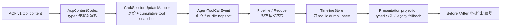

# 02 · 方案设计

任务：Grok 文件编辑适配 diff 样式

日期：2026-08-11

状态：方案已收口；实施前必须完成共享层 Issue 评审、0.2.119 证据采集，并解决 G7/G8 阻塞

最终档位：**L**

## 结论先行

推荐一条方案：**把 ACP v1 的标准 `diff` content block 在共享 data codec 中无状态解码，由 Grok mapper 在 Provider 边界内合并成语义完整的工具快照，再通过现有 `AgentToolCallEvent` 将中立 before/after 文件编辑快照交给时间线。**

新 UI 使用“修改前 / 修改后”比较器：宽视口左右并排，窄视口上下排列；长内容在有界视口内按行虚拟化，可滚动到最后一行，不截断，也不读本地文件。新路径按 typed snapshot 渲染；Codex 和旧数据的 unified-diff 路径原样保留，UI 不按 Provider 名称分支。

需要从 `01-需求分析.md` 中的 M 预判改判为 L，原因是合规实现已确定会：

- 修改 `acp_content_codec.dart` 与 `AgentConversationTimelineStore`，命中 G1 共享层；
- 扩展 `AgentToolCallEvent` 所携 payload 的 typed 语义，需按 AgentEvent 十六问复核；
- 涉及 Grok 流式状态、history/replay 一致性、敏感正文日志边界和新时间线渲染。

## 1. 现状：关键符号与调用链

### 1.1 Live 路径

```text
JsonRpcNotification
  → GrokAcpAgentProvider._handleNotification
  → GrokAcpNotificationMapper.mapSessionUpdate / mapXaiSessionUpdate
  → GrokSessionUpdateMapper.mapSessionUpdate
  → AcpSessionUpdateDecoder.decode
  → AcpToolCallUpdate(content: Object?)
  → GrokStreamIdentity.resolveTool
  → GrokSessionUpdateMapper._mapTool / _mapToolCall
  → AcpContentCodec.toolContentText
  → AgentToolCallEvent
  → AgentEventPipeline / AgentEventCoalescingPolicy
  → AgentConversationReducer._toolCall
  → AgentUpsertToolCallTimelineMutation
  → AgentConversationTimelineStore.upsertToolCall
  → AgentTimelineProjectionCache.resolve
  → buildAgentTimelineRenderBlocks
  → _fileEditItemsFromToolCall
  → _AgentFileEditGroupCard / _AgentDiffDetails
```

关键断点有三个：

1. `AcpSessionUpdateDecoder` 已把 `tool_call` 和 `tool_call_update` 解成 `AcpToolCallUpdate`，但 `content` 仍是 `Object?`。
2. `AcpContentCodec.toolContentText` 虽然识别 `type == diff`，却只保留 `diff: <path>`，`oldText/newText` 在进入 domain 前就丢失。
3. `agent_timeline_grouping.dart::_fileEditChangesFromToolCall` 只会从 `toolCall.rawOutput['changes'][path]['unified_diff']` 解析详情；ACP content diff 不是这种形状，因此时间线最终只有文件名或占位文字。

另一个时序风险在 `AgentEventCoalescingPolicy`：同 id 的非终态 tool event 会用后一条替换前一条。ACP 又允许 `tool_call_update` 只携带发生变化的字段，所以如果 Grok mapper 输出 partial event，“有效 diff in-progress → 只有 status 的 in-progress”可能在进入 Store 前就把 diff 丢掉。

### 1.2 History / replay 路径

```text
GrokUpdatesHistoryParser.parse
  → 每次 parse 新建 GrokSessionUpdateMapper
  → 同一 AcpSessionUpdateDecoder / Grok mapper
  → _TurnBuilder.upsertTool / _mergeTool
  → AgentHistoryToolEntry
  → AgentConversationTimelineStore.applyHistorySnapshot
  → 同一 presentation projection
```

当前 `session/load` 的 replay notification 会被 `GrokAcpAgentProvider` 主动压制，以避免与已读取的 history snapshot 重复。因此现状中：

- live 与 history 虽使用同一 mapper 算法，但必须保证两个独立实例；
- replay 应用 fresh mapper 做 canonical 对比，而不是再将同份 replay 送进 live Store；
- 现有 canonical signature 并不比较文件路径或 before/after，无法发现当前缺失。

### 1.3 现有 UI 能力

- 文件编辑组已有组折叠和单文件折叠；单文件展开状态保存在 TimelineStore。
- 旧 `_AgentDiffDetails` 预览 24 行，再用 `HighlightView(language: 'diff')` 一次性高亮整段 unified diff。
- 外层时间线已是 sliver 虚拟化，且 grouping/highlight 有缓存；但“展开超大 diff 后生成一个巨型 HighlightView”仍会造成巨型 sliver child 和同步 parse/layout 峰值。

## 2. 目标架构与数据流



数据语义固定为：

1. 共享 codec 只解 ACP v1 公开语法，不处理 Grok 乱序、去重、tool scope 或非标准变体。
2. Grok mapper 用 `(runtimeScope, sessionId, turnId, generation, toolCallId)` 保留 Provider-local 工具快照；后续字段省略或损坏时继承上一份已确认快照。
3. 每个进入共享 pipeline 的 Grok `AgentToolCallEvent` 都是语义完整快照；因此不修改 CoalescingPolicy 的 latest-wins 机制。
4. Store 只根据同 tool id 原位 upsert，对 typed snapshot 执行 `incoming ?? existing`；它不读 raw，不判断 Provider，不修复 partial event。
5. presentation 新路径只读中立 snapshot。旧 Codex/unified-diff 数据仍走 legacy details，分支条件是“是否有 typed details”，不是 Provider 名称。

### 2.1 ACP 内容解码规则

- `path` 必须是非空字符串；`newText` 必须是字符串，空字符串也是有效值。
- `oldText` 缺失或为 `null` 表示新建文件；为字符串表示修改已有文件。
- `oldText` 是数字、map 等非法类型时，不得当成“新建”；该 diff block 标记为 malformed。
- 同一 content snapshot 内，只要某个声称为 diff 的 block 损坏，整份 file-edit snapshot 就不替换上一份有效值，避免用不完整多文件数据覆盖已确认证据。
- 未知的其他 content block 可宽容忽略，不影响合法 diff；正常 text block 仍保留为工具文本。
- 不 `trim` before/after，不改换行符，不归一化正文，以便精确审计。

### 2.2 Grok 增量合并规则

- `tool_call_update` 省略字段：继承上一份快照的 title/kind/locations/fileEditSnapshot；不用 Store 或 UI 猜。
- 出现一份完整合法的 diff list：按其 Provider 顺序整体替换 fileEditSnapshot。
- 仅 status 更新、空 content、损坏 diff：保留上一份有效 snapshot，但状态、终态和安全的其他字段仍可更新。
- 重复 eventId：仍由 `GrokStreamIdentity` 丢弃；不重复编辑项。
- 新 turn/generation 开始、显式 invalidate/cancel、runtime/session 失效或 dispose：同步清理对应 Provider-local snapshot，不跨 turn/session 泄漏。普通 turn terminal 只冻结“不再接受新 tool”的边界，不立即清已知 tool 的 snapshot；同一已知 tool 的迟到 terminal update 仍须能补全状态且保留 diff。
- 文件编辑项 id 由 Grok mapper 基于 tool identity 与同路径出现次序生成；UI 只使用该 id，不再用 path 猜唯一性。

## 3. 分层归属

| 层 | 拟新增/修改的符号 | 责任与归属理由 |
|---|---|---|
| 共享 data / ACP | `AcpContentCodec`、`AcpFileDiffBlock`、`AcpToolContentProjection` | 只做 ACP v1 content 的无状态 typed 解码；这是公开协议语法，不是 Grok 生命周期逻辑 |
| Grok data adapter | `GrokSessionUpdateMapper` 的 tool snapshot state 与 `_mapTool` | 决定 Grok tool identity、partial update 合并、last-valid、稳定 change id 与清理边界，保证输出语义完整 event |
| Grok history data | `GrokUpdatesHistoryParser._mergeTool`、canonical signature | 复用 fresh Grok mapper，在注入的 history/replay 数据上保留 typed snapshot，固定逐位置一致性 |
| 中立 domain | `AgentFileEditKind`、`AgentFileEdit`、`AgentFileEditSnapshot`、`AgentToolCall.fileEditSnapshot` | 表达“文件创建/修改的 before/after 证据”；不出现 `oldText/newText`、ACP 或 Grok 字段 |
| application / Store | `AgentConversationTimelineStore._mergeToolCallUpdate` | 对中立 optional snapshot 做机械的同 id upsert；不处理 Provider partial update，不改 identity |
| presentation projection | `AgentTimelineFileEditItem`、`AgentTimelineBeforeAfterDetails`、`AgentTimelineUnifiedDiffDetails`、`_fileEditItemsFromToolCall` | typed before/after 优先，legacy unified diff 回退；行统计、行索引和展示变体是渲染语义 |
| presentation widget | `_AgentBeforeAfterDiffDetails`、`_AgentDiffSnapshotPane`、`_AgentDiffLineList` | 宽/窄响应式布局、虚拟行、滚动、语义标签、键盘与 token |
| presentation performance | `AgentTimelineProjectionCache`、`AgentTimelineExtentDescriptorFactory`、时间线滚动通知过滤 | 数据变化才重建行索引/统计；resize 只切布局；内层滚动不污染外层 follow-end |
| 共享 data / 安全 | `AgentIgnoredMessageLogger` | 删除 raw payload 串行化，只允许方法、稳定原因、类型/字段数/计数白名单；这是 G8 必需的 Provider 中立安全修正 |

明确不改：

- `AgentEventPipeline`、`AgentEventCoalescingPolicy`、`CoalescingEventBuffer`、`AgentConversationReducer` 的调度/合并语义；
- `AgentProviderBundle`、任何 Provider port 或 capability；
- 审批卡、permission model 与写入权限；
- Codex mapper、`AgentTurnDiffEvent` 和 Codex 协议链路；
- 持久化 schema。

## 4. 契约变更

### 4.1 共享 ACP data 契约

拟在 `acp_content_codec.dart` 增加类似以下的 data-only 类型（名称可在实现时按仓库风格微调，语义不变）：

```dart
final class AcpFileDiffBlock {
  final String path;
  final String? oldText;
  final String newText;
}

final class AcpToolContentProjection {
  final String? text;
  final List<AcpFileDiffBlock> fileDiffs;
  final bool hasMalformedDiff;
  final int malformedDiffCount;
}
```

`toolContentText` 保留旧签名，避免无关调用方一次性迁移；Grok 新路径改为一次解码 `AcpToolContentProjection`，使用其 text 与 fileDiffs，不再产生 `diff: path` 占位文字。损坏诊断只留类型和计数，不留正文。

`AcpSessionUpdateDecoder` 无需知道文件编辑的 domain 语义；content block 解码仍归现有 codec。若 0.2.119 真实证据显示 Grok 发的是非标准 singleton/map 形状，该兼容只能放进 Grok mapper，不得改宽共享 codec。

### 4.2 中立 domain 契约

```dart
enum AgentFileEditKind { created, modified }

final class AgentFileEdit {
  final String id;
  final String path;
  final AgentFileEditKind kind;
  final String? beforeContent;
  final String afterContent;
}

final class AgentFileEditSnapshot {
  final List<AgentFileEdit> edits;
}

class AgentToolCall {
  final AgentFileEditSnapshot? fileEditSnapshot;
}
```

不变的语义约束：

- `fileEditSnapshot == null`：该调用方未提供 typed 文件编辑证据；旧构造调用方默认就是此值。
- `fileEditSnapshot != null`：该 tool 当前最新、完整、已规范化的权威快照；其 `edits` 为有序不可变列表，显式空列表可表示权威清空。
- `created` 时 `beforeContent == null`；`modified` 时 `beforeContent != null`。该重复真源由 domain 构造器断言和契约测试锁死，不允许构造出矛盾状态；空字符串与 `null` 不能混同。
- `afterContent` 必填且可为空字符串；空结果解释为“修改为空文件”，不猜测为 delete。
- domain 不放 ACP `oldText/newText`、unified diff、行高亮、Provider 名称或本地文件状态。
- snapshot 只存活于内存，不进入 Zeta 配置、状态、缓存、日志或系统通知。

`AgentToolCall.copyWith`、TimelineStore 手工重建与 Grok history `_mergeTool` 都必须显式携带该字段；这是最容易漏字段的三处。

### 4.3 Event 契约

不新增 event class，也不复用回合级 `AgentTurnDiffEvent`。仍使用 `AgentToolCallEvent`，但其 `AgentToolCall` 可携带 file-edit snapshot，因此按“改变 AgentEvent payload 契约”处理。

#### AgentEvent 十六问

| # | 答案 |
|---|---|
| 1 | Tool 的 session/turn/id 仍由 `GrokStreamIdentity.resolveTool` 决定；单个 file edit 的 id 由 Grok mapper 决定。 |
| 2 | 事件属于 `toolCall.sessionId/turnId`；仍只由 `_shouldHandleCurrent` 接收当前匹配 thread/turn。 |
| 3 | 不扩大 detached runtime allowlist；完全沿用现有 tool event 接收规则。 |
| 4 | 非终态仍可合并，key 仍是 session/turn/tool id 的 `toolProgress`；不加 Provider/raw 字段。 |
| 5 | 合并仍是 latest full snapshot；先在 Grok mapper 把 partial update 归一成 cumulative snapshot，共享 policy 不追加/猜测 diff。 |
| 6 | 非终态不是 barrier；tool 终态仍是现有 barrier，flush 行为不变。 |
| 7 | 不新增 critical event 类别；沿用 tool event 现有可合并/终态不丢语义。 |
| 8 | Reducer 仍只产生 `AgentUpsertToolCallTimelineMutation`，活动状态更新不变。 |
| 9 | typed UI region 仍只是 `liveTurn`；变化的是文件编辑 block 内容与 extent。 |
| 10 | pending/in-progress 仍 `nextFrame`，终态仍 `immediate`；无新 urgency 特例。 |
| 11 | 仍只有现有 `AgentRequestAutoScroll`，不新增一次性 UI effect。 |
| 12 | 不产生新 `AgentConversationEffect`。 |
| 13 | 只沿用现有 active tool 对 ThreadSnapshot 的影响；file-edit payload 本身不改 snapshot。 |
| 14 | live、每次 history parse、fresh replay 必须各用独立 mapper/identity/snapshot state。 |
| 15 | Grok 用 0.2.119 脱敏序列做契约与 canonical 测试；共享 codec/Store 用 Provider 无关 fixture；Codex 只回归 legacy 路径。 |
| 16 | presentation/Store 不读 ACP key、Grok raw 或 Provider 名称；身份与损坏更新决策全在 Grok data adapter。 |

### 4.4 Bundle、capability 与持久化

| 契约面 | 变更 |
|---|---|
| `AgentProviderBundle` / port | 无 |
| `AgentProviderCapabilities` | 无；无新入口，也不把“有 diff 数据”伪造成能力位 |
| 持久化 JSON | 无；不新增字段、版本或迁移 |
| 审批契约 | 无 |
| `AgentTurnDiffEvent` | 无变更 |

## 5. 新 diff 样式的固定方案

### 5.1 信息结构

保留现有“文件编辑组 → 单文件”两层折叠，替换 typed details 的内容样式：

```text
▾ 2 个文件                              +8 / -3
  ▾ lib/src/agent.dart     修改          +5 / -2
    ┌ 修改前 · 2 行 ──────────┬ 修改后 · 5 行 ──────────┐
    │ - 1  old line              │ + 1  new line              │
    │ - 2  old line              │ + 2  new line              │
    │                            │ + 3  ...                   │
    └───────────────────────────┴───────────────────────────┘
```

- 局部可用宽度达到现有 `IdeMetrics.stackedRowBreakpoint` 时左右并排；否则改为“修改前”、“修改后”上下排列。
- 文件行显示动作、文件名、有界路径和统计；完整路径通过 tooltip/semantics 可读，不因同名文件串项。
- 新建文件的 before 面板显示“创建前不存在”，不伪造空文本；after 为空时显示“空文件”。
- 不在 UI 猜测“局部编辑”还是“整文件覆写”；两者均是 modified before/after，完整证据一样可查。
- 删除/新增不只靠颜色：同时有“修改前/后”、`-/+` 前缀和行数文字。

### 5.2 `+N / -M` 口径

不生成 Myers/LCS 最小编辑脚本，而是严格按 Provider 上报的 replacement 两个操作数统计：

- created：`+ logicalLines(after) / -0`；
- modified 且 before/after 完全相同：`+0 / -0`；
- modified 且不同：`+ logicalLines(after) / - logicalLines(before)`；
- 空字符串计 0 行；LF/CRLF 均按逻辑行计数，末尾换行符不额外伪造一行。

这个口径是 O(n)，数字可以由 before/after 直接复核，不引入“哪种最小 diff 算法才是真相”的客户端推导。文案和测试必须把它固定为“Provider 替换证据行数”，不宣称为 Git 最小 hunk 统计。

### 5.3 完整内容与性能

- 单文件默认折叠；展开后直接进入有界比较视口，不再走“24 行预览 + 一次性展开巨型 HighlightView”。
- 有界是视口高度，不是内容截断；用户可用滚轮、拖动滚动条、方向键、PageUp/PageDown、Home/End 到达任意一行。
- 行列表用 `ListView.builder`/等价虚拟化原语和固定行高；长行不换行，改用水平滚动，避免 resize 改变全部行高。
- before/after 的逻辑行索引与统计按不可变 edit snapshot 在 presentation cache 中仅构建一次，不按窗口宽度重做。cache 随当前保留 turn 清理，不落盘。
- 比较器外层保留 `RepaintBoundary`，但不为每一行建独立 layer。
- 内层滚动通知的 `depth != 0` 时，外层时间线不更改 follow-end/anchor 状态。
- typed 比较器不使用 `HighlightView`；行前缀、标题和 error/success token 直接表达语义，才能真正按行虚拟化。旧 unified diff 仍保留旧高亮。

### 5.4 主题和可访问性

- 仅用 `IdeColors`、`IdeTextStyles`、`IdeRadius`、`IdeSpacing`、`IdeMotion`，不新增裸色值、阴影或圆角。
- 文件 toggle 的 semantic label 包含完整路径、动作、统计和展开状态。
- 面板语义分别为“修改前，共 M 行”和“修改后，共 N 行”；行号不重复读出，正文保留可读语义。
- 内层滚动区可获取键盘焦点，有可见 scrollbar。
- 文字放大时行高同步调整；标题、路径与统计用 `Flexible`/`Wrap` 等有界布局，不溢出。

## 6. 门禁合规

### G1 · 命中，共享契约缺口论证

论证成立：

1. ACP v1 正式规定 `ToolCallContent.Diff(path, oldText, newText)`，且 `tool_call_update` 除 `toolCallId` 外都是可选字段；这是公开、跨 ACP Provider 的语法。
2. `AcpContentCodec` 本来就是标准 ACP content block 的共享 codec，而且已经匹配 `type: diff`；当前问题是共享 codec 将结构压扁成占位文字，属于中立 typed 契约缺口。
3. 新 codec 无状态，不包含 Grok/xAI/providerId 分支，不处理 identity、乱序、去重、last-valid 或终态。
4. Grok 私有形状兼容、partial update 合并、scope 和变更 id 留在 Grok mapper；共享 CoalescingPolicy 不因此改语义。
5. Store 只根据中立 nullable snapshot 执行类型可证明的 dumb merge，不从空列表/raw 猜“省略还是清空”。

反证：如果只在 Grok mapper 中手写 `path/oldText/newText` 语法，会复制 ACP 标准解码；如果伪造 `rawOutput.changes.unified_diff`，会继续让 UI 读 raw。两者都不比共享 typed codec 更合规。

因为实施将改 G1 共享文件，按流程必须**先开 Issue 记录候选中立缺口，再用 0.2.119 真实脱敏证据完成最终架构评审，最后才写共享层代码**。若证据显示 Grok 发送的是非标准 singleton/map 形状，该兼容必须退回 Grok mapper，不得扩宽共享 codec。Issue 链接和最终评审结论需记录在任务产物中；不能只更新共享层指纹测试的 baseline。

### G2 · 命中

- Tool identity、turn scope、去重、终态和 file edit 稳定 id 均由 Grok data adapter/reducer 决定。
- Store 仍只同 id upsert；UI 不根据 path/raw/最后一条猜合并边界。
- 必须用 0.2.119 真实脱敏序列固定 start/progress/malformed/completed 和多文件顺序；另固定“有效 diff → turn terminal → 同一已知 tool 的 status-only completed”仍保留 cumulative snapshot。

### G3 · 命中隔离验证

- `AgentConversationReducer` 不改，仍纯同步；Grok tool snapshot 合并也是 data 层同步状态机，无 Timer/Future/Flutter scheduler。
- live、每次 history parse 和 fresh replay 各自新建 mapper/identity/snapshot state，清理边界有单测。

### G4 · 不改能力面

不新增 port/capability，不伪造静默成功。有 typed snapshot 才展示详情；没有证据就明确降级为文件摘要。

### G5 · 明确不命中

不修改审批卡、pending registry 或 permission response。diff 卡仅审计已上报操作，不表示授权，也没有 apply/reject/save 操作。

### G6 · 命中

- ACP `oldText/newText` 只出现在 data codec。
- domain 使用 before/after 中立语义；presentation 新路径只读 `AgentFileEditSnapshot`。
- 不在 Widget、Store 或 reducer 中引入 Grok/ACP import，不新建顶层目录。

### G7 · 现存冲突，实施阻塞

当前 `GrokSessionHistoryReader` 会扫描 `~/.grok/sessions` 并读取 `updates.jsonl/chat_history.jsonl`，而现行 G7 明文禁止读取 `~/.grok`，唯一例外仅是 Codex usage。AC-5 的“关闭重开”现在恰好依赖这条旧路径。仓库内 `FileSystemGrokUsageLogScanner` 也存在 Grok 私有目录读取；解决本功能的合法 history source 可以解除 AC-5 阻塞，但不得据此宣称仓库级 G7 冲突已全部清零。

本方案不新增、扩大或默认谅解该读取。推荐的处理是：

- 另建阻塞 Issue，将 Grok 历史恢复迁到 Provider 合法提供的协议路径（例如由 `session/load` replay 产生独立 history snapshot），不建议为本功能新增 G7 例外；
- 在该前置问题解决前，可用注入的脱敏 history/replay fixture 完成 parser/canonical 设计验证，但不得宣称真实 AC-5 已合规通过；
- 不在这个 diff PR 里顺手重写整个 Grok thread catalog/history 架构。

### G8 · 命中，安全修正是前置

`AgentIgnoredMessageLogger` 当前在非 release 模式下会 JSON 串行化 `rawPayload`；被压制的 `session/load` replay 和未匹配/损坏消息都可进这条路径。引入 old/new 后，这会直接把用户文件正文写进开发日志，与 G8 冲突。

因此实施必须同步：

- 移除 ignored logger 的 raw 序列化能力，只记录 method、稳定 reason、protocol type、presence/count 白名单；
- `details` 也只接受稳定类型/数值，不允许任意正文字符串进日志；
- 损坏 diff 仍映射为正常的降级 tool event，诊断只留计数，不把 raw diff 交给 ignored logger；
- 用独特 sentinel 验证控制台和临时文件日志都不含 before/after/完整路径；
- 缓存只在 presentation 内存中，随 ViewModel/turn 释放，不写 `~/.zeta`。

### G9 · 命中

- 使用 Graphite token 和现有 UI 原语，不按 Provider 分支。
- 有稳定 item key、`RepaintBoundary`、行虚拟化、projection cache 和有界 extent。
- resize 不重做 content parse/行索引，不用 post-frame 测高、`GlobalKey` 查高或 layout 后 `setState` 反馈环。
- 实施验收必须补 Windows Profile 1280→1000→1280 十秒场景。

## 7. 兼容性

### 旧调用方

- `AgentToolCall.fileEditSnapshot` 默认 `null`，现有 fake、mapper 和构造调用方可逐步迁移。
- `copyWith` 需能区分“沿用”和“显式清空”；Store 中 `null` 是沿用，非 null 空 snapshot 是权威清空。
- `AgentToolCallEvent` 类型、Reducer mutation 和 UI urgency 不变。

### Codex 与 legacy diff

- Codex `AgentTurnDiffEvent`、`rawOutput.changes.unified_diff` 与旧高亮卡继续原样工作；本次不回填 typed contract，不重做 Codex 视觉。
- presentation details 改为 typed before/after 与 legacy unified diff 两个中立变体；Widget 不知道变体来自哪个 Provider。
- 新路径不继续扩大 presentation 对 raw 的依赖；旧 rawOutput parser 作为现有兼容债保留，后续可另立中立化任务。

### 旧 Grok 数据

- 没有 ACP diff block 的旧 Grok 历史仍只显示文件摘要/不可展开项，不伪造 before/after。
- 原始 history 证据本身确实含标准 diff 时，新 parser 可在重读时产生 typed snapshot；`chat_history` 没有该证据时不可恢复。
- 无持久化迁移；不把 old/new 存成 Zeta 自有数据。

### Capability

不变。diff 是已有工具时间线的内容语义，不是一个可调用端口；没有证据时降级展示，不需要 capability gate。

## 8. 测试矩阵

| 层/测试 | 要固定的行为 | 覆盖风险 / 验收 |
|---|---|---|
| 证据门 | 新增标注 Grok CLI `0.2.119` 的脱敏 tool start → 有效 diff → 省略字段/损坏 update → 有效终态序列；包含局部编辑、新建、覆写、多文件 | G2/G3，AC-1、AC-3、AC-4；无真实设备/凭据时标记阻塞，不推定通过 |
| 共享 ACP codec 单测 | path/old/new 精确保留，顺序，新建，空 new，混合 text+diff，未知 block，malformed 原子失败，正文不 trim | G1/G6/G8；只用 Provider 无关 fixture |
| Domain 单测 | snapshot/list 不可变，`null`/explicit empty 语义，created/modified 不变式，copyWith 保留/清空，完整内容不截断 | 契约退化，AC-2 |
| Grok mapper 序列测试 | 同 tool id 每次输出 cumulative snapshot；省略/损坏不清空；后续有效快照替换；duplicate 不重复；new turn/runtime/session/dispose 不串状态 | G2/G3，AC-3 |
| Coalescing / buffer 回归 | 用已 cumulative 的 Provider 无关 tool event 保留现有 latest-wins；可控 flush 中连续投入有 diff 和 status-only 事件，最终仍有 diff | 证明不需共享 policy 猜 partial，AC-3 |
| TimelineStore 单测 | 同 tool id 原位 upsert；null snapshot 沿用，非 null 替换，explicit empty 清空；异 id 新建；顺序/turn 不变；不读 raw/provider | G1/G2，AC-3 |
| History parser | 同 id `_mergeTool` 保留 typed snapshot；每次 parse 使用 fresh mapper；带 diff 的注入 JSONL 恰一项 | G3，AC-5 的 parser 部分 |
| Live/history/replay canonical | signature 逐位置包含 tool id/kind/status 和有序 `{editId,path,kind,before,after}`；对比 live、history、fresh replay mapper | AC-5；防缺项、重复、乱序 |
| Replay 隔离 | 带 diff 的 `session/load` replay 不重复进 live Store；独立 replay mapper 可重建相同 canonical 结果 | G3，AC-5；不暗中改当前 replay 产品语义 |
| 日志安全 | 有效、损坏、被压制 replay 中放入唯一 before/after/path sentinel；控制台和临时文件日志均不含 sentinel，只有类型/计数 | G8 |
| Presentation projection 单测 | typed 优先、legacy fallback，created/modified/改空/相同内容统计，LF/CRLF/末尾换行，多文件顺序，同路径多 block id 不冲突 | AC-1、AC-2、AC-4 |
| Widget 测试 | 宽视口并排、窄视口堆叠；完整滚到末行；新建前不存在；文字放大/长路径无 overflow；semantics/键盘/滚动条；更新后原位且保持展开 | AC-1—AC-4，G9 |
| 大内容/热路径 | 10,000 行 fixture 的已挂载行数受视口约束；resize 不增加 grouping/行索引计数；内层滚动不改外层 follow-end | G9，AC-2 |
| 可见链路回归 | fake live 序列只有一个编辑项；合法 history source 恢复后的内容/终态与 live 一致 | AC-3、AC-5 |
| 架构守卫 | G1 扫描覆盖 `acp_*.dart` 和 Store；presentation 新路径不出现 `oldText/newText`/Grok；共享测试不 import Grok fixture | G1/G6 |
| Profile 验收 | Windows Profile 1280→1000→1280 十秒，记录 UI/Raster p95、慢帧率、projection/index/highlight 计数 | G9 时间线/resize 门禁 |

共享层纯度守卫不得只“重算指纹”：应保留未改的 Pipeline/Policy/Buffer/Dispatcher 内容冻结，TimelineStore 继续参与 Provider import/名称扫描，同时用上表的 Provider 无关 dumb-merge 行为测试代替它的整文件指纹。当前名为 `claude_code_shared_layer_purity_test.dart` 的守卫实质已是全局架构责任，实施时应泛化命名/注释，不保留“只有某个 Provider 才不能改”的误导语义。

## 9. 风险、取舍与否决方案

### 风险 1：0.2.119 真实形状尚未取得

当前仓库没有任何 `type: diff` fixture，Grok 序列仍是较旧版本。实施前必须采集 0.2.119 脱敏序列，确认：

- 是否为标准 content list，是否在 update 中整体替换；
- kind/title/locations 在哪些 update 中省略；
- 多文件、重复通知、终态和损坏 update 的真实顺序；
- 新建、清空和 delete/move 如何区分。

如果证据不符合标准，兼容适配退回 Grok mapper；如果根本不上报完整 before/after，在“不读本地文件”边界下 AC-2 就是证据阻塞，不能猜测通过。

### 风险 2：ACP v1 无法仅凭空 `newText` 区分 delete 与清空

ACP v1 的 diff 没有 deleted 字段，官方已有后续 draft RFD 讨论该缺口。因此本方案只根据已确认的 tool `kind` 归类：

- `kind: edit` + 空 `afterContent` 表示清空/覆写，在范围内；
- `kind: delete/move` 仍走普通工具项，不进新比较器；
- 若 0.2.119 实际只发 `edit + newText: ''` 表示删除，在不读本地文件、不采用 draft 扩展的前提下无法诚实区分，AC-4 应标记阻塞，不能由 UI 猜。

### 风险 3：大内容内存与滚动交互

完整 before/after 本身就会占内存。方案不复制为 unified diff 和 Highlight AST，只在内存建行索引，并将已挂载行限制在内层视口。如果 Profile 仍不达标，可把行索引计算迁移到可取消的异步 projection，但不改变“内容完整可达”的契约。

### 已考虑并否决

| 方案 | 否决原因 |
|---|---|
| 只在 Grok mapper 手写 ACP diff 语法 | 复制标准 ACP grammar，隐藏真正的共享 typed 契约缺口 |
| 把 ACP diff 伪造成 `rawOutput.changes.unified_diff` | 让 raw 兼容逻辑上浮到 UI，丢失 before/after 结构，违反 G6 |
| 改 CoalescingPolicy 合并 partial file edits | 共享 policy 无法知道空值是省略、损坏还是权威清空，会让 Provider 叙事逻辑泄漏到 G1 机制层 |
| 新增/复用 `AgentTurnDiffEvent` | 需求是 tool-scoped 操作，改成 turn 聚合会丢 tool identity/status，还会与 Codex 回合 diff 重复 |
| 读取工作区文件补算 | 与 PRD “明确不做”、01 范围以及 G7 直接冲突 |
| 将 before/after 生成最小 unified diff 并复用旧卡 | 用户已选新样式；引入客户端 diff 算法和最坏耗时，又将完整 before/after 降格为 hunk |
| 展开后一次性渲染完整 `HighlightView` | 超大文件会在主 isolate 同步 parse/layout，造成巨型 sliver child |
| 仅保留 24 行或只显示 hunk | 直接不满足 AC-2 的完整内容可查 |
| 所有宽度都左右并排 | 窄视口和文字放大不可读 |
| 按 Grok/providerId 选 Widget | 违反 Provider 中立 UI 边界 |
| 本次同时迁移 Codex typed diff | 不是本需求的必要条件，会扩大协议、回合级事件和回归范围 |
| 为了 AC-5 直接给 G7 加 `~/.grok` 例外 | 会倒退用户私有数据边界；推荐修合法历史来源，不改弱门禁 |

## 10. 实施前置与推荐

推荐批准本方案，但不直接进入编码。开工顺序必须是：

1. **先开 G1 共享契约 Issue**，记录“标准 ACP typed diff + nullable 中立 snapshot + Store dumb merge”的候选论证与 Provider-local 止损线。
2. **取得 Grok CLI 0.2.119 脱敏 fixture**，特别确认 update 替换语义、kind 和 delete/清空区分；若与标准形状不一致，先修正本方案。
3. **用实证完成 G1 最终评审**，在任务产物中记录 Issue 链接与明确批准结论；未批准不改共享文件。
4. **解决 G8 raw ignored log**，以“正文永不进日志”的测试作为 typed diff 接入前置。
5. **为 G7 历史来源建立独立阻塞任务并解决**；在此前只能证明 parser/canonical parity，不能完成真实 AC-5 签收。
6. 上述准入项按本文和 `03-任务拆解.md` 的硬停线逐项通过后，再按“契约→Provider reducer→Store/history→projection→Widget→安全/性能验收”实施。

实施时还需要：

- 用户可感知变化写入 `CHANGELOG.md` 的 `[未发布]`；
- 因中立 Provider→AgentToolCall 契约与 G1 共享行为变化，按 `AGENTS.md` §6 逐项审阅 `AGENTS.md`、架构总览中英文、工程规范、design document、developer guide、glossary 中英文和 CONTRIBUTING 中英文；需要的同步修改，审阅后无需修改的在验收报告留证。长期文档只增补“Provider adapter 输出 cumulative typed file-edit snapshot，共享 policy 仅处理完整 event，UI 不读 raw”的契约，不复制本文全文；
- 门禁编号未变，无需因此修改 `CLAUDE.md`；不改 Codex 适配层，无需 Codex schema diff/smoke。

## 依据

- `01-需求分析.md`
- `docs/product/product_requirements.md` §3–§9
- `AGENTS.md` G1–G9 与任务路由
- `docs/architecture/engineering_standards.md` §4、§4.1、§4.2、§6
- `docs/guides/developer_guide.md`“新增 AgentEvent 接入清单”、共享适配层修改判定、§8
- [ACP v1 Tool Calls](https://agentclientprotocol.com/protocol/v1/tool-calls)
- [ACP v1 Rust tool-call schema](https://github.com/agentclientprotocol/agent-client-protocol/blob/main/agent-client-protocol-schema/src/v1/tool_call.rs)
- [ACP “Delete in Diff” draft RFD](https://agentclientprotocol.com/rfds/diff-delete)
