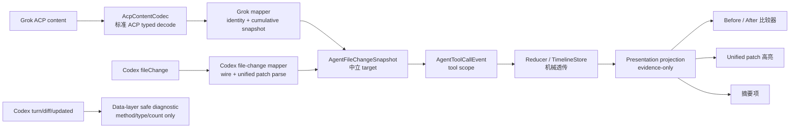

# 02 · 方案设计

任务：对话流文件编辑 diff 通用化（由 Grok 适配缺口触发）

日期：2026-08-11

状态：方案已按“双 Provider 归一到同一 target”重新收口；尚未开始代码实现

最终档位：**L**

## 结论先行

推荐唯一方案：**建立 Provider 中立的 `AgentFileChangeSnapshot`，Codex 和 Grok 各自在 data adapter 中把原始文件变更证据转成该 target；文件详情统一由 tool-scoped `AgentToolCallEvent` 承载；Store 只机械透传，presentation 最终只按中立 evidence 变体渲染。Codex `turn/diff/updated` 不再生成时间线事件，现有 `AgentTurnDiffEvent` 在 tool target 全链路跑通后退役。**

目标契约是“同一容器 + typed evidence”，不是“所有 Provider 强制生成同一段文本”：

- Grok ACP `oldText/newText` → `AgentBeforeAfterFileChangeEvidence`；
- Codex tool-scoped `FileUpdateChange.diff` → `AgentUnifiedPatchFileChangeEvidence`；
- 只有路径/动作 → `evidence == null` 的 typed summary。

前两种是 evidence 变体；摘要是“无 evidence”的展示状态，不是第三种 evidence class。它们都不表示 Provider 身份。UI 不出现 Codex/Grok 分支，也不再读 `oldText/newText/unified_diff/changes/rawOutput` 等 wire/raw 字段。

Codex 以合法 `thread/read` 也能恢复的 tool-scoped `fileChange` 作唯一时间线详情真源。`turn/diff/updated` 是不可恢复的派生聚合，只在 Codex data 层做无正文白名单诊断；Store/UI 不按路径跨 scope 去重。Codex 仍使用现有 unified diff 高亮/预览组件，改变的是真源归属和 typed 数据源，不是视觉重设计。

## 1. 现状：关键符号与调用链

### 1.1 Grok tool scope

```text
JsonRpcNotification
  → GrokAcpAgentProvider._handleNotification
  → GrokAcpNotificationMapper
  → GrokSessionUpdateMapper
  → AcpSessionUpdateDecoder
  → AcpToolCallUpdate(content: Object?)
  → AcpContentCodec.toolContentText
  → AgentToolCallEvent
  → Pipeline / Reducer / TimelineStore
  → agent_timeline_grouping.dart
```

断点：`AcpContentCodec` 已识别 `type == diff`，却只产生 `diff: <path>`，没有把 `oldText/newText` 投影到 domain。同一 tool 的 ACP update 又可省略未变字段；如果 Grok mapper 输出 partial event，共享 coalescing 的 latest-wins 可能使后续 status-only update 覆盖先前有效 diff。

Grok history 由 `GrokUpdatesHistoryParser` 为每次 parse 新建 mapper，但现有 canonical signature 不比较文件证据。`session/load` replay 会被 live provider 压制以避免和 history snapshot 重复。

### 1.2 Codex tool scope

```text
item/started | item/fileChange/patchUpdated | item/completed
  → CodexNotificationMapper
  → _toolCallFromThreadItem / _toolCallFromProgressNotification
  → AgentToolCall(raw/rawOutput)
  → AgentToolCallEvent
  → TimelineStore
  → _fileEditChangesFromToolCall
  → rawOutput['changes'][path]['unified_diff']
```

仓库 pin 的 Codex app-server `0.144.5` schema 将 `fileChange.changes[]` 定义为 `{path, kind, diff}`，`kind` 支持 add/delete/update，update 可带 `move_path`。当前 helper 只将 item 映射为通用 tool raw/locations，文件变更解析仍落在 presentation；`patchUpdated` 也未映射为结构化 target。

Codex `thread/read`/resume/history 会经 `codex_app_server_helpers.dart::_toolCallFromThreadItem` 重建 tool，但同样没有 typed file-change evidence。旧 JSONL `patch_apply` 形状存在宽容解析债，也必须在 Codex data 层归一，不能由 UI 兼容。

### 1.3 Codex 现有 turn aggregate 链

```text
turn/diff/updated {threadId, turnId, diff}
  → CodexNotificationMapper
  → AgentTurnDiffEvent(diff: String)
  → AgentConversationReducer._turnDiff
  → AgentConversationTimelineStore.upsertTurnDiff
  → AgentTurnDiffTimelineEntry(diff: String)
  → _fileEditItemsFromUnifiedDiff
  → presentation 拆文件、路径和 +/- 统计
```

Codex 官方语义是：每次 FileChange 后发送当前回合所有文件变更的最新聚合 unified diff，每条都是 snapshot，不是 delta。当前数据链将整段原文送到 presentation 才拆分，与 G6 的目标分层不符。同时，pin `0.144.5` 的 `thread/read` Turn 只恢复 items，不携 `turn/diff/updated` aggregate；因此方案不再将该通知映射为可见 AgentEvent，而是在 Codex data 层安全消费并只记 method/type/count 诊断。

### 1.4 共通安全与渲染问题

- `AgentIgnoredMessageLogger` 在非 release 下会 JSON 串行化 ignored raw payload；Grok old/new 和 Codex patch 都可能落盘到开发日志。
- `_fileEditChangesFromToolCall`、`_fallbackFilePathsFromToolCall`、`_fileEditItemsFromUnifiedDiff` 使 presentation 同时承担协议解析、身份推导、统计与渲染。
- `agent_pane_context_panel.dart` 也会从 tool/turn raw 合成上下文文本，文件变更迁移不能只改主卡片。

## 2. 目标数据流



固定规则：

1. Provider adapter 是原始格式、身份、顺序、动作和 partial/cumulative 语义的唯一决策者。
2. 中立 target 完整保留证据，但不把一种 evidence 生成另一种。
3. `AgentToolCall.fileChangeSnapshot == null` 表示本次 event 未提供该字段；非 null 是权威最新快照，空 changes 表示权威清空。snapshot 携 owner-scope 内单调 `revision`，UI 不 hash 大段正文。
4. Grok 与 Codex adapter 在进入共享 pipeline 前都输出语义完整的 cumulative snapshot：Codex 纯 mapper 对 `0.144.5` 的 replace/full wire snapshot 无状态转换，Provider-local wrapper 在已有有效证据后给同 key 的 status/text-only event 带回当前 snapshot/revision。CoalescingPolicy 仍 latest-wins，不拼 patch、不猜 partial。
5. Codex `turn/diff/updated` 不产生 target 或时间线 event；data adapter 只记录不含 path/diff 的 method/type/count 白名单诊断。如 `0.144.5` 实证不能证明 tool item 是 full 可恢复详情，整个方案阻塞，不做 live-only 降级。
6. 迁移期允许 target-first + raw fallback；双 Provider 的 live/history/replay tool target 契约门全过后，同一任务内删除 presentation fallback 并退役 `AgentTurnDiffEvent`/turn timeline 链。

## 3. 分层归属

| 层 | 新增/修改 | 责任与归属理由 |
|---|---|---|
| 中立 domain | `AgentFileChangeKind`、`AgentFileChangeEvidence`及其两个实现、`AgentFileChange`、`AgentFileChangeSnapshot`、`AgentToolCall.fileChangeSnapshot` | 表达文件身份、动作、目标路径和证据形状；不出现 ACP/Codex 字段、Flutter、IO 或 Provider 枚举 |
| 共享 ACP data | `AcpContentCodec`、`AcpFileDiffBlock`、`AcpToolContentProjection` | 只无状态解析 ACP v1 公开 content 语法；不处理 Grok identity/partial/非标准兼容 |
| Grok data | `GrokSessionUpdateMapper` tool snapshot state 与 history canonical | 把 ACP typed block 转为 before/after evidence，处理 Grok 字段省略、last-valid、稳定 id、终态迟到更新和 scope 清理 |
| Codex data | 新增纯 `codex_file_change_mapper.dart`，复用于 `CodexNotificationMapper`、`codex_app_server_helpers.dart`、Codex history parser；owner-scope cumulative snapshot/revision wrapper 留在 Codex datasource | 解 full `FileUpdateChange`、`patchUpdated` 和旧历史形状，决定 tool identity、顺序、kind、destinationPath，并保证 coalescing 前 event 语义完整；`turn/diff/updated` 只做 method/type/count 诊断，不映射 AgentEvent |
| AgentEvent/domain | `AgentToolCallEvent` 通过 ToolCall 携快照；迁移完成后退役 `AgentTurnDiffEvent` | 文件详情只沿真实 tool identity 流转；不伪造 tool id，不保留不可恢复的 turn-only 例外 |
| application / Store | `AgentConversationTimelineStore` 的 tool merge；最终删除 turn diff upsert 与 `AgentTurnDiffTimelineEntry` | 同 tool id 仅做 nullable snapshot 机械合并；不读 raw、Provider 或 path；退役代码只在 tool target 全链路全绿后删 |
| presentation projection | 新增 `agent_file_change_projection.dart`；改 `agent_timeline_grouping.dart`、cache、extent、context panel | 只把两种 domain evidence 投影为 before/after 或 unified patch，`evidence == null` 投影为 summary；一次构建逻辑行/统计，最终删除 wire/raw 解析 |
| presentation widget | `AgentFileComparisonView`，复用现有 unified diff renderer 的 typed 入口 | before/after 使用宽并排/窄堆叠和有界行虚拟化；unified patch 保持旧高亮；summary 不可展开 |
| 共享安全 | `AgentIgnoredMessageLogger` | 只记录 method/reason/type/presence/count 白名单，不串行化两种文件正文或 raw payload |

明确不改：

- `AgentProviderBundle`、port、capability 和审批契约；
- `AgentEventPipeline` / `AgentEventCoalescingPolicy` 对其余事件的 key、barrier、urgency 和 latest-wins 机制；tool target 不加特例，最终只删除已无生产者的 turn diff 分支；
- Zeta 持久化 schema；
- Codex unified patch 的产品视觉；
- 本地工作区读取或 patch 应用。

## 4. 契约变更

### 4.1 中立 domain target

拟定契约（实现时名称可按仓库风格微调，语义不变）：

```dart
enum AgentFileChangeKind {
  created,
  modified,
  deleted,
  moved,
  unknown,
}

sealed class AgentFileChangeEvidence {
  const AgentFileChangeEvidence();
}

final class AgentBeforeAfterFileChangeEvidence
    extends AgentFileChangeEvidence {
  const AgentBeforeAfterFileChangeEvidence._({
    this.beforeContent,
    this.afterContent,
  });

  final String? beforeContent;
  final String? afterContent;
}

final class AgentUnifiedPatchFileChangeEvidence
    extends AgentFileChangeEvidence {
  const AgentUnifiedPatchFileChangeEvidence._({required this.patch});

  final String patch;
}

final class AgentFileChange {
  const AgentFileChange._({
    required this.id,
    required this.path,
    required this.kind,
    this.destinationPath,
    this.evidence,
  });

  final String id;
  final String path;
  final String? destinationPath;
  final AgentFileChangeKind kind;
  final AgentFileChangeEvidence? evidence;
}

final class AgentFileChangeSnapshot {
  const AgentFileChangeSnapshot._({
    required this.revision,
    required this.changes,
  });

  final int revision;
  final List<AgentFileChange> changes;
}
```

不变式：

- `changes` 是 Provider 顺序的不可变列表；`revision >= 0` 且在 owner scope 内单调，权威内容快照更新时递增，status-only 事件复用原 snapshot/revision。UI 以 `(ownerEntryId, revision)` 缓存，不 hash 整段正文。
- Domain 只要求 `change.id` 非空，且同一 owner 中的同一 source change 跨 revision 稳定；具体生成由 Provider adapter 决定。当前两边在没有 wire id 时都用 `owner identity + 规范化 source path + 同 path occurrence`，明确不含 kind、destination 或 evidence，因此这些字段后补不会重置展开状态；同 path 重复项只能在其相对次序稳定时保持 id。UI 不自己拼 key。
- 所有 change 的 `path` 必须非空；`moved` 的 `destinationPath` 必须非空，非 moved 的 `destinationPath` 必须为 null。空/非法 `move_path` 降级为原 path 上的 unknown/summary，不构造 moved。
- before/after evidence 中：`created` 要求仅 after 存在，`modified` 要求 before/after 都存在，`deleted` 要求仅 before 存在，`moved` 要求 before/after 都存在；两边同时为 null 非法，空字符串表示真实空文件，不等于 null。Grok 不将局部编辑/整文件覆写猜成额外 kind，也不把空 `newText` 猜成删除。
- unified patch evidence 原样保留 Provider patch，不 trim、不应用到工作区、不还原为 before/after。Codex add/delete 分别映射 created/deleted；update 在 `move_path == null` 时映射 modified，否则映射 moved 并保留 `destinationPath`。
- `evidence == null` 表示 Provider 只提供身份/动作；UI 只显示摘要。Codex 变更项的 `diff == ''` 归一为该形态，不伪造空 patch 详情。
- before/after、unified patch、change 与 snapshot 都只暴露 release 生效的 validated factory：拒绝两边缺失、空 patch、非法 kind/path/destination/evidence 组合和负 revision，snapshot factory 复制为不可变列表；不用 `assert` 单独承担 domain 合法性。
- 不在 domain 增加 Provider/source 枚举；不用平铺的 optional before/after/patch 字段，避免互相矛盾的非法状态。
- snapshot/evidence 只在内存，不进入 Zeta 配置、状态、cache、log 或通知。

### 4.2 Tool scope

`AgentToolCall` 新增：

```dart
final AgentFileChangeSnapshot? fileChangeSnapshot;
```

语义：

- null：当前 event 未提供 typed 文件变更字段，Store 可沿用同 tool id 上一份；
- 非 null：当前权威完整快照，Store 整体替换；
- 非 null + 空 changes：权威清空。

Grok adapter 对外发送 cumulative tool snapshot。Codex 的纯 mapper 对 pin `0.144.5` 的 full/replace wire snapshot 无状态转换，但 Provider-local wrapper 在第一次有效快照后把当前 snapshot/revision 带到所有同 key 的 status/text-only event，确保它们在 Store 前被 coalescing 时也不会清掉证据。Store 的 `incoming.fileChangeSnapshot ?? existing.fileChangeSnapshot` 只是类型可证明的机械合并，不是容错 Provider partial 或拼 patch 的地方。

### 4.3 Turn aggregate 退役契约

`AgentTurnDiffEvent` 不增 typed bridge。迁移期保留旧 event/UI，让新 tool target 的 Provider、Store、projection 和 Widget 先独立跑通；切换提交中同时停止 Codex `turn/diff/updated` 产生 event、启用 tool target 详情，避免中间状态丢详情或出双卡。

双 Provider live/history/replay tool target contract 全绿后，最后删除 `AgentTurnDiffEvent`、`AgentUpsertTurnDiffTimelineMutation`、`AgentConversationTimelineStore.upsertTurnDiff`、`AgentTurnDiffTimelineEntry`、`_fileEditItemsFromUnifiedDiff` 及相关 raw 正文字段/测试。Codex adapter 对 `turn/diff/updated` 只保留 method/type/count 白名单诊断，不保留 `diff`、path 或 raw payload。

### 4.4 Provider 映射

#### Grok

- `AcpContentCodec` 只解 ACP v1 `content[]` 的 `type/path/oldText/newText`；单个声称为 diff 的 block 损坏时，该 content snapshot 不产生新 target，但其他 text block 可正常投影。
- `GrokSessionUpdateMapper` 维护 `(runtime, session, turn, generation, toolId)` 范围的工具快照；合法 diff list 整体替换，省略/空/malformed 保留 last-valid。
- 普通 turn terminal 不立即清已知 tool；现有协议允许 prompt terminal 后同一 known tool 的迟到 terminal update。新 turn/generation、显式 invalidate/cancel、session/runtime 失效或 dispose 才清理。
- `oldText == null` → created + before/after；`oldText is String` → modified + before/after；`newText` 可为空字符串，不猜为 delete。

#### Codex

- 新增 Provider-local `codex_file_change_mapper.dart`，输入仓库 `0.144.5` schema 已定义的 `FileUpdateChange`、`FileChangePatchUpdatedNotification`和 `FileChangeThreadItem`。
- pin `0.144.5` 的 `item/started`、`patchUpdated`、`item/completed` 按 schema 都是 replace/full snapshot 语义；纯 mapper 对每条权威快照无状态转换。已弃用且当前 server 不发送的 `item/fileChange/outputDelta` 只更新 text progress：首次有效证据前不带 snapshot，已有证据后继承当前 snapshot/revision，绝不产生、追加、覆盖或清空文件证据。
- `changes[]` 保留 Provider 顺序；change id 优先用 wire id，没有时固定为 `itemId + 规范化 source path + 同 path occurrence`，不含 kind、`move_path`/destination 或 evidence。path/kind/diff/move_path 全部在 data 层解，`update + move_path` 输出 moved + destinationPath；后补 kind/destination 不改变同一 source change 的 id。
- 纯 mapper 返回经校验、尚未分配 revision 的有序 changes。Codex Provider-local wrapper 按 `(runtime, thread, turn, itemId)` 为每个 owner 独立持有当前 snapshot 并分配单调 revision：每个权威 full snapshot 递增，后续 text/status-only event 复用当前 snapshot/revision；新 turn、invalidate/cancel、session/runtime 失效或 dispose 清状态，live/history/replay 独立实例。
- `turn/diff/updated` 不进 file-change mapper，不产生 `AgentTurnDiffEvent`。Codex notification adapter 只将 method/type/count 交给安全诊断，不序列化 `diff`、path 或 raw payload。
- live notification、`thread/read`/resume 的 ThreadItem 和旧 JSONL history 都调同一 Provider-local mapper/factory；证据不足时生成 typed summary，不把 raw 送给 UI 补猜。
- 最终只有 tool-scoped 详情可见。如 `0.144.5` 真实 fixture 显示 tool item 不是 full 可恢复证据，Codex 切换步骤阻塞并回修方案，不恢复 live-only turn 例外。

### 4.5 Bundle、capability、审批与持久化

| 契约面 | 变更 |
|---|---|
| `AgentProviderBundle` / port | 无 |
| `AgentProviderCapabilities` | 无；diff evidence 是工具时间线内容，不是可调用能力 |
| 审批 | 无；该卡只是审计证据，不负责 approve/apply |
| Zeta 持久化 JSON | 无；不保存时间线正文，无 schema 版本/迁移 |

## 5. AgentEvent 契约十六问

本次不新增事件 class，但扩展 `AgentToolCallEvent` 所携 ToolCall payload 并退役 `AgentTurnDiffEvent`，按 AgentEvent 契约变更完整回答：

| # | 答案 |
|---|---|
| 1 | Tool entryId/tool id 由各 Provider adapter 决定；domain 只要求非空且同 source change 跨 revision 稳定。无 wire id 时，Grok 用 `toolId + 规范化 path + 同 path occurrence`，Codex 用 `itemId + 规范化 source path + 同 path occurrence`，均不含 kind/destination/evidence；同 path 重复项以 Provider 相对次序消歧。`AgentTurnDiffEvent` 退役后不分配替代 id。 |
| 2 | Tool snapshot 属于 `toolCall.sessionId/turnId`；现有 `_shouldHandleCurrent` 路由不变。 |
| 3 | 不扩大 detached runtime allowlist；沿用当前 tool 接收规则；Codex turn diff 通知不再进事件管线。 |
| 4 | Tool 非终态 key 仍是 toolProgress(session/turn/toolId)；不加 path/evidence/provider/raw。退役 turn diff key 不会引入替代 key。 |
| 5 | Grok tool latest-wins 前由 adapter 输出 cumulative snapshot；Codex `0.144.5` 权威 tool wire 由纯 mapper按 full snapshot 无状态转换，owner-scope wrapper 分配 revision，并在已有证据后给同 key 的 status/text-only event 带回当前 snapshot。共享 policy 不追加 patch、不恢复 last-valid。 |
| 6 | Tool 非终态不是 barrier，终态仍是现有 barrier；退役 turn diff 不改其他 event 的 flush/barrier。 |
| 7 | 不新增 critical 事件类别；文件证据随 tool event 不丢。 |
| 8 | Tool 仍产生 `AgentUpsertToolCallTimelineMutation`；删除 `AgentUpsertTurnDiffTimelineMutation`，不新增替代 mutation。 |
| 9 | UI region 仍是 `liveTurn`；改变的是 tool file-edit block 内容、fingerprint 和 extent，以及不再有独立 turn diff block。 |
| 10 | Tool pending/in-progress 仍 `nextFrame`，终态仍 `immediate`；无新 urgency 特例。 |
| 11 | 只沿用现有 `AgentRequestAutoScroll`，不新增一次性 UI effect。 |
| 12 | 不新增 `AgentConversationEffect`，reducer 继续纯同步；turn diff 退役不发 effect。 |
| 13 | 文件证据 payload 不改 ThreadSnapshot；只沿用 tool active/terminal 已有影响。 |
| 14 | Grok live/history/fresh replay、Codex live/thread-read/JSONL/replay 分别使用独立 mapper/reducer/cumulative snapshot-revision wrapper/context，不共享 current snapshot/seen/generation。 |
| 15 | 共享 domain/Store/Buffer 用 Provider-neutral fixture；Grok 用 0.2.119 脱敏序列；Codex 用 pin 0.144.5 schema-valid 序列；canonical 比较容器 envelope `{scope: tool, ownerEntryId, toolStatus, orderedChanges}`，并有 turn diff 不产事件回归。 |
| 16 | Provider wire/raw key 只在各自 data adapter；Store/presentation/context panel 只读 `AgentFileChangeSnapshot` 与 evidence 变体；`turn/diff/updated.diff` 不进诊断输出。 |

## 6. 文件变更卡的统一渲染

### 6.1 公用外壳

所有 tool-scoped 文件快照都投影为：

```text
文件变更组
  └─ 文件行：动作 + 文件名/路径 + +N/-M
       ├─ before/after evidence → 前后比较器
       ├─ unified patch evidence → 高亮 patch
       └─ no evidence → 摘要，不可展开
```

文件行 key 使用 domain `change.id`，不用 path 拼接。`destinationPath` 存在时显示原路径 → 目标路径，不把移动信息隐藏在 patch 里。

### 6.2 Before/after evidence

- 使用新样式：局部可用宽度达 `IdeMetrics.stackedRowBreakpoint` 时左右并排，否则上下堆叠。
- created 的 before 显示“创建前不存在”；deleted 的 after 显示“删除后不存在”；moved 显示原路径 → 目标路径；存在的一边为空字符串时显示“空文件”。
- 默认折叠；展开后是有界视口、按行虚拟化，可滚动到完整内容末尾，不截断。
- `logicalLines` 口径固定：空字符串为 0 行；先将 CRLF 和单独 CR 视为一个换行分隔；末尾换行不额外产生一个空逻辑行。
- 统计是 Provider replacement 证据口径：created `+lines(after)/-0`；deleted `+0/-lines(before)`；modified/moved 相同为 0/0，不同为 `+lines(after)/-lines(before)`。不宣称是 Git 最小 hunk。

### 6.3 Unified patch evidence

- 保持当前 Codex 的 patch 高亮、24 行预览/展开行为和文件分组信息，只把数据源从 raw 换成 typed evidence。
- +/- 统计只数 hunk 中的新增/删除行，排除 `+++`/`---` header。统计与按行投影仅随 snapshot `revision` 计算一次，不在 resize/build 重复 parse。拆分时保留每个 patch 子串的 CRLF/末尾换行/`\ No newline at end of file` 真值，不 trim 或重组。
- typed unified patch 是中立证据，UI 可识别该 evidence class，但不能识别它来自 Codex。

### 6.4 热路径与可访问性

- `AgentTimelineProjectionCache` 按 `(ownerEntryId, snapshot.revision, change.id)` 缓存行索引、统计和 details；不在 fingerprint 重复 hash 整段超大正文。
- before/after 使用有界 `ListView.builder`/等价虚拟化，unified patch 先保持旧视觉；若 10,000 行 Profile/挂载数门不过，改为视觉等价的按行虚拟化 renderer，不用“旧组件”豁免 G9。两条详情均有 `RepaintBoundary`。
- 内层滚动通知 `depth != 0` 时外层不改 follow-end/anchor；不使用 post-frame 测高、`GlobalKey` 查高或 layout 后 `setState` 反馈环。
- 比较器的直接 `LayoutBuilder` 约束决定宽/窄切换，不用整窗口宽度。只用 `IdeColors`、`IdeTextStyles`、`IdeRadius`、`IdeSpacing`、`IdeMotion`；文件 toggle 和两种 details 有完整 semantics、键盘和可见 scrollbar。
- `agent_pane_context_panel.dart` 改从 typed snapshot 合成上下文摘要，不通过 raw 绕回协议字段。

## 7. 门禁合规

### G1 · 命中，中立缺口论证成立

共享修改不是为 Grok 打特例：

1. ACP v1 `Diff(path, oldText, newText)` 是公开标准语法，`AcpContentCodec` 已识别却压扁证据，属于中立 typed decode 缺口。
2. `AgentFileChangeSnapshot` 同时被 Codex 和 Grok 生产；Store 只处理 nullable full snapshot，没有 Provider 特例。
3. Grok 非标准 shape/partial/identity 留在 Grok mapper；Codex wire/patch/identity 留在 Codex mapper；共享 policy 不理解任一格式。
4. 如果仅在 UI 保留 Codex raw parser、只给 Grok 增 typed 字段，中立链路就没有闭环；所以删除 presentation raw fallback 是本任务完成条件。
5. `AgentTurnDiffEvent` 的 producer 停止后，删除 Pipeline/Policy/Reducer/Store 中无消费者的通用分支是中立契约收口；不按 Provider 条件跳过、不改变其他事件机制，并由 Provider-neutral 退役回归固定。

现有 G1 Issue 如果只批准 before/after-only，必须用“证据变体 + 双 Provider tool 生产者 + Store 机械合并 + 无 producer 的 turn 分支退役”重新评审。没有 Grok 0.2.119 和 Codex 0.144.5 证据时不得最终批准。

### G2 / G3

- Tool identity、stable change id、revision、顺序、partial/full snapshot、last-valid 和终态全在对应 Provider adapter/reducer；Store 不猜边界。Codex `turn/diff/updated` 明确不进入 AgentEvent/Store，因此没有跨 tool/turn 去重规则。
- 同步 mapper/reducer 不创建 Timer/Future/Flutter scheduler；live/history/replay 各自独立实例。
- CoalescingPolicy 只合并已完整 target；如果回归发现证据丢失，修 Provider adapter，不修 policy 去猜 raw。

### G4 / G5

无 port/capability/审批改变。typed summary 是“有文件身份但没有详情证据”，不是静默伪造能力。diff 卡不执行 apply/reject/save，不改文件审批或预授权。

### G6

- `oldText/newText` 只在 ACP data codec/mapper；`changes/diff/kind/move_path/unified_diff` 只在 Codex data mapper/history parser。
- domain 只有 change/evidence/snapshot；Store/presentation/context panel 不 import Provider 类型，不读 raw/wire key。
- unified patch 作为中立 evidence 可进 domain；wire key `unified_diff` 不可进 domain/UI。

### G7 · 现存阻塞

- `GrokSessionHistoryReader` 扫描 `~/.grok/sessions`；
- Codex `_CodexThreadHistoryReader` 会优先打开 Provider session path/本地 JSONL。

两者均不能作为现行 G7 下的真实 reopen 验收路径。本方案不新增例外，也不在 diff PR 顺手重写所有 thread catalog/usage 功能。可先用注入 fixture 完成 parser/canonical 算法验证；两个 Provider 的合法协议 history source 未合入前，AC-5 和功能全验收保持阻塞。

### G8 · 安全修正前置

- 移除 `AgentIgnoredMessageLogger` 的 raw JSON 串行化，details 只收稳定枚举/类型/计数；
- Grok old/new、Codex item patch/turn patch、损坏通知和 suppressed replay 均放入独特 sentinel，验证控制台与临时文件日志不包含它们；
- 流式损坏块仍映射成降级 typed event，诊断只记 malformed count，不把 raw 交给 ignored logger；
- presentation cache 只存于内存并随 turn/ViewModel 释放。

### G9

使用主题 token、稳定 key、有界虚拟行、`RepaintBoundary`、内外滚动隔离和响应式断点。所有热路径测试使用 Provider-neutral target fixture；最终在 Windows Profile 采样，Debug/macOS 数据不代替结论。

## 8. 兼容性与迁移

### 旧构造方

- `AgentToolCall.fileChangeSnapshot` 默认 null，旧 fake/非文件工具无行为改变；新 snapshot `revision` 只在内存 owner scope 中使用，不是持久化版本。
- `copyWith` 必须区分沿用和显式清空。
- `AgentTurnDiffEvent` 不增加 snapshot bridge。迁移期原样保留旧 event/UI；等 tool target 的生产、Store、projection、Widget 全链路跑通后，在同一切换提交中启用 tool typed 详情并停止 Codex 产生 turn diff event。最后再删除已无生产者/消费者的旧类型与分支，保证每个提交可编译且不会出现双详情。

### Provider 旧数据

- Grok 历史含合法 ACP diff block 时重建 before/after target；只有路径或旧版不含 diff 时显示 summary。
- Codex live/thread-read/JSONL 中有 patch 则重建 unified patch target；只有 path/kind 时显示 summary；未知字段宽容降级。
- 没有 Zeta 自有时间线正文持久化，无 JSON schema 迁移。

### UI 迁移

1. 先增 target 及双 Provider 生产者，现有 raw UI 保持行为。
2. 独立新增中立 projection/cache 与 before/after Widget，先用 Provider-neutral target 测通，不接生产时间线。
3. Grok live/history/replay、Codex tool live/thread-read/JSONL/replay 全部通过 target contract gate 后，在一个原子切换提交中让生产时间线使用 tool target，同时停止 `turn/diff/updated` 产生 `AgentTurnDiffEvent`；tool raw fallback 暂作迁移保险。
4. 再删除 `_fileEditChangesFromToolCall`、`_fallbackFilePathsFromToolCall`、`_fileEditItemsFromUnifiedDiff` 等 raw/wire 路径和无生产者的旧 turn diff event/mutation/entry；最终 presentation 的 details 分支是 beforeAfter/unifiedPatch，`evidence == null` 进 summary 状态，不按 typed/legacy 或 Grok/Codex 分支。

### Capability / Codex 视觉

capability/bundle 不变。Codex unified patch 的文件顺序、统计、预览、高亮和展开视觉用 characterization 测试锁定；文件详情只来自 tool-scoped `fileChange`，`turn/diff/updated` 不产生可见项。精确 0.144.5 实证若不能证明 tool item 是完整且可恢复的详情真源，实施阻塞并回修 01/02，不以 live-only aggregate 降级。

## 9. 测试矩阵

| 层/测试 | 要固定的行为 | 风险/验收 |
|---|---|---|
| 证据门 | Grok 0.2.119 start→diff→omit/malformed→terminal；Codex pin 0.144.5 `item/started→patchUpdated→completed→turn/diff/updated`、thread/read 与旧 history 形状 | 防止用 ACP 文档/本机旧 Codex 版本推定真实实现；G1/G2 |
| 日志安全 | 两种 Provider 的有效/损坏/suppressed payload sentinel 不进控制台或临时文件日志 | G8 前置 |
| Domain | 两种 evidence + no-evidence summary、release 生效的 validated factory、created/modified/deleted/moved/unknown 与 before/after/path/destination 不变式、revision、snapshot 不可变顺序、null/empty、copyWith，大内容不截断 | 非法状态、有损转换；AC-2/4 |
| ACP codec | 标准 path/old/new、顺序、空 new、mixed/unknown、malformed 原子失败、不 trim | G1/G6；Provider-neutral fixture |
| Grok mapper | cumulative snapshot、omit/malformed 继承、合法替换、stable id、duplicate、迟到 known tool terminal、scope 清理 | G2/G3；AC-1‑4 |
| Codex mapper/reducer | add/update/delete/move_path/unknown、empty diff summary、full patchUpdated/item completed 同 id、无状态 wire 映射、稳定 source-change id、Provider-local cumulative snapshot/revision、full→status/text-only 不丢证据、scope 清理/实例隔离；`turn/diff/updated` 不产 event 且只进安全诊断 | G2/G3/G6；AC-1‑4 |
| Codex history | thread/read/resume 与旧 JSONL 归一同一 target，有 patch/仅 path/未知 kind 宽容解析 | 旧数据、history parity |
| Store | Tool 同 id 原位、null retain/non-null replace/empty clear；异 id 新建；不读 raw/provider/path，不处理新的 turn file-change target | G1/G2/AC-3 |
| Coalescing/Buffer | 只用 Provider-neutral 语义完整 event；Grok cumulative，以及 Codex full snapshot→携同 revision 的 status/text-only 同批 latest-wins 后都不丢 target | 证明不改 policy |
| Canonical | Grok tool live/history/fresh replay；Codex tool live/thread-read/JSONL/fresh replay。签名容器为 `{scope:tool,ownerEntryId,toolStatus?,orderedChanges:[{id,path,destinationPath,kind,evidenceVariant,evidence}]}`；另断言 `turn/diff/updated` 不产事件、不进正文日志 | G2/G3/AC-5 的算法部分；不伪造 history aggregate |
| 双 Provider contract | 所有活跃 Provider 的文件变更生产路径有证据就产 target，证据不足产 typed summary | 删 raw fallback 的硬门 |
| Projection | beforeAfter/unifiedPatch/no-evidence summary，统计口径、CRLF/末尾换行/no-newline 真值、前部插入/重排后 stable id、`(owner,revision,changeId)` 缓存 | AC-1/2/4；G9 |
| Widget | 直接 LayoutBuilder 的宽/窄切档，before 与 after 各自末行可达，created/deleted/moved/空文件，虚拟行、scrollbar/键盘/semantics/text scale；10,000 行 unified patch 预览/展开/滚动/resize | AC-1/2；G9 |
| 上下文面板 | Tool 文件变更摘要只从 target 生成；turn aggregate 不生成摘要，无 raw 回路 | G6 |
| 架构守卫 | G1 扫 `acp_*`/Store；presentation/context panel 不出现 `oldText/newText/unified_diff/raw*['changes']` 或 Provider 分支 | G1/G6；防回流 |
| 合法 reopen | 两个 Provider 合法 history source 重建后与 live 的容器签名逐位一致；Codex 每个真实 tool owner 只有一份详情且没有冗余 turn aggregate，无串状态 | G7/AC-5；未解决就阻塞 |
| 真实 CLI | Grok 0.2.119 文件编辑；Codex 0.144.5 app-server schema diff + 真实 smoke | Provider 自动化测试不代替真实平台 |
| Profile | Windows Profile 100+ turn + 10,000 行 before/after + 10,000 行 typed unified patch，1280→1000→1280 十秒，记录 UI/Raster p95、慢帧率和 projection/index/highlight/挂载行结构计数 | G9 时间线/resize 门禁 |

## 10. 风险、取舍与否决方案

### 风险 1：证据版本不匹配

当前仓库 Grok fixture 早于 0.2.119；Codex 仓库 pin 是 0.144.5，而本机/文档技能 schema 缓存是 0.144.1，官方最新 release 已高于两者。实施必须以仓库指定版本为目标：

- Grok 无 0.2.119 真实序列时，Grok producer 步骤阻塞；
- Codex 无 0.144.5 环境时，可用仓库 pinned schema 写单测，但真实 smoke 仍阻塞；不用 0.144.1 或 latest 推定通过，不自动升级 CLI。

### 风险 2：Codex tool/turn 双来源

Codex app-server 同时有 `fileChange` item 和 `turn/diff/updated` aggregate，但 pin `0.144.5` 的 `thread/read` 只能合法恢复 items。若把 aggregate 做成 live-only fallback，实时可见内容会在 reopen 后消失；若在 Store/UI 合并，又无法证明 scope 与覆盖关系。因此方案只让 tool item 进入中立 target/时间线，aggregate 在 Codex data 层安全消费且只记 method/type/count。0.144.5 fixture 必须证明 item `diff` 是可审计的 full snapshot；证据不成立就停止实施、回到 01/02 重新拍板，不用 aggregate 猜测补洞。

### 风险 3：大证据内存/渲染

target 保留完整证据，不再额外互转复制。before/after 只建行索引，unified patch 继续高亮但缓存 projection；两者都不将正文写盘。如 Profile 仍超标，后续可将行索引构建迁到可取消异步 projection，不改变“完整可达”契约。

### 已考虑并否决

| 方案 | 否决原因 |
|---|---|
| 所有 Provider 强制转 before/after | Codex unified hunk 无法在不读工作区的情况下无损还原整文件；会违反产品边界/G7 |
| 所有 Provider 强制转 unified patch | 会丢掉 Grok 完整 before/after 第一手证据，并引入客户端 diff 算法与性能/口径争议 |
| 继续伪造 `rawOutput.changes.unified_diff` | 使 Provider 兼容上浮 UI，数据链仍不中立，违反 G6 |
| 只迁 Grok，永久保留 Codex raw fallback | 无法满足新的“各 Provider 转统一 target”决定，新 Provider 仍可复制 UI 特例 |
| 平铺 optional before/after/patch 字段 | 能构造同时有 patch 和 before/after 等矛盾状态，将合法性推给 UI |
| 新建一个 turn 级文件变更 event 取代 tool 详情 | 会丢 tool identity/status，且 `thread/read` 无法恢复该派生 aggregate，破坏 G2/AC-5 |
| 保留 live-only turn aggregate fallback | 实时与 reopen 的可见链不一致，且“何时 tool 已完整覆盖 aggregate”无法由共享层证明 |
| Store/UI 按 path 合并 tool 和 turn | 共享层无法证明两者是同一证据，会在同路径多次编辑时误去重；本方案在 Codex data 边界只选择可恢复的 tool 真源 |
| CoalescingPolicy 合并 partial file changes | 它无法判断 null/empty/malformed/权威清空；Provider 事实必须在 adapter 完成 |
| 保留 presentation raw fallback 作为长期兼容 | 会让 target 契约无法成为唯一真源，守卫也无法防止后续 Provider 回流 |
| 本次同时重做 Codex diff 组件视觉 | 新决定要求数据契约中立化和可恢复主叙事，不要求重设高亮/预览/展开交互；会扩大回归面 |
| 为 AC-5 放宽 `~/.grok`/`~/.codex` 例外 | 倒退 G7 用户数据边界；应修合法 Provider history source，不弱化门禁 |

## 11. 实施前置与推荐顺序

1. 先用新 target 范围更新 G1 Issue，显式包含 ACP codec、Store 机械合并和最终删除 CoalescingPolicy 无 producer 的 turn diff case；最终批准必须等 Grok 0.2.119 与 Codex 0.144.5 实证。
2. 修复 G8 ignored raw log，用双 Provider 正文 sentinel 锁死；未过不接入任一 typed 正文。
3. 锁定 Grok 0.2.119 fixture；Codex adapter 改动前运行 `./tool/gen_codex_schema.sh --diff`，目标必须是仓库 pin `0.144.5`，无该版本环境时标记阻塞，不自动升级。
4. 按“domain target → shared ACP codec/Store → Grok/Codex live → 双 Provider history/replay → contract gate → target-first UI → 新 Widget → 删 raw fallback”先加后删。
5. 为两个 Provider 建立独立 G7 合法 history source 阻塞任务；未解决前可实现其他步骤，但不完成 AC-5/最终验收。
6. 最终跑 Grok 0.2.119 文件编辑实测、`python tool/smoke_codex_app_server.py --expected-version 0.144.5` 与 Windows Profile。本次不改 Plan 协议路径，因此不要求 plan-mode smoke；若实施外溢到 Plan 再加。

用户可见变化必须写入 `CHANGELOG.md` `[Unreleased]`。因中立 Provider 契约、AgentEvent payload 和 G1 共享行为变化，按 `AGENTS.md` §6 逐项审阅/同步 `AGENTS.md`、engineering standards、design document、overview 中英文、developer guide、glossary 中英文和 CONTRIBUTING 中英文；另同步 `docs/protocols/codex_app_server_protocol.md` 的 Zeta mapping 说明。门禁编号/数量不变则 `CLAUDE.md` 不改；wire/schema 本身不变则不更新 `third_party` snapshot。

## 依据

- `01-需求分析.md`
- `docs/product/product_requirements.md` §3—§9
- `AGENTS.md` G1—G9 与任务路由
- `docs/architecture/engineering_standards.md` §4、§4.1、§4.2、§6
- `docs/guides/developer_guide.md`“新增 AgentEvent 接入清单”、Provider adapter/reducer、§8、§9
- ACP v1 Tool Calls / Diff content
- 仓库 `third_party/codex_app_server_schema/PINNED_VERSION` = `0.144.5`
- Codex app-server stable schema：`FileUpdateChange`、`FileChangePatchUpdatedNotification`、`TurnDiffUpdatedNotification`
- [Codex App Server 官方文档](https://developers.openai.com/codex/app-server)（文档更新于本地 CLI 时，实施以仓库 pin schema 为准）
