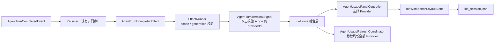

# 左侧栏与 Agent 统计整合 · 方案设计

- 日期：2026-08-11
- 输入：`01-需求分析.md`（D1–D10 已确认）
- 状态：待评审，未进入任务拆解与实现
- 档位：L

## 0. 推荐方案

在现有 Workbench 与 `ide_session` 恢复链路上做增量改造，不新建 feature，不新增 Provider 端口，也不修改 `AgentEvent` 或共享适配层：

1. 用新的 `IdeWorkbenchLayoutState` 表达并持久化应用级左栏状态，由 `IdeShellController` 作为运行时和持久化真源。
2. 首页移除 `IdeActivityRail`，给 `WindowFrame` 增加通用的标题栏左侧 action 槽；该 action 控制整个 Projects/Agent 统计合并栏。
3. 新建单一卡片的 `ProjectAgentSidebar`：Projects 占剩余空间，Agent 统计固定在底部；折叠时显示三行内摘要，展开时沿用现有完整统计内容并允许拖动高度。
4. 复用现有 `AgentTurnCompletedEvent → AgentTurnCompletedEffect`，在 EffectRunner 通过 scope 校验后，从已校验的会话 scope 构造中立 `AgentTurnTerminalSignal`。任何前后台 Turn 终态均驱动统计选择和静默刷新。
5. `AgentUsagePanelController` 负责把“持久化偏好”解析为当前 Provider 目录中的有效选择；手动选择、Turn 自动选择和失效回退最终都回写同一个 Workbench 快照，但绝不改变会话默认 Provider。



## 1. 现状与关键调用链

### 1.1 Workbench 与左栏

当前首页结构：

```text
IdeHome.build
  → WindowFrame(titleBarActions: Usage / Settings)
  → IdeHome._buildWorkbench
  → IdeWorkbenchScaffold
      leadingRailBuilder → IdeHome._buildLeadingRail → IdeActivityRail
      navigationPane    → IdeHome._buildLeftPanel
                         → _ResizableColumn
                           top    → PanelCard → ProjectListPane
                           bottom → AgentUsagePanel → PanelCard → Pane
      canvas            → _buildRetainedCanvasStack
```

- `_buildLeadingRail` 用 Projects/Context 两个 action 调 `_toggleLeftPanel`，分别改变 `_leftTopVisible` 与 `_leftBottomVisible`。
- `_leftPanelWidth`、`_leftTopRatio` 和两块显隐状态只保存在 `_IdeHomeState` 内存中，重启即丢失。
- `_ResizableColumn` 只支持“两块独立面板 + 比例分割”，没有“底部折叠摘要 + 展开最小高度”的语义。
- Compact 模式下，Activity Rail action 设置 `_activeOverlay = navigation`，由 `IdeWorkbenchScaffold` 展示 Navigation Overlay。
- `WindowFrame._TitleBar` 当前顺序为 macOS 三色灯 gutter / Windows Logo / 菜单 / 拖拽区 / 右侧 actions / 窗口按钮，没有可注入的左侧 action 槽。

### 1.2 Agent 统计

```text
IdeHome.initState
  → AgentUsagePanelController
  → ProviderAgentUsagePanelRepository.load
      → enabledProviderLoader
      → AgentProviderGlobalRuntime
      → AgentProviderBundle.usageQuota（可选）
      → Codex/Grok 本地统计仓储
  → AgentUsagePanel
```

- `AgentUsagePanelController._selectedProviderId` 只在内存中；Provider 目录刷新后，原选择不存在时回退到第一项。
- 控制器已有 load token，旧刷新结果不会覆盖新刷新；刷新期间可保留旧 Provider 数据。
- `AgentUsagePanel` 展开态已有 Provider Tabs、套餐、全部额度窗口、剩余进度、今日 Token、Skeleton 和局部错误。
- `AgentUsageWindow.windowDuration` 已提供额度周期，足以选择“周期最短窗口”，无需读取 raw payload。
- `AgentProviderIcon` 已按稳定 Provider id 渲染当前内置品牌图标，并为未知 Provider 提供中立回退；本需求直接复用。

### 1.3 Turn 终态通知

```text
AgentTurnCompletedEvent
  → AgentConversationReducer._turnCompleted
  → AgentTurnCompletedEffect
  → DefaultAgentConversationEffectRunner
  → AgentConversationViewModel.onTurnCompleted（VoidCallback）
  → AgentThreadWorkspaceController（每个常驻 entry 共用该 callback）
  → IdeShellController.onAgentTurnCompleted
  → IdeHome._handleAgentTurnCompleted
  → AgentUsageRefreshCoordinator.requestRefresh
```

- `AgentTurnCompletedEvent` 已覆盖 completed、failed、interrupted；取消最终映射为终态事件。
- EffectRunner 会先校验当前 scope/generation，再同步调用完成回调。
- 每个常驻 Workspace entry 都会触发回调，因此后台会话已具备通知路径。
- 当前回调为空参数，Provider 归属在向上传递时丢失；`IdeHome` 只能刷新，无法可靠切换 Provider。
- 不能改用最终的 `AgentAttentionSignal` 代替：Plan 执行交接会把 completed attention 转换成 `planExecutionRequired`，但统计仍必须收到原始 Turn 终态。

### 1.4 会话持久化

```text
IdeShellController._restoreSession
  → IdeSessionPersistenceCoordinator.restore
  → IdeSessionState.tryDecode / sanitizeIdeSessionState
  → Shell 应用项目、文件树与 Thread 状态

Shell 状态变化
  → IdeShellController._requestSessionSave
  → buildIdeSessionState
  → IdeSessionPersistenceCoordinator（延迟合并）
  → IdeSessionStore
```

- `IdeSessionState` 当前版本为 v4，保存项目、文件树、Thread 和当前会话 Provider，不包含 Workbench 布局。
- `IdeHome` 与 `IdeShellController` 已共享同一个常驻 Workbench；把应用级左栏状态并入该快照，不需要新文件或新 store。

## 2. 目标结构与状态流

### 2.1 应用级 Workbench 状态

新增纯 Dart、不可变的 `IdeWorkbenchLayoutState`，归属 `features/ide_session/domain`：

| 字段 | 类型 | 默认/语义 |
|---|---|---|
| `leftSidebarVisible` | `bool` | 默认 `true`；表示 Projects/Agent 统计合并栏是否打开 |
| `agentUsageExpanded` | `bool` | 默认 `false`；只控制统计展开，不控制整个左栏 |
| `leftSidebarWidth` | `double?` | `null` 表示使用 `IdeMetrics.sidePaneDefaultWidth`；用户拖动后保存逻辑像素 |
| `agentUsageHeightFraction` | `double?` | `null` 表示使用 UI token 默认比例；保存展开区占左栏可用高度的比例 |
| `selectedAgentUsageProviderId` | `String?` | 规范化 Provider id；目录加载后再校验可用性 |

推荐把“展开高度”持久化为比例而不是绝对像素：窗口高度变化时仍能保持用户的空间分配意图，并由最小高度约束防止 Projects 或统计被挤没。

新增 UI token：

- `IdeMetrics.agentUsageExpandedMinHeight = 220`
- `IdeMetrics.projectsPaneMinHeight = 160`
- `IdeMetrics.agentUsageDefaultFraction = 0.40`

布局时再结合实际 `BoxConstraints` 夹紧；domain 不 import UI token。左栏宽度继续夹紧到现有 `sidePaneMinWidth`～`sidePaneMaxWidth`。

`IdeShellController` 持有 `IdeWorkbenchLayoutState` 并提供窄接口：

- `setLeftSidebarVisible`
- `setAgentUsageExpanded`
- `setLeftSidebarWidth`
- `setAgentUsageHeightFraction`
- `setSelectedAgentUsageProviderId`

每次提交生成一个完整不可变快照并走现有 `_requestSessionSave`。拖动过程中的每像素预览只留在 presentation；在 drag end/cancel 时提交最终值，避免持续构建并序列化会话快照。窗口正常关闭的 `saveNow` 仍保存最近一次已提交状态。

### 2.2 单卡片左栏

目标树：

```text
IdeWorkbenchScaffold.navigationPane
  → ProjectAgentSidebar
      → PanelCard（唯一外框）
          → Expanded(ProjectListPane)
          → [展开时] IdeResizeHandle
          → AgentUsagePanel
              collapsed → 最多三行摘要
              expanded  → 现有 Pane / Tabs / 完整统计内容
```

`ProjectAgentSidebar` 只负责编排约束和拖动，不读取 Provider 数据；`ProjectListPane` 与 `AgentUsagePanel` 仍分别负责自己的业务内容。这样满足“单一卡片”又不让 Projects feature 依赖 Usage Statistics。

展开算法只使用父约束：

1. `LayoutBuilder` 取得左栏可用高度。
2. 根据 `agentUsageHeightFraction` 算目标高度。
3. 下界取 `agentUsageExpandedMinHeight`，上界保留 `projectsPaneMinHeight`。
4. 空间不足以同时满足两个最小高度时，统计内容保持自身最小可操作头部，正文内部滚动；不通过 post-frame 测量回写高度。
5. 折叠时不显示拖动手柄，并保留上次比例，重新展开恢复原高度。

折叠摘要规则：

- 第一行：`AgentProviderIcon`；有付费套餐显示套餐名，无套餐显示 Provider 名；最右侧为展开 action。
- 第二行：仅有付费套餐时显示周期最短额度窗口的剩余进度。
- 第三行：今日 Token 总量；无统计显示 `-`。
- 冷加载使用专用三行内呼吸 Skeleton；Provider 读取失败显示单行错误并保留重试入口；长文本省略。
- 展开后复用当前 Tabs、刷新按钮、全部套餐窗口与 Token 明细，不复制第二套完整统计实现。

### 2.3 Activity Rail 与标题栏入口

- Agent 首页不再向 `IdeWorkbenchScaffold.leadingRailBuilder` 传入 `_buildLeadingRail`；Scaffold 本身保留通用 Rail 能力，避免影响其他潜在调用方和测试能力。
- `WindowFrame` 新增默认空的 `titleBarLeadingActions`。布局位置固定在 macOS traffic-light gutter 之后、Windows Logo/菜单之前；因此 macOS 位于三色灯右侧，Windows/Linux 位于标题栏最左侧可交互区。
- `WindowTitleBarAction` 增加可选 `focusNode` 并传给 `PaneInteractiveSurface`，Compact Overlay 通过 Esc 或 scrim 关闭后把焦点还给该按钮。
- 该 action 只在 Agent 首页显示；设置页和完整使用统计页维持当前标题栏与 Navigation 语义。
- tooltip/semantic label 随状态使用“显示左侧栏”或“隐藏左侧栏”，active 状态与 `leftSidebarVisible` 一致。

首页映射规则：

```text
navigationVisible = leftSidebarVisible
activeOverlay =
  inspector overlay（若显式打开）
  否则 leftSidebarVisible ? navigation : null
```

Wide/Medium 下 Navigation 仍内联，`activeOverlay = navigation` 不产生浮层；同一状态在 Compact 下自然成为 Navigation Overlay。窗口跨断点时不需要 post-frame 回调或 layout 后 `setState`。Scrim/Esc 关闭 Navigation Overlay 等价于 `setLeftSidebarVisible(false)` 并持久化。

### 2.4 Provider 选择与 Turn 自动跟随

新增中立 `AgentTurnTerminalSignal`，字段仅为：

- `providerId`
- `threadId`（可空，与现有 effect scope 一致）
- `turnId`

它不包含错误正文、raw payload、命令或路径。信号生成流程：

1. Reducer 继续同步产生现有 `AgentTurnCompletedEffect`，不增加副作用。
2. `DefaultAgentConversationEffectRunner` 在现有 scope/generation 校验后，使用 `effect.scope.providerId`、`effect.scope.threadId` 与 `effect.turnId` 构造 signal，再调用 typed callback。该 scope 本身由该 Workspace entry 的固定 Conversation Binding 建立。
3. `AgentConversationViewModel`、`AgentThreadWorkspaceController`、`IdeShellController` 将 typed callback 原样向上传递；不能从“当前选中 entry”猜 Provider，因此后台完成不会串到前台 Provider。
4. `IdeHome` 先请求统计控制器选择 `signal.providerId`，再调用现有 `AgentUsageRefreshCoordinator.requestRefresh()`。

`AgentUsagePanelController` 增加“偏好 id”和“当前有效选择”的区分：

- `restorePreferredProviderId`：应用恢复值，不回写持久化，避免恢复循环。
- `selectProvider`：展开 Tab 的手动选择。
- `selectProviderFromTurn`：Turn 终态选择；即使 Provider 目录尚未发现，也先记录最新偏好。
- Provider 目录到达后：偏好存在则选择它；不存在则按目录稳定顺序选择第一项并回写；目录为空则选择为空。
- 所有选择更新均与会话默认 Provider 状态隔离。

Turn 信号按 EffectRunner 的同步交付顺序处理，最后到达者覆盖前一个选择；这同时定义了多个后台 Turn 几乎同时结束时的确定行为。已有刷新协调器继续合并重复刷新，因为每次刷新本就加载全部已启用 Provider，不需要按 Provider 启动并行刷新。

### 2.5 最短额度窗口

在 `AgentUsagePanelEntry` 增加纯派生 getter `compactQuotaWindow`：

1. 只在 `hasSubscriptionPlan` 为 true 时返回窗口。
2. 有正数 `windowDuration` 的窗口按时长升序选择。
3. 时长相同保持 Provider 返回的原始顺序。
4. 所有窗口都缺少有效时长时回退到第一项。
5. 没有窗口时不展示进度行。

该规则只消费中立 `AgentUsageWindow`，不在 UI 按 Provider id/kind 分支。

## 3. 分层归属与预计文件

| 层 | 新增/修改 | 归属理由 |
|---|---|---|
| `ide_session/domain` | 新增 `ide_workbench_layout_state.dart`；修改 `ide_session_state.dart` | 应用级、可持久化、Provider 无关的 Workbench 快照 |
| `ide_session/application` | 修改 `ide_session_state_builder.dart` | 构建/清洗会话快照时携带 Workbench 状态，不绘制 UI |
| `agent/domain` | 新增 `agent_turn_terminal_signal.dart` | 跨 agent 与 usage 组合层传递的中立、白名单终态身份 |
| `agent/application` | 修改 `agent_conversation_effect_runner.dart`、`agent_thread_workspace_controller.dart` | 从已校验 effect scope 构造并投递 typed signal；每个 Workspace entry 保持来源身份 |
| `agent/presentation` | 修改 `agent_conversation_view_model.dart` | 只转发 typed signal；不解析协议，也不从当前 UI 选择猜身份 |
| `usage_statistics/domain` | 修改 `agent_usage_panel_models.dart` | 提供 Provider 无关的最短额度窗口派生语义 |
| `usage_statistics/application` | 修改 `agent_usage_panel_controller.dart` | 处理持久化偏好、目录回退、自动/手动选择和刷新竞态 |
| `usage_statistics/presentation` | 修改 `agent_usage_panel.dart` | 拆出卡片外框，增加折叠摘要并复用现有展开内容 |
| `ui/features/ide` | 新增 `project_agent_sidebar.dart`；修改 `ide_home.dart` | `IdeHome` 是唯一 Workbench 组合边界；单卡片左栏是 shell 组合，不属于任一业务 feature |
| `ui/core` | 修改 `window_frame.dart`、`ide_metrics.dart` | 标题栏左 action、焦点和通用尺寸 token 是跨页面 UI 原语 |
| `app/shell` | 修改 `ide_shell_controller.dart` | Workbench 状态的应用级真源、恢复和持久化协调 |
| data | 不新增 store；现有 `IdeSessionStore` 原样使用 | 仍写 `state/ide_session.json`，不创建第二份状态文件 |

不会修改 Provider data adapter、`AgentProviderBundle`、Usage quota port、事件 Pipeline、CoalescingPolicy/Buffer 或 TimelineStore。

## 4. 契约变更

### 4.1 Domain / application 契约

| 契约 | 变化 |
|---|---|
| `IdeWorkbenchLayoutState` | 新增不可变模型、`copyWith`、宽容 JSON 投影；所有数值必须 finite，非法值回退为 null/default |
| `IdeSessionState` | 新增 `workbenchLayout`，构造函数默认 `const IdeWorkbenchLayoutState()` |
| `AgentTurnTerminalSignal` | 新增 Provider、可空 thread、turn 白名单身份；不携带状态正文或 raw |
| `DefaultAgentConversationEffectRunner.onTurnCompleted` | 从无参回调改为接收 `AgentTurnTerminalSignal`；signal 只从已校验 effect scope 构造 |
| `AgentConversationViewModel` / `AgentThreadWorkspaceController` / `IdeShellController` | `onTurnCompleted` 重命名为 typed `onTurnTerminal`，内部调用方一次性迁移 |
| `AgentUsagePanelController` | 增加恢复偏好、Turn 选择和 selection changed callback；现有构造参数保持可选默认，便于独立测试 |
| `AgentUsagePanelEntry.compactQuotaWindow` | 新增纯派生 getter，不改变仓储数据形状 |
| `WindowFrame.titleBarLeadingActions` | 新增默认空列表；旧调用方行为不变 |
| `WindowTitleBarAction.focusNode` | 新增可选字段；旧调用方行为不变 |

### 4.2 明确不变的契约

- `AgentProviderBundle`：不新增/修改端口；仍通过可选 `usageQuota` 表达套餐能力。
- `AgentProviderCapabilities`：不新增 flag。
- `AgentEvent`：不新增事件、不修改 `AgentTurnCompletedEvent`。
- `AgentConversationReducer`：算法与同步纯度不变。
- G1 列出的共享适配层：零改动。
- 统计 Tab 选择不写 `AgentProviderSettings.activeProviderId`，不触发 Provider switch。

### 4.3 持久化字段

`ide_session.json` 增加一个顶层嵌套字段：

```json
{
  "version": 4,
  "workbench": {
    "leftSidebarVisible": true,
    "agentUsageExpanded": false,
    "leftSidebarWidth": 286.0,
    "agentUsageHeightFraction": 0.4,
    "selectedAgentUsageProviderId": "codex"
  }
}
```

这是纯加字段：保持 `sessionStateVersion = 4`，不做迁移、不写 marker。原因是：

- 新版读取旧 v1～v4：缺少 `workbench` 时使用默认状态。
- 旧版读取新版 v4：忽略未知 `workbench`，不会因版本号升级而丢弃整个 IDE 会话。
- 单个 workbench 字段类型错误或越界时只回退该字段，不丢弃项目与 Thread 状态。
- 只保存布尔值、有限数值和规范化 Provider id，不含内容、路径、凭证或 raw payload。

## 5. 门禁合规

### G1 · 共享适配层纯度

方案不修改 G1 文件。最短额度选择只消费 typed `AgentUsageWindow`；Turn 自动跟随复用 typed terminal effect。没有任何 Provider raw、id/kind 分支或兼容逻辑进入 Pipeline、Buffer、Store。

### G2 · 身份由 Provider/Binding 决定，Store 不猜

自动切换使用产生终态的已校验 `AgentConversationEffectScope.providerId`；该 scope 来自 Workspace entry 的固定 `AgentConversationBinding`。不读取当前选中 Thread、不按 session id 反查/猜 Provider，也不把统计 Provider 当成会话 Provider。

### G3 · Reducer 纯同步，副作用走 EffectRunner

Reducer 仍只产生 `AgentTurnCompletedEffect`。typed callback 在 EffectRunner 完成 scope/generation 校验后同步投递；统计选择、持久化和刷新均在外层 application/组合层执行。live/history/replay reducer 实例完全不动。

### G4 · capability 驱动

Provider 目录仍来自已启用配置；套餐仍取可选 `bundle.usageQuota`。无 quota/无付费套餐就隐藏额度行，不制造空额度或 no-op 端口。新 UI 不按 Provider kind/name 判断能力。

### G5 · 审批语义隔离

不修改权限、提问、Plan 审批或 Plan 执行交接。尤其不复用可能被转换为 `planExecutionRequired` 的 attention 作为终态来源。

### G6 · 单向分层

Provider 协议与历史扫描保持在 data；usage domain 只提供中立派生规则；application 管状态、恢复与竞态；presentation 只渲染。跨 feature 的组合只发生在 `IdeHome` / app shell，`ProjectListPane` 不 import usage feature。

### G7/G8 · 存储边界

不增加 CLI 私有数据访问。新增状态继续写 app 注入的 `IdeSessionStore`，采用版本化宽容读取，只包含白名单 UI 字段。presentation/application 不拼 `~/.zeta` 路径。

### G9 · 主题与响应式 UI

复用 `PanelCard`、`Pane`、`IdeResizeHandle`、`IdeTabs`、`AgentProviderIcon`、`IdeSkeleton` 和 Graphite token；新增尺寸进入 `IdeMetrics`。布局只依赖 `LayoutBuilder` 约束，不使用 post-frame 测高、GlobalKey 查高或 layout 后反馈环。按钮补 tooltip、semantic label 和焦点恢复。

## 6. 兼容性策略

### 数据兼容

- 缺少 `workbench`：左栏可见、统计折叠、尺寸使用 token 默认、Provider 首次目录选择第一项。
- 损坏/未知字段：逐字段回退；不阻断启动，不覆盖项目/Thread 状态。
- Provider id 被禁用、删除或目录中不存在：目录稳定顺序第一项成为选择并回写。
- Provider 目录为空：显示现有空态，持久化选择清空。
- 降级旧版：仍是 v4，旧 decoder 忽略新增字段。

### 调用方兼容

- `WindowFrame` 新参数、`WindowTitleBarAction.focusNode`、`AgentUsagePanelController` 的新 seed/callback 均有默认值。
- `IdeSessionState` 与 `buildIdeSessionState` 的 Workbench 参数提供默认值，现有独立单测可逐步迁移。
- Turn callback 是内部 typed contract，统一修改所有生产与测试调用方，不保留无参/有参双轨，避免两条完成通知漂移。
- `AgentUsagePanel` 的展开内容和 repository contract 不变；只改变外框归属和增加折叠模式。

### capability 兼容

不改变任何 Provider capability。支持套餐的 Provider 继续展示套餐；不支持的 Provider 仍可展示今日 Token 或 `-`。未知 Provider 图标走现有回退，不影响数据加载。

## 7. 测试矩阵

| 层/测试文件 | 覆盖行为 | 主要风险 |
|---|---|---|
| `ide_session_state_test.dart` | Workbench 往返、缺字段、旧 v1～v4、未知字段、损坏类型、非法数值 | 新字段导致整份会话不可读 |
| `ide_session_persistence_coordinator_test.dart` | 恢复期间不被默认 UI 状态覆盖；快速更新最终快照胜出 | 慢恢复/保存竞态覆盖用户状态 |
| `ide_shell_controller_test.dart` | 恢复与保存全部左栏字段；选择回退回写；drag 只提交最终值 | 应用级状态与页面状态漂移 |
| `agent_usage_panel_controller_test.dart` | 有效 seed、失效 seed、目录前自动选择、手动后自动覆盖、空目录、刷新竞态、最后信号胜出 | Provider 选择被旧刷新或手动状态反覆盖 |
| `agent_conversation_effect_runner_test.dart` | typed terminal callback 只执行一次；旧 scope/generation 丢弃 | 迟到终态切错统计 Provider |
| `agent_conversation_view_model_test.dart` | typed signal 原样上送；completed/failed/interrupted 与 Plan handoff 路径都不吞掉 terminal callback | attention 转换吞掉统计切换 |
| `agent_thread_workspace_controller_test.dart` | 两个前后台 entry 分别上报自己的 Provider，不读取当前选中 entry | 后台 Turn 归属串线 |
| `agent_usage_panel_models_test.dart` | 最短 duration、相同时稳定首项、部分/全部 duration 缺失、无窗口 | 折叠额度选择不确定 |
| `agent_usage_panel_test.dart` | 有套餐三行、无套餐两行、Provider 图标、Skeleton、错误、Token `-`、展开 Tabs/完整内容 | 折叠态溢出或与展开态数据漂移 |
| `window_frame_menubar_test.dart` | leading action 在 macOS gutter 后、Windows/Linux 最左交互区；tooltip/semantics/focus | 标题栏拖拽区或系统按钮被破坏 |
| `ide_workbench_scaffold_test.dart` | 无 leading rail 时宽度计算；Navigation 在 Compact 成为 Overlay；Esc/scrim 关闭并恢复焦点 | 窄窗挤压 Canvas、Overlay 无法关闭 |
| `ide_shell_widget_test.dart`（真实 `IdeHome`） | 单卡片、标题栏 toggle、宽度/高度拖动、重启恢复、后台 Turn 自动切换、Wide/Medium/Compact 转换 | Workbench/AgentPane 重挂载、草稿/滚动/Thread 丢失 |
| 架构守卫 | G1 文件无新增 Provider import/分支；统计 Tab 不写 active provider | 共享层污染或统计选择改变会话路由 |

实现完成后执行：

```sh
dart format .
flutter analyze
flutter test
```

本次会修改 resize 热路径，还需在 Windows Profile 运行 1280→1000→1280 的 10 秒场景，记录 UI/Raster p95、慢帧率、隐藏页 build/layout、viewport item、projection/diff/highlight 与 transient callback 计数；Debug 数据不作为结论。

## 8. 风险与取舍

### 采用的取舍

- **高度保存比例，宽度保存逻辑像素。** 高度更受窗口变化影响，比例恢复更稳定；宽度已有明确 min/max token，逻辑像素符合当前拖动语义。
- **拖动预览留在 presentation，结束后才持久化。** 避免每个 pointer delta 都生成/编码完整 IDE 会话；toggle 与 Provider 选择仍立即请求延迟保存。
- **最后到达的后台终态胜出。** 与需求“自动覆盖手动选择”一致，也给并发完成提供无需墙钟比较的确定顺序。

### 考虑后否决

1. **把布局状态写入 `general.json`：否决。** 这些是 Workbench 会话恢复状态，放入 General Settings 会拆成两条异步恢复链路，难以原子恢复。
2. **保存统计绝对像素高度：否决。** 换窗口尺寸或显示缩放后容易挤没 Projects；比例 + min/max 更符合响应式约束。
3. **继续复用 `_ResizableColumn`：否决。** 它表达两个独立卡片的显隐，不能自然表达单卡片、折叠摘要和统计最低高度；改它还会扩大到右侧 Files/Tools。
4. **从当前选中 Thread 推断完成 Provider：否决。** 后台 Turn 会被错误归到前台 Provider，违反 G2。
5. **复用 `AgentAttentionSignal`：否决。** Plan handoff 会改写 completed attention，无法覆盖所有终态。
6. **修改 `AgentTurnCompletedEvent` 或共享 Pipeline：否决。** 现有 typed event/effect 已足够，改共享层既无中立契约缺口，也会无谓触发 G1 与 AgentEvent 16 问。
7. **新增 Bundle 端口或 capability：否决。** 套餐和 Provider 目录已有中立契约；本需求只是展示与选择状态。
8. **让统计 Tab 复用 active provider：否决。** 会把观察对象与会话路由耦合，直接违反 D8。
9. **保留两个 `PanelCard` 只改间距：否决。** 视觉上仍是两个卡片，不满足 D2 的单一卡片语义。

## 9. 文档与交付影响

实现阶段需同步：

- `docs/architecture/design_document.md`：Agent 首页 Navigation 从 `Projects / Context` 改为合并左栏，移除首页 Activity Rail 描述。
- `docs/architecture/overview.md` 与中英文对应文档：补充标题栏左侧入口、单卡片左栏和 Workbench 状态恢复。
- `docs/guides/developer_guide.md`：更新 UI slot、Compact Overlay、使用统计折叠态与持久化约束。
- `docs/product/product_requirements.md`：在现有三栏目标下补充可折叠合并左栏，不改变“暂不包含”。
- `CHANGELOG.md` 的 `[未发布]`：记录用户可感知的工作台布局与恢复变化。

## 10. 阶段门结论

- 分层、typed contract、持久化兼容、测试矩阵和 G1–G9 边界均已明确。
- 不需要 Issue 讨论共享层或 Provider 端口，因为方案不修改两者。
- 没有剩余产品决策；最低高度、等周期排序和并发终态顺序已在本方案中给出唯一推荐。
- 评审确认后进入 `03-任务拆解.md`，在此之前不写实现代码。
