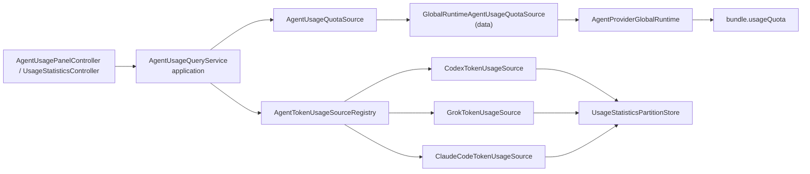

# 统一 Agent 用量查询 · 方案设计

- 日期：2026-08-12
- 输入：`01-需求分析.md`
- 状态：已确认，T00 已完成
- 档位：L

## 0. 推荐方案

在现有 `usage_statistics` feature 内引入一个 **application 级统一查询边界**，但不把“套餐限额”与“Token 历史”合并为一个 Provider 大接口：

1. 套餐保留既有 `AgentProviderBundle.usageQuota` 可选端口，query service 依赖中立 `AgentUsageQuotaSource`，生产 data 实现再通过 global runtime 读取。
2. Token 历史新增中立 `AgentTokenUsageSource`，Codex/Grok/Claude Code 分别实现自己的路径解析、扫描、差分、去重和 codec。
3. `AgentUsageQueryService` 按已启用 Provider 并行组合 quota 和 token history，产出 Provider 中立快照，侧栏与完整统计页都由它派生当前所需读模型。
4. `lib/src/app` 是唯一组合点：`app.dart` 注入持久化依赖，`IdeShellController` 在建立 global runtime 和 Provider 设置控制器后注册 token source 并构造 query service；`IdeHome` 只消费 shell 暴露的中立 controller。
5. 索引 Store 改为 Provider 不透明分区；共享 Store 只负责版本化、原子读写与分区合并，不 import Provider 自有 snapshot 类。
6. Provider 自有 source 可以读取查询所需的 CLI 私有数据，但文件访问、路径解析和协议解码全部封装在该 Provider 的 data 层；共享 query/store 只接收中立快照。



这是唯一推荐方案：**UI 看到统一读模型，Provider 底层保持两种独立能力契约。**

### 0.1 用户确认的数据访问决策

用户于 2026-08-12 明确要求删除原 G7“不得读取其他 CLI 私有数据”的门禁，允许 Provider data adapter 按明确功能读取对应 CLI 的配置、会话、日志和账号 metadata。因此：

- 不再建立全局的精确路径白名单，也不把 Grok/Claude 历史读取视为例外；
- 读取路径、文件格式、容错和去重仍由 Provider 自有 data source 高内聚封装；
- domain/application/presentation 不遍历 Provider 私有目录，不接收原始路径、环境值或 payload；
- 允许读取不自动授权迁移、复制、改写或删除，写操作仍需独立产品能力与用户动作；
- 派生索引继续只写 `~/.zeta/state` 的规范化白名单字段，原 G8/G9 顺延为新 G7/G8。

该决策会同步 `AGENTS.md`、`CLAUDE.md`、工程规范、架构概览、贡献指南和提示词模板，但**不修改共享事件适配层、`AgentProviderBundle` 或 Provider 端口**。

## 1. 现状测绘

### 1.1 套餐额度链路

```text
AgentUsagePanelController
  → ProviderAgentUsagePanelRepository
  → AgentProviderGlobalRuntime.run(config)
  → AgentProviderBundle.usageQuota
  → Provider.readUsageQuota()
      Codex       → account/rateLimits/read
      Grok        → _x.ai/billing
      Claude Code → OAuth Usage REST
```

优点：

- domain 已有中立快照 `AgentUsageQuotaSnapshot`。
- `usageQuota` 是可选端口，未支持 Provider 不必伪造实现。
- 具体协议和 mapper 在 Provider data 层。

剩余问题：`AgentProviderGlobalRuntime.run` 在操作前会初始化 Provider，因此查询 Claude Code 账号 REST 也会经过 runtime 初始化。这不在本次首阶段修改，因为项目规范明确要求用量面板只通过 global runtime 读 quota；如果后续要去掉这次初始化，需另立 Provider 生命周期设计。

### 1.2 Token 历史链路

完整统计页：

```text
IdeHome
  → UsageStatisticsController
  → CompositeUsageStatisticsRepository
      → CodexUsageStatisticsRepository
      → GrokUsageStatisticsRepository
  → UsageStatisticsIndexStore(v3)
```

侧栏：

```text
IdeHome
  → AgentUsagePanelController
  → ProviderAgentUsagePanelRepository
      → kind == codex ? CodexUsageStatisticsRepository
      → kind == acp   ? GrokUsageStatisticsRepository
      → MemoryUsageStatisticsIndexStore(seed)
```

已确认的侵入：

- `IdeHome` 直接 import 并构造 usage data 实现。
- `ProviderAgentUsagePanelRepository` 按 `AgentProviderKind` 分支，并重复今日 Token 聚合。
- `UsageStatisticsIndexStore` 直接 import Codex/Grok snapshot 类，新增 Provider 必须改 Store 接口和 JSON codec。
- Codex/Grok repository 同时承担 Token 历史和可选 quota 读取，与已经建立的 bundle quota 路径重复。
- 侧栏使用临时 Memory Index，完整统计页使用共享 File/Memory Store，两条路径的缓存写回语义不同。
- Grok scanner 的现有路径行为曾与原 G7 冲突；§0.1 的用户决策已解除读取禁令，迁移时只需继续保证访问封装在 Grok data source。

### 1.3 Claude Code 现有基础

- live `result.usage` 已映射为 `AgentTokenUsageEvent(isSessionCumulative: false)`。
- `ClaudeCodeSessionHistoryReader` 已从本地历史聚合 usage，并可产出中立历史事件/快照。
- 当前统计仓储没有 Claude Code source，面板对非 Codex/Grok 直接只返回 quota。
- history reader 当前读取 `~/.claude/projects/<encoded-project>/*.jsonl`；新 source 可复用该入口，但不得把原始路径或消息正文带入共享统计层。

## 2. 领域语义分离

### 2.1 不合并 quota 和 token history 端口

| 维度 | 套餐/额度 | Token 历史 |
|---|---|---|
| 数据来源 | Provider 账号 API/CLI RPC | CLI 历史、远程记录或 Zeta 观测投影 |
| 时效性 | 实时/短缓存 | 可增量重建的历史 |
| 生命周期 | 可能需要 global runtime | 应能独立于 session runtime 扫描 |
| 失败语义 | 未登录、不支持、限流、网络错误 | 目录不存在、损坏行、部分索引不可用 |
| 存储 | 不落盘或短时内存 | 可落盘白名单派生索引 |
| 查询维度 | 当前账号窗口 | 时间、项目、模型、回合 |

因此不新增 `AgentProvider.queryAllUsage()`，也不让 `AgentTokenUsageSource` 返回 quota。统一只发生在 application 读模型上。

### 2.2 新的中立契约

#### `AgentUsageQuery`

```dart
class AgentUsageQuery {
  const AgentUsageQuery({
    required this.earliest,
    this.forceRefresh = false,
  });

  final DateTime earliest;
  final bool forceRefresh;
}
```

不在 query 中放 CLI home、原始路径或 Provider 协议参数。

#### `AgentTokenUsageSource`

```dart
abstract interface class AgentTokenUsageSource {
  String get providerId;

  Future<AgentTokenUsageSourceSnapshot> load(AgentUsageQuery query);
}
```

`AgentTokenUsageSourceSnapshot` 只包含：

- `providerId` / `providerName`；
- 不可变 `List<AgentUsageRecord>`；
- `refreshedAt`；
- 中立 warning code/message，不含原始错误正文。

source 实例在 app 组合时与具体 `AgentProviderConfig` 绑定，所以 source 内可自己处理 `CODEX_HOME` / `GROK_HOME` / Claude home，共享 service 不需要按 kind 分支。

#### `AgentUsageQuotaSource`

```dart
abstract interface class AgentUsageQuotaSource {
  Future<AgentUsageCapabilityResult<AgentUsageQuotaSnapshot>> loadQuota(
    AgentProviderConfig config,
  );
}
```

query service 只依赖这个中立契约。生产实现 `GlobalRuntimeAgentUsageQuotaSource` 属于 data 层，它调用 `AgentProviderGlobalRuntime.run`，只在回调中使用 `bundle.usageQuota`。

#### `AgentUsageProviderSnapshot`

```text
AgentUsageProviderSnapshot
├── provider
├── quota: unsupported | available | unavailable
└── tokenHistory: unsupported | available | unavailable
```

`unsupported` 和 `unavailable` 必须区分：

- `unsupported`：没有注册 source/端口，UI 可不展示对应内容；
- `unavailable`：本来支持，但本次读取失败，UI 保留旧数据或展示局部错误。

不用 `null` 同时承担“不支持”、“失败”和“数据为空”三种语义。

#### `AgentUsageQueryService`

职责：

1. 加载已启用 Provider 目录。
2. 从 registry 解析该 Provider 的 token source。
3. quota 与 token history **独立并行**读取，互不阻断。
4. 将失败限定在单 Provider 单能力。
5. 对外流式发布 Provider 目录和单项快照，保留当前面板的渐进加载。
6. 提供聚合历史快照，供完整统计页使用。

Service 不解析 Provider raw payload，不 import Provider scanner/codec，不按 kind 分支。

### 2.3 Registry 与 app 组合

推荐使用组合时构建的中立 factory registry：

```dart
abstract interface class AgentTokenUsageSourceRegistry {
  AgentTokenUsageSource? createFor(AgentProviderConfig config);
}
```

使用 factory 而不是预构造 source，因为 Provider 设置需先异步加载，且每个 source 要绑定实际 config id/environment。生产注册发生在 `lib/src/app/shell`，可以按稳定 kind/id 选择具体 factory；这是 composition root 对具体实现的合法了解，不将分支泄漏到 UI/application。

不推荐 `source.supports(config)` 逐个试探：它会把选择规则分散到每个实现，而且同一 config 可被多个 source 误匹配。

## 3. Provider 自有实现

### 3.1 Codex

`CodexTokenUsageSource` 承接当前 `CodexUsageStatisticsRepository` 的 Token 职责：

- 解析 config/environment 中的 `CODEX_HOME`；
- 调用 Codex usage scanner；
- 对 thread 累计 `token_count` 做非负差分；
- 合并重复 thread/turn；
- 产出 `AgentUsageRecord`；
- 解码/编码 Codex 索引分区。

它不再接受 raw `AgentProvider` loader，不再查 quota。

### 3.2 Grok

`GrokTokenUsageSource` 承接当前 Grok repository 职责：

- 解析 `GROK_HOME`；
- 扫描 `updates.jsonl`；
- 将 Grok 自有状态映射为中立 status/token/error category；
- 解码/编码 Grok 索引分区。

它不再查 quota。

本 source 自己拥有 Grok 私有历史读取和容错逻辑；共享 query、partition store 与 UI 不知道 `GROK_HOME` 或 `updates.jsonl`。

### 3.3 Claude Code

`ClaudeCodeTokenUsageSource` 复用已有只读历史入口，但不经 TimelineStore 或 UI 反向获取 Token：

1. 使用 `ClaudeCodeSessionHistoryReader` 的独立 history identity/reducer 路径获得已规范化回合。
2. 将每个历史回合映射为 `AgentUsageRecord`，`result.usage` 作为本回合绝对用量，不做 Codex 式会话累计差分。
3. 用 `(providerId, threadId, turnId)` 去重；相同记录多次出现时保留字段更完整的快照。
4. 索引只保存统计白名单，不复制消息/工具正文。
5. 只读 Claude Code CLI 历史，不改写、不删除、不迁移。

Claude source 上线前先用现有 history/live parity fixture 和新的 usage projection 序列测试固定语义，并断言原始路径、正文和凭据不会进入中立快照或索引。

## 4. 索引设计

### 4.1 目标格式 v4

```json
{
  "version": 4,
  "providers": {
    "codex": {
      "schemaVersion": 1,
      "payload": {
        "sessions": []
      }
    },
    "grok": {
      "schemaVersion": 1,
      "payload": {
        "sessions": []
      }
    },
    "claude-code": {
      "schemaVersion": 1,
      "payload": {
        "sessions": []
      }
    }
  }
}
```

共享层定义：

```dart
class UsageStatisticsIndexPartition {
  const UsageStatisticsIndexPartition({
    required this.schemaVersion,
    required this.payload,
  });
}

abstract interface class UsageStatisticsPartitionStore {
  Future<UsageStatisticsIndexPartition?> readPartition(String sourceKey);
  Future<void> writePartition(
    String sourceKey,
    UsageStatisticsIndexPartition partition,
  );
}
```

约束：

- `sourceKey` 是统计源稳定 key，不是 UI 显示名称。
- 共享 Store 对 payload 不做 Provider 解码，只保存 JSON-safe 白名单对象。
- Provider source 的 codec 负责忽略损坏条目、缺字段和未知字段。
- Store 内部使用串行 read-modify-write，并行刷新只替换自己的分区。
- 未知 Provider 分区在重写时原样保留，便于版本回退和分阶段发布。

### 4.2 v2/v3 兼容

- v2 顶层 `sessions` 按已有语义视为 Codex 分区。
- v3 `providers.codex` / `providers.grok` 在 data 边界投影为 v4 不透明分区。这两个 legacy key 只允许出现在专用 `LegacyUsageStatisticsIndexDecoder`，通用 partition store/query service 不得识别 Provider 名称。
- 首次成功写入时统一输出 v4；不单独写 migration marker，迁移失败时保持本次内存结果并下次重试。
- 文件损坏或版本未知时返回空索引，由 source 重建，不阻断启动。

### 4.3 白名单

允许落盘：Provider/thread/turn 规范化标识、项目路径的现有规范化统计字段、模型、时间、状态、时延、Token 计数、错误分类/代码以及无路径 fingerprint/sourceId。

禁止落盘：Prompt、回复、thinking、工具输入/输出、原始错误正文、raw payload、环境变量值、凭据、session 文件路径。

## 5. 查询、缓存与刷新语义

### 5.1 查询独立性

每个 Provider 同时启动两个互不依赖的 operation：

```text
quotaFuture  ──→ available / unsupported / unavailable
tokenFuture  ──→ available / unsupported / unavailable
```

任一失败都不取消另一个。不得像现状一样先进 global runtime，再在同一回调里扫本地历史。

### 5.2 单一历史真源

侧栏和完整统计页共享同一组 token source 与同一 partition store：

- 侧栏查询今日起点，再用中立聚合函数计算今日 Token。
- 完整统计页查询当前及前一时间窗的 earliest。
- source 和 Store 共用增量索引，不再为面板创建 seed-only Memory Store。

为避免侧栏和完整页同时刷新重复扫描，query service 以 `(providerId, earliest, forceRefresh generation)` 合并同期 in-flight；`forceRefresh` 不复用旧的非强制请求。

### 5.3 刷新粒度

首阶段保留当前“回合终态后刷新全部已启用 Provider”的可见行为。新 query service 内部为单 Provider 读取建立窄接口，但不在这次顺手修改 turn terminal callback 为 typed provider signal，避免扩大到 Agent 事件/效果链路。

## 6. 分层归属与预计文件

| 层 | 新增/修改 | 归属理由 |
|---|---|---|
| `usage_statistics/domain` | `AgentUsageQuery`、`AgentTokenUsageSource`、Provider 能力结果、中立 record identity | 不依赖 Flutter、IO 或 Provider 协议的稳定契约 |
| `usage_statistics/application` | `AgentUsageQueryService`、今日 Token 聚合、局部失败组合、渐进发布 | 跨 repository/source 的可复用业务编排 |
| `usage_statistics/data` | partition store、registry 实现、global-runtime quota source、Codex/Grok/Claude token source 及自有 codec | 文件系统、JSON、Provider 私有数据读取与索引均属 data |
| `agent/domain` | 保留 `AgentUsageQuotaProvider` / `AgentUsageQuotaSnapshot` | 已是稳定的 Provider 可选账号能力，不因历史统计搬迁 |
| `agent/data` | 现有 quota adapter 不变；usage scanner 在迁移期可先复用，旧路径无调用方后再搬到 usage data | 避免一步同时搬文件和改行为，保持可回滚 |
| `app` | `app.dart` 构建/注入 store；`IdeShellController` 在 global runtime 就绪后构建 source registry、quota source、query service 和页面 controllers | 唯一 composition root；不要求 `app.dart` 访问尚未创建的 runtime |
| `ui/features/ide` | 删除 usage data imports，只接收 controllers/中立 repository | UI 只组合界面 slot，不数据访问 |

不新建顶层宽泛目录，也不将中立用量契约放入 G1 共享事件适配层。

## 7. 契约变更清单

| 契约 | 变化 | 是否影响 Provider 端口 |
|---|---|---|
| `AgentUsageQuotaProvider` | 保持不变 | 否 |
| `AgentProviderBundle.usageQuota` | 保持不变 | 否 |
| `UsageStatisticsRepository` | 保留为完整页的中立 facade，生产实现改为 query service 适配器 | 否 |
| `AgentUsagePanelRepository` | 保留流式 UI 契约，生产实现改为 query service 适配器 | 否 |
| `AgentTokenUsageSource` | 新增 usage feature 中立数据源契约 | 否，不是 bundle/Provider 端口 |
| `AgentUsageQuotaSource` | 新增 usage feature 中立 quota 加载契约，生产实现包装 global runtime | 否，只消费既有 bundle 端口 |
| `AgentUsageProviderSnapshot` | 新增 quota/history 独立状态 | 否 |
| `UsageStatisticsPartitionStore` | 替换 Provider-typed `UsageStatisticsIndexStore` | 否 |
| `AgentUsageRecord.id` | 改为包含 `providerId` 的规范 identity | 否；UI key 行为仅在冲突时更正 |
| `AGENTS.md` 原 G7 | 删除“不得读取其他 CLI 私有数据”门禁；原 G8/G9 顺延为新 G7/G8 | 是架构规则变更；否，不是 Provider 端口 |

如果实施期发现中立 source 无法在不修改 `AgentProviderBundle` 或 Provider 端口的前提下完成，立即停止并请用户确认，不在实现期扩张契约。

## 8. 兼容与迁移策略

### 8.1 行为兼容

- 保留 `AgentUsagePanelController` 的目录顺序、单项渐进完成、旧数据保留、静默刷新和 load token 语义。
- 保留 `UsageStatisticsController` 的时间窗自动扩展、筛选保留和旧请求丢弃语义。
- 保留 quota 失败时不阻断 Token，单 source 失败时不阻断其他 Provider。
- 保留当前统计页和面板的展示契约，不在本次调整文案或布局。

### 8.2 旧调用面

采用先加后删：

1. 建立新 source/store/query service 并用 characterization tests 与旧 repository 对齐。
2. 侧栏、完整统计页逐个切换。
3. 旧 `CodexUsageStatisticsRepository`、`GrokUsageStatisticsRepository`、`CompositeUsageStatisticsRepository`、`ProviderAgentUsagePanelRepository` 无生产调用方后再删除或收敛。
4. 不留双写、双扫描或永久 compatibility wrapper。

### 8.3 持久化兼容

此部分同时命中“持久化演进”专项门禁；实施时需在 `.workflow/migration/` 补齐 v4 兼容产物，不以本设计文档代替实际迁移记录。

## 9. 门禁合规

### G1/G2 · 共享适配层与 identity

- 不修改 Pipeline、CoalescingPolicy/Buffer、Dispatcher 或 TimelineStore。
- 不从 `AgentTokenUsageEvent.raw`、source id 或时间线末尾推断统计身份。
- Token source 只消费 Provider 已规范化的本地历史身份，去重 key 为 `(providerId, threadId, turnId)`。

### G3 · reducer 隔离

- 查询层不引入 Timer/Flutter scheduler。
- Claude Code 历史继续使用独立 history identity/reducer，不复用 live 实例。

### G4 · 能力表达

- quota 继续由 bundle 可选端口表达。
- Token history 是 usage feature 注册的只读数据源，没有 source 时返回 `unsupported`，不返回空成功伪造支持。
- 本契约不扩大 `AgentProvider` 必选实现面。

### G6 · 分层

- Provider JSON/JSONL、文件路径、环境变量和 codec 只在 data。
- domain 只定义不可变查询/结果契约，无 Flutter、`dart:io` 或 Provider raw 字段。
- application 编排并行查询和业务聚合。
- `lib/src/app/shell` 在已有 global runtime/Provider settings 就绪后构建具体 source 与 controllers；`IdeHome` 只接收 shell 暴露的中立控制器。

### G6/G7 · CLI 数据和索引

- Provider 私有历史的文件访问、路径解析和协议字段只存在于各自 data source。
- 用户已允许读取其他 CLI 私有数据；该决定不自动授权迁移、复制、删除或改写。
- v4 索引依然写入 app 注入的 `~/.zeta/state` 文件。
- 宽容处理缺字段、未知字段、损坏数据和 v2/v3。
- 按 §4.3 白名单存储，不写敏感内容或原始路径。

## 10. 测试矩阵

| 层 | 用例 | 覆盖风险 |
|---|---|---|
| domain | query/result 不可变、unsupported/unavailable 区分、record identity 包含 Provider | 中立语义模糊、UI key 冲突 |
| application | quota/history 并行且局部失败；目录顺序；逐项发布；in-flight 合并；强制刷新 | 一种能力阻断另一种、刷新竞态 |
| Codex data | v3 分区对齐、累计 Token 非负差分、重复 rollout 合并 | 重复或负 Token |
| Grok data | updates 映射、cached/reasoning Token、损坏行 | 字段漂移或部分文件阻断 |
| Claude data | live/history canonical parity、回合绝对 Token、重复记录合并、损坏历史 | 累计语义用错、重复计费 |
| persistence | v4 往返、v2/v3 迁移、缺/多字段、损坏 JSON、并行分区写、未知分区保留 | 索引丢失、无法回退、启动阻断 |
| data access | 三个 source 仅命中获批历史 glob；不读认证/配置/其他文件；不跟符号链接；无写入 API | 私有数据越权、规则再次漂移 |
| controller | 侧栏保留旧数据/静默刷新/旧流丢弃；统计页筛选/窗口 | 可见行为回归 |
| widget | Codex/Grok 基线不变；Claude 有/无历史；局部错误 | 面板/页面信息缺失或闪烁 |
| architecture | `IdeHome` 无 usage data import；query/store 无 Provider kind/id 分支或自有 type import；G1 文件 diff 为空 | 分层再次侵入 |

每一实施步骤都执行 `dart format .`、`flutter analyze` 与该步相关测试；最终执行全量 `flutter test`。

## 11. 风险与止损线

### 11.1 主要风险

1. **同一个 Provider 多配置实例。** 索引 source key 与业务 `providerId` 必须分清；如果当前配置允许同 kind 多实例，分区 key 必须使用稳定配置 id，不得只用 kind。
2. **v3 迁移范围。** 旧分区中是 Provider 自有快照，不能直接当中立 record 使用；必须由对应 source codec 解码。
3. **Claude 历史扫描成本。** 不能为今日 Token 每次递归全部历史，必须复用增量 fingerprint/分区索引或有界窗口。
4. **行为重构与新功能混杂。** 先对齐 Codex/Grok 行为再注册 Claude；不在同一步同时删旧路径和接新 Provider。
5. **调试信息泄漏。** warning 和实现记录只保留类型/计数，不复制原始异常、路径或 payload。
6. **私有数据读取面扩大。** 使用测试和分层守卫防止路径、raw、凭据或正文穿透到共享层与派生索引；Provider source 仍应只读取完成查询所需的数据。

### 11.2 必须立即停止的情况

- 新 source 无法在不修改 `AgentProviderBundle` / Provider 端口的情况下实现。
- 方案假设的 Claude Code 历史 usage 与实际语义不一致，需改 AgentEvent 或 TimelineStore 才能获取。
- 为保持现有测试必须长期双写旧索引和新索引。
- 某一步从预计的局部契约/调用方切换扩大为共享适配层或会话生命周期改造。
- 不能从当前 v2/v3 数据无损或可重建地得到 v4，且需要猜测敏感/raw 字段。

命中任一条时，先写入 `04-实现记录.md` 并请用户确认，不自行扩大方案。

## 12. 考虑后否决的方案

1. **向 `AgentProviderBundle` 增加 `usageHistory` 端口：否决。** Token 历史是可离线扫描的分析数据，绑入 runtime bundle 会迫使查询经过 Provider 实例生命周期，加重当前问题。
2. **用一个 `queryUsage()` 统一 quota/history：否决。** 两者时效、失败、存储和查询维度不同，合并会得到可选字段过多的上帝接口。
3. **继续在 `ProviderAgentUsagePanelRepository` 加 Claude 分支：否决。** 能快速出功能，但会固化需要解决的 kind 分支、双缓存和 UI data 装配。
4. **只把 scanner 移文件不改契约：否决。** 只修正目录归属，不解决 Store 和聚合层的 Provider 依赖。
5. **用 live `AgentTokenUsageEvent` 直接写全部统计：否决。** 它只能覆盖 Zeta 观测到的回合，无法完整表达 CLI 历史；还会把事件管线与分析存储耦合。
6. **当即修改 global runtime 为“可不初始化”：否决。** 这是 Provider 生命周期契约变更，超出本次用量查询收敛的必要范围。
7. **只统计 live 事件：否决。** 只能覆盖 Zeta 观测回合，会丢失 CLI 外部历史，并引入另一条持久化投影链路。

## 13. 文档与交付影响

实现后需同步：

- `AGENTS.md` 删除原 G7 并重编号、更新使用统计任务路由；同步 `CLAUDE.md`、贡献指南和提示词模板中的门禁数量/引用。
- `docs/architecture/engineering_standards.md`：补充统一 query/source 边界和 app-only composition。
- `docs/architecture/design_document.md`、`overview.md` 及 `overview.en.md`：更新 Token 历史查询流和 v4 分区索引。
- `docs/guides/developer_guide.md`：更新新 Provider Token source 接入步骤、v4 索引和 Claude Code 统计语义。
- `docs/product/troubleshooting.md` 及英文版：如存储白名单或清理语义变化则同步。
- `CHANGELOG.md` `[未发布]`：只记录 Claude Code 新增全局 Token 统计的用户可见变化；纯结构收敛不写。

## 14. 阶段门结论

- 统一的是 application 读模型和组合边界，不是 quota/history 底层语义。
- 用户已确认 §0.1；T00 先完成规则删除和门禁重编号，再进入行为安全网。
- 首阶段不需要修改共享事件适配层、`AgentProviderBundle` 或 Provider 端口。
- 持久化 v4 迁移需独立安全网和兼容记录，不与 Claude source 在同一步落地。
- 用户确认后才按 `03-任务拆解.md` 实施。
