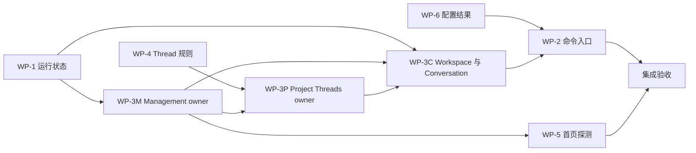

# lib 高内聚、低耦合改造 · 开发总入口

> 类型：开发设计文档集；创建日期：2026-09-05。本文记录目标设计；已实现阶段以本页状态表和验收记录为准。
> 复核基线：`511cc0be`。本轮开始时工作区存在发布流程相关改动；本计划不包含发布、打包、依赖升级或 Provider 协议升级。
> 六项问题编号与上轮审查一致；**编号不是执行顺序**。伪代码中的拟新增接口必须按目标文件清单实现，不是可直接粘贴编译的现有 API。

## 1. 使用方法与任务状态

本目录是一份完整改造方案：本文件统一规定架构决策、依赖顺序和验收门禁；六份工作包分别提供文件清单、状态设计、接口、伪代码和测试要求。开发者先读本文件，再按执行队列读取对应工作包。

| 工作包 | 对应问题 | 详细设计 | 前置条件 | 实现状态 |
|---|---|---|---|---|
| WP-1 | 管理页运行状态归属与多 Provider 聚合 | [运行状态聚合](01-wp1-runtime-summary.md) | 无；WP-3 更换源 owner 时保持本契约 | 未开始 |
| WP-2 | Conversation 命令入口统一 | [会话命令](02-wp2-conversation-actions.md) | WP-6、WP-3C | 未开始 |
| WP-3 | 单一状态 owner 与组合生命周期 | [状态与装配](03-wp3-state-ownership.md) | WP-1；其中 WP-3P 依赖 WP-4 | 未开始 |
| WP-4 | Project Threads 重复规则收口 | [Thread 列表规则](04-wp4-project-threads.md) | 无；先基于现有 Store 收口 | 未开始 |
| WP-5 | 首页探测逻辑下沉 | [首页探测](05-wp5-home-detection.md) | WP-3M | 未开始 |
| WP-6 | Session config 显式失败与结果契约 | [配置命令](06-wp6-session-config.md) | 无；WP-2 后接入统一入口 | 已完成，见 §6 |

推荐串行队列：**WP-6 → WP-1 → WP-4 → WP-3M → WP-3P → WP-3C → WP-2 → WP-5 → 集成验收**。WP-3M/P/C 是同一工作包的三个可独立提交阶段。WP-5 可在 WP-3M 完成后开发，但与 WP-1/WP-3M 修改同一 management state，合入前须重验。



每个提交必须能独立构建和测试；禁止先删除旧入口、留到下一提交再补生产调用者。迁移允许同一提交内短暂存在新旧代码，提交时同一逻辑状态只能有一个可写 owner。

## 2. 本轮事实与设计边界

### 2.1 设计编制时已复核的事实

- 管理页快照身份来自全局 Provider 设置，状态来自当前 Canvas；参见 `IdeHome._managementRuntimeSnapshot`。
- `agentConversationCommandProvider` 返回 RuntimeController，SliceStore 同时维护独立命令 intent/effect/operation 账本。
- Conversation、Management、Project Threads 仍有手写 Store 与镜像 Notifier；两处 composition 有 `_Deferred*Runner`。
- Project Threads 的同步规则重复在 Store/Runner；生产 Shell 主要调用 Store，部分旧回归直接调用 Runner。
- IdeHome 自行维护探测缓存、错误、请求 token 和失败回滚。
- `selectSessionConfigOption` 缺少端口时正常结束 `Future<void>`。

上轮运行的五个结构测试文件共 **47 条用例通过**，只能证明当时那些守卫通过；不代表本计划已实现，不替代本文的生产入口、关闭竞态和多 Provider 接线验收。本轮文档编制只做源码与文档核验，不将旧测试结果登记为新实现证据。

### 2.2 必须保留的架构约束

1. Provider 私有协议继续只在各插件 data 层；本计划不修改 pinned schema、共享 reducer 的厂商纯度或跨包方向。
2. TimelineStore、Provider-local 身份规则、live/history/replay 独立 reducer、帧合并、增量 live-turn 通道保持原语义。Riverpod 只承载轻量切片，不逐 token 复制历史正文。
3. 四种审批语义分别建模；执行计划仍是显式 Default 新回合。权限只能恢复同 Binding/thread/runtime generation 下仍有效的用户选择，否则用 Provider catalog 的保守默认；目录不可用时要求显式选择，不能以“第一个可用选项”代替保守默认。
4. 保持 provider 配置、模型缓存、IDE session v4、usage index 等现有持久化身份与格式。新增 owner token、operation、运行态摘要、探测中间结果均只在内存中。
5. Binding/runtime/进程由显式 application 生命周期关闭，不能由页面的订阅数量决定。切页不重建会话、不释放租约、不丢草稿和滚动位置。
6. 只使用 `flutter_riverpod`，不添加 `riverpod` 直接依赖或 codegen；application 禁 Flutter Widget/WidgetRef/generated l10n。Provider 只用公开 barrel。
7. 本计划统一六项边界，不批量拆分所有大文件，不增加内部 package，不借机更换路由、日志、Markdown 或文件索引机制。

### 2.3 现有规范冲突的处理

`AGENTS.md` 是约束权威；`docs/zh/architecture/engineering_standards.md` §3.0、`developer_guide.md` 的 Conversation Slice 接入和 2026-09-03 旧计划仍记录 Store → 镜像 Notifier 的阶段性目标。它们解释了现状，但不是继续增加镜像层的依据。

WP-3 完成时同步写明新的单 owner 发布链；旧计划保留历史完成记录，追加“由本计划继续收口”链接，不能倒改历史测试和提交证据。`AGENTS.md` §3 残留的 `package:riverpod` 注释应随该阶段改成与 G6 一致的 `flutter_riverpod`。Plan 指南中与 G5 不一致的 generation/default 描述，在 WP-2 文档同步时修正；本计划不降低现有权限约束。

`AGENTS.md` 引用的 `docs/prompts/refactoring.md` 在本次 checkout 不存在；本计划遵守 AGENTS 已明确写出的重构全量门禁，不推断缺失文档的内容。实施期间如补回该文件，应再核对约束，不将缺失引用当作免验理由。

## 3. 全局架构决策

| 决策 | 确定的方案 | 为什么 |
|---|---|---|
| AD-01 | RuntimeController 继续拥有会话运行事实；application Notifier 拥有轻量切片与用户命令账本 | 分清运行事实和发布状态，保留流式热路径 |
| AD-02 | UI 使用 `AgentConversationActions`；既有 CommandPort/Controller 作为 executor | 实际按钮经过同一结果与 scope 管理 |
| AD-03 | 一个 entry 对应稳定 `AgentConversationOwnerKey(entryId, lifetimeToken)`；BindingKey 只是当前协议身份/公共查询别名 | 草稿晋升会改变 BindingKey，不能因此重建 pending owner |
| AD-04 | Workspace Notifier 直接拥有 entry 资源表与不可变 workspace state；app 中的 lifetime coordinator 管切片和资源的关闭次序 | 删除 Widget 反向 bind，避免 workspace → slice → workspace 的依赖环 |
| AD-05 | Management 和 Project Threads 的 Notifier 在 application；Workspace 跨 feature 编排仍在 app | 与既有层次和复用边界一致 |
| AD-06 | MVI 保留同步 reducer、typed effect、typed ingress；runner 用 factory(owner/sink) 构造 | 不以迁移 Riverpod 为由删除竞态与副作用边界 |
| AD-07 | 管理运行状态按 provider 实例 id 聚合全体 Binding，会话状态不从前台选择推导 | 同时表达后台会话；不混淆厂商 type 与配置实例 id |
| AD-08 | 探测的已确认值只有 management 一份；partial 只供进度，失败保留已确认值 | 首页和管理页无需双向同步缓存 |

### 3.1 目标发布与命令链

```text
Provider → 中立事件 → core reducer / TimelineStore
  → RuntimeController + AgentUiUpdateScheduler
  → application ConversationSliceNotifier（轻量 regions）
  → 按 BindingKey 解析稳定 owner 的 selector → Widget

Widget → AgentConversationActions
  → ConversationSliceNotifier（OperationId + owner lifetime + scope）
  → 同步 reducer → command effect runner → RuntimeController / executor
  → typed result → 回写前校验 → 结算账本与调用方 Future

live-turn 的局部监听与无 replay UI effect 流沿用原通道。
```

### 3.2 共享命名与接口归属

| 拟新增/调整符号 | 归属 | 约定 |
|---|---|---|
| `AgentConversationOwnerKey` | agent/application/conversation_slice | entryId + 内存 Object token；晋升不变，重新打开是新 token |
| `AgentConversationSessionDependencies` | agent/application/conversation_slice | regions、executor、scope、ownerKey 及纯投影回收回调；构造时冻结，不含 Widget/Shell 对象 |
| `agentConversationSliceOwnerProvider(ownerKey)` | agent/application/conversation_slice | 非 autoDispose 的真实 Notifier family |
| `agentConversationOwnerResolutionProvider(bindingKey)` | application 声明、app 接线 | Live/Closing/Closed/Unknown；仅 Live 可解析 owner，其他状态返回空投影并拒绝命令 |
| `AgentConversationActions` | agent/application/conversation_slice | 唯一 UI 写入口；签名与 WP-2 的映射表一致 |
| `ConversationSliceLifetimeCoordinator` | app/conversation_workspace_slice | eager 创建 owner、关闭与清理投影；不成为另一个状态 store |
| `workbenchSessionProvider` | app/composition | 提供完整 Shell/生命周期组合，Widget 只读取 |

新类型名称以本表及对应 WP 的详细定义为准；跨工作包不得各自发明第二套等价接口。伪代码使用 `fail(...)`、`publish(...)` 等辅助名时，详细章节必须给出其语义，开发时落实为私有方法或既有端口。

## 4. 文件与提交范围

代码实施可触及六个工作包列出的 `lib/`、对应 `test/`、架构文档和需要新增的本地化 ARB。不修改各 Provider 协议实现，不升级依赖；若开发发现必须改变中立 core 契约，应先回写设计与影响面，不能静默扩大本计划。

设计编制提交仅新增本目录的 Markdown。各工作包实施开始时重新检查 `git status --short` 与 HEAD；对他人已修改文件不得整文件覆盖、重置或顺手提交。文档行号是阅读锚点，定位以符号和当前源码为准。

## 5. 通用验证协议

### 5.1 开发循环与工作包收尾

```sh
# 编辑 Dart 后按顺序执行；工作区原有改动必须先辨明归属。
dart format .
flutter analyze
bash tool/test_affected.sh

# WP-2/3/4/5 为结构重构；各可合入阶段收尾执行完整门禁。
bash tool/test_full.sh
```

`test_full.sh` 已包含内部 package 分析/测试，不重复再跑一遍全部包。开发循环用单文件和受影响测试；完整门禁用于重构阶段收尾。WP-1/6 为行为修复，定向用例与受影响测试是默认门禁；最终整合必须全量。测试基础设施若变化，也必须完整门禁。

现有环境需要重新解析依赖时，遵守项目既有 pub host 配置并核对 `pubspec.lock`，不能把依赖漂移混入重构。`dart_test.yaml` 并发仍为 2。

### 5.2 所有工作包都必须证明的性质

| 类别 | 验收证据 |
|---|---|
| 调用链 | 从生产 Widget/Shell 入口触发，注入 fake 只替换外部端口；不能只测另一个同名方法 |
| 身份 | 两 Provider、两 thread、两 Canvas；草稿晋升、同 key 关闭后重开、旧 runtime 回写 |
| 所有权 | 单次命令只执行一次；每项状态只有一处可写，关闭后 pending Future 全部结算 |
| 保活 | 切设置/统计/首页不会停止后台 turn；草稿、滚动、宽度、选中线程维持 |
| 失败 | WP-2/6 的命令必须区分 Unsupported、异常、取消与过期；WP-4 保持原 Future/null 语义并验证，不能顺手扩大成 Thread 命令结果重构 |
| 隐私 | owner token、请求内容、runtime/path/raw 错误不进持久化、日志或新增指标标签 |
| 静态守卫 | 检查真实 import/符号及入口使用；新增反例证明守卫会失败，扫描文件集非空 |

已有断言应迁移入口而保持原业务预期。WP-1/6 的修复和 WP-5 明确规定的新失败展示行为，要先增加能在旧实现失败的回归用例；这些行为变更与纯重构断言调整分别记录，不得为了全绿删除原不变量。

### 5.3 文档同步清单

- `AGENTS.md` §3/§6；`docs/zh/architecture/engineering_standards.md`、`design_document.md`、`overview.md`。
- `docs/en/architecture/overview.md`；`docs/zh/development/developer_guide.md`、`glossary.md` 与 `docs/en/development/glossary.md`。
- `CONTRIBUTING.md`、`CONTRIBUTING.en.md`；若修改门禁编号或数量，同步 `CLAUDE.md`。
- 用户可感知修复写入 `CHANGELOG.md` 未发布段；保留并合并同期发布任务的内容。
- 相关旧工作流计划只追加后继引用；不得把本计划的“未开始”改成“已完成”，除非实现与验证均已完成。

## 6. 集成验收与回滚

集成完成条件：六个工作包的逐项验收全勾选，新的单 owner/命令路径守卫和真实 Widget 接线回归通过，完整门禁通过；Provider 私有协议和持久化格式无意外 diff。测试数从当次报告读取，不能复制本页的历史 47 条。

每个阶段结束在本节登记实际提交、运行命令、结果和未执行的平台验收。回滚按依赖逆序撤回相关提交，不以同时保留新旧 owner 或 feature flag 切换两条生产路径作为回滚机制；用户数据格式保持不变，无数据降级迁移步骤。

| 日期 | 工作包/阶段 | 实现提交 | 验证结果 | 状态 |
|---|---|---|---|---|
| 2026-09-05 | 文档编制 | `e951d9a5` | 见本目录文档校验记录 | 设计已编制，代码未开始 |
| 2026-09-05 | WP-6 | `8778a8ae` | format / analyze 通过；定向 54 条、受影响 925 条通过；[验收记录](../../fix/2026-09-05-session-config/00-validation.md) | 已完成 |

当前下一项：**WP-1 · 按 Provider 实例聚合会话运行事实**。WP-2 的统一 Actions 和 WP-3 的状态 owner 迁移尚未开始；WP-6 现有临时 UI 翻译边界的后继动作见其 §6.7。

## 7. 文档校验记录

核验日期：2026-09-05；源码基线仍为 `511cc0be`。以下记录的是**文档质量验证**，不属于代码改造验收。

| 检查 | 结果 |
|---|---|
| 六项问题完整性 | 一个总入口、六个独立工作包；均包含现状证据、目标文件、接口/伪代码、实施步骤、测试与回滚 |
| 依赖顺序 | 从本页 Mermaid 提取 11 条依赖边，拓扑检查无环；WP-1/WP-4/WP-6 均可从现有实现独立开始 |
| 链接 | 19 个本地 Markdown 链接均可解析 |
| 文档结构 | 38 个代码块围栏全部闭合；7 个文件通过空白检查 |
| 源码与测试定位 | 已核对重点源码符号、生产入口及所列已有测试；拟新增文件明确标注，没有将新 API 当作现成实现 |
| 跨包契约 | 已统一 OwnerKey/解析状态、Actions、配置结果、Management runner 返回值、单次探测执行及关闭/排空顺序 |
| 状态与资源 | 已区分 UI waiter 结算、实际 I/O 终态、entry lease 释放、CLI 退出和纯投影回收；关闭失败不伪报成功 |
| 本轮变更范围 | 仅新增本目录 7 个 Markdown 文件；未修改应用源码、测试、依赖、发布流程或持久化数据 |

本轮未运行 `dart format`、`flutter analyze` 或 Flutter 测试，因为交付内容仅为文档；伪代码未按 Dart 编译，代码阶段必须依据各工作包完成实现和门禁。上轮 47 条结构用例只保留为历史背景。
