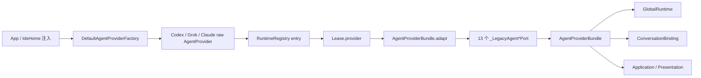
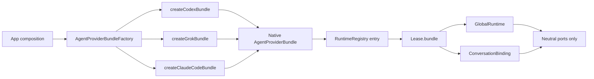

# 彻底删除旧 `AgentProvider` 接口：现状分析与改造方案

> - 日期：2026-08-13
> - 状态：实施中
> - 定性：R3 · 契约收敛；目标是外部行为不变
>
> | 阶段 | 状态 |
> |---|---|
> | S0 安全网 | 已完成 |
> | S1 细化端口 | 已完成 |
> | S2 原生 Bundle | 已完成 |
> | S3 切 Registry 所有权 | 已完成 |
> | S4 迁移组合与测试 | 已完成 |
> | S5 物理删除 | 未开始 |
> | S6 能力与文档收口 | 未开始 |

## 结论先行

旧 `AgentProvider` 不是完全没有调用方的死代码，而是 2026-07-16 引入
`AgentProviderBundle` 时留下的**迁移根**：Application / Presentation 已经改为消费
Bundle 端口，但工厂、Runtime Registry、Lease、三个 Provider 实现和大量测试替身仍以
`AgentProvider` 为创建及所有权单位，再由 `AgentProviderBundle.adapt` 包成新端口。

从提交顺序、源码注释和现行开发指南可以判断，当时采用的是渐进式替换策略：先隔离上层，
暂不同时重写 Provider 生命周期和测试基础设施。这个选择在迁移初期合理；现在它已经成为
过渡债务，并带来三类实际问题：

1. 所有 Provider 被迫实现 23 个成员，即使协议不支持；Grok / Claude Code 因此保留了
   `UnsupportedError`，甚至存在静默 no-op。
2. 能力事实同时存在于静态 capability、可选旧接口、Bundle 端口三个位置，容易不一致。
3. 新 Provider 仍会被引导去实现旧接口，再依赖 legacy adapter，迁移无法自然结束。

不能直接删除文件。正确终点是：**工厂直接创建原生 `AgentProviderBundle`，Registry 和
Lease 直接拥有 Bundle，Provider 只实现自己真实支持的中立端口，Shared Domain 不再做
旧类型识别或协议兼容。**

## 1. 本次“彻底删除”的边界

### 1.1 必须删除

- `lib/src/features/agent/domain/agent_provider.dart` 整个文件：
  - `AgentProvider`；
  - 11 个 `*Provider` 可选接口；
  - `AgentProviderFactory`。
- `AgentProviderBundle.adapt(AgentProvider)`。
- `AgentProviderBundleAdapter on AgentProvider` 的 `.bundle` 扩展。
- `agent_provider_bundle.dart` 中 13 个 `_LegacyAgent*Port` 包装类。
- `AgentProviderRuntimeLease.provider` 与 Registry entry 的 raw provider 字段。
- `DefaultAgentProviderFactory` 旧返回类型和所有旧 Factory 测试替身。
- 仅为补齐旧大接口而存在的 fake mixin / stub / no-op 方法。

### 1.2 保留且行为不变

- `AgentProviderBundle` 作为 Application / Presentation 的唯一能力入口。
- `AgentProviderConfig`、持久化 JSON key、Provider ID / kind 与 Cursor 退役策略。
- Codex、Grok、Claude Code 的协议、事件映射、会话语义、模型结果和用量结果。
- Registry 的 `(providerId, scope)` 唯一实例、generation、ABA 防护、关闭屏障和租约语义。
- Global runtime 与 session Binding 的隔离方式。
- G1/G2/G3 约束下的事件管线、reducer、Timeline Store。

### 1.3 本次不顺手做

- 不把每个 Provider 大类强制拆成“一端口一个类”；同一个 Provider-local 对象可以实现多个
  它真实支持的中立端口。
- 不新增 Pi Provider，也不改变现有 CLI 协议。
- 不改变 Widget 树、时间线渲染或持久化格式。
- 不借机重写 Provider 进程管理、模型缓存或权限状态机。

## 2. 旧接口清单

`agent_provider.dart` 当前有 13 个旧抽象声明：

| 类别 | 数量 | 当前职责 |
|---|---:|---|
| `AgentProvider` | 1 | 配置、能力、事件、初始化、会话、thread、turn、交互、销毁的 23 成员大接口 |
| 可选接口 | 11 | runtime info/lifecycle/scope、问题回写、模型刷新、模式、权限策略、Skill、本地列表、session 配置、Plan 审批 |
| `AgentProviderFactory` | 1 | 按配置返回 raw `AgentProvider` |

与之并存的新边界有 15 个能力端口：Bundle 文件中的 13 个端口，加上
`AgentPermissionPolicyPort` 和当前命名为 `AgentUsageQuotaProvider` 的用量端口。旧接口与新端口
大面积一一重复，`AgentProviderBundle.adapt` 负责用 capability 和运行时类型判断拼装两者。

适配层本身已经有 13 个 `_LegacyAgent*Port` 类，占 `agent_provider_bundle.dart` 后半部约
348 行；这些代码没有新增领域能力，只做转发、默认值和运行时类型判断。

## 3. 为什么旧接口会一直存在

### 3.1 时间线证据

| 时间 / 提交 | 事实 | 含义 |
|---|---|---|
| 2026-07-16 `30e849c6` / `291c3fe8` | Phase 1.1 运行时门控、Phase 1.2 调度器 | 先稳定原 Provider 生命周期 |
| 2026-07-16 `86f5c3d0` | “完成 Phase 2 provider bundle 迁移” | 新增 Bundle 和 legacy adapter，上层切端口 |
| 2026-07-16 `7f70332d` | 同步 Phase 2 文档 | 文档确认双层结构是迁移阶段设计 |
| 2026-08-09 `89178b67` | 删除 Bundle / RuntimePort 的 raw provider getter | 上层逃生通道已关闭，但底层所有权根仍未切换 |

当前源码也直接写明：

- `AgentProviderBundleAdapter` 是“迁移期适配入口”；
- 开发指南称 `AgentProvider` 为“旧必选接口”；
- 开发指南明确说明 Factory “当前仍返回 `AgentProvider`”。

### 3.2 当时保留它的现实原因

以下是基于提交顺序和当前调用链作出的工程判断：

1. **避免一次性迁移生命周期。** Registry 原来需要一个同时拥有 `config`、`initialize`、
   `events`、`dispose` 的对象，旧接口正好是现成 owner。
2. **允许上层先完成隔离。** ViewModel、Project Threads、模型目录和用量可以先改走 Bundle，
   不必同时重写三个 CLI adapter。
3. **用 RTTI 暂时代替原生组合。** 旧 Provider 通过实现不同的可选接口，让
   `AgentProviderBundle.adapt` 决定哪些端口非空。
4. **保护已有测试投资。** 大量 Widget / Controller 测试已经围绕一个“万能 Fake Provider”
   构建；保留旧 Factory 可以减少 Phase 2 的单次改动面。

这解释了旧接口为什么出现，也解释了它为什么不是长期目标：它承担的是迁移桥职责，不是
最终领域抽象。

## 4. 当前真实调用链与影响面



### 4.1 量化结果

以 2026-08-13 当前工作树为准：

- 旧 13 个类型在 34 个文件中被直接引用：12 个生产文件、22 个测试文件。
- `AgentProviderFactory` 单独影响 21 个文件：6 个生产文件、15 个测试文件。
- 加上通过 `lease.provider` 间接依赖的 Binding / GlobalRuntime，生产改动面至少 14 个文件。
- 共有 13 个测试类在 11 个文件中直接实现 `AgentProvider`。
- 算上公共 Fake Factory 的消费者，至少 31 个测试文件会在切换 Factory 类型时重新编译。

计数只表示直接源码依赖；使用共享 test harness 的 Widget 测试会被公共替身改动级联影响，
因此不能把“只改 34 个文件”当作工作量上限。

### 4.2 生产代码按职责分类

| 职责 | 当前文件 / 符号 | 删除后的变化 |
|---|---|---|
| 组合入口 | `app.dart`、`ide_shell_controller.dart`、`ide_home.dart` | 注入 Bundle Factory |
| 默认工厂 | `default_agent_provider_factory.dart` | 改为直接返回原生 Bundle |
| 生命周期所有者 | `agent_provider_runtime_registry.dart` | entry / lease 持有 Bundle；只通过 `runtime` 初始化和销毁 |
| 全局操作 | `agent_provider_global_runtime.dart` | `lease.bundle`，不再适配 |
| 会话运行时 | `agent_conversation_binding.dart` | `lease.bundle`，保持 scope / generation 逻辑 |
| 管理探测 | Codex / Grok management repository | 只接收 Bundle 或具体 `modelCatalog` 端口 |
| Provider 实现 | Codex / Grok / Claude Code provider | 改为实现真实支持的端口并提供 native bundle |
| 领域适配 | `agent_provider.dart`、`agent_provider_bundle.dart` | 删除旧文件和全部 legacy wrapper |

### 4.3 现有测试安全网与缺口

已有安全网：

- Registry 测试覆盖单实例、租约、配置失效、generation、dispose/acquire 屏障。
- Binding 架构测试限制 Factory 唯一调用方，并禁止 ViewModel 取回 raw Provider。
- `agent_provider_bundle_test.dart` 覆盖旧 adapter 的 capability / 可选接口组合。
- 三个 Provider 各有协议、生命周期、权限、模型或历史相关测试。

删除前必须补的缺口：

- 三个生产 Provider 的**原生 Bundle 端口矩阵**尚无统一契约测试。
- 当前没有测试禁止“端口存在但其中部分方法只抛错或 no-op”。
- 旧 adapter 与 native bundle 的行为等价性没有 characterization snapshot。
- Factory 测试更关注具体类和 Cursor fail-closed，尚未完整固定 runtime / conversation /
  optional ports 的组合。

## 5. 旧接口已经造成的具体问题

### 5.1 大接口强迫 Provider 伪实现

三个 Provider 的协议能力并不相同，但都必须实现 `AgentProvider`。当前可见例子：

- Grok 对 Guardian 放行记录日志后直接返回，属于静默成功。
- Grok 和 Claude Code 的 `unsubscribeThread` 是空实现，因为它们没有远端 thread 订阅模型。
- Grok 对 archive / unarchive / fork / compact / steer 抛 `UnsupportedError`。
- Claude Code 对 Guardian、rename、archive、unarchive、delete、fork、steer 抛
  `UnsupportedError`。

显式抛错比静默成功安全，但两者都说明抽象面过宽；尤其 no-op 与 G4 的 fail-closed 要求冲突。

### 5.2 新 Bundle 端口仍有分组过粗的问题

即使删除旧接口，如果直接让 Provider 实现现有端口，也会把同一问题复制到新层：

- `AgentThreadCatalogPort` 把 list/history 和 unsubscribe 绑在一起。
- `AgentThreadMutationsPort` 把 rename、archive、unarchive、delete、compact 绑在一起。
- `AgentInteractionPort` 把权限、用户提问和 Codex Guardian 放行绑在一起。

Grok 只支持 rename/delete，Claude Code 只支持 compact；三者都不能准确实现当前
`threadMutations` 的完整语义。因此“把 `implements AgentProvider` 机械替换成
`implements AgentThreadMutationsPort`”不算彻底删除，只是换了一个大接口。

### 5.3 三份能力真源会漂移

当前一个入口是否出现，可能同时取决于：

1. `AgentProviderCapabilities` 的静态 / 动态布尔位；
2. Provider 是否实现某个旧可选接口；
3. `AgentProviderBundle.adapt` 最终是否暴露端口。

模型思考程度尤其不应再由 Provider 级 `supportsReasoningOptions` 代替模型级事实。
目标真源应是 `AgentModelInfo.supportedEffortLevels`；只要 Provider 有模型目录端口，就返回
目录，每个模型自行声明支持的 effort。这样可以避免“原始模型报文有选项，但静态 capability
或 adapter 没开，UI 仍显示无思考程度”的同类问题。

### 5.4 共享 Domain 中仍含 Provider 私有语义

旧接口直接暴露 `approveGuardianDeniedAction`，注释含 Codex RPC 名，参数还是
`Object event`。这既使其他 Provider 被迫实现，也让 raw 形状有机会穿过领域边界。

彻底收口时应改成中立的 denied-action override 端口：UI 只回传 typed request id；Codex
adapter 在 Provider-local pending registry 中用该 id 找回协议对象。Domain 不保存 raw event。

## 6. 目标架构



目标契约示意：

```dart
abstract interface class AgentProviderBundleFactory {
  AgentProviderBundle create(AgentProviderConfig config);
}

final class AgentProviderRuntimeLease {
  AgentProviderBundle get bundle => _entry.bundle;
}

final class _AgentProviderRuntimeEntry {
  final AgentProviderBundle bundle;
  final AgentProviderRuntimeIdentity identity;
  final AgentProviderRuntimeScopeKey scope;
}
```

Registry 的身份校验、重启判断和销毁分别改走：

```dart
bundle.runtime.config
bundle.runtime.initialize()
bundle.runtime.dispose()
```

Provider-local 组合可以让同一个实例实现多个端口，不要求产生大量空壳 wrapper：

```dart
final runtime = ClaudeCodeAgentRuntime(...);
return AgentProviderBundle(
  runtime: runtime,
  conversation: runtime,
  threadCatalog: runtime,
  threadCompaction: runtime,
  permissionResponses: runtime,
  questions: null,
  deniedActionOverride: null,
  modelCatalog: runtime,
  localThreadList: runtime,
  planApproval: runtime,
  permissionPolicy: runtime.permissionPolicy,
  usageQuota: runtime,
);
```

关键不是“一端口一对象”，而是 Bundle 只发布真实支持的端口；未发布的能力在编译期和运行时
都不可达。

## 7. 目标端口调整

### 7.1 旧可选接口的归宿

| 旧接口 | 目标 |
|---|---|
| `AgentRuntimeInfoProvider` / `Lifecycle` / `Scope` | 合并进必选 `AgentRuntimePort` 的真实实现 |
| `AgentQuestionResponseProvider` | 独立 `AgentQuestionResponsePort?` |
| `AgentRefreshableModelCatalogProvider` | `AgentModelCatalogPort.listModels(forceRefresh:)` 原生实现 |
| `AgentConversationModeCatalogProvider` | `AgentConversationModeCatalogPort?` |
| `AgentPermissionPolicyProvider` | Bundle 直接接收 `AgentPermissionPolicyPort?` |
| `AgentSkillsCatalogProvider` | `AgentSkillsPort?` |
| `AgentLocalThreadListProvider` | `AgentLocalThreadListPort?` |
| `AgentSessionConfigProvider` | `AgentSessionConfigurationPort?` |
| `AgentPlanApprovalProvider` | `AgentPlanApprovalPort?` |

### 7.2 拆开过宽端口

| 当前端口 | 目标端口 | 原因 |
|---|---|---|
| `AgentThreadCatalogPort` | catalog + `AgentThreadSubscriptionPort?` | 只有 Codex 有远端订阅释放 |
| `AgentThreadMutationsPort` | naming / archival / deletion / compaction 四个可选端口 | 三个 Provider 支持集合互不相同 |
| `AgentInteractionPort` | permission response / question response / denied-action override 三个端口 | 遵守 G5，并移除 Guardian 强制实现 |
| `AgentUsageQuotaProvider` | 可选机械重命名为 `AgentUsageQuotaPort` | 与 Bundle 端口命名一致；不是删除阻塞项 |

denied-action override 不得继续接收 `Object event`。建议端口只收
`AgentDeniedActionOverrideRequest(threadId, requestId)`；只有 Codex data adapter 持有
`requestId -> raw event` 映射，终态、取消、runtime generation 失效时清理。

### 7.3 目标 Provider 端口矩阵

| 端口 | Codex | Grok | Claude Code |
|---|:---:|:---:|:---:|
| runtime / conversation | ✓ | ✓ | ✓ |
| thread catalog / history | ✓ | ✓ | ✓ |
| thread subscription | ✓ | — | — |
| thread naming | ✓ | ✓ | — |
| thread archival | ✓ | — | — |
| thread deletion | ✓ | ✓ | — |
| thread compaction | ✓ | — | ✓ |
| thread branching | ✓ | — | — |
| turn steering | ✓ | — | — |
| permission response | ✓ | ✓ | ✓ |
| question response | ✓ | ✓ | — |
| denied-action override | ✓ | — | — |
| model catalog | ✓ | ✓ | ✓ |
| conversation modes | ✓ | ✓ | — |
| skills | ✓ | ✓ | — |
| local thread list | — | — | ✓ |
| session configuration | — | — | — |
| plan approval | — | ✓ | ✓ |
| permission policy | ✓ | ✓ | ✓ |
| usage quota | ✓ | ✓ | ✓ |

`sessionConfiguration` 当前无生产实现，可以保留为中立扩展点，但不得再通过测试 fake
制造“已有 Provider 支持”的印象。

### 7.4 capability 的伴随收口

删除 legacy adapter 后，端口存在性应成为“是否有这项操作”的单一真源：

- list / mutate / steer / interaction / catalog / quota 等操作优先由可空端口表达；
- 端口内部确有多种子能力时，使用该端口自己的 typed capabilities；
- `canForkThreadAtTurn` 归 `AgentThreadBranchingPort`；
- 输入模态继续由模型 / runtime 的 typed 能力表达；
- reasoning effort 和 service tier 由每个 `AgentModelInfo` 表达；
- bootstrap policy 属于 Provider 注册/组合信息，不应通过 domain 中的 provider 名称 switch 推导。

因此建议在最终清理阶段移除 `AgentProviderCapabilities.codexAppServer/grokAcp/claudeCode`
和 `defaultsFor(kind)`。`AgentProviderCapabilities` 可保留为中立值对象，但具体默认值由 data/app
组合层注入，Shared Domain 不再列举厂商。

## 8. 分阶段实施方案

原则：先加后删；每一步结束时仓库都能编译且测试全绿。旧 adapter 只允许存在于明确的过渡
阶段，不能成为新 Provider 的默认接入方式。

| 阶段 | 做什么 | 主要文件 | 完成判据 | 回滚点 |
|---|---|---|---|---|
| S0 安全网 | 增加三个 Provider 的 Bundle contract snapshot；固定 Registry 生命周期、Cursor fail-closed、模型 effort 真源 | provider / factory / registry tests、architecture tests | 改结构前全部测试已绿；每个端口的有/无都有断言 | 仅测试提交，可独立保留 |
| S1 细化端口 | 新增 subscription、细分 thread mutation、拆 interaction；调用方改走新端口；旧聚合端口暂作转发 | `agent_provider_bundle.dart`、ViewModel、Project Threads、provider adapters | Grok/Claude 不再需要 unsupported/no-op 聚合能力；UI 行为不变 | 回退 S1，不影响 Factory |
| S2 原生 Bundle | 三个 Provider 实现真实端口；新增 `createCodex/Grok/ClaudeCodeBundle`；做 legacy-vs-native 等价测试 | 三个 datasource、default factory tests | 原生 Bundle 矩阵与 S0 snapshot 一致 | 继续使用 legacy factory/adapter |
| S3 切 Registry 所有权 | 新增 `AgentProviderBundleFactory`；Registry entry/lease 改持有 Bundle；GlobalRuntime、Binding、management probe 改 `lease.bundle` | app、registry、global runtime、binding、management | 无 `lease.provider`；scope、generation、dispose 屏障测试不变 | 临时 legacy Factory-to-Bundle adapter |
| S4 迁移组合与测试 | App / IdeHome 注入新 Factory；公共 Fake 改为 `FakeAgentProviderBundleBuilder`；逐个迁移 31+ 测试文件 | app shell、test harness、controller/widget tests | 旧 Factory 只剩过渡 adapter 自测，无生产调用方 | 回退公共 harness + 注入切换 |
| S5 物理删除 | 删除 `agent_provider.dart`、`AgentProviderBundle.adapt`、13 个 `_Legacy*`、旧 Factory、stub base、所有兼容注释 | domain/data/test | 旧符号和路径搜索为零；全量测试绿 | 整体回退 S5 单提交 |
| S6 能力与文档收口 | 移除 provider 命名 capability 默认值和冗余布尔位；同步当前架构文档；给 Pi 计划追加 superseded 指针 | capabilities、settings controller、规范文档 | Domain 无 provider 名称 switch；当前文档只描述 native Bundle | 回退 S6，不恢复旧接口 |

### 8.1 过渡 Factory 的限制

为保证 S3/S4 可分开提交，可以短暂存在一个
`LegacyAgentProviderFactoryBundleAdapter`，其唯一职责是把旧 Factory 输出适配成 Bundle。
它必须满足：

- 只位于 data/组合层，不进入 application/presentation；
- 不新增 capability 或 Provider kind 分支；
- S5 必删，并用 architecture test 固定删除；
- 新的生产默认 Factory 从 S2 起必须走 native bundle，不能经过它。

不建议让新的 Factory 永久同时暴露 `createProvider` 和 `createBundle`；那会形成第四份能力真源。

## 9. 删除时最容易引入的行为回归

| 风险 | 可能后果 | 防护 |
|---|---|---|
| runtime owner 改错 | 子进程未关、重复 dispose 或双进程 | Registry entry 只拥有一个 Bundle；只有 `runtime.dispose` 是关闭入口 |
| 同一个 bundle 被多 scope 复用 | global/session 状态串味 | Factory 每次 create 返回新 runtime bundle；测试验证 object identity |
| 动态 capability 丢失 | 握手后能力不更新 | `runtime.capabilities` 保持动态 getter，不在 Bundle 构造时复制快照 |
| events 监听换源 | 旧 generation 事件进入新会话 | Binding 继续用 runtime identity + scope 校验，监听 `bundle.runtime.events` |
| 端口误暴露 | UI 出现点了报错的入口 | Provider matrix contract；不支持必须是 `null`，不是 no-op |
| 模型目录门控错误 | `supportedEffortLevels` 有值但 UI 不显示 | `modelCatalog` 按端口发布；effort 按模型数据渲染，不看 provider 静态位 |
| config mismatch 清理错误 | 误关仍被其他 entry 使用的实例 | Registry 的 mismatch / registered-instance 测试改为比较 Bundle identity |
| Cursor 回流 | 退役 Provider 被启动 | 新默认 Bundle Factory 继续在创建前 fail-closed |
| 测试万能 fake 掩盖能力 | 测试通过但生产端口为 null | Builder 默认只提供 runtime/conversation；可选端口逐项显式注入 |

该重构不修改任何持久化字段，因此没有 JSON 迁移风险；如果实施中发现必须改
`AgentProviderConfig` key，应立即拆成独立 migration 任务，不并入本重构。

## 10. 测试与验收

### 10.1 S0 必补 characterization tests

1. 每个 Provider 的 Bundle 端口 presence matrix 与上表一致。
2. `runtime.config/capabilities/events/initialize/dispose` 由同一 runtime owner 提供。
3. Factory 每次创建不同 scope 时返回不同 Bundle / runtime identity。
4. 配置不变复用、启动参数改变重启、dispose 未完成阻塞 reacquire。
5. global 与两个 session scope 三者互不共享可变 Provider 状态。
6. `modelCatalog.listModels(forceRefresh: true)` 与当前行为一致；模型
   `supportedEffortLevels` 原样保留。
7. 不支持能力端口为 `null`，且不存在 no-op 成功路径。
8. Cursor 配置和 legacy alias 均无法创建 runtime。

### 10.2 架构守卫

最终应新增或改写守卫，保证：

- `lib/` 和 `test/` 不再存在独立类型 `AgentProvider` / `AgentProviderFactory`；
- `agent_provider.dart` 不存在；
- `AgentProviderBundle.adapt`、`_LegacyAgent`、`lease.provider` 不存在；
- Runtime Factory 仍只有 Registry 一个生产调用方；
- Bundle / RuntimePort / Binding 不暴露 raw datasource 对象；
- `agent_provider_bundle.dart` 不含 Codex / Grok / Claude / Cursor 分支；
- domain capability 文件不含具体 Provider 默认常量或 kind switch；
- G1 共享文件继续零 Provider 逻辑。

### 10.3 自动化验证

每个结构步骤均执行：

```sh
dart format .
flutter analyze
flutter test
```

最终额外执行 G1 自查、Factory 唯一调用方守卫和旧符号搜索。纯重构不写 CHANGELOG。

### 10.4 真实 CLI 验收

Factory / Registry / dispose 边界发生变化，自动化 fake 不能替代真实进程验收。最终至少在
Windows 分别验证 Codex、Grok、Claude Code：

- global 模型探测后能建立 session；
- 两个不同 thread 使用独立 session runtime；
- 关闭一个 Binding 不影响另一个；
- 配置失效后旧进程退出，新进程可重新初始化；
- 模型及其思考程度目录与删除前一致。

记录只保留版本、平台、结果和脱敏错误分类，不保存 prompt、回复、原始 payload、路径或凭据。

## 11. 文档同步范围

S5/S6 改变 Provider 契约和运行时所有权描述，按仓库架构规则同步：

- `AGENTS.md`；
- `docs/architecture/engineering_standards.md`；
- `docs/architecture/design_document.md`；
- `docs/architecture/overview.md` / `overview.en.md`；
- `docs/guides/developer_guide.md`；
- `docs/guides/glossary.md` / `glossary.en.md`；
- `CONTRIBUTING.md` / `CONTRIBUTING.en.md`。

门禁编号和数量不变时无需改 `CLAUDE.md`。历史 `.workflow` 文件不重写事实；Pi Provider
计划中依赖 legacy adapter 的段落应追加“已被本方案取代”的指针，并在后续实现时直接创建
native Bundle。

## 12. 止损线与回滚策略

遇到以下任一情况立即停止，不以兼容层继续掩盖：

1. 某个 Provider 无法在不向 domain 传 raw payload 的前提下实现目标端口。
2. Registry 无法继续保证 `(providerId, scope)` 单实例、generation 和 dispose 屏障。
3. 现有行为断言必须修改才能通过，且原因不是测试对旧类型名的机械依赖。
4. 为了某个 Provider 必须在 Bundle、application 或 presentation 中新增 kind/id 分支。
5. S5 前仍有生产调用方依赖 legacy adapter。

S0-S4 均保留旧桥，任何阶段可独立回退；S5 必须是单独的物理删除提交，失败时整体回退该
提交，不恢复半套旧接口。S6 只做能力真源和文档收口，可独立回退而不恢复旧接口。

## 13. 完成定义

只有同时满足以下条件，才能称为“彻底删除”：

- 旧 13 个抽象声明和 `agent_provider.dart` 已删除。
- 13 个 `_LegacyAgent*Port`、`.adapt`、`.bundle` extension 已删除。
- Registry / Lease / GlobalRuntime / Binding 全程只持有 Bundle 或中立端口。
- 三个生产 Provider 都有原生 Bundle，且只发布真实支持的端口。
- Grok / Claude Code 不再为 Guardian、unsubscribe 或 thread mutation 保留 no-op/占位实现。
- Domain 端口不接收 `Object event` 或协议对象。
- 模型思考程度只由 `AgentModelInfo.supportedEffortLevels` 等模型级事实决定。
- 公共 test harness 不再提供万能 `AgentProvider` fake。
- 全量 analyze/test、G1 守卫、旧符号搜索和三个真实 CLI 冒烟通过。
- 当前架构文档已全部改成“Factory 直接创建 Bundle”的单一路径。

## 14. 建议提交序列

```text
test(agent): 固定 Provider Bundle 行为基线
refactor(agent): 拆分过宽的 Provider 能力端口
refactor(agent): 为三类 Provider 建立原生 Bundle
refactor(agent): 让 Registry 直接持有 Provider Bundle
refactor(test): 迁移 Provider Bundle 测试替身
refactor(agent): 删除旧 AgentProvider 兼容接口
docs(agent): 同步原生 Provider Bundle 架构
```

最终删除不建议与 S0-S4 压成一个提交：编译错误很多，但真正高风险的是生命周期、端口
presence 和能力真源。把机械迁移与物理删除分开，评审时才能证明行为保持不变。

## S0 记录

仅测试，未改运行时代码。`format` / `analyze` / 相关测试已绿。

当前 `adapt()` 聚合端口矩阵（不是 §7.3 的拆分后名字）：

| 当前端口 | Codex | Grok | Claude Code |
|---|:---:|:---:|:---:|
| runtime / conversation | ✓ | ✓ | ✓ |
| threadCatalog | ✓ | ✓ | ✓ |
| threadMutations | ✓ | ✓ | ✓ |
| threadBranching | ✓ | — | — |
| turnSteering | ✓ | — | — |
| interactions | ✓ | ✓ | ✓ |
| modelCatalog | ✓ | ✓ | ✓ |
| conversationModes | ✓ | ✓ | — |
| skills | ✓ | ✓ | — |
| localThreadList | — | — | ✓ |
| sessionConfiguration | — | — | — |
| planApproval | — | ✓ | ✓ |
| permissionPolicy | ✓ | ✓ | ✓ |
| usageQuota | ✓ | ✓ | ✓ |

方法级事实（供 S1 对照）：

- Grok：`unsubscribeThread` / `approveGuardianDeniedAction` 静默成功；archive / unarchive / compact 抛错。
- Claude Code：`unsubscribeThread` 空实现；Guardian、提问回写、rename / archive / unarchive / delete 抛错。
- `sessionConfiguration` 无生产实现。
- 领域字段名是 `AgentModelInfo.supportedReasoningEfforts`，不是方案里的 `supportedEffortLevels`。
- ViewModel `showReasoningEffort` 仍同时看 `supportsReasoningOptions` 和模型档位。
- Grok / Claude 的 `capabilities` getter 每次分配新对象，不能用 `identical` 钉 owner。

契约测试：

- `test/src/features/agent/data/agent_provider_bundle_contract_test.dart`
- `test/src/features/agent/architecture/agent_provider_bundle_contract_test.dart`
- `agent_provider_bundle_test.dart` 补了 `forceRefresh` → `refreshModels`

## S1 记录

按拍板：denied-action 改 `requestId`；旧聚合端口从 Bundle 删除；Grok / Claude 的旧接口方法先留着。

Bundle 现端口：`threadSubscription` / `threadNaming` / `threadArchival` / `threadDeletion` / `threadCompaction` / `permissionResponses` / `questions` / `deniedActionOverride`。已删除 `threadMutations`、`interactions`，以及 catalog 上的 `unsubscribeThread`。

- Codex 实现 `AgentThreadSubscriptionProvider` 与 `AgentDeniedActionOverridePort`；pending registry 按 `reviewId` 持有 raw event，终态 / 关线程 / dispose / 断线时清理。
- ViewModel 与 Project Threads 只走新端口。
- Grok / Claude 不再发布 archive、Guardian、unsubscribe、提问（Claude）等端口。
- `format` / `analyze` / 相关测试已绿。

## S2 记录

三个生产 Provider 直接实现自己支持的中立端口；`createCodex/Grok/ClaudeCodeBundle` 组装原生 Bundle，不经过 `adapt()`。

- `DefaultAgentProviderFactory.create()` 仍返回旧 `AgentProvider`（S3 再切 Registry）。
- 新增 `createBundle()` 走 native 路径，Cursor 继续 fail-closed。
- `listModels(forceRefresh:)` 在三个 Provider 上原生实现。
- 等价测试：native 与 `adapt()` 端口矩阵一致；runtime/conversation 是同一 owner。

## S3 记录

Registry / Lease 改为持有 `AgentProviderBundle`。`lease.provider` 已删除。

- 新增 `AgentProviderBundleFactory.createBundle`。生产默认工厂直接实现它，走 native Bundle。
- 测试旧 Factory 经 `LegacyAgentProviderFactoryBundleAdapter` / mixin 过渡，S4/S5 删除。
- Binding、GlobalRuntime、Codex/Grok management probe 只读 `lease.bundle`。
- initialize / dispose / 身份比较走 `bundle.runtime`。
- scope、generation、dispose 屏障测试保持原语义。

## S4 记录

App / IdeHome / Shell 注入 `AgentProviderBundleFactory`，生产路径不再经过 `asAgentProviderBundleFactory`。

- 公共 Fake 改为 `FakeAgentProviderBundleBuilder`：默认只发布 runtime / conversation；存量测试走 `fromFake`。
- `FixedAgentProviderFactory` 改为 `FixedAgentProviderBundleFactory`，只实现 Bundle 工厂。
- 局部测试工厂不再 `extends AgentProviderFactory`；`LegacyBundleFactoryMixin` 仅作过渡 adapt。
- 旧 `AgentProviderFactory` 生产调用方已清零，只留 adapter 自测与 `DefaultAgentProviderFactory.create()`。
- `format` / `analyze` / 相关测试已绿。
