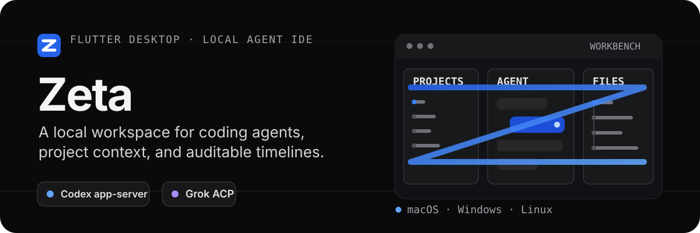
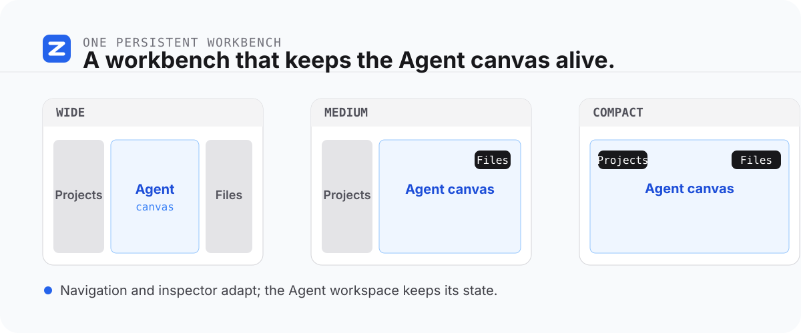
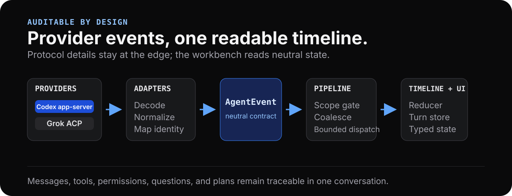

# Zeta

<p align="center">
  
</p>

<p align="center">
  Flutter Desktop · macOS · Windows · Linux · Codex app-server · Grok ACP
</p>

> Zeta 是面向本地代码仓库开发者的 Agent IDE 壳层：在一个持续保留状态的三栏工作台中，连接项目目录、Agent thread 与可审计的工具时间线。

当前版本聚焦“本地项目上下文 + Agent 协作 + 可追溯执行过程”，而不是替代完整代码编辑器。

## 你可以用它做什么

- 在 **Projects / Agent / Files** 三栏中打开本地项目、浏览文件树，并把项目路径与当前文件路径交给 Agent 作为上下文。
- 使用默认的 Codex CLI app-server 或 Grok ACP 创建、恢复和继续 Agent thread；界面会根据 Provider 握手能力显示可用功能。
- 在连续时间线中查看消息、推理摘要、工具调用、回合级改动与执行状态；权限、用户提问和 Plan 审批集中在输入框上方处理。
- 管理 Codex/Grok CLI 的身份、版本、账号、连接与配置，并查看本地派生的使用统计。
- 重启后恢复项目、选中文件、文件树展开状态和 thread 缓存；Agent Canvas 在页面切换和窗口断点变化时保持状态。

## 一处工作台，适配三种桌面布局

<p align="center">
  
</p>

- 宽窗口内联显示 Projects、Agent 与 Files。
- 窄窗口将导航或文件检查器收进按需 Overlay，避免压缩对话空间。
- Agent pane、草稿、滚动位置与面板状态由持久工作台承载，不因页面切换而重置。

## 可审计的 Agent 事件流

<p align="center">
  
</p>

Provider 的原始协议仅留在数据适配层。Zeta 将它们规范化为中立的 `AgentEvent`，经由作用域隔离、事件合并、受限分发、reducer 与时间线存储，最终渲染为类型化 UI 状态。这样可以让消息、工具、权限、提问、Plan 与状态变化落到同一条可追溯的对话表面上。

## Provider 与交互

- **Codex CLI app-server**：默认 Provider，支持 thread 生命周期、模型目录、权限与会话配置等能力。
- **Grok ACP**：通过 ACP stdio 接入；不支持的能力会被显式隐藏或拒绝，不会伪造成功状态。
- **能力驱动 UI**：模型、推理强度、Plan、动态会话配置与 `$skill` 输入等入口仅在对应 Provider 支持时出现。
- **保守的权限模型**：审批、用户提问与 Plan 审批使用不同的领域语义；Plan 的“执行确认”是 Zeta 本地工作流，不等同于预先授权命令、文件或网络操作。

## 快速开始

### 前置条件

- 一套兼容 `pubspec.yaml` 中 Dart `^3.12.2` 约束的 Flutter Desktop 开发环境。
- 若使用默认 Provider，`codex app-server` 应可在本机执行；也可在 Agent 管理页配置并启用 Grok。
- 使用 Grok ACP 时，建议安装 Grok CLI（grok-build）`0.2.119` 或更高版本。`0.2.119`
  之前的版本不支持多会话，无法可靠承载 Zeta 的多会话工作区。

### 从源码运行

在仓库根目录执行：

```sh
flutter pub get
flutter run -d macos
```

Linux 或 Windows 开发时，将设备替换为对应的 Flutter desktop device。

### 开发验证

```sh
dart format .
flutter analyze
flutter test
```

有关真实 Codex CLI smoke、协议 schema 导出与跨平台发布验证，请参阅[开发者指南](./docs/developer_guide.md)。

## 本地优先的边界

- Zeta 自有的配置、会话状态、日志与可重建缓存保存在版本化的 `~/.zeta` 目录中。
- 默认上下文只自动传递当前项目路径与选中文件路径；不会自动把文件内容注入给 Agent。
- Zeta 不会迁移或改写 Codex、Grok 的自有配置和会话历史。
- Cursor 已退役；Zeta 不会启动 Cursor，也不会读取、迁移或改写 `~/.cursor`、项目 `.cursor` 或遗留 Cursor 会话数据。

## 当前范围

Zeta 目前不包含内置代码编辑器、文件内容读取与保存流程、远程仓库/云同步、账号体系、完整插件系统或移动端支持。它更适合作为本地代码工作流中的 Agent 协作面板与可审计时间线。

## 文档

- [文档索引](./docs/README.md)
- [产品需求](./docs/product_requirements.md)
- [设计文档](./docs/design_document.md)
- [开发者指南](./docs/developer_guide.md)
- [工程规范](./docs/engineering_standards.md)
- [发版指南](./docs/release_guide.md)
- [Codex app-server 协议版本锁定](./docs/codex_app_server_protocol.md)

发布工作流会构建 Windows x64、macOS universal 与 Linux x64 安装包；发布方式、签名状态和校验步骤见[发版指南](./docs/release_guide.md)。

## 许可证

本仓库当前未附带 `LICENSE` 文件。使用、分发或二次开发前，请先与维护者确认授权范围。
