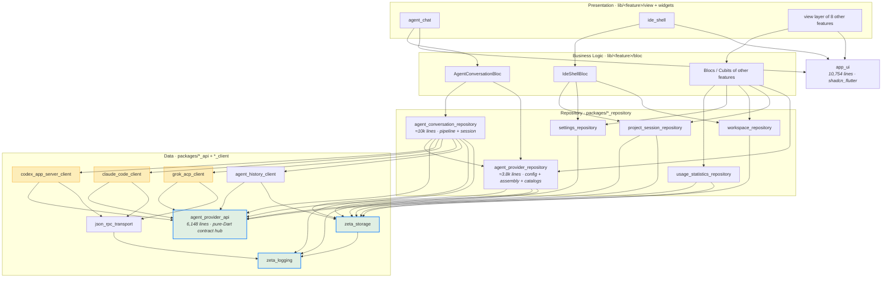

# Migration topology analysis

[中文](./migration_topology.md) ｜ English

This document is the global topology analysis and execution roadmap for the **legacy repository → VGV architecture** migration.

- Subject: legacy `zeta` repository — 362 Dart files / 127,231 lines under `lib/src`, 261 files / 97,601 lines under `test`.
- Method: parsed all 1,215 `package:zeta/src/...` imports to build the module dependency graph. Only 52 relative imports exist and none cross module boundaries, so they do not affect the conclusions.
- **Design baseline: VGV Layered Architecture.** The legacy four-layer structure (`domain` / `application` / `data` / `presentation`) and its eight custom gates are *not* the organizing principle for this migration. Module boundaries are re-derived entirely from VGV's Data → Repository → Business Logic → Presentation layering.

Four confirmed decisions:

| Decision | Choice |
| --- | --- |
| State management | **Full rewrite to Bloc** |
| Package structure | **Layered extraction** (monorepo, not one package per feature) |
| Target platforms | **Desktop only** (macOS / Windows / Linux) |
| UI foundation | **Keep shadcn_flutter** (`app_ui` is built on it) |

> **Skills are the authority on implementation.** The repository carries 15 official VGV skills under `.claude/skills/`. Before writing code, consult the step → skill mapping in [migration task list §0.7](./migration_tasks.en.md#07-skills-first). Where this document conflicts with a skill, the skill wins — unless the conflict is recorded in the "deviation register" of §0.7 (currently 3 entries).

---

## 1. VGV layers and how this project maps onto them

The four VGV layers and their responsibilities:

| Layer | Location | Responsibility | Hard constraint |
| --- | --- | --- | --- |
| **Data** | `packages/<name>_api`, `packages/<name>_client` | Talk to external data sources; raw data → models | No business logic; no Flutter dependency |
| **Repository** | `packages/<name>_repository` | Compose one or more data sources; carry domain logic | No Flutter dependency; no coupling to another repository's internals |
| **Business Logic** | `lib/<feature>/bloc/` | Consume repositories, manage feature state | Blocs never depend on each other; **never touch `dart:io` directly** |
| **Presentation** | `lib/<feature>/view/`, `lib/<feature>/widgets/` | Rendering and user input | Interact only through blocs; no business decisions |

### The hard evidence for re-partitioning

The legacy repository has **60+ files that import `dart:io` directly**:

```
features/agent               26        features/app_update           3
features/agent_management     8        features/ide_session          2
features/usage_statistics     7        core/*                        6
features/workspace            4        app/*                         5
features/settings             3        others                        4
```

A significant share of these sit in the presentation and application layers. **Under VGV that is a hard violation** — nothing at or above the bloc layer may touch `dart:io`. So the core action of this migration is not "rename directories", it is:

> Push every process spawn, file read/write, CLI probe, and protocol decode **down into `*_client` packages in the Data layer**, wrap them behind pure-Dart repository interfaces, and make `dart:io` invisible above the bloc layer.

Draw that line and the package boundaries fall out on their own.

---

## 2. Module breakdown

### 2.1 Data layer

Contracts and implementations are separated: `*_api` defines abstract interfaces and models (pure Dart), `*_client` provides concrete implementations (may use `dart:io`).

| Package | Source (legacy path) | Size | Responsibility |
| --- | --- | --- | --- |
| `packages/agent_provider_api` | `features/agent/domain/` | 31 files / 5,493 lines | **The project's contract hub**: `AgentEvent` (827 lines), `AgentProviderBundle` (243), `AgentProviderCapabilities` (188) and other neutral models plus abstract interfaces. Pure Dart — no Flutter, no `dart:io`, no vendor fields |
| `packages/json_rpc_transport` | `features/agent/data/datasources/transport/` | 3 files / 1,299 lines | JSON-RPC over stdio, operation scheduler, runtime peer |
| `packages/codex_app_server_client` | `datasources/app_server/` + `mappers/codex_*` + `codex_cli_locator` | ≈6.3k lines | Implements `agent_provider_api` |
| `packages/claude_code_client` | `datasources/claude_code/` + `mappers/claude_code_*` | ≈7.4k lines | Implements `agent_provider_api` |
| `packages/grok_acp_client` | `datasources/acp/` + `mappers/grok_*` + `mappers/acp_*` | ≈6.5k lines | Implements `agent_provider_api` |
| `packages/agent_history_client` | `datasources/local_history/` | 6 files / 3,085 lines | Local session history reading |
| `packages/zeta_storage` | `core/storage/` + `core/utils/` | 4 files / 268 lines | Atomic file writes, data path resolution, path utilities. **The only low-level package allowed to do file IO directly** |
| `packages/zeta_logging` | `core/logging/` + `core/security/` | 3 files / 493 lines | Structured logging + sensitive data redaction |

The three `*_client` packages are invisible to each other in their `pubspec.yaml` files, and each depends only on `agent_provider_api` + `json_rpc_transport`. **Vendor protocol differences are locked inside the Data layer, enforced by `pub get` rather than by human review.**

ACP mappers live in `grok_acp_client` for now (Grok is the only consumer). Extract `acp_shared` when a second ACP provider appears.

### 2.2 Repository layer

Repositories are the bloc layer's only data entry point. **This layer absorbs all 11,888 lines of the legacy `features/agent/application/`** — that code is domain orchestration and does not belong in a bloc under VGV.

| Package | Source | Size | Responsibility |
| --- | --- | --- | --- |
| `packages/agent_conversation_repository` | the pipeline and session parts of `agent/application/` | ≈10k lines | Event pipeline + session binding + runtime registry |
| `packages/agent_provider_repository` | top level of `agent/data/` + configuration and catalog controllers | ≈3.8k lines | Provider configuration persistence, assembly, model/skill/permission catalogs |
| `packages/settings_repository` | `features/settings/{domain,data,application}` | ≈1.2k lines | General settings persistence |
| `packages/workspace_repository` | `features/workspace/{domain,data,application}` | ≈0.8k lines | File tree scanning and querying |
| `packages/usage_statistics_repository` | `features/usage_statistics/{domain,data,application}` | ≈6.5k lines | Usage aggregation across three providers; the data layer is already isolated |
| `packages/project_session_repository` | non-UI parts of `features/project_threads/` + `features/ide_session/` | ≈2.1k lines | **Merges two modules**, dissolving the legacy bidirectional cycle |

#### Why agent splits into two repositories

A single package would reach 13.8k lines, hitting the `layered-architecture` skill's anti-pattern "One giant repository for everything", and could not be tested in isolation. Split by responsibility:

```
agent_conversation_repository  ≈10k lines — the lifecycle of one conversation
  Event pipeline (5,349 lines, purely synchronous)
    agent_conversation_timeline_store.dart      2,017
    agent_conversation_reducer.dart             1,160
    agent_conversation_mutation.dart              395
    agent_event_pipeline.dart                     349
    agent_conversation_event_processor.dart       260
    agent_conversation_effect_runner.dart         212
    bounded_event_dispatcher.dart                 183
    agent_ui_update_request.dart                  170
    coalescing_event_buffer.dart                  163
    agent_event_coalescing_policy.dart            143
    agent_conversation_effect.dart                129
    agent_provider_event_listener_gate.dart       103
    agent_elapsed_ticker.dart                      42
    agent_ui_update_port.dart                      23
  Session orchestration (≈4.7k lines)
    binding / binding_manager / runtime registry / global runtime
    thread_workspace_controller / turn_context_recorder / overlay
    plan_execution_handoff_controller

agent_provider_repository  ≈3.8k lines — provider configuration and catalogs
  Provider assembly (1,944 lines)
    default_agent_provider_factory / native_agent_provider_bundles
    cli_command_locator / *_cli_locator
    agent_provider_config_store / codec / static_capabilities
  Catalog and configuration controllers (≈1.9k lines)
    model_selection / permission_selection / mode / skills_catalog
    model_catalog_repository / permission_catalog_controller
    provider_settings_controller
```

**Dependency direction is one-way**: `agent_conversation_repository` → `agent_provider_repository` (a session needs to read provider configuration and bundles). There is no reverse edge.

> ⚠️ The skill states "repositories never import other repositories". This is **one directed edge, not a mutual dependency**, and `agent_provider_repository` knows nothing about sessions. If a reverse need ever appears, the split point was wrong — redraw the line rather than adding the edge.

`agent_provider_repository` is consumed by both the `settings` and `agent_management` features — empirical evidence that it has to be its own package.

**Exposes pure-Dart interfaces only**: `Stream<AgentTimelineSnapshot>`, `Future<void> submitTurn(...)`, `Future<void> respondToPermission(...)`. Blocs never see JSON-RPC, processes, or files.

#### Observer mechanism: fully converted to Stream

This code uses `ChangeNotifier` / `ValueNotifier` / `ValueListenable` as its observer mechanism, all of which come from `package:flutter/foundation.dart`:

| Target package | Total lines | Of which depend on Flutter |
| --- | --- | --- |
| `agent_conversation_repository` + `agent_provider_repository` | 13.8k | **7,446** |
| `settings_repository` | 1,333 | 1,031 |
| repository portion of `agent_management` | 4,357 | 795 |
| `usage_statistics_repository` | 5,759 | 686 |
| repository portion of `app_update` | 1,377 | 387 |
| `workspace_repository` | 966 | 272 |
| repository portion of `desktop_notifications` | 563 | 113 |
| `project_session_repository` | 2,125 | **0** |
| **Total** | | **10,730** |

29 occurrences of `import 'package:flutter/foundation.dart'` in all.

**All convert to `Stream` / `StreamController`.** Two reasons, both binding:

1. Repository packages must not depend on Flutter (VGV hard constraint, explicitly stated by the skill)
2. If kept, the finished migration would carry **ChangeNotifier and Bloc as two parallel state mechanisms** — in direct conflict with the "full rewrite to Bloc" decision

So **P3 is not "pure relocation"; it is the second-largest refactor in the project** (after P6). §5.4 grants it an explicit exemption.

### 2.3 Shared layer

| Package | Source | Size |
| --- | --- | --- |
| `packages/app_ui` | `ui/core/` + `core/constants/app_typography.dart` | 50 files / 10,754 lines |

Contains design tokens (colors / spacing / text styles / metrics / motion / effects), 24 base components, workbench primitives, and a 7-file virtual scrolling subsystem.

`app_ui` has **zero l10n dependency**: strings for shared widgets are passed in as constructor parameters and it never references `AppLocalizations`. The full internationalization plan is in §2.5.

### 2.4 In-app features (VGV standard layout)

The legacy per-feature four-layer directories **dissolve entirely**: `domain` / `data` move up into Data layer packages, `application` moves up into Repository layer packages, and only blocs and UI remain in the app.

```
lib/
├── app/                      # App widget + RepositoryProvider / BlocProvider wiring
├── bootstrap.dart
├── l10n/                     # ARB (en, zh)
├── main_development.dart · main_staging.dart · main_production.dart
│
├── agent_chat/               # bloc/ view/ widgets/   ← was agent/presentation
├── agent_management/         # bloc/ view/ widgets/
├── usage_statistics/         # bloc/ view/ widgets/
├── settings/                 # bloc/ view/
├── workspace/                # bloc/ view/
├── project_threads/          # bloc/ view/
├── ide_session/              # bloc/
├── desktop_notifications/    # bloc/
├── app_update/               # bloc/ view/
└── ide_shell/                # bloc/ view/ widgets/   ← was ui/features/ide + app/shell
```

Each feature directory carries a same-named barrel (`agent_chat.dart`), per VGV convention.

UI size per feature (measured in the legacy repository):

| Feature | Presentation size | Note |
| --- | --- | --- |
| `agent_chat` | 34 files / 22,993 lines | Includes a 4,190-line view model and 13,017 lines of widgets |
| `usage_statistics` | 1,669 + 1,215 lines in two main files | |
| `agent_management` | 1,734 lines in one file | |
| `ide_shell` | 4,059 + 3,631 lines | Three-pane views + shell controller merged |
| Others | < 1k lines each | |

### 2.5 Internationalization

#### Comparing the two repositories

**Same foundation**: both use Flutter's official gen-l10n (`flutter_localizations` + ARB + `l10n.yaml`), and agree on `template-arb-file`, `output-localization-file`, `output-class`, and `nullable-getter`. Even the `BuildContext.l10n` extension is written identically. **The new repository's setup is a strict subset of the legacy one** — there is no technology conflict.

All differences are things the legacy repository added on top:

| Aspect | Legacy | New (VGV scaffold) |
| --- | --- | --- |
| Directory | `lib/src/ui/localization/{arb,generated}` | `lib/l10n/{arb,gen}` |
| Languages | en + zh(Hans) | en + es |
| Key count | **1,072** | 1 |
| Generated code | 14,277 lines | ≈100 lines |
| `l10n.yaml` extras | `required-resource-attributes: true`<br>`use-escaping: true`<br>`format: true` | `header: "// dart format off\n// coverage:ignore-file"` |
| Locale source | Driven by in-app setting, frozen at startup | Follows the system |
| Delegates | Custom composition of 5 (including a synchronous loader) | Default |
| Third-party localization | `ZetaShadcnLocalizations` (384 lines) | None |
| Non-UI-layer copy | TextCatalog abstraction (4 sets + 866-line bridge) | None (withdrawn in this migration, see below) |

#### Adoption principle

**Keep the new repository's directory convention and CI configuration; migrate in the legacy repository's four extensions.**

`header: "// dart format off\n// coverage:ignore-file"` is the one configuration where the new repository is better, and under VGV it is mandatory — 1,072 keys generate 14,277 lines, and without `coverage:ignore-file` that alone sinks `--min-coverage 100`. The legacy `format: true` conflicts with it and is dropped.

Final `l10n.yaml`:

```yaml
arb-dir: lib/l10n/arb
template-arb-file: app_en.arb
output-localization-file: app_localizations.dart
output-class: AppLocalizations
output-dir: lib/l10n/gen
nullable-getter: false
required-resource-attributes: true   # from legacy: forces a description per key at 1072-key scale
use-escaping: true                   # from legacy
header: "// dart format off\n// coverage:ignore-file"   # keep from new
```

#### No ARB split — shared widget strings become parameters

`app_ui` is built on shadcn_flutter, and its shadcn localization adapter needs `AppLocalizations` — but `app_ui` must not depend on the app.

Splitting 118 keys into an `app_ui`-owned ARB was considered, but the `internationalization` skill gives a cleaner answer:

> Pass localized strings as parameters to reusable widgets — never couple shared widgets directly to `AppLocalizations`

Measured key usage:

| Consumer | Keys used directly | Handling |
| --- | --- | --- |
| `ui/core` → `app_ui` | 11 | **Become constructor parameters**, supplied by the caller |
| `shadcn*` prefix (adapter only) | 107 | **Stay in the app** together with `ZetaShadcnLocalizations` |
| app + all other features | ≈954 | Unchanged |

**Final decision: the ARB is not split at all. All 1,072 keys stay in `lib/l10n/`, and `app_ui` has zero l10n dependency.**

Benefits: one fewer cross-package l10n dependency, `app_ui` becomes reusable in any project, and an entire split step disappears. The cost is a handful of extra constructor parameters on 11 widgets — which is exactly the shape the skill asks for.

> Frozen into a check: **no package under `packages/` may reference `AppLocalizations`.**

#### The TextCatalog abstraction: withdrawn in favor of typed codes

The legacy repository defines four text catalog interfaces, each with a pure-Dart `Fallback*` default implementation (hardcoded English strings) and an `App*` implementation backed by `AppLocalizations`, bridged by the 866-line `zeta_text_catalogs.dart`:

| Interface | Fallback implementation (hardcoded strings) |
| --- | --- |
| `AgentUiTextCatalog` (260 lines) | `FallbackAgentUiTextCatalog` (395 lines) |
| `AgentManagementTextCatalog` | `FallbackAgentManagementTextCatalog` |
| `UsageStatisticsTextCatalog` | `FallbackUsageStatisticsTextCatalog` |
| `DesktopAttentionTextCatalog` | `FallbackDesktopAttentionTextCatalog` |

**This mechanism is withdrawn entirely in this migration.**

Why: the hardcoded strings inside `Fallback*` and the 1,072 ARB keys constitute **two sources of truth for copy**, directly violating the first rule of the `internationalization` skill — "ARB files are the single source of truth". And §2.5 has already settled that `app_ui` passes strings as constructor parameters; keeping TextCatalog alongside would mean two solutions to one problem.

**Replacement: lower layers return typed codes; the app layer maps them to ARB.**

```dart
// data / repository layer: emits typed semantics only, never user-visible copy
sealed class AgentProviderFailure { const AgentProviderFailure(); }
final class AgentCliNotFound extends AgentProviderFailure {
  const AgentCliNotFound({required this.providerId, required this.probedPaths});
  final String providerId;
  final List<String> probedPaths;
}
final class AgentCapabilityUnsupported extends AgentProviderFailure {
  const AgentCapabilityUnsupported({required this.capability});
  final String capability;
}

// app layer: the single localization point
String describeFailure(BuildContext context, AgentProviderFailure failure) =>
    switch (failure) {
      AgentCliNotFound(:final providerId) => context.l10n.agentCliNotFound(providerId),
      AgentCapabilityUnsupported(:final capability) =>
          context.l10n.agentCapabilityUnsupported(capability),
    };
```

Benefits:

- ARB becomes the single source of truth; the 395 lines of hardcoded `Fallback*` copy fold into ARB and the classes are deleted
- Unified with `app_ui`'s parameter strategy — the project has exactly one localization path
- `sealed` + exhaustive `switch` makes a new failure type a compile error, so no translation is ever missed
- Data and repository layers are fully decoupled from copy and reusable in CLI, test, and server contexts with no Flutter

Cost: four interfaces and an 866-line bridge are deleted, and 60+ consumption points switch to emitting/receiving typed codes. This work is spread across P1 (contracts), P3 (repositories), and P5–P7 (UI mapping).

> The single-copy-exit constraint for the migration: **no package under `packages/` may emit user-visible strings or reference `AppLocalizations`.**

#### Other mechanisms to migrate

| Mechanism | Source | Purpose | Destination |
| --- | --- | --- | --- |
| Synchronous delegate | `ZetaAppLocalizationsDelegate` | Loads via `SynchronousFuture`, avoiding a blank first frame | `lib/l10n/` |
| Locale freezing | `_frozenDisplayLocale` in `app.dart` | Language comes from the app setting rather than the system, frozen at startup so a mid-run drift cannot desynchronize copy for already-started providers | `bootstrap.dart` + `lib/app/` |
| shadcn localization | `ZetaShadcnLocalizations` (384 lines) | Adapts `sf.ShadcnLocalizations` | `packages/app_ui` |
| Language-invariant formatting | `formatInvariantNumber`, `formatLocalizedRelativeTime` | Number and relative-time algorithms stay language-invariant; only the surrounding static tokens are translated | With their consumers |
| `l10nOrNull` | `app_localizations_x.dart` | Tests or subtrees without a delegate can read null | `lib/l10n/l10n.dart` |

#### Languages

Delete the scaffold's `app_es.arb`; migrate in en + zh(Hans). The legacy `supportedLocales` lists both `Locale.fromSubtags(languageCode: 'zh', scriptCode: 'Hans')` and `Locale('zh')` to tolerate different system reporting formats — keep both.

---

## 3. Dependency graph



**How to read it**: the three orange vendor clients have no edges between them and point at no repository; arrows run strictly downward with no layer skipping.

Inside the Repository layer there is exactly **one directed edge**, `agent_conversation_repository → agent_provider_repository` (a session needs to read provider configuration and bundles). No reverse edge, no cycle. This is the boundary case for the skill's "repositories never import other repositories"; the rationale and review trigger are in §2.2.

### The bottom of the call chain

By fanout = 0, after extraction the truly bottom-most modules are:

1. **`agent_provider_api`** — depended on by all 3 clients and 4 of the 6 repositories. **The semantic hub of the system**: vendor protocol differences are flattened here. Three key files: `agent_event_models.dart` (827 lines), `agent_provider_bundle.dart` (243), `agent_provider_capabilities.dart` (188)
2. **`zeta_logging`** — the one cross-cutting package the Data layer depends on broadly
3. **`zeta_storage`** — the single exit point for file IO in the project

On the UI side, `app_ui` is the smallest-fanout leaf (Flutter + shadcn_flutter + its own l10n only).

### Measured fan-in / fan-out (pre-migration baseline)

Per module; values count *modules* with a dependency relationship, not import lines:

| Module | fan-in | fan-out |
| --- | --- | --- |
| `core` | 12 | 0 |
| `ui/core` | 8 | 2 |
| `ui/localization` | 8 | 0 |
| `features/agent` | 7 | 5 |
| `features/settings` | 4 | 5 |
| `features/agent_management` | 3 | 4 |
| `features/project_threads` | 3 | 3 |
| `features/ide_session` | 3 | 3 |
| `features/workspace` | 3 | 2 |
| `features/usage_statistics` | 2 | 4 |
| `features/desktop_notifications` | 2 | 3 |
| `features/app_update` | 2 | 3 |
| `app` | 2 | 13 |
| `ui/features` | 1 | 13 |

### Reverse edges that must be broken

Good news: **every cross-feature edge in the legacy repository points only at the other feature's `domain/`**, with two exceptions. That means when re-layering for VGV, the vast majority of dependencies naturally land on `agent_provider_api` in the Data layer with no manual decoupling.

| # | Reverse edge | Location (legacy) | Handling under VGV |
| --- | --- | --- | --- |
| 1 | `settings → app` | `settings/presentation/settings_page.dart:6` imports `app/localization/zeta_localization.dart` | **Disappears automatically** — l10n moves into `lib/l10n/`, alongside settings inside the app |
| 2 | `ui/features → app` | `ui/features/ide/views/ide_home.dart:7-8` imports `menu_action_bridge`, `ide_shell_controller` | **Disappears automatically** — the two merge into `lib/ide_shell/` |
| 3 | `ide_session ↔ project_threads` | One each way: `ide_session_state_builder.dart:6` ↔ `project_threads_session_snapshot_codec.dart:2` | **Merge into `project_session_repository`**; the cycle becomes an intra-package call |
| 4 | `settings → agent_management/presentation` | `settings_page.dart:13-14` | **The only cross-feature touch of a presentation layer.** Under VGV, inject a widget builder at the app layer, or reuse `AgentManagementBloc` via `BlocProvider.value` |
| 5 | `desktop_notifications/application → settings/application` | `desktop_attention_controller.dart:9-10` | Two blocs must not depend on each other. Have both consume `settings_repository`, or bridge with a `BlocListener` at the app layer |
| 6 | `agent/presentation → settings/domain` | `agent_pane.dart:20` | Move the `GeneralSettings` model down into `settings_repository`; both sides import it from the package |

---

## 4. Where the legacy gates land under VGV

The legacy repository's eight gates are no longer the organizing principle. But several of them describe **product requirements rather than architectural preferences** — changing the architecture does not make them hold automatically, so they must be carried explicitly:

| Legacy gate | Owner under VGV | Automatic? |
| --- | --- | --- |
| G1 zero provider dependency in shared layers | Data layer package boundaries + `pubspec.yaml` constraints | ✅ Yes (and stronger than before) |
| G2 identity decided by the adapter | Responsibility of each `*_client` package | ⚠️ Keep in client contract tests |
| G3 pure synchronous reducer, effects via EffectRunner | Bloc `emit` semantics + repository boundary | ✅ Yes |
| G4 render by capability | `AgentProviderCapabilities` exposed by the repository to the bloc | ⚠️ Keep widget tests |
| **G5 four approval semantics isolated, never pre-authorize** | **No architectural mechanism** | ❌ **Must be carried explicitly as a product security requirement** |
| G6 unidirectional layer dependencies | VGV Layered Architecture itself | ✅ Yes |
| **G7 versioned persistence + tolerant decoding** | Data layer `fromJson` tolerance | ❌ **Must be carried explicitly, see §5.6** |
| G8 shadcn imported only `as sf` | Internal convention of `app_ui` | ✅ Converged by the package boundary |

**G5 and G7 are the two most easily lost in this migration**, because neither shows up in the directory structure. G5 covers the security semantics of granting permissions (confusing permission response / question answer / plan approval / plan execution handoff leads to accidental authorization); G7 covers whether existing users' data stays readable. Both have corresponding acceptance gates in the roadmap below.

---

## 5. Confirmed execution premises

### 5.1 Tests migrate with their feature, as much as is migrated

**No separate bulk test migration.** Each migrated module completes three things together:

1. Migrate that module's corresponding tests and fixtures from the legacy repository
2. Fill the gaps so the module reaches `--min-coverage 100`
3. Bloc-ified modules additionally get `bloc_test` covering every state transition

**Each phase's acceptance gate is "100% coverage within that phase's scope"**, not a single push at the end. The legacy repository's 261 test files / 97,601 lines are distributed across P0–P6; they are not a separate work item.

Note that legacy tests are organized by the four-layer directories. Under VGV, tests follow the code: tests in `test/src/features/agent/domain/` move to `packages/agent_provider_api/test/`, not to the app's test directory.

### 5.2 Legacy repository freeze

Feature development in the legacy repository stops during the migration. P2 (Data layer, ≈26k lines) is the window where drift is most expensive.

### 5.3 Package name stays `zeta`

The app package remains `zeta`. Extracted packages are named by responsibility per VGV convention (`agent_provider_api`, `app_ui`) with no forced `zeta_` prefix; only cross-cutting infrastructure packages keep the prefix (`zeta_storage`, `zeta_logging`) to avoid clashing with common pub.dev names.

All `package:zeta/src/...` import paths need a full rewrite — script the bulk rewrite at the end of each phase and let `flutter analyze` catch the rest.

### 5.4 No opportunistic refactoring (with two explicit exemptions)

Default rule: **do not split large files, do not change business logic, do not rename.**

Two exemptions, each with an unavoidable reason:

| Exemption | Phase | Scope | Reason |
| --- | --- | --- | --- |
| **Observer mechanism conversion** | P3 | 10,730 lines of `ChangeNotifier` / `ValueNotifier` → `Stream` | `ChangeNotifier` comes from `package:flutter/foundation.dart`, in hard conflict with "repository packages do not depend on Flutter"; keeping it leaves ChangeNotifier and Bloc as two parallel mechanisms |
| **Conversation ViewModel breakup** | P6 | `agent_conversation_view_model.dart` (4,190 lines) and its directly related widgets | A 4,190-line ChangeNotifier cannot be bloc-ified without being broken up |

**Outside those exemptions the rule still binds strictly**: P1, P2, and P4 are pure relocation; P3 touches no business logic beyond the observer exits; P5 only swaps the shell.

**This constraint exists to keep bisection possible**: when P6 breaks something, you can be certain P1/P2/P4 introduced zero behavior change and P3's change surface is confined to observer exits.

> P3's behavioral equivalence rests on the existing tests — these modules are well covered in the legacy repository. Converting to Stream changes how assertions are written, but **the behavior under test must map one-to-one**. Get the equivalent of each old assertion passing first, then add Stream-specific cases (subscribe/unsubscribe/multiple subscribers).

### 5.5 `third_party/` and `tool/` are out of scope

The legacy `third_party/` (1 directory) and `tool/` (17 directories) do not move in this migration.

### 5.6 Cursor retirement code: cleared in the legacy repository before migration starts

The decision is not to migrate the Cursor compatibility code. **But it is not dead code** — it is the filter layer for existing users' persisted configuration, and 5 lib files depend on it. Deleting it outright would make leftover cursor entries reappear in the provider menu and would strip protection from the protected session index.

**The whole retirement moves up to step 0, completed inside the legacy repository, and migration starts only once it is green.**

Why: under the original plan — exclude the file at P1, delete the call sites at P7 — those 5 call sites would migrate one by one across P2/P3/P5 and reference a class that does not exist. The entire migration would carry deprecated code, which is exactly "old and new logic coexisting". Clearing it first means the migration only ever faces one clean codebase.

The order cannot be reversed:

1. **Data cleanup first**: add a one-time migration in the legacy repository that physically removes cursor entries from persisted provider configuration; rewrites `activeProviderId` to the default provider when it points at cursor; deletes or archives `cursor_sessions.json`
2. **Then remove the compatibility layer**, covering these legacy locations:

   | Location | Content |
   | --- | --- |
   | `agent/domain/cursor_retirement_policy.dart` | The policy class itself (122 lines) |
   | `agent/domain/agent_models.dart:8` | Barrel re-export |
   | `agent/data/agent_provider_config_codec.dart:52` | Legacy activeProviderId fallback path |
   | `agent/data/default_agent_provider_factory.dart:37,39,52` | Fail-closed on a retired provider |
   | `agent/data/agent_provider_static_capabilities.dart:92` | `AgentProviderKind.cursorAcp` branch |
   | `agent/application/agent_provider_settings_controller.dart` | 8 call sites |
   | `agent/application/agent_turn_context_recorder.dart:7,92` | Import and retirement check |
   | `agent_management/application/agent_management_controller.dart:792` | Catalog filtering |
   | `ui/features/ide/views/new_thread_provider_popover.dart:39` | Provider list filter for new threads |
   | `core/storage/zeta_data_paths.dart:86-88` | `cursorSessionsFile` protected path |
   | l10n | 8 `cursorRetired` strings each in zh / en |

3. **Regression check**: upgrade a real legacy configuration file containing cursor entries and confirm no crash, no cursor in the menu, and correct fallback of the active provider
4. **The legacy repository must be fully green before migration starts** — this is step 0's exit condition

> ⚠️ Keep the `AgentProviderKind.cursorAcp` enum value, or add an unknown-value fallback in `fromJson` — otherwise deserializing legacy configuration throws (see G7 in §4). This fallback migrates into `agent_provider_api` along with the contracts.

---

## 6. Migration roadmap

Principle: **Data layer without UI first → then the Repository layer → then shared UI → finally blocs and presentation.** Each phase has an explicit acceptance gate; do not proceed until it passes.

### Risk assessment for the full Bloc rewrite

This is the riskiest of the four decisions, but the investigation is more encouraging than expected:

`AgentConversationReducer` (1,160 lines) **is already a pure synchronous reducer**, and `EffectRunner` (212 lines) **is already the single effect exit**. That is exactly Bloc's `on<Event>((event, emit) => ...)` semantics. So bloc-ification is not a rewrite — it swaps a ChangeNotifier shell for a Bloc shell and calls the existing reducer unchanged:

```dart
on<AgentEventReceived>((event, emit) {
  final mutation = _reducer.reduce(state.timeline, event.agentEvent); // existing code
  emit(state.applying(mutation));
});
```

Note that the reducer and EffectRunner **sink into the Repository layer along with `agent_conversation_repository`** (P3); the bloc only consumes the stream it exposes.

Legacy state management baseline: 0 Blocs / Cubits, 28 files using `ChangeNotifier`, 8 using `ValueNotifier`, 36 containing `setState`.

---

### Step 0 · Cursor retirement, done in the legacy repository

**A precondition for the migration, belonging to no P phase.** Clear the Cursor retirement code and its persisted data in one pass inside the legacy repository, and start migrating only once it is green — so the migration only ever faces one clean codebase and never carries old and new logic side by side.

0. Follow the order in §5.6: data cleanup → delete the compatibility layer (11 sites) → regression-test the upgrade against a real legacy configuration containing cursor entries

**Exit condition**: the legacy repository is clean under `flutter analyze`, its full test suite is green, and the upgrade regression passes. **Do not enter P0 until all three hold.**

### P0 · Engineering foundation

1. Fix the platform matrix: `flutter create --platforms=linux .` to add linux; delete `android/`, `ios/`, `web/`
2. Introduce melos or a Dart workspace; set up the `packages/` skeleton and a shared `very_good_analysis` configuration
3. **l10n baseline** (see §2.5): apply the merged `l10n.yaml`; delete the scaffold's `app_es.arb`; migrate all 1,072 en + zh keys (the 118 for `app_ui` are split out in P4); migrate the `l10n.dart` extension including `l10nOrNull`. **ARB is pure data with no code dependencies — migrating it early lets every later phase reference key names directly**
4. Wire up CI: `very_good test --coverage --min-coverage 100`, `bloc_lint`, `dart format --set-exit-if-changed`
5. Migrate **`zeta_logging`** (493 lines) and **`zeta_storage`** (268 lines) — fanout = 0, no friction
6. Establish the **layer dependency check**: a test that walks each package's `pubspec.yaml` and asserts Data does not depend on Repository, Repository does not depend on Flutter, and app_ui depends on no repository

**Acceptance gate**: both foundation packages at 100% coverage; the layer dependency check is live in CI.

**Why step 6 comes first**: it is the automated guard for VGV layering. Doing it late leaves every intermediate phase unprotected.

### P1 · Data layer contracts

7. **`agent_provider_api`** (5,493 lines) — verify file by file: no Flutter, no `dart:io`, no vendor fields. **`AgentUiTextCatalog` (260 lines) and `FallbackAgentUiTextCatalog` (395 lines) do not migrate**; they are replaced by a `sealed` failure-type family carrying semantics and parameters but no copy (§2.5)
8. **`json_rpc_transport`** (1,299 lines)

**Acceptance gate**: `agent_provider_api` runs under plain `dart test` with no `flutter_test` dependency; 100% coverage.

### P2 · Data layer implementations

9. Migrate the three client packages **in parallel**: `codex_app_server_client` (≈6.3k), `claude_code_client` (≈7.4k), `grok_acp_client` (≈6.5k)
10. **`agent_history_client`** (3,085 lines)
11. Migrate each package's contract tests and fixtures; fill gaps to 100%

**Acceptance gate**: the three clients' `pubspec.yaml` files do not reference each other; contract tests green; **G2's identity semantics** (entryId decided by the client) explicitly asserted in contract tests.

This is the largest single block of work (≈23k lines) but carries the **lowest risk** — pure Dart, no UI, complete existing tests, and parallelizable three ways.

### P3 · Repository layer

**This phase is the second-largest refactor in the project** (after P6): `dart:io` sinking down, a 10,730-line observer-mechanism conversion, and the TextCatalog withdrawal all happen at once.

12. **`agent_conversation_repository`** (≈10k lines) — event pipeline + session binding + runtime registry. **Do not touch Bloc in this phase**, but every observer exit converts to `Stream`
13. **`agent_provider_repository`** (≈3.8k lines) — provider configuration persistence, assembly, model/skill/permission catalogs. Shared by `settings` and `agent_management`
14. `settings_repository` (≈1.2k), `workspace_repository` (≈0.8k), **`project_session_repository`** (≈2.1k, merging two modules to dissolve reverse edge #3)
15. `usage_statistics_repository` (≈6.5k)

Every package also completes two cross-cutting conversions (§2.2, §2.5):

- **Observers become Streams**: the 29 `import 'package:flutter/foundation.dart'` occurrences drop to zero
- **TextCatalog withdrawn**: replaced by `sealed` typed codes; `Fallback*` hardcoded copy folds into ARB

**Acceptance gate** (all objectively checkable):

| Metric | Before | Target |
| --- | --- | --- |
| `flutter` dependencies in repository packages | — | **0** |
| `dart:io` imports on the app side | 60+ | **0** |
| `ChangeNotifier` / `ValueNotifier` occurrences in repository packages | 29 files / 10,730 lines | **0** |
| `AppLocalizations` references under `packages/` | — | **0** |
| Coverage | — | **100%** |

### P4 · Design system

16. **`app_ui`** (10,754 lines) — including `app_typography.dart` sinking down from core. Built on shadcn_flutter. **The 11 component strings become constructor parameters** (§2.5); `ZetaShadcnLocalizations` (384 lines) and the 107 `shadcn*` keys stay in the app
17. Migrate `test/src/ui/core/` (including the 7 virtual scrolling test files); fill gaps to 100%

**Acceptance gate**: `app_ui` depends on no repository package; **no `AppLocalizations` reference anywhere in the package**; runs its tests standalone; the ARB stays intact at 1,072 keys, unsplit.

### P5 · Blocs and presentation (serial, by feature)

**Easy first, to establish the bloc migration technique on small modules before the large ones.**

18. `workspace` (1,167 lines) → `WorkspaceCubit`
19. `settings` (2,267 lines) → `SettingsCubit`; handle reverse edges #4 and #6
20. `app_update` (1,813 lines) → `AppUpdateBloc` (has explicit state machine semantics)
21. `desktop_notifications` (563 lines) → `DesktopNotificationsBloc`; handle reverse edge #5; `DesktopAttentionTextCatalog` is withdrawn — notification copy now comes from `context.l10n` in the bloc
22. `project_threads` + `ide_session` (2,578 lines) → separate blocs sharing `project_session_repository`
23. `agent_management` (7,034 lines) → `AgentManagementBloc`. ⚠️ `agent_management_page.dart` is 1,734 lines in one file
24. `usage_statistics` (9,558 lines) → `UsageStatisticsBloc`. The data layer was isolated in P3; the work is concentrated in two UI files

**Acceptance gate (per feature)**: `bloc_test` covers every state transition; no bloc depends on another; that feature at 100% coverage.

### P6 · Agent conversation (highest risk, separate work stream)

25. **`agent_conversation_view_model.dart` (4,190 lines) → `AgentConversationBloc`**, in four sub-steps:
    - **25a** State classes — reuse the existing `agent_conversation_ui_state.dart` (1,098 lines) as the Bloc state
    - **25b** Event stream wiring — subscribe to the `Stream<AgentTimelineSnapshot>` exposed by `agent_conversation_repository` and convert to bloc events
    - **25c** User action wiring — **permission response / question answer / plan approval / plan execution handoff are four strictly isolated semantics**, four independent event types, never pre-authorizing any operation (carries G5)
    - **25d** Extract UI-derived logic into state getters or standalone selectors
26. Presentation widgets (18 files / 13,017 lines) → convert to `BlocBuilder` / `BlocSelector`. Recommended to split `agent_pane_cards.dart` (2,220), `agent_model_config.dart` (1,971), `agent_pane_composer.dart` (1,607) at the same time
27. Capability-driven rendering widget tests (carries G4): when a capability is missing, its entry point does not appear

**Acceptance gate**: the isolation of the four approval semantics is explicitly asserted in `bloc_test`, including negative cases; real-CLI smoke test across all three providers (Codex + Claude Code + Grok).

**Pull this phase onto its own branch with its own review** — it accounts for roughly 60% of the total migration risk.

### P7 · Application shell and wrap-up

28. `ide_shell` — merge `ui/features/ide/` (4,059 lines) with `app/shell/ide_shell_controller.dart` (1,467 lines) and convert to `IdeShellBloc`; reverse edge #2 disappears
29. `lib/app/` wiring layer: `RepositoryProvider` injects every repository, `BlocProvider` injects global blocs; `zeta_startup_bootstrap` plugs into VGV's `bootstrap.dart`
30. **l10n wrap-up** (§2.5): the `sealed` failure type → ARB key mapping functions are consolidated in `lib/l10n/`; verify all 395 lines of `Fallback*` copy folded into ARB with nothing missed; `ZetaAppLocalizationsDelegate` (synchronous loading) and the composed `ZetaLocalization.delegates` are in place; **locale freezing** moves into `bootstrap.dart` + `lib/app/`
31. Wire the three flavors (development / staging / production) to `main_*.dart`
32. **Data migration verification** (carries G7): versioned reading and tolerant decoding of legacy user configuration, session index, and turn context, regression-tested against real legacy data files
33. Documentation wrap-up: update this file as the final architecture description; add layering rules to `CONTRIBUTING.md`

> Cursor retirement is not in this phase — it moved up to **step 0**, completed in the legacy repository (§5.6).

**Acceptance gate**: all three platforms build; full test suite green; 100% coverage; legacy data upgrade regression passes; real-CLI end-to-end smoke test; **one UI smoke pass in each language** (locale freezing effective, missing keys fall back to English correctly).

---

## 7. Phase risk and parallelism

| Phase | Size | Risk | Parallelizable |
| --- | --- | --- | --- |
| **Step 0 Cursor retirement** | ≈0.5k lines (**in the legacy repo**) | Medium (touches persisted data) | No (precondition for migration) |
| P0 Foundation | 0.8k lines of code + 1,072 ARB keys | Low | No (prerequisite for everything) |
| P1 Data contracts | 6.8k lines | Low | No |
| P2 Data implementations | ≈23k lines | Low (pure Dart + existing tests) | **Yes** (three clients, three ways) |
| P3 Repository | ≈24k lines, **incl. 10,730 lines of observer conversion** | **High** (`dart:io` descent + ChangeNotifier→Stream + TextCatalog withdrawal) | Partly (the two agent packages vs the other four) |
| P4 Design system | 10.8k lines | Low | **Yes** (alongside P2 / P3) |
| P5 Blocs and UI | ≈25k lines | Medium (bloc technique still being established) | No (deliberately serial to settle the technique) |
| P6 Agent conversation | ≈23k lines | **High** | No |
| P7 Shell and wrap-up | ≈7.7k lines | Medium | No |

P1 / P2 / P4 together are ≈40k lines of low-risk relocation and parallelize well.

**P3 and P6 are the two high-risk phases**, ≈47k lines combined; both must run serially with their own review. P3 rose from an earlier estimate of "medium" to "high" because it carries three cross-cutting conversions at once (`dart:io` descent, a 10,730-line observer conversion to Stream, and the TextCatalog withdrawal) — a problem in any one of them propagates across every repository package.

---

## Appendix: measurement methodology

- Module boundary definition (pre-migration baseline): each `features/<name>` is one module; `ui/core`, `ui/features`, `ui/localization`, `core`, and `app` are each one module.
- Edge counting: only `import 'package:zeta/src/...'` is counted, and only when it crosses a module. The legacy repository has 52 relative imports, all inside `ui/core`, none crossing modules.
- Line counts: `wc -l`, including blank lines and comments. Generated code (l10n generated, 14,277 lines) is noted separately and excluded from manual effort estimates.
- Sizes marked `≈` are estimates after splitting by file prefix (for example, the 29 files / 9,415 lines under `mappers/` are dispatched to the three client packages by `codex_*` / `claude_code_*` / `grok_*` / `acp_*` prefix). Actual splits take precedence during execution.
