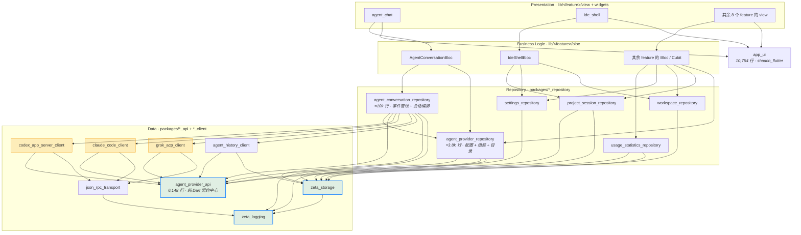

# 迁移拓扑分析

中文 ｜ [English](./migration_topology.en.md)

本文件是**旧仓库 → VGV 架构**迁移的全局拓扑分析与执行 Roadmap。

- 分析对象：旧仓库 `zeta`，`lib/src` 362 个 Dart 文件 / 127,231 行，`test` 261 个文件 / 97,601 行。
- 分析方式：解析全部 `package:zeta/src/...` 导入（1,215 处）构建模块依赖图；相对导入仅 52 处且不跨模块，不影响结论。
- **设计基准：VGV Layered Architecture**。旧仓库的四层结构（`domain` / `application` / `data` / `presentation`）与八条自定义门禁不作为迁移的组织原则，模块划分完全按 VGV 的 Data → Repository → Business Logic → Presentation 重新推导。

已确认的四项前提：

| 决策 | 选择 |
| --- | --- |
| 状态管理 | **全量重写为 Bloc** |
| 包结构 | **分层抽包**（monorepo，非每 feature 一包） |
| 目标平台 | **仅桌面三端**（macOS / Windows / Linux） |
| UI 基础 | **保留 shadcn_flutter**（`app_ui` 建于其上） |

> **实现规范以 skill 为准。** 仓库 `.claude/skills/` 下有 15 个 VGV 官方 skill。写代码前先查[迁移任务清单 §0.7](./migration_tasks.md#07-skill-优先) 的步骤→skill 映射表；本文件与 skill 冲突时以 skill 为准，除非该冲突已登记在 §0.7 的「偏离登记」中（当前有 3 条）。

---

## 1. VGV 分层与本项目的映射

VGV Layered Architecture 的四层职责：

| 层 | 位置 | 职责 | 硬约束 |
| --- | --- | --- | --- |
| **Data** | `packages/<name>_api`、`packages/<name>_client` | 与外部数据源交互，原始数据 → 模型 | 无业务逻辑；不依赖 Flutter |
| **Repository** | `packages/<name>_repository` | 组合一个或多个 data source，承载领域逻辑 | 不依赖 Flutter；不依赖其他 repository 的实现细节 |
| **Business Logic** | `lib/<feature>/bloc/` | 消费 repository，管理 feature 状态 | Bloc 之间不互相依赖；**绝不直接触碰 `dart:io`** |
| **Presentation** | `lib/<feature>/view/`、`lib/<feature>/widgets/` | 渲染与用户输入 | 只通过 bloc 交互；不含业务判断 |

### 重新划分的硬依据

旧仓库有 **60+ 个文件直接 `import 'dart:io'`**，分布如下：

```
features/agent               26        features/app_update           3
features/agent_management     8        features/ide_session          2
features/usage_statistics     7        core/*                        6
features/workspace            4        app/*                         5
features/settings             3        其他                          4
```

其中相当一部分位于 presentation 与 application 层。**在 VGV 下这是硬违规**——bloc 及其之上不得触碰 `dart:io`。因此本次迁移的核心动作不是"换目录名"，而是：

> 把所有进程拉起、文件读写、CLI 探测、协议解码**下沉到 Data 层的 `*_client` 包**，用 Repository 封装成纯 Dart 接口，让 bloc 之上再也见不到 `dart:io`。

这条线一划，包边界就自然确定了。

---

## 2. 模块划分

### 2.1 Data 层

契约与实现分离：`*_api` 定义抽象接口与模型（纯 Dart），`*_client` 提供具体实现（可用 `dart:io`）。

| 包 | 来源（旧仓库路径） | 规模 | 职责 |
| --- | --- | --- | --- |
| `packages/agent_provider_api` | `features/agent/domain/` | 31 文件 / 5,493 行 | **全项目契约中心**：`AgentEvent`（827 行）、`AgentProviderBundle`（243 行）、`AgentProviderCapabilities`（188 行）等中立模型与抽象接口。纯 Dart，零 Flutter、零 `dart:io`、零厂商字段 |
| `packages/json_rpc_transport` | `features/agent/data/datasources/transport/` | 3 文件 / 1,299 行 | JSON-RPC over stdio、operation scheduler、runtime peer |
| `packages/codex_app_server_client` | `datasources/app_server/` + `mappers/codex_*` + `codex_cli_locator` | ≈6.3k 行 | 实现 `agent_provider_api` |
| `packages/claude_code_client` | `datasources/claude_code/` + `mappers/claude_code_*` | ≈7.4k 行 | 实现 `agent_provider_api` |
| `packages/grok_acp_client` | `datasources/acp/` + `mappers/grok_*` + `mappers/acp_*` | ≈6.5k 行 | 实现 `agent_provider_api` |
| `packages/agent_history_client` | `datasources/local_history/` | 6 文件 / 3,085 行 | 本地会话历史读取 |
| `packages/zeta_storage` | `core/storage/` + `core/utils/` | 4 文件 / 268 行 | 原子文件写入、数据路径解析、路径工具。**全项目唯一允许直接文件 IO 的底层包** |
| `packages/zeta_logging` | `core/logging/` + `core/security/` | 3 文件 / 493 行 | 结构化日志 + 敏感数据脱敏 |

三个 `*_client` 包在各自 `pubspec.yaml` 中互不可见，且都只依赖 `agent_provider_api` + `json_rpc_transport`。**厂商协议差异被锁死在 Data 层，这是 `pub get` 强制的，不靠人工审查。**

ACP mapper 暂归 `grok_acp_client`（Grok 是当前唯一使用者），出现第二个 ACP provider 时再抽 `acp_shared`。

### 2.2 Repository 层

Repository 是 bloc 唯一的数据入口。**这一层承接了旧仓库 `features/agent/application/` 的全部 11,888 行**——它们是领域编排，在 VGV 下不属于 bloc。

| 包 | 来源 | 规模 | 职责 |
| --- | --- | --- | --- |
| `packages/agent_conversation_repository` | `agent/application/` 的管线与会话部分 | ≈10k 行 | 事件管线 + 会话 binding + 运行时注册表 |
| `packages/agent_provider_repository` | `agent/data/` 顶层 + 配置与目录 controller | ≈3.8k 行 | Provider 配置持久化、组装、模型/Skill/权限目录 |
| `packages/settings_repository` | `features/settings/{domain,data,application}` | ≈1.2k 行 | 通用设置持久化 |
| `packages/workspace_repository` | `features/workspace/{domain,data,application}` | ≈0.8k 行 | 文件树扫描与查询 |
| `packages/usage_statistics_repository` | `features/usage_statistics/{domain,data,application}` | ≈6.5k 行 | 三个 provider 的用量数据聚合，data 层已隔离 |
| `packages/project_session_repository` | `features/project_threads/` + `features/ide_session/` 的非 UI 部分 | ≈2.1k 行 | **合并两模块**，解开旧仓库的双向环 |

#### 为什么 agent 拆成两个 repository

单包会达到 13.8k 行，触及 `layered-architecture` skill 的反模式「One giant repository for everything」，且无法独立测试。按职责切开：

```
agent_conversation_repository  ≈10k 行 —— 一次会话的生命周期
  事件管线（5,349 行，纯同步）
    agent_conversation_timeline_store.dart      2,017
    agent_conversation_reducer.dart             1,160
    agent_conversation_mutation.dart              395
    agent_event_pipeline.dart                     349
    agent_conversation_event_processor.dart       260
    agent_conversation_effect_runner.dart         212
    bounded_event_dispatcher.dart                 183
    agent_ui_update_request.dart                  170
    coalescing_event_buffer.dart                  163
    agent_event_coalescing_policy.dart            143
    agent_conversation_effect.dart                129
    agent_provider_event_listener_gate.dart       103
    agent_elapsed_ticker.dart                      42
    agent_ui_update_port.dart                      23
  会话编排（≈4.7k 行）
    binding / binding_manager / runtime registry / global runtime
    thread_workspace_controller / turn_context_recorder / overlay
    plan_execution_handoff_controller

agent_provider_repository  ≈3.8k 行 —— Provider 的配置与目录
  Provider 组装（1,944 行）
    default_agent_provider_factory / native_agent_provider_bundles
    cli_command_locator / *_cli_locator
    agent_provider_config_store / codec / static_capabilities
  目录与配置 controller（≈1.9k 行）
    model_selection / permission_selection / mode / skills_catalog
    model_catalog_repository / permission_catalog_controller
    provider_settings_controller
```

**依赖方向单向**：`agent_conversation_repository` → `agent_provider_repository`（会话需要读取 Provider 配置与 bundle），反向没有边。

> ⚠️ skill 规定「repository 之间不得互相依赖」。这里是**一条有向边而非互相依赖**，且 `agent_provider_repository` 完全不知道会话的存在。若将来出现反向需求，说明切分点选错了，应重新划线而不是加边。

`agent_provider_repository` 同时被 `settings` 与 `agent_management` 两个 feature 消费——这也是它必须独立成包的实证依据。

**对外只暴露纯 Dart 接口**：`Stream<AgentTimelineSnapshot>`、`Future<void> submitTurn(...)`、`Future<void> respondToPermission(...)`。bloc 看不到 JSON-RPC、看不到进程、看不到文件。

#### 观察者机制：全量改为 Stream

旧仓库这些代码用 `ChangeNotifier` / `ValueNotifier` / `ValueListenable` 做观察者，全部来自 `package:flutter/foundation.dart`：

| 目标包 | 总行数 | 其中依赖 Flutter |
| --- | --- | --- |
| `agent_conversation_repository` + `agent_provider_repository` | 13.8k | **7,446** |
| `settings_repository` | 1,333 | 1,031 |
| `agent_management` 的 repository 部分 | 4,357 | 795 |
| `usage_statistics_repository` | 5,759 | 686 |
| `app_update` 的 repository 部分 | 1,377 | 387 |
| `workspace_repository` | 966 | 272 |
| `desktop_notifications` 的 repository 部分 | 563 | 113 |
| `project_session_repository` | 2,125 | **0** |
| **合计** | | **10,730** |

共 29 处 `import 'package:flutter/foundation.dart'`。

**全部改为 `Stream` / `StreamController`。** 理由有两条，缺一不可：

1. repository 包不得依赖 Flutter（VGV 硬约束 + skill 明文规定）
2. 若保留，迁移完成后会是 **ChangeNotifier 与 Bloc 两套状态机制并存**——与「全量重写为 Bloc」的决策直接冲突

因此 **P3 不是"纯搬运"，是全项目第二大的重构**（仅次于 P6 的 agent 会话）。§5.4「不做顺手重构」对 P3 有明确豁免，见该节。

### 2.3 Shared 层

| 包 | 来源 | 规模 | 说明 |
| --- | --- | --- | --- |
| `packages/app_ui` | `ui/core/` + `core/constants/app_typography.dart` | 50 文件 / 10,754 行 | VGV 标准命名的设计系统包。建于 shadcn_flutter 之上，含设计 token、24 个基础组件、workbench 原语、7 文件虚拟滚动子系统 |

`app_ui` **零 l10n 依赖**：共享组件的文案由构造参数传入，不引用 `AppLocalizations`。国际化的完整方案见 §2.5。

### 2.4 App 内 Feature（VGV 标准布局）

旧仓库的每 feature 四层目录**全部消解**：`domain` / `data` 上移到 Data 层包，`application` 上移到 Repository 层包，只剩 bloc 与 UI 留在 app 内。

```
lib/
├── app/                      # App widget + RepositoryProvider / BlocProvider 装配
├── bootstrap.dart
├── l10n/                     # ARB (en, zh)
├── main_development.dart · main_staging.dart · main_production.dart
│
├── agent_chat/               # bloc/ view/ widgets/   ← 原 agent/presentation
├── agent_management/         # bloc/ view/ widgets/
├── usage_statistics/         # bloc/ view/ widgets/
├── settings/                 # bloc/ view/
├── workspace/                # bloc/ view/
├── project_threads/          # bloc/ view/
├── ide_session/              # bloc/
├── desktop_notifications/    # bloc/
├── app_update/               # bloc/ view/
└── ide_shell/                # bloc/ view/ widgets/   ← 原 ui/features/ide + app/shell
```

每个 feature 目录带一个同名 barrel（`agent_chat.dart`），符合 VGV 约定。

各 feature 的 UI 规模（旧仓库实测）：

| Feature | presentation 规模 | 备注 |
| --- | --- | --- |
| `agent_chat` | 34 文件 / 22,993 行 | 含 4,190 行的 ViewModel 与 13,017 行 widgets |
| `usage_statistics` | 1,669 + 1,215 行两个主文件 | |
| `agent_management` | 1,734 行单文件 | |
| `ide_shell` | 4,059 + 3,631 行 | 三栏视图 + shell controller 合并 |
| 其余 | 各 < 1k 行 | |

### 2.5 国际化

#### 两个仓库的现状对比

**底座相同**：两边都用 Flutter 官方 gen-l10n（`flutter_localizations` + ARB + `l10n.yaml`），`template-arb-file`、`output-localization-file`、`output-class`、`nullable-getter` 四项配置一致，连 `BuildContext.l10n` 扩展的写法都相同。**新仓库的方案是旧仓库的真子集**，不存在选型冲突。

差异全部集中在旧仓库多出来的部分：

| 维度 | 旧仓库 | 新仓库（VGV 脚手架） |
| --- | --- | --- |
| 目录 | `lib/src/ui/localization/{arb,generated}` | `lib/l10n/{arb,gen}` |
| 语言 | en + zh(Hans) | en + es |
| 键数 | **1,072** | 1 |
| 生成代码 | 14,277 行 | ≈100 行 |
| `l10n.yaml` 独有项 | `required-resource-attributes: true`<br>`use-escaping: true`<br>`format: true` | `header: "// dart format off\n// coverage:ignore-file"` |
| Locale 来源 | 应用内设置驱动 + 启动冻结 | 跟随系统 |
| delegates | 自组合 5 个（含同步加载的自定义 delegate） | 默认 |
| 第三方库本地化 | `ZetaShadcnLocalizations`（384 行） | 无 |
| 非 UI 层文案 | TextCatalog 抽象（4 组 + 866 行桥接） | 无（本次迁移废除，见下） |

#### 采纳原则

**保留新仓库的目录约定与 CI 配置，迁入旧仓库的四层扩展。**

`header: "// dart format off\n// coverage:ignore-file"` 是新仓库唯一优于旧仓库的配置，且在 VGV 下是刚需——1,072 个键生成 14,277 行代码，没有 `coverage:ignore-file` 会直接拖垮 `--min-coverage 100`。旧仓库的 `format: true` 与之冲突，丢弃。

最终 `l10n.yaml`：

```yaml
arb-dir: lib/l10n/arb
template-arb-file: app_en.arb
output-localization-file: app_localizations.dart
output-class: AppLocalizations
output-dir: lib/l10n/gen
nullable-getter: false
required-resource-attributes: true   # 迁自旧仓库：1072 键规模下强制写 description
use-escaping: true                   # 迁自旧仓库
header: "// dart format off\n// coverage:ignore-file"   # 保留新仓库
```

#### ARB 不拆分，共享组件文案改为传参

`app_ui` 建于 shadcn_flutter 之上，其 shadcn 本地化适配器需要 `AppLocalizations`——但 `app_ui` 不能反向依赖 app。

一度考虑把 118 键拆进 `app_ui` 自带的 ARB，但 `internationalization` skill 给了更干净的解法：

> Pass localized strings as parameters to reusable widgets — never couple shared widgets directly to `AppLocalizations`

实测键使用量：

| 消费方 | 直接使用的键数 | 处理 |
| --- | --- | --- |
| `ui/core` → `app_ui` | 11 | **改为构造参数**，由调用方传入 |
| `shadcn*` 前缀（适配器专用） | 107 | 连同 `ZetaShadcnLocalizations` **留在 app** |
| app + 其余全部 feature | ≈954 | 不动 |

**最终方案：ARB 完全不拆分，1,072 键整体留在 `lib/l10n/`；`app_ui` 零 l10n 依赖。**

收益：少一层跨包 l10n 依赖，`app_ui` 可被任意项目复用，且省掉整个拆分步骤。代价是 11 个组件多几个构造参数——这正是 skill 想要的形态。

> 约束固化为一条检查项：**`packages/` 下任何包都不得引用 `AppLocalizations`。**

#### TextCatalog 抽象：废除，改为 typed code

旧仓库有 4 组文本目录接口，每组配一个纯 Dart 的 `Fallback*` 默认实现（硬编码英文文案），以及一个用 `AppLocalizations` 填充的 `App*` 实现，由 866 行的 `zeta_text_catalogs.dart` 桥接：

| 接口 | Fallback 实现（硬编码文案） |
| --- | --- |
| `AgentUiTextCatalog`（260 行） | `FallbackAgentUiTextCatalog`（395 行） |
| `AgentManagementTextCatalog` | `FallbackAgentManagementTextCatalog` |
| `UsageStatisticsTextCatalog` | `FallbackUsageStatisticsTextCatalog` |
| `DesktopAttentionTextCatalog` | `FallbackDesktopAttentionTextCatalog` |

**这套机制在本次迁移中整体废除。**

废除理由：`Fallback*` 里的硬编码文案与 ARB 的 1,072 键构成**两份文案真源**，直接违反 `internationalization` skill 的第一条——「ARB files are the single source of truth」。而 §2.5 已确定 `app_ui` 走构造参数传参，若 TextCatalog 同时保留，同一个问题就有了两套解法。

**改后方案：下层返回 typed code，app 层统一映射到 ARB。**

```dart
// data / repository 层：只产出类型化的语义，不产出用户可见文案
sealed class AgentProviderFailure { const AgentProviderFailure(); }
final class AgentCliNotFound extends AgentProviderFailure {
  const AgentCliNotFound({required this.providerId, required this.probedPaths});
  final String providerId;
  final List<String> probedPaths;
}
final class AgentCapabilityUnsupported extends AgentProviderFailure {
  const AgentCapabilityUnsupported({required this.capability});
  final String capability;
}

// app 层：唯一的本地化点
String describeFailure(BuildContext context, AgentProviderFailure failure) =>
    switch (failure) {
      AgentCliNotFound(:final providerId) => context.l10n.agentCliNotFound(providerId),
      AgentCapabilityUnsupported(:final capability) =>
          context.l10n.agentCapabilityUnsupported(capability),
    };
```

收益：

- ARB 成为唯一文案真源，`Fallback*` 的 395 行硬编码文案并入 ARB 后删除
- 与 `app_ui` 的传参策略统一，全项目只有一套本地化路径
- `sealed` + `switch` 穷尽匹配保证新增失败类型时编译期报错，不会漏翻译
- data / repository 层彻底与文案脱钩，可在 CLI、测试、服务端等无 Flutter 环境复用

代价：4 组接口与 866 行桥接废除，60+ 个消费点改为返回/接收 typed code，`Fallback*` 文案需逐条并入 ARB。这部分工作分摊在 P1（契约定义）、P3（repository 改造）、P5–P7（UI 映射）。

> 迁移期的**唯一文案出口**约束：`packages/` 下任何包都不得产出用户可见字符串，也不得引用 `AppLocalizations`。

#### 其余需要迁移的机制

| 机制 | 来源 | 作用 | 目标位置 |
| --- | --- | --- | --- |
| 同步 delegate | `ZetaAppLocalizationsDelegate` | 用 `SynchronousFuture` 加载，避免首帧空白 | `lib/l10n/` |
| Locale 冻结 | `app.dart` 的 `_frozenDisplayLocale` | 语言由应用设置决定而非系统，启动时冻结，防止运行中漂移导致已启动 provider 的文案不一致 | `bootstrap.dart` + `lib/app/` |
| shadcn 本地化 | `ZetaShadcnLocalizations`（384 行） | 适配 `sf.ShadcnLocalizations` | `packages/app_ui` |
| 语言无关格式化 | `formatInvariantNumber`、`formatLocalizedRelativeTime` | 数值与相对时间的算法保持语言无关，只翻译外围静态 token | 随各自消费方 |
| `l10nOrNull` | `app_localizations_x.dart` | 测试或未挂 delegate 的子树可读到 null | `lib/l10n/l10n.dart` |

#### 语言

删除脚手架的 `app_es.arb`，迁入 en + zh(Hans)。旧仓库 `supportedLocales` 同时列出 `Locale.fromSubtags(languageCode: 'zh', scriptCode: 'Hans')` 与 `Locale('zh')` 两个条目以兼容不同系统上报格式，迁移时保留。

---

## 3. 依赖关系图



**读图要点**：橙色的三个厂商 client 之间无边，也不指向任何 repository；箭头严格自上而下，跨层不跳跃。

Repository 层内部只有 `agent_conversation_repository → agent_provider_repository` **一条有向边**（会话需要读 Provider 配置与 bundle），无反向边、无环。这是 skill「repository 之间不得互相依赖」的边界情形，理由与复核触发条件见 §2.2。

### 调用链最底层的核心模块

按 fanout=0 判定，抽包后处于绝对底层的是：

1. **`agent_provider_api`** — 被全部 3 个 client、6 个 repository 中的 4 个依赖。**整个系统的语义枢纽**：厂商协议差异在此被抹平。三个关键文件：`agent_event_models.dart`（827 行）、`agent_provider_bundle.dart`（243 行）、`agent_provider_capabilities.dart`（188 行）
2. **`zeta_logging`** — 唯一被 Data 层普遍依赖的横切包
3. **`zeta_storage`** — 全项目文件 IO 的唯一出口

`app_ui` 在 UI 侧是 fanout 最小的叶子（仅依赖 Flutter + shadcn_flutter + 自身 l10n）。

### 旧仓库实测 fan-in / fan-out（迁移前基线）

以模块为单位，数值为"有依赖关系的模块个数"：

| 模块 | fan-in | fan-out |
| --- | --- | --- |
| `core` | 12 | 0 |
| `ui/core` | 8 | 2 |
| `ui/localization` | 8 | 0 |
| `features/agent` | 7 | 5 |
| `features/settings` | 4 | 5 |
| `features/agent_management` | 3 | 4 |
| `features/project_threads` | 3 | 3 |
| `features/ide_session` | 3 | 3 |
| `features/workspace` | 3 | 2 |
| `features/usage_statistics` | 2 | 4 |
| `features/desktop_notifications` | 2 | 3 |
| `features/app_update` | 2 | 3 |
| `app` | 2 | 13 |
| `ui/features` | 1 | 13 |

### 必须打破的反向边

好消息：**旧仓库所有跨 feature 的边都只指向对方的 `domain/`**，仅两处例外。这意味着按 VGV 重新分层时，绝大多数依赖会自然落到 Data 层的 `agent_provider_api`，无需手工解耦。

| # | 反向边 | 位置（旧仓库） | VGV 下的处理 |
| --- | --- | --- | --- |
| 1 | `settings → app` | `settings/presentation/settings_page.dart:6` 导入 `app/localization/zeta_localization.dart` | **自动消失**——l10n 移入 `lib/l10n/`，与 settings 同在 app 内 |
| 2 | `ui/features → app` | `ui/features/ide/views/ide_home.dart:7-8` 导入 `menu_action_bridge`、`ide_shell_controller` | **自动消失**——两者合并为 `lib/ide_shell/` |
| 3 | `ide_session ↔ project_threads` | 双向各 1 处：`ide_session_state_builder.dart:6` ↔ `project_threads_session_snapshot_codec.dart:2` | **合并为 `project_session_repository`**，环内化为包内调用 |
| 4 | `settings → agent_management/presentation` | `settings_page.dart:13-14` | **唯一一处跨 feature 触碰 presentation**。VGV 下改为 app 层注入 widget builder，或 settings 页面用 `BlocProvider.value` 复用 `AgentManagementBloc` |
| 5 | `desktop_notifications/application → settings/application` | `desktop_attention_controller.dart:9-10` | 两个 bloc 不得互相依赖。改为都消费 `settings_repository`，或 app 层用 `BlocListener` 桥接 |
| 6 | `agent/presentation → settings/domain` | `agent_pane.dart:20` | `GeneralSettings` 模型下沉到 `settings_repository`，两侧都从包导入 |

---

## 4. 旧门禁在 VGV 下的归属

旧仓库八条门禁不再作为组织原则。但其中几条描述的是**产品需求而非架构偏好**，架构换了它们不会自动成立，需要显式承接：

| 旧门禁 | VGV 下的归属 | 是否自动成立 |
| --- | --- | --- |
| G1 共享层零 Provider 依赖 | Data 层包边界 + `pubspec.yaml` 约束 | ✅ 自动（且比原来更强） |
| G2 身份由 adapter 决定 | `*_client` 包的实现职责 | ⚠️ 需在 client 包的契约测试中保留 |
| G3 reducer 纯同步、副作用走 EffectRunner | Bloc 的 `emit` 语义 + repository 边界 | ✅ 自动 |
| G4 按 capability 渲染 | `AgentProviderCapabilities` 由 repository 暴露给 bloc | ⚠️ 需保留 widget 测试 |
| **G5 四种审批语义隔离、绝不预授权** | **无对应架构机制** | ❌ **必须显式保留为产品安全需求** |
| G6 分层依赖单向 | VGV Layered Architecture 本体 | ✅ 自动 |
| **G7 持久化版本化 + 宽容解码** | Data 层 `fromJson` 的容错职责 | ❌ **必须显式保留，见 §5.6** |
| G8 shadcn 仅 `as sf` 导入 | `app_ui` 包内部约定 | ✅ 由包边界收敛 |

**G5 与 G7 是本次迁移最容易丢失的两项**，因为它们不体现在目录结构里。G5 涉及权限授予的安全语义（权限响应 / 提问回答 / Plan 审批 / Plan 执行交接四者混淆会导致误授权），G7 涉及老用户数据可读性。两者都在下方 Roadmap 中有对应的验收门。

---

## 5. 已确认的执行前提

### 5.1 测试随功能同步迁移，迁多少补多少

**不做测试的独立批量迁移。** 每迁一个模块，同步完成三件事：

1. 迁移该模块在旧仓库对应的测试与 fixtures
2. 补齐缺口，使该模块达到 `--min-coverage 100`
3. Bloc 化的模块额外补 `bloc_test`，覆盖全部状态迁移

**每个阶段的验收门都是"该阶段范围内 100% 覆盖"**，而非最终一次性达标。旧仓库 261 个测试文件 / 97,601 行随功能分散到 P0–P6，不单独立项。

注意：旧仓库测试按四层目录组织，VGV 下测试要跟着代码走——`test/src/features/agent/domain/` 的测试迁到 `packages/agent_provider_api/test/`，而非 app 的 test 目录。

### 5.2 旧仓库 freeze

迁移期间旧仓库停止功能开发。P2（Data 层，约 26k 行）是漂移代价最高的窗口。

### 5.3 包名保持 `zeta`

app 包仍名 `zeta`。抽出的包按 VGV 惯例用职责命名（`agent_provider_api`、`app_ui`），不强加 `zeta_` 前缀；仅横切基础设施包保留前缀（`zeta_storage`、`zeta_logging`）以避免与 pub.dev 常见名冲突。

`package:zeta/src/...` 的导入路径需全量重写——建议每阶段收尾用脚本批量改写，`flutter analyze` 兜底。

### 5.4 不做顺手重构（含两处明确豁免）

默认规则：**不拆大文件、不改业务逻辑、不调整命名。**

两处豁免，各有不可回避的理由：

| 豁免 | 阶段 | 范围 | 理由 |
| --- | --- | --- | --- |
| **观察者机制改造** | P3 | 10,730 行的 `ChangeNotifier` / `ValueNotifier` → `Stream` | `ChangeNotifier` 来自 `package:flutter/foundation.dart`，与「repository 包不依赖 Flutter」硬冲突；保留则 ChangeNotifier 与 Bloc 两套并存 |
| **会话 ViewModel 拆解** | P6 | `agent_conversation_view_model.dart`（4,190 行）及其直接关联 widget | 4,190 行的 ChangeNotifier 无法在不拆解的前提下 Bloc 化 |

**豁免之外仍然严格适用**：P1、P2、P4 是纯搬运；P3 除观察者出口外不动业务逻辑；P5 只换外壳。

**这条约束保证可二分定位**：P6 出问题时，能确定 P1/P2/P4 引入零行为变更，P3 的变更面收敛在观察者出口这一处。

> P3 的行为等价性靠现有测试兜底——旧仓库这些模块测试完备，改 Stream 后测试断言方式要改，但**被测行为必须逐条对应**。改造时先跑通旧断言的等价版本，再补 Stream 特有的用例（订阅/取消订阅/多订阅者）。

### 5.5 `third_party/` 与 `tool/` 不在本次范围

旧仓库的 `third_party/`（1 个目录）与 `tool/`（17 个目录）不随本次迁移。

### 5.6 Cursor 退役代码：迁移开始前在旧仓库清完

已决定不迁移 Cursor 兼容代码。**但它不是死代码**——它是老用户持久化配置的过滤层，被 5 处 lib 代码依赖。直接删除会让残留的 cursor 条目重新出现在 Provider 菜单里，并使受保护的会话索引失去保护。

**清退整体前置到步骤 0，在旧仓库内完成，确认全绿后才开始迁移。**

这样安排的原因：若按原计划在 P1 排除该文件、P7 才删调用点，它的 5 个调用点会在 P2/P3/P5 陆续迁移并引用一个不存在的类——中间整个迁移期都背着已废弃的代码，正是"新旧两套逻辑并存"。前置清退让迁移全程只面对一套干净代码。

执行顺序不可颠倒：

1. **先做数据清洗**：在旧仓库的数据迁移逻辑中新增一次性迁移——从持久化的 provider 配置中物理删除 cursor 条目；`activeProviderId` 指向 cursor 时改写为默认 provider；删除或归档 `cursor_sessions.json`
2. **再删兼容层**，涉及旧仓库以下位置：

   | 位置 | 内容 |
   | --- | --- |
   | `agent/domain/cursor_retirement_policy.dart` | 策略类本体（122 行） |
   | `agent/domain/agent_models.dart:8` | barrel 的 re-export |
   | `agent/data/agent_provider_config_codec.dart:52` | 老配置 activeProviderId 降级路径 |
   | `agent/data/default_agent_provider_factory.dart:37,39,52` | 命中退役 provider 时 fail-closed |
   | `agent/data/agent_provider_static_capabilities.dart:92` | `AgentProviderKind.cursorAcp` 分支 |
   | `agent/application/agent_provider_settings_controller.dart` | 8 处调用 |
   | `agent/application/agent_turn_context_recorder.dart:7,92` | 导入与退役判定 |
   | `agent_management/application/agent_management_controller.dart:792` | 目录过滤 |
   | `ui/features/ide/views/new_thread_provider_popover.dart:39` | 新建 thread 的 Provider 列表过滤 |
   | `core/storage/zeta_data_paths.dart:86-88` | `cursorSessionsFile` 受保护路径 |
   | l10n | zh / en 各 8 条 `cursorRetired` 相关文案 |

3. **回归验证**：用真实旧版本配置文件（含 cursor 条目）跑升级，确认不崩溃、菜单无 cursor、活动 provider 正确降级

> ⚠️ `AgentProviderKind.cursorAcp` 枚举值建议保留，或在 `fromJson` 中加未知值兜底，否则老配置反序列化会抛异常（见 §4 的 G7）。

---

## 6. 迁移 Roadmap

原则：**先无 UI 的 Data 层 → 再 Repository 层 → 再 Shared UI → 最后 Bloc 与 Presentation**。每阶段有明确验收门，未通过不进入下一阶段。

### 关于"全量重写为 Bloc"的风险评估

这是四项决策中风险最高的一项，但探查后结论比预估乐观：

`AgentConversationReducer`（1,160 行）**已经是纯同步 reducer**，`EffectRunner`（212 行）**已经是唯一副作用出口**。这恰好就是 Bloc 的 `on<Event>((event, emit) => ...)` 语义。所以 Bloc 化不是推倒重来，而是把 ChangeNotifier 外壳换成 Bloc 外壳、reducer 原样调用：

```dart
on<AgentEventReceived>((event, emit) {
  final mutation = _reducer.reduce(state.timeline, event.agentEvent); // 现有代码
  emit(state.applying(mutation));
});
```

注意 reducer 与 EffectRunner **随 `agent_conversation_repository` 一起下沉到 Repository 层**（P3），bloc 只消费它暴露的 `Stream`。

旧仓库状态管理现状：0 个 Bloc / Cubit，28 个文件用 `ChangeNotifier`，8 个 `ValueNotifier`，36 个文件含 `setState`。

---

### 步骤 0 · Cursor 前置清退（在旧仓库内完成）

**迁移的前置条件，不属于任何 P 阶段。** 在旧仓库把 Cursor 退役代码连同其持久化数据一次清干净，确认全绿后才开始迁移——这样迁移全程只面对一套干净代码，不会出现"新旧两套逻辑并存"。

0. 按 §5.6 的顺序执行：数据清洗 → 删除兼容层（11 处）→ 用含 cursor 条目的真实旧配置跑升级回归

**出口条件**：旧仓库 `flutter analyze` 零告警、全量测试绿、升级回归通过。**未达成不进入 P0。**

### P0 · 工程地基

1. 修正平台矩阵：`flutter create --platforms=linux .` 补齐 linux；删除 `android/`、`ios/`、`web/`
2. 引入 melos 或 Dart workspace，建立 `packages/` 骨架与统一的 `very_good_analysis` 配置
3. **l10n 基线**（详见 §2.5）：按合并后的 `l10n.yaml` 配置；删除脚手架的 `app_es.arb`；迁入旧仓库 en + zh 全量 1,072 键（**不拆分**，见 §2.5）；迁 `l10n.dart` 扩展含 `l10nOrNull`。**ARB 是纯数据，无代码依赖，提前迁可让后续每个阶段直接引用键名**
4. CI 接入：`very_good test --coverage --min-coverage 100`、`bloc_lint`、`dart format --set-exit-if-changed`
5. 迁 **`zeta_logging`**（493 行）与 **`zeta_storage`**（268 行）——fanout=0，零阻力
6. 建立**分层依赖检查**：一个测试遍历各包 `pubspec.yaml`，断言 Data 层不依赖 Repository、Repository 不依赖 Flutter、app_ui 不依赖任何 repository

**验收门**：两个基础包 100% 覆盖；分层依赖检查在 CI 中生效。

**为什么第 5 步要最先做**：它是 VGV 分层的自动化守卫。晚做则中间所有阶段裸奔。

### P1 · Data 层契约

7. **`agent_provider_api`**（5,493 行）——迁移时逐文件验证零 Flutter / 零 `dart:io` / 零厂商字段。**`AgentUiTextCatalog`（260 行）与 `FallbackAgentUiTextCatalog`（395 行）不迁**，改为定义 `sealed` 失败类型与语义码，文案由 app 层映射（§2.5）
8. **`json_rpc_transport`**（1,299 行）

**验收门**：`agent_provider_api` 可用纯 `dart test` 运行（不依赖 flutter_test）；100% 覆盖。

### P2 · Data 层实现

9. 三个 client 包**并行迁移**：`codex_app_server_client`（≈6.3k）、`claude_code_client`（≈7.4k）、`grok_acp_client`（≈6.5k）
10. **`agent_history_client`**（3,085 行）
11. 同步迁移各自的契约测试与 fixtures，补齐至 100%

**验收门**：三个 client 的 `pubspec.yaml` 互不引用；各自契约测试全绿；**G2 的身份归属语义**（entryId 由 client 自行决定）在契约测试中被显式断言。

这是单块工作量最大的阶段（≈23k 行），但**风险最低**——纯 Dart、无 UI、有完整现成测试、可三路并行。

### P3 · Repository 层

**本阶段是全项目第二大的重构**（仅次于 P6）：`dart:io` 下沉、10,730 行观察者机制改造、TextCatalog 废除，三件事同时发生。

12. **`agent_conversation_repository`**（≈10k 行）——事件管线 + 会话 binding + 运行时注册表。**此阶段不碰 Bloc**，但观察者出口全部改 `Stream`
13. **`agent_provider_repository`**（≈3.8k 行）——Provider 配置持久化、组装、模型/Skill/权限目录。被 `settings` 与 `agent_management` 共用
14. `settings_repository`（≈1.2k）、`workspace_repository`（≈0.8k）、**`project_session_repository`**（≈2.1k，合并两模块解开反向边 #3）
15. `usage_statistics_repository`（≈6.5k）

各包同时完成两项横切改造（§2.2、§2.5）：

- **观察者改 Stream**：29 处 `import 'package:flutter/foundation.dart'` 归零
- **废除 TextCatalog**：改为返回 `sealed` typed code，`Fallback*` 硬编码文案并入 ARB

**验收门**（全部为可自动化核对的客观指标）：

| 指标 | 迁移前 | 目标 |
| --- | --- | --- |
| repository 包的 `flutter` 依赖数 | — | **0** |
| app 侧 `dart:io` 导入数 | 60+ | **0** |
| repository 包中 `ChangeNotifier` / `ValueNotifier` 出现次数 | 29 文件 / 10,730 行 | **0** |
| `packages/` 下 `AppLocalizations` 引用数 | — | **0** |
| 覆盖率 | — | **100%** |

### P4 · 设计系统

16. **`app_ui`**（10,754 行）——含 `app_typography.dart` 从 core 下沉。建于 shadcn_flutter 之上。**11 个组件文案改为构造参数**（§2.5），`ZetaShadcnLocalizations`（384 行）与 107 个 `shadcn*` 键留在 app
17. 迁 `test/src/ui/core/`（含虚拟滚动 7 文件测试），补齐至 100%

**验收门**：`app_ui` 不依赖任何 repository 包；**包内无任何 `AppLocalizations` 引用**；可独立跑测试；ARB 保持 1,072 键完整未拆分。

### P5 · Bloc 与 Presentation（按 feature 串行）

**先易后难，用小模块建立 Bloc 迁移手法，定型后再上大模块。**

18. `workspace`（1,167 行）→ `WorkspaceCubit`
19. `settings`（2,267 行）→ `SettingsCubit`；处理反向边 #4 与 #6
20. `app_update`（1,813 行）→ `AppUpdateBloc`（有明确状态机语义）
21. `desktop_notifications`（563 行）→ `DesktopNotificationsBloc`；处理反向边 #5；`DesktopAttentionTextCatalog` 废除，通知文案改由 bloc 从 `context.l10n` 取
22. `project_threads` + `ide_session`（2,578 行）→ 各自 bloc，共享 `project_session_repository`
23. `agent_management`（7,034 行）→ `AgentManagementBloc`。⚠️ `agent_management_page.dart` 单文件 1,734 行
24. `usage_statistics`（9,558 行）→ `UsageStatisticsBloc`。data 层已在 P3 隔离，改造集中在两个 UI 主文件

**验收门（每个 feature 独立验收）**：`bloc_test` 覆盖全部状态迁移；bloc 之间无互相依赖；该 feature 100% 覆盖。

### P6 · Agent 会话（最高风险，单独立项）

25. **`agent_conversation_view_model.dart`（4,190 行）→ `AgentConversationBloc`**，拆 4 步：
    - **24a** 状态类——复用现有 `agent_conversation_ui_state.dart`（1,098 行）作为 Bloc State
    - **24b** 事件流接入——订阅 `agent_conversation_repository` 暴露的 `Stream<AgentTimelineSnapshot>`，转为 bloc event
    - **24c** 用户操作接入——**权限响应 / 提问回答 / Plan 审批 / Plan 执行交接四种语义严格隔离**，四组独立 event 类型，绝不预授权任何操作（承接 G5）
    - **24d** 拆解 UI 派生逻辑 → state 的 getter 或独立 selector
26. presentation widgets（18 文件 / 13,017 行）→ `BlocBuilder` / `BlocSelector` 改造。建议同步拆分 `agent_pane_cards.dart`（2,220）、`agent_model_config.dart`（1,971）、`agent_pane_composer.dart`（1,607）
27. 按 capability 渲染的 widget 测试（承接 G4）：能力缺失时对应入口不出现

**验收门**：四种审批语义的隔离在 `bloc_test` 中被显式断言（含"不预授权"的负向用例）；真实 CLI 三路冒烟（Codex + Claude Code + Grok）。

**这一阶段建议单独拉分支、单独评审**，占全部迁移风险约 60%。

### P7 · 应用外壳与收口

28. `ide_shell`——`ui/features/ide/`（4,059 行）+ `app/shell/ide_shell_controller.dart`（1,467 行）合并，改造为 `IdeShellBloc`，反向边 #2 消失
29. `lib/app/` 装配层：`RepositoryProvider` 注入全部 repository，`BlocProvider` 注入全局 bloc；`zeta_startup_bootstrap` 接入 VGV `bootstrap.dart`
30. **l10n 收口**（§2.5）：`sealed` 失败类型 → ARB 键的映射函数集中到 `lib/l10n/`；核验 `Fallback*` 的 395 行文案已全部并入 ARB 且无遗漏；`ZetaAppLocalizationsDelegate`（同步加载）与 `ZetaLocalization.delegates` 组合就位；**Locale 冻结**逻辑迁入 `bootstrap.dart` + `lib/app/`
31. 三 flavor（development / staging / production）对接 `main_*.dart`
32. **数据迁移专项验证**（承接 G7）：老用户配置、会话索引、turn context 的版本化读取与宽容解码，用真实旧版本数据文件做回归
33. 文档收口：本文件更新为最终架构说明；补 `CONTRIBUTING.md` 的分层规则

> Cursor 退役代码不在本阶段——已整体前置到**步骤 0**，在旧仓库内完成（§5.6）。

**验收门**：三平台构建通过；全量测试绿；覆盖率 100%；老版本数据升级回归通过；真实 CLI 端到端冒烟；**中英文两种语言下各跑一次 UI 冒烟**（Locale 冻结生效、无缺键回退到英文）。

---

## 7. 阶段风险与并行度

| 阶段 | 规模 | 风险 | 可并行 |
| --- | --- | --- | --- |
| **步骤 0 Cursor 前置清退** | ≈0.5k 行（**在旧仓库**） | 中（触及持久化数据） | 否（迁移的前置条件） |
| P0 工程地基 | 0.8k 行代码 + 1,072 键 ARB | 低 | 否（所有阶段前提） |
| P1 Data 契约 | 6.8k 行 | 低 | 否 |
| P2 Data 实现 | ≈23k 行 | 低（纯 Dart + 现成测试） | **是**（三个 client 三路并行） |
| P3 Repository | ≈24k 行，**含 10,730 行观察者改造** | **高**（`dart:io` 下沉 + ChangeNotifier→Stream + TextCatalog 废除） | 部分（两个 agent 包与其余四个可并行） |
| P4 设计系统 | 10.8k 行 | 低 | **是**（与 P2 / P3 并行） |
| P5 Bloc 与 UI | ≈25k 行 | 中（Bloc 手法建立期） | 否（刻意串行以定型手法） |
| P6 Agent 会话 | ≈23k 行 | **高** | 否 |
| P7 外壳与收口 | ≈7.7k 行 | 中 | 否 |

P1 / P2 / P4 合计约 40k 行是低风险搬运且可大幅并行。

**P3 与 P6 是两个高风险阶段**，合计约 47k 行，必须串行、单独评审。P3 之所以从原先评估的"中"升到"高"，是因为它同时承担三项横切改造（`dart:io` 下沉、10,730 行观察者机制改 Stream、TextCatalog 废除），任何一项出问题都会波及全部 repository 包。

---

## 附：分析口径

- 模块边界定义（迁移前基线）：`features/<name>` 为一个模块；`ui/core`、`ui/features`、`ui/localization`、`core`、`app` 各为一个模块。
- 边的统计：仅统计 `import 'package:zeta/src/...'`，跨模块才计数。旧仓库相对导入共 52 处，全部在 `ui/core` 内部，不跨模块。
- 行数：`wc -l`，含空行与注释。生成代码（l10n generated，14,277 行）单独标注，不计入人工迁移工作量估算。
- 标注 `≈` 的规模为按文件前缀切分后的估算（如 `mappers/` 下 29 个文件 9,415 行需按 `codex_*` / `claude_code_*` / `grok_*` / `acp_*` 前缀分派到三个 client 包），实际执行时以切分结果为准。
