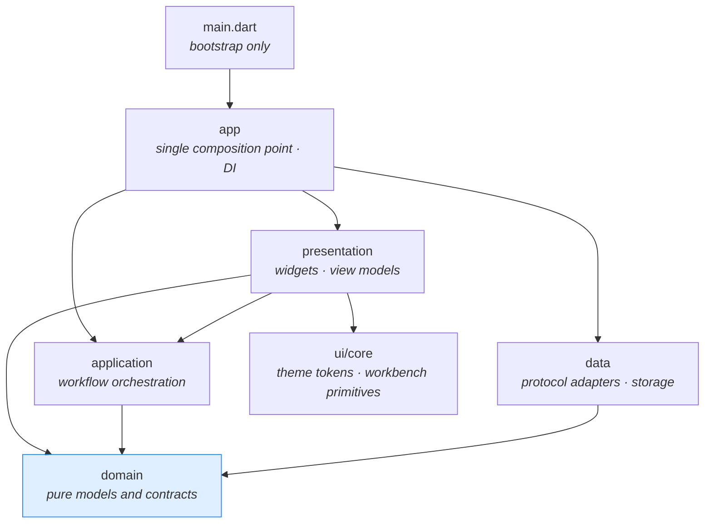
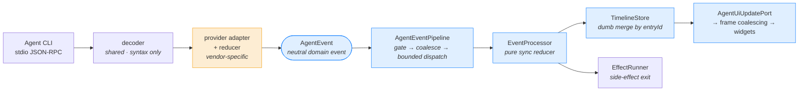
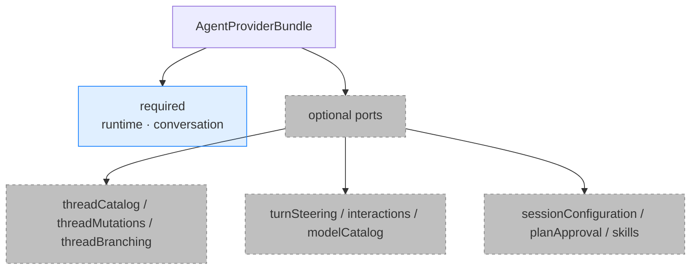
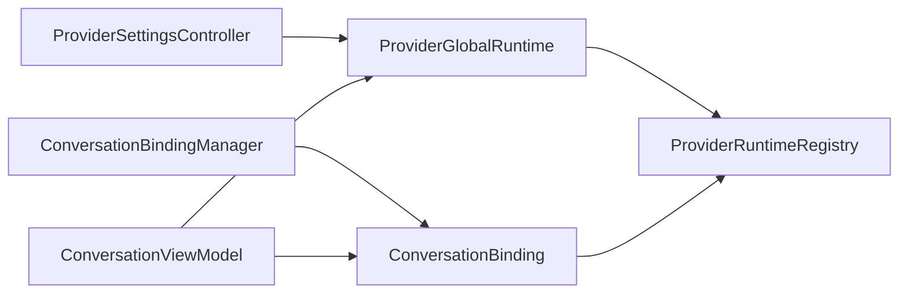
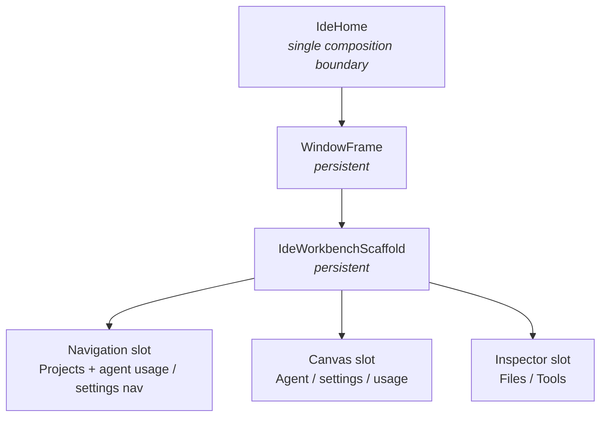

# Architecture overview

[中文](./overview.md) ｜ English

Written for someone opening this repository for the first time. The goal is to give you a working mental model in about fifteen minutes, so you know which layer to touch.

For definitions of specific terms, see the [glossary](../guides/glossary.en.md). For the complete rules and invariants, see the [design document](./design_document.md) and [engineering standards](./engineering_standards.md) (both Chinese).

## In one sentence

Zeta is a **desktop shell**. It ships no model and implements no editor. It launches the agent CLIs already on your machine, translates their proprietary protocols into a set of neutral domain events, and renders those events as an auditable timeline.

The active providers are Codex app-server (default), Grok ACP, and Claude Code stream-json; Cursor is retired. See the [Claude Code protocol baseline](../protocols/claude_code_stream_json_protocol.md) for its current wire contract.

So the architecture revolves around exactly one question: **how do we keep provider-specific protocol differences from contaminating shared code?** Most constraints you'll read about are derived from that question.

## Layering



**Dependencies are one-way; you can't reverse an arrow.** The critical rule: `domain` is pure — no Flutter, no `dart:io`, no provider protocol fields. Any time you want to import a Codex type into domain, you're in the wrong layer.

Code is sliced by feature, and each feature is split into those same four layers:

```
lib/src/features/<feature>/
├── domain/         models, contracts, pure rules
├── application/    controllers, workflow orchestration
├── data/           protocol adapters, storage implementations
└── presentation/   widgets, view models
```

Existing features: `agent` (provider abstraction and conversation), `agent_management` (CLI detection and diagnostics), `desktop_notifications`, `ide_session` (restore), `project_threads`, `settings`, `usage_statistics`, `workspace` (file tree).

**New code goes into the matching feature — not back into broad top-level directories.**

## The agent event pipeline

This is the one path worth understanding thoroughly. A raw notification from the CLI passes through all of this before it becomes a line on screen:



Exactly one box is orange. **Everything after it must be provider-agnostic** — that's the entire point of the design.

Responsibilities break down like this:

| Stage | Owns | Explicitly doesn't own |
| --- | --- | --- |
| decoder | protocol syntax, transport lifecycle | any provider branching |
| **provider adapter / reducer** | vendor field compatibility, entryId assignment, segmentation, dedup, terminal states | punting unresolved semantics downstream |
| pipeline | subscription scope, coalescing, bounded dispatch | business semantics |
| processor / reducer | state transitions, timeline mutation descriptions | async work, Flutter scheduling |
| TimelineStore | update on same entryId, create on new entryId | inference, id rewriting |
| UI | rendering | parsing protocol |

The three rules most often violated:

1. **A provider's `sourceItemId` / `sourceMessageId` is metadata only.** entryId, message segmentation, reasoning phases, dedup, and terminal states are all decided by that provider's own adapter/reducer. TimelineStore merges blindly — it never guesses.
2. **Reducers must be purely synchronous.** No `Timer`, no `Future`, no Flutter scheduler, no external callbacks. Side effects go through the EffectRunner, which validates scope.
3. **Live / history / replay each get their own reducer instance.** Sharing one bleeds state across them.

Before adding or changing an `AgentEvent`, work through all 16 items of the onboarding checklist in [developer guide §7](../guides/developer_guide.md).

## Provider capability negotiation

Zeta doesn't assume every agent can do the same things. Each provider exposes a set of ports through `AgentProviderBundle`, only two of which are required:



**UI renders by capability, never by provider name.** When a port is absent or `capability = false`, the corresponding entry point never appears in the menu, and an accidental call from the application layer throws `UnsupportedError` — **silent success is forbidden**, because it makes users believe something took effect when it didn't.

The bundle is a strict boundary: neither it nor `AgentRuntimePort` provides a way to recover the raw `AgentProvider`; view models only retain neutral ports.

This is also what makes "adding a provider without touching shared code" realistic. The normal scope of a new provider is:

```
its own data files  +  neutral domain contracts  +  factory wiring  +  contract tests
```

If you find yourself needing to change a shared layer, stop and open an issue — that usually means the abstraction is wrong.

## Conversation bindings and provider lifecycle

Panes and view models never own provider processes directly:



- The registry is the sole owner of instances and child processes. There is one non-reaped global runtime per provider ID.
- A binding uniquely represents one logical conversation by draft/thread key and owns its session runtime, event generation, single-conversation permission snapshot, and active operations; permission state is not kept in a cross-conversation registry.
- The workspace composes a matching thread summary, binding, and view model once when creating an entry. A view model's thread identity is fixed; it may update only project/file context, while selecting another thread selects another entry.
- Creating a draft, opening a thread, or reading history/models/skills does not start a session runtime. Only the first submitted turn calls `beginTurn()`.
- A binding already attached to a real thread is never rebound in place. The session returned by fork is registered like any newly created thread, then the shell reuses the standard selection flow to create its separate entry/binding; subsequent history, rename, and send operations target that new thread.
- Late cancel, steer, and interaction responses may only use `runCurrent()` and fail closed after runtime reclamation.
- The manager runs a single-flight sweep every minute. A session is reaped only after ten idle minutes with no active turn/RPC, using an exact runtime identity; a replacement waits for the old process to finish disposing.
- Runtime acquisition must explicitly choose a global or session scope. Shared model/usage features consume neutral ports, and the usage panel always uses the global runtime.

## Three kinds of approval — don't conflate them

This is the most common newcomer trap. They all look like "show a card and wait for a click", but they are **three independent domain semantics** that do not share request/decision models:

| Type | Initiated by | Meaning |
| --- | --- | --- |
| **Permission approval** | provider | I want to run a command / write a file / reach the network — authorize me |
| **User question** | provider | I need an answer before I can continue |
| **Plan approval** | provider | please approve this plan |

There's a fourth thing, and it belongs to **none** of the above:

- **Plan execution handoff** — a local Zeta workflow. After a Plan turn succeeds, Zeta asks whether to execute. Choosing to run **starts an explicit new Default turn** and **pre-authorizes nothing** the plan mentioned. The card restores the still-valid permission selected before Plan; if its scope or option is stale, it falls back to the provider catalog's conservative default and allows a one-turn override.

That last one is frequently misimplemented as "steer the current turn" or "call the planApproval port". Both are wrong.

## Workbench UI



Page switching only swaps slot content; `WindowFrame` and `IdeWorkbenchScaffold` stay the same Element throughout. **Feature pages must not replace the top-level workbench.**

The Agent home page mounts no Activity Rail. A leading title-bar action on `WindowFrame` is the sole visibility control for the merged sidebar; inside the Navigation slot, one `ProjectAgentSidebar` card contains Projects / Threads and the read-only agent-usage summary at the bottom. Usage starts collapsed. In Compact mode the entire sidebar reuses the Navigation Overlay, and dismissing it with the scrim or Escape restores focus to the title-bar action.

Sidebar visibility, usage expansion, sidebar width, usage height fraction, and the selected usage provider are application-level Workbench preferences restored tolerantly from `ide_session.json`. A terminal signal from either a foreground or background thread only makes usage follow that signal's provider and refresh silently; it never switches the conversation's active provider.

Cross-page retention uses `IdeRetainedPageView`, not `IndexedStack` (the latter keeps paying layout cost for long timelines). The timeline is virtualized with `SliverList.builder`, and streaming turns, syntax highlighting, and diff regions each get a `RepaintBoundary`.

Post-frame measurement, `GlobalKey` height probing, and post-layout `setState` feedback loops are forbidden — all of them produce visible jitter on long timelines.

On theming: import `shadcn_flutter` only `as sf`, and route all semantic colors through `IdeThemeScope` / `IdeColors.of(context)`. Business code must not contain bare `Color(0x...)`, hand-written `BoxShadow`, or ad-hoc `BorderRadius.circular(...)`.

## Persistence

All Zeta-owned data lives under `~/.zeta/`:

```
config/   providers.json · appearance.json · general.json
state/    ide_session.json · usage_statistics_index.json · migration_marker.json
logs/     zeta-YYYY-MM-DD.log
cache/    agent_models_v1.json
```

Three hard requirements:

- **Versioned JSON with tolerant decoding.** Missing fields, corruption, and old versions must never block startup.
- **Read Provider-private data only inside that Provider's data adapter.** Protocol fields, raw content, and private paths stay out of upper layers; read access does not automatically authorize migration, rewriting, or deletion.
- **Derived indexes store allow-listed fields only.** Never persist prompts, response bodies, tool output, raw error text, environment variables, credentials, or provider raw payloads.

Feature stores also must not assemble `File('~/.zeta/...')` themselves in presentation or application code — concrete files are injected from `lib/src/app`.

For the user-facing file listing and cleanup instructions, see the [data reference](../product/troubleshooting.en.md#what-zeta-stores-on-your-machine).

## Where to start for a given change

| What you want to do | Mainly touches |
| --- | --- |
| Restyle a timeline card | `features/agent/presentation` + `ui/core` tokens |
| Fix a streaming glitch in one provider | that provider's `data/` adapter / reducer |
| Surface a capability the provider already supports | domain port and capability → application → presentation |
| Onboard a brand-new agent CLI | new `data/` implementation + factory wiring + contract tests |
| Change file-tree ignore rules | `features/workspace/domain/workspace_directory_rules.dart` |
| Change a persisted field | that feature's `data/` + versioned decoding + migration compatibility |

**Read before you start**: the [hard lines in CONTRIBUTING](../../CONTRIBUTING.en.md#architectural-hard-lines) are the short version; [engineering standards](./engineering_standards.md) is the complete version with review gates.
