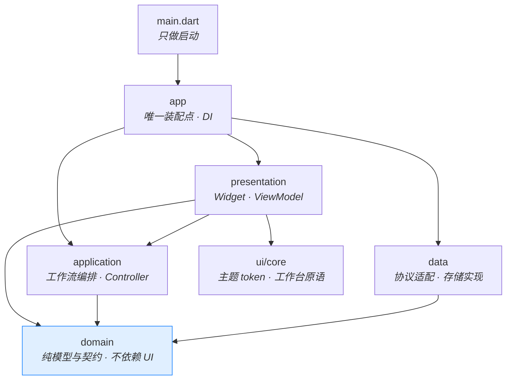
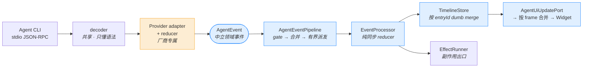
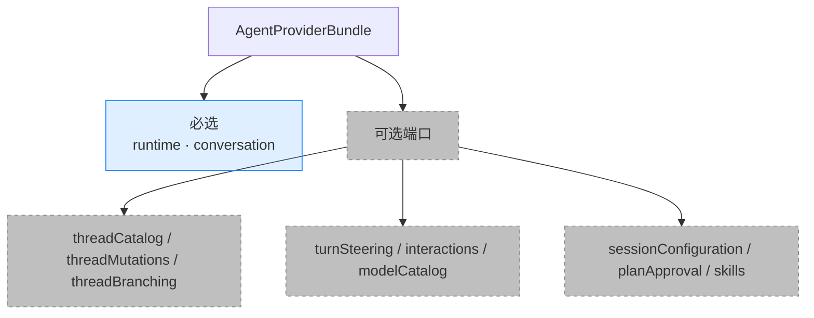
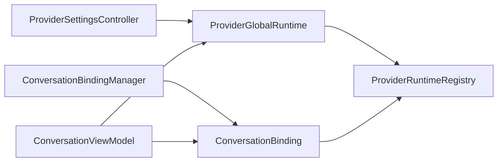
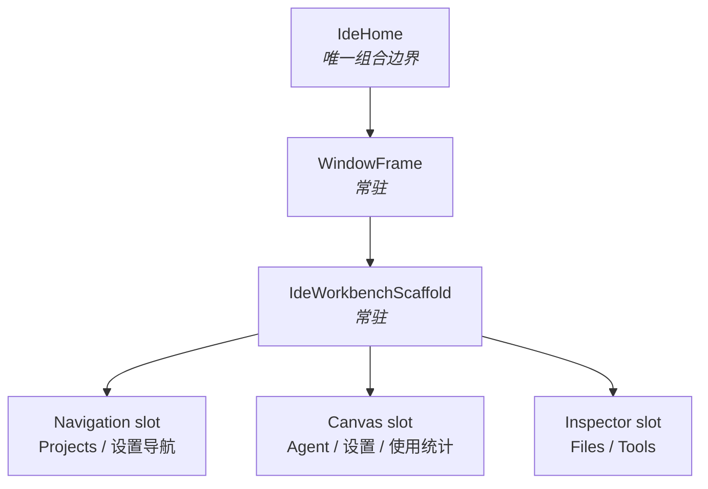

# 架构总览

中文 ｜ [English](./overview.en.md)

面向第一次读这个仓库的人。目标是让你在十几分钟内建立整体心智模型，知道该去哪一层改代码。

想查具体名词的定义，看[术语表](../guides/glossary.md)。想看完整规则和不变量，看[设计文档](./design_document.md)与[工程规范](./engineering_standards.md)。

## 一句话概括

Zeta 是一个**桌面壳层**：它不含模型，也不实现编辑器。它把本机已有的 Agent CLI 拉起来，把对方的私有协议翻译成一套中立的领域事件，再把这些事件渲染成可审计的时间线。

当前活跃 Provider 是 Codex app-server（默认）、Grok ACP 和 Claude Code stream-json；Cursor 已退役。Claude Code 的协议基线见[这里](../protocols/claude_code_stream_json_protocol.md)。

所以整个架构的中心问题只有一个：**怎么让不同 Provider 的协议差异不污染共享代码。** 你在文档里看到的大部分约束，都是从这个问题推导出来的。

## 分层



**依赖是单向的，箭头不能反着画。** 最关键的一条：`domain` 是纯的——里面没有 Flutter、没有 `dart:io`、没有任何 Provider 的协议字段。任何时候你想在 domain 里 import 一个 Codex 的类型，都说明放错层了。

代码按 feature 切分，每个 feature 内部再分这四层：

```
lib/src/features/<feature>/
├── domain/         模型、契约、纯规则
├── application/    controller、工作流编排
├── data/           协议适配、存储实现
└── presentation/   Widget、ViewModel
```

现有 feature：`agent`（Provider 抽象与对话）、`agent_management`（CLI 检测与诊断）、`desktop_notifications`、`ide_session`（会话恢复）、`project_threads`、`settings`、`usage_statistics`、`workspace`（文件树）。

**新代码进对应 feature，不要回到顶层宽泛目录。**

## Agent 事件管线

这是全项目最需要理解的一条链路。CLI 吐出的原始通知，要经过这些环节才变成屏幕上的一行字：



橙色的只有一格。**那格之后的所有东西都必须是 Provider 无关的**，这是整条链路的设计意图。

分工可以这样记：

| 环节 | 负责 | 明确不负责 |
| --- | --- | --- |
| decoder | 协议语法、传输生命周期 | 任何 Provider 分支 |
| **Provider adapter / reducer** | 厂商字段兼容、entryId 归属、分段、去重、终态判定、完整文件变更快照 | 把没想清楚的语义丢给下游猜 |
| Pipeline | 订阅作用域、事件合并、有界派发 | 业务语义 |
| Processor / reducer | 状态迁移、时间线变更描述 | 异步、Flutter 调度 |
| TimelineStore | 同 entryId 更新、异 entryId 新建 | 推断、改写 id |
| UI | 渲染 | 解析协议 |

三条最容易违反的规则：

1. **Provider 的 `sourceItemId` / `sourceMessageId` 只是 metadata。** entryId、消息分段、推理阶段、去重、终态，全部由该 Provider 自己的 adapter/reducer 决定。TimelineStore 只做无脑合并，它不猜。
2. **reducer 必须纯同步。** 不许出现 `Timer`、`Future`、Flutter scheduler 或外部回调。所有副作用走 EffectRunner，由它做作用域校验。
3. **live / history / replay 用各自独立的 reducer 实例。** 共用会串味。
4. **文件变更只展示 Provider 给出的 typed 证据。** 替换片段、写入内容和 unified patch 保持各自语义；只有命令时继续显示命令卡，不解析命令或当前工作区去编造 diff。

`AgentFileChangeSnapshot` 是 Provider 在进入共享管线前完成的完整累计快照。Store 只机械替换，
UI 只按 evidence 类型渲染；Codex 的 turn aggregate 是显式 `liveOnly` fallback，不能冒充可恢复
历史，也不能与后到的 tool-scoped 证据双显。

新增或修改 `AgentEvent` 之前，要逐项走完[开发者文档 §7](../guides/developer_guide.md) 的 16 条接入清单。

## Provider 能力协商

Zeta 不假设所有 Agent 能力相同。每个 Provider 通过 `AgentProviderBundle` 暴露一组端口，必选的只有两个：



**UI 按 capability 渲染，绝不按 provider 名字硬编码。** 端口缺失或 `capability = false` 时，对应入口根本不会出现在菜单里；应用层误调用会抛 `UnsupportedError`——**不允许静默成功**，因为静默成功会让用户以为操作生效了。

Bundle 是严格边界：它和 `AgentRuntimePort` 不提供取回原始 `AgentProvider` 的通道；
ViewModel 只持有中立端口。

这也是"新增 Provider 不用改共享层"的底气所在。正常的接入范围是：

```
自有 data 文件  +  中立 domain 契约  +  factory 组合  +  契约测试
```

如果你发现非改共享层不可，先停下来开个 Issue——那通常意味着抽象没做对。

## 会话 Binding 与 Provider 生命周期

Provider 进程不会由 Pane 或 ViewModel 直接持有：



- Registry 是实例和子进程的唯一所有者；global runtime 每个 Provider ID 一个，永不空闲回收。
- Binding 以 draft/thread key 唯一代表一个逻辑会话，并独占 session runtime、事件 generation、单会话权限快照和活跃操作；权限状态不再使用跨会话注册表。
- Workspace 创建 entry 时一次性组合匹配的 thread summary、Binding 与 ViewModel；一个 ViewModel 的 thread 身份固定，只能更新 project/file context，切换 thread 必须选择另一个 entry。
- 新建草稿、打开 thread、读取历史/模型/Skill 不启动 session runtime；只有首次提交调用 `beginTurn()`。
- 已绑定真实 thread 的 Binding 不会原地改绑；fork 返回的新 session 按新建 thread 登记到列表，再由 Shell 复用标准选择流程创建独立 Entry/Binding，之后的历史、重命名、发送都基于新 thread。
- cancel、steer、审批回写等迟到操作只能 `runCurrent()`，runtime 已回收时 fail-closed。
- Manager 每分钟 single-flight 扫描；没有 turn/RPC 且空闲满 10 分钟才按精确 identity 回收。旧进程未 dispose 完前同会话不能启动新进程。
- Registry 获取 runtime 时必须显式选择 global/session scope；模型选择与用量等共享功能只消费中立端口，其中用量面板固定走 global runtime。

## 三种审批，别搞混

这是新人最容易踩的坑。看起来都是"弹个卡片让用户点"，但它们是**三种独立的领域语义**，不共享 request/decision 模型：

| 类型 | 谁发起 | 语义 |
| --- | --- | --- |
| **权限审批** | Provider | 要执行命令 / 写文件 / 联网，请你授权 |
| **用户提问** | Provider | 我需要你回答一个问题才能继续 |
| **Plan 审批** | Provider | 请你批准这份计划 |

还有第四种，但它**不属于**上面任何一种：

- **Plan 执行交接**——这是 Zeta 自己的本地工作流。Plan 回合成功结束后，Zeta 问你"要执行吗"。点执行会**新建一个显式的 Default 回合**，并且**不预授权计划里提到的任何命令、文件或网络操作**。执行卡默认恢复进入 Plan 前仍有效的权限；若上下文或选项失效，则回到 Provider 声明的保守默认，并允许用户只为本次执行改选。

最后这条经常被误实现成"把当前回合 steer 一下"或者"调 planApproval 端口"，两种都是错的。

## 工作台 UI



页面切换只换 slot 内容，`WindowFrame` 和 `IdeWorkbenchScaffold` 始终是同一个 Element。**feature 页面不得替换顶层 workbench。**

跨页面保活用 `IdeRetainedPageView`，不用 `IndexedStack`（后者会一直保留长时间线的布局开销）。时间线用 `SliverList.builder` 虚拟化，流式回合、代码高亮和文件变更证据区域各自加 `RepaintBoundary`。

禁止 post-frame 测量、`GlobalKey` 查高、layout 后 `setState` 反馈环——这些都会在长时间线上产生可见的抖动。

主题方面：`shadcn_flutter` 只能 `as sf` 导入，所有语义色走 `IdeThemeScope` / `IdeColors.of(context)`。业务代码里不许出现裸 `Color(0x...)`、手写 `BoxShadow` 或临时 `BorderRadius.circular(...)`。

## 持久化

Zeta 自己的数据全在 `~/.zeta/`：

```
config/   providers.json · appearance.json · general.json
state/    ide_session.json · usage_statistics_index.json · migration_marker.json
logs/     zeta-YYYY-MM-DD.log
cache/    agent_models_v1.json
```

三条硬性要求：

- **JSON 必须版本化 + 宽容解码。** 缺字段、损坏、旧版本都不能阻断启动。
- **Provider 私有数据只在自有 data adapter 中读取。** 协议字段、原始正文和私有路径不进入上层；读取权限不自动授权迁移、改写或删除。
- **派生索引只存白名单字段。** 禁止落盘 prompt、回复正文、工具输出、文件变更 evidence 正文、原始错误文本、环境变量、凭证或 Provider raw payload。

feature store 也不得在 presentation / application 里自己拼 `File('~/.zeta/...')`——具体文件由 `lib/src/app` 注入。

用户视角的文件清单和清理方法见[故障排查与数据说明](../product/troubleshooting.md#zeta-在你电脑上存了什么)。

## 想改点东西，从哪下手

| 你想做的事 | 主要涉及 |
| --- | --- |
| 调整时间线某种卡片的外观 | `features/agent/presentation` + `ui/core` token |
| 修某个 Provider 的流式显示异常 | 该 Provider 的 `data/` adapter / reducer |
| 接入或修复 Provider 文件变更证据 | 该 Provider 的 `data/` tracker + 中立 domain/presentation；共享 Store 只机械透传 |
| 加一个 Provider 已支持但 UI 没露出的能力 | domain 端口与 capability → application → presentation |
| 接入一个全新的 Agent CLI | 新建 `data/` 实现 + factory 组合 + 契约测试 |
| 改文件树忽略规则 | `features/workspace/domain/workspace_directory_rules.dart` |
| 改持久化字段 | 对应 feature 的 `data/` + 版本化解码 + 迁移兼容 |

**动手前先读**：[贡献指南的架构红线](../../CONTRIBUTING.md#架构红线)是精简版；[工程规范](./engineering_standards.md)是完整版和评审门禁。
