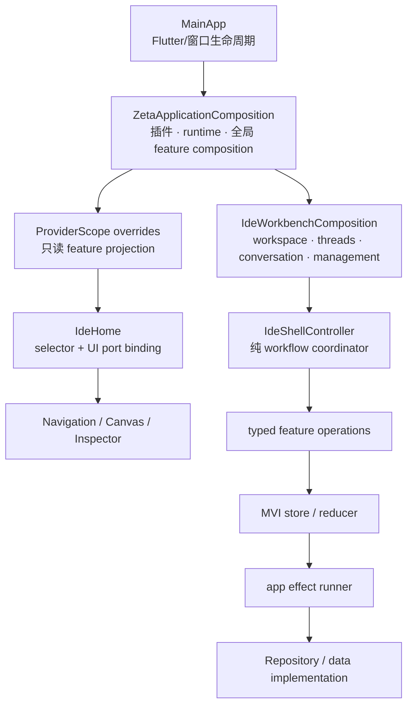

# Phase 4 执行计划书：删除剩余旧路径与过渡层

最后更新：2026-08-24

状态：**P4-0 / P4-1 / P4-2 / P4-3a 已关批（2026-08-24），下一批为 P4-3b**

> P4-0 的现状测绘、基线与安全网决策落在
> [`.workflow/refactor/2026-08-24-phase4-transition-cleanup/`](../../.workflow/refactor/2026-08-24-phase4-transition-cleanup/)。
> 本文 §2 的清单已按该次实测校正，下面标注实测值的地方以本文为准。

> 对应[目标架构 §14 Phase 4](./target_architecture_riverpod_mvi_plugins_packages.md#phase-4删除剩余旧路径与过渡层)。
> 本文是 Phase 4 的范围、顺序、删除边界与关批标准的权威源；Phase 0–3 文档只保留迁移证据。

---

## 0. 准入决定与风险接受

2026-08-24，用户明确要求忽略此前审计列出的剩余阶段证据并开始 Phase 4。该决定覆盖
原 Phase 4 前置条件中的下列项目：

| 原证据项 | Phase 4 口径 |
| --- | --- |
| Phase 2 连续 14 天真实使用证据 | `WAIVED`：未形成，不再阻塞开工或关批 |
| 旧格式迁移窗口、可构建 tag/分支 | `WAIVED`：未形成，不再阻塞开工或关批 |
| Windows/macOS/Linux + 三个真实 Provider smoke | `WAIVED`：未执行，不再阻塞开工或关批 |
| Windows Profile 与历史性能红灯复测 | `WAIVED`：未复测，不再阻塞开工或关批 |

`WAIVED` 不是 `PASS`。后续文档不得把这些证据写成已通过，也不得在 Phase 4 关批时
重新把它们变成隐含门禁。

准入豁免只改变阶段治理，不授权破坏用户数据。持久化向后读取、旧 Provider wire 宽容
解析及其测试继续保留，见 §4。

---

## 1. 目标、非目标与执行原则

### 1.1 目标

1. `MainApp` 只管理 Flutter/窗口生命周期和组合输入；feature data、runner、store 由显式
   app/workbench composition 创建和反序释放。
2. `IdeHome` 只组合 Workbench slot、绑定 UI 端口并消费 feature selector；不构造
   Repository、data implementation 或 feature controller。
3. `IdeShellController` 只编排跨 feature workflow，不继承 `ChangeNotifier`，不承担全页
   rebuild 广播，也不创建 feature owner。
4. presentation 不取得或调用 Repository；异步 IO 只经 typed operation/effect runner。
5. 删除剩余的 ViewModel/slice 过渡 binding、callback facade、旧别名、死 flag、过渡
   re-export 和测试兼容工厂，只留下当前单一路径。
6. 把所有历史燃尽 allowlist 改成目标态零容忍守卫，并让当前文档只描述一套架构。

### 1.2 非目标

- 不新增功能，不改变 UI、Provider capability、wire 参数或产品语义；
- 不修改 `AgentEventPipeline`、TimelineStore 合并语义、entry identity、G5 四种审批或
  Binding/runtime generation；
- 不升级 Flutter、Riverpod、shadcn 或 Provider CLI 基线；
- 不新增 Package、状态框架、代码生成器或依赖注入容器；
- 不修改持久化 schema/version，不删除旧数据或协议的向后读取；
- 不执行已在 §0 豁免的长时观察、真实平台 smoke、Profile 或发布锚工作。

### 1.3 直接目标态原则

- 不新增 feature flag、compatibility factory、双写 owner 或新旧 UI 双轨；
- 每批在同一批次内完成调用迁移和旧符号物理删除；
- 回滚只 revert 该批提交，不恢复运行时 fallback；
- 行为测试的断言不因重构放宽，只允许机械更换 wiring、类型名和 fixture builder；
- 一次只处理一个高风险桥，Conversation 与 Shell 不在同一提交中重接。

---

## 2. 当前基线

### 2.1 已经达到目标态的部分

| 项目 | 当前状态 |
| --- | --- |
| Phase 3 feature flags / false-path | 生产代码为 0 |
| Provider compatibility/default factory/core 内置目录 | 生产代码为 0 |
| application → presentation、application Flutter、domain impurity | 守卫燃尽清单均为 0 |
| Package 反向依赖与外部依赖例外 | `_knownEdgeViolations` / `_knownExternalViolations` 均为空 |
| 跨已拆 Package 的 `/src` import | 零容忍守卫已存在，当前为 0 |
| root `ZetaStateSnapshot` | 按需只读，无 listener/provider，生产 Widget 当前未订阅 |
| `zeta_agent_core` | 纯 Dart，无 Flutter SDK/import |

### 2.2 剩余删除面

| 类别 | 当前证据 | Phase 4 目标 |
| --- | --- | --- |
| Shell 全局通知桥 | `IdeShellController extends ChangeNotifier`，20 条 `_notifyStateChanged()` 通知路径汇到 1 处 `notifyListeners()`；`IdeHome` 用 20 处 `setState` 消费 | UI 改用 feature selector/定向 listener，Shell 变纯 workflow coordinator |
| 分散装配 | `MainApp`、`IdeHome`、Shell 直接创建 data/repository/composition | 统一移入 app-owned composition，Widget 只接收当前 operations/state |
| Project Threads 过渡桥 | `ProjectThreadsController` → `ProjectThreadsSliceRunnerAdapter` → store | effect runner 直接执行业务副作用并 typed 回流 store，删除 controller/adapter |
| Repository 泄漏 | `AgentProviderSettingsPort.modelCatalogRepository` 被 ViewModel 直接调用；usage operations 暴露 repository getter | presentation 只见窄 operations/effect，Repository 只在 composition/runner/data |
| Conversation 过渡 binding | `AgentConversationSliceBinding` 在 ViewModel region source 与 slice effect 之间双向接缝 | composition 直接连接 slice owner 与窄 command/region port，删除过渡 binding；保留 ViewModel 作为中立命令/typed-listenable facade |
| callback seam | `sessionLoader/sessionSaver`、`CallbackIdeSessionStore`、`CallbackWorkspaceFileCorpusPort` 等仍参与生产装配 | 改为 typed store/corpus/composition 注入，同批删除 callback 路径 |
| 旧别名与 re-export | `agentViewModel`、`renderRevision`、`rawPayload` 空参数、`mutedText`、`codexUsageSourceId` 等 | 迁移调用后物理删除 |
| 测试过渡层 | `LegacyBundleFactoryMixin`、空燃尽 allowlist、带 Phase/batch 名的永久守卫 | 改为当前 bundle builder 和永久零容忍 guard |
| 文档漂移 | 部分总览/规范仍描述旧 Provider facade、旧目录或“尚未准入” | 当前入口只描述目标态；历史文档明确标为迁移证据 |

### 2.3 零调用候选

P4-0 已在 `dev` @ `e5cb9273` 上逐个复核，结论如下（生产调用者一律为 0，直接删除，
不为其建立新适配层）：

- `IdeShellController.agentViewModel` —— 生产 0 / 测试 0；
- `CallbackAgentProviderConfigStore` —— 生产 0 / 测试 0；
- `CallbackAppearanceSettingsStore` —— 生产 0，**测试 1**（`appearance_settings_store_test.dart`），同批删；
- `codexUsageSourceId` —— 生产 0 / 测试 0；
- `AgentThreadSummary.displayTitle` —— 生产 0 / 测试 0。**注意同名歧义**：全库
  `displayTitle` 的其余命中属于 `AgentToolCallUiText.displayTitle` 与 Grok history
  reader 的私有 getter，都是活路径，不得按名字批量删；
- model selection/ViewModel 的 `selectServiceTier` 兼容入口 —— 外部调用 0，
  仅 ViewModel→controller 一跳，整条链删；
- 过渡 re-export 三处：`agent_conversation_view_model.dart:33`、
  `agent_provider_config_store.dart:9`、
  `settings/application/settings_slice/appearance_settings_slice_state.dart:7`
  （`lib/src` 全库仅 4 条 `export`，第四条 `app_localizations_x.dart` 保留）；
- `kIdeUseAnchoredDynamicSliver`（`const bool = true` 死 flag）—— 生产 0 / 测试 0；
- `buildIdeVirtualSliver` fallback helper —— 生产 0，**测试 1**
  （`ide_dynamic_sliver_list_test.dart`），同批处理。

---

## 3. 目标结构与生命周期



| 资源 | 创建者 | 消费者 | 释放者 |
| --- | --- | --- | --- |
| plugin catalog / runtime registry | `ZetaApplicationComposition` | Provider/global runtime ports | `ZetaApplicationComposition`，runtime 先于 plugin |
| settings/provider/usage/attention/session composition | `ZetaApplicationComposition` | ProviderScope + Workbench | 同一 composition 反序释放 |
| workspace/project threads/conversation/management composition | `IdeWorkbenchComposition` | Shell + IdeHome selectors | `IdeWorkbenchComposition` 反序释放 |
| `IdeShellController` | `IdeWorkbenchComposition` | UI commands / cross-feature workflow | composition；不再释放注入的 feature owner |
| UI callback（toast、attention activation、菜单） | `IdeHome` 绑定到显式 relay/port | app/workbench workflow | `IdeHome.dispose` 解绑 |
| root snapshot reader | composition 提供同步 reader | 诊断/恢复测试 | 无订阅；composition 释放时解绑 |

组合对象是显式依赖聚合，不是 service locator：业务代码不得持有 `ProviderContainer`，也
不得从全局单例寻找 Repository。

---

## 4. 明确保留的兼容边界

以下内容即使名字包含 `legacy`、`migration` 或 `compatibility` 也不属于架构双轨，Phase 4
不得按关键词删除：

- `ZetaStorageMigrator`、`LegacyZetaPreferences` 与迁移 marker/audit result；
- Provider permission V1→V2 migration registry、codec 和脱敏 fixture；
- Usage Statistics 旧 index decoder 与幂等迁移；
- IDE Session 旧 JSON 字段的宽容读取；
- Codex/Grok/ACP/Claude Code 的历史 wire alias、旧 payload/history parser；
- `AgentConversationComposerStateOwner`、`ProjectThreadsStateOwner`、`MenuActionBridge`；
- 当前 bundle/capability、行为、生命周期、隔离、性能和 root snapshot 守卫。

判断规则：外部数据/wire 的**向后读**保留；内部代码装配/UI owner 的**双路径**删除。若某
候选同时满足两者，先保留读取端，把写入/运行时入口收成单一路径。

---

## 5. 执行批次

依赖顺序固定为：`P4-0 → P4-1 → P4-2 → P4-3 → P4-4 → P4-5 → P4-6`。前一批未关批
不得进入下一批；每批独立提交和 review。

### P4-0：范围冻结与安全网

**风险：低；生产行为变化：0。**

- 建立 `.workflow/refactor/2026-08-24-phase4-transition-cleanup/`，按重构流程记录现状测绘、
  安全网、每批执行和等价性验收；长期事实仍只写本文；
- 固定 §2 删除/保留清单，记录每个候选的生产/测试调用者；
- 运行完整基线并记录根测试、Package 测试、架构守卫与行为基线；
- 新增 Phase 4 守卫时先证明它能命中当前待清理面，再随对应批次反转为零容忍。

**关批**：只有文档/测试安全网变更；完整门禁绿；没有把待删符号加入新的永久 allowlist。

**执行结论（2026-08-24，已关批）**

基线：`dart format` 0 改写 · `flutter analyze` 无 issue · 根测试 **2371 passed** ·
五个内部 Package analyze 全绿、共 **74 passed** · `tool/test_full.sh` **exit 0**。
本批未改动任何 `lib` / `packages` / `test` 代码。

上面最后一条（守卫先命中再反转）在执行中被证明**在单批内不可满足**：能命中当前
待清理面的守卫在本 commit 上必然是红的，要让它绿就得配一份写着待删符号的
allowlist，而这与本批关批标准和 §1.3 直接冲突。**据此确定后续各批的守卫办法**：

1. 零容忍守卫由**对应批次**编写，与该批删除动作同一提交，不带 allowlist；
2. 关批前做 **mutation check**——临时把该批删掉的某个符号加回去，确认守卫变红后撤销；
3. mutation check 结论（mutate 了哪个符号、哪条守卫变红）记进该批执行记录；
4. 高风险批 P4-3b / P4-4 / P4-5 的 mutation check 由 §6 的独立 reviewer 复查。

顺带修复了一处证据链缺陷：`tool/test_full.sh` 与 `tool/test_shard.sh` 把 `pwd` 推导的
MSYS 路径以 `json:/d/...` 形式传给 `flutter test --file-reporter`。MSYS 只自动转换
**以 `/` 开头**的参数，该形式不在转换范围内，Windows 版 `flutter` 无法解析便静默
不写报告，随后的耗时摘要一直读的是上一次的旧文件。两个脚本现在在 `cygpath` 可用时
先转原生路径（Linux/macOS 与 CI 行为不变）。

### P4-1：零调用与机械过渡 API 清理

**风险：低到中；目标：先缩小后续改动面。**

- 删除 §2.3 的零调用符号、死 virtual-list flag/helper；
- ~~`rawPayload` 空参数的全部传递点改为当前 logger 结构摘要 API~~ —— P4-0 实测
  `rawPayload: {}` / `rawPayload: null` 在 `lib` / `packages` / `test` 均为 0 命中，
  该项**已无待办**，只需在关批时保留零值检查；
- Timeline 统一使用 `contentRevision`，删除 `renderRevision` ctor 字段/getter/fallback；
- `mutedText` 调用迁到 `textSecondary` 后删除历史别名；
- 删除无调用的 app dependency provider/helper；有真实读取者的 provider 保留；
- 行为/缓存/性能测试改用目标字段，删除只证明别名存在的断言。

**关批**：旧符号 `rg` 为 0；Timeline 内容/meta revision 行为、virtual list 与三 Provider
ignored-message 脱敏测试保持通过。

**执行结论（2026-08-24，已关批）**

九个过渡符号（`agentViewModel` / `CallbackAgentProviderConfigStore` /
`CallbackAppearanceSettingsStore` / `codexUsageSourceId` / `selectServiceTier` /
`kIdeUseAnchoredDynamicSliver` / `buildIdeVirtualSliver` / `renderRevision` /
`mutedText`）、`AgentThreadSummary.displayTitle`、3 条过渡 re-export 与 3 个零读取者
Riverpod provider 已物理删除。`lib/src` 现在只剩 `app_localizations_x.dart` 一条 `export`。
新增零 allowlist 守卫 `test/src/architecture/deleted_transition_api_guard_test.dart`
（不带阶段命名），mutation check 已验证其会红。

门禁：根测试 **2371 passed / 0 failed**，五个 Package analyze + test 全绿。
用例数与基线持平且账目可核：基线 2371 − 删除 2 条用例（都是只证明被删符号存在的）
+ 守卫新增 2 条 = 2371。

**本批触发过一次停线**：删 `renderRevision` 动到 G1 冻结文件
`agent_conversation_timeline_store.dart`，T18 基线守卫按设计拦下。已按守卫要求停线取得
明确批准后刷新基线，边界记录在该守卫的文档注释与
`.workflow/refactor/2026-08-24-phase4-transition-cleanup/05-执行记录.md` §5。
改动是纯删除（ctor 参数 / final 字段 / 转发 getter / snapshot 传参各一处），
合并语义、entryId 身份与 Provider 分支未触碰。

`zetaClockProvider` / `zetaMetricsPortProvider` / `requiredDependency` 生产读取者虽为 0，
但**留给 P4-2** 与 app composition 重建一并决定，避免删了再建。

> ⚠️ 后续批次注意：本批发现 GNU grep 的 `\b` 在符号紧邻中文全角标点时**不匹配**
> （Dart `RegExp` 会匹配），`renderRevision` 因此在测绘时被少数了一处。
> 销账以 Dart 守卫为准，用 grep 复查时不要带 `\b`。

### P4-2：App / Workbench 组合根目标化

**风险：中高；目标：presentation 不再创建 data。**

- 建立 `ZetaApplicationComposition` 和 `IdeWorkbenchComposition`（最终命名可在批次设计中
  微调，但职责不得回到 Widget）；
- 把 `MainApp` 中 session/config/cache/context/notification/plugin/runtime 的具体构造分支
  移入 app composition/factory；
- 把 `IdeHome` 中三个 Agent Management Repository 和 management composition 的创建移入
  Workbench composition；
- `MainApp.sessionLoader/sessionSaver` 改为 typed `IdeSessionStore` 或 composition input，机械
  迁移测试后删除 `CallbackIdeSessionStore` 生产路径；
- Workspace composition 暴露只读 corpus port，删除 Shell 创建的
  `CallbackWorkspaceFileCorpusPort`；
- 生命周期由 composition 统一反序释放，Shell/Widget 不释放注入 owner；
- UI 依赖的 toast/attention/menu callback 通过显式 relay/port 绑定。

**关批**：`lib/src/ui` 不 import/构造 feature data/Repository；`MainApp` 不直接 new feature
data/controller；现有启动、恢复、窗口关闭和资源反序释放测试全绿。

**执行结论（2026-08-24，P4-2a 已关批）**

本批按止损线 S6 拆成 **P4-2a / P4-2b / P4-2c**：一批同时动 6 个 feature 的 data 面
超出了单批边界（拆批理由与三批范围见
`.workflow/refactor/2026-08-24-phase4-transition-cleanup/04-目标态与步骤.md` §7）。

**P4-2a（已完成）**：新增 `ZetaHostMode` 与 `ZetaApplicationComposition`，
`MainApp` 的 13 个 feature data 构造调用全部移出；`sessionLoader`/`sessionSaver`
换成显式 `hostMode` + typed `ideSessionStore`；删除 `CallbackIdeSessionStore`。
门禁 exit 0、根测试 2378 passed / 0 failed。

> ⚠️ **本批推翻了计划书原文的一处要求。** 原文写「`sessionLoader`/`sessionSaver`
> 改为 typed `IdeSessionStore`」——照字面做会出事：这对回调实际是个隐式的宿主模式
> 开关，除注入 session store 外还控制**持久化是否落盘、是否探测本机 CLI、是否读取
> 本机用量历史**三件事，字面迁移会让后三者静默失效，widget test 将开始写用户真实的
> `~/.zeta` 并扫描本机。这四重语义此前**零测试覆盖**，已先补 characterization test
> 单独提交（`03-安全网.md` §7），再做结构改动。

**P4-2b（已完成）**：新增 `IdeWorkbenchComposition`，接管 `IdeHome` 的 3 个 Agent
Management Repository 与 management composition。`lib/src/ui` 的 data import 与
`Repository(` 构造**双双归零**，§7.2 那条检查首次真正无输出。门禁 exit 0、
根测试 2379 passed / 0 failed。

> 该组合目前只拥有 Agent Management 一块；§3 目标态要求它还拥有 workspace /
> project threads / conversation 三块 composition，那些仍由 `IdeShellController`
> 构造函数创建，属 P4-2c / P4-5，**P4-2 整体尚未完成**。

**P4-2c（已完成）**：新增 `WorkspaceSliceFileCorpus`，`WorkspaceSliceComposition`
暴露只读 `fileCorpus`；Shell 的 20 行闭包收成一行消费，
`CallbackWorkspaceFileCorpusPort` 移出生产代码（落到 `test/src/testing/`）。
门禁 exit 0、根测试 2379 passed / 0 failed。

> 本段"UI 依赖的 toast/attention/menu callback 通过显式 relay/port 绑定"这条要求
> **比实际待办面大**：attention 早已是 `DesktopAttentionTargetActivatorRelay`；
> `MenuActionBridge` 在 §4 被明确列为保留项（与本条要求冲突，以 §4 为准）；
> toast 的 `statusReporter` 已经是 `IdeShellStatusReporter` typedef 端口而非裸闭包。
> 三者本批均无需改动。

**P4-2 整体已关批。** 目标架构 §3 要求 `IdeWorkbenchComposition` 还拥有 workspace /
project threads / conversation 三块 composition——它们仍由 `IdeShellController`
构造函数创建，那属 **P4-5**（"Shell 构造函数只接收 prebuilt ports，不创建 feature
composition"），不是 P4-2 的遗留。

`zetaClockProvider` / `zetaMetricsPortProvider` / `requiredDependency` 三个 P4-1
顺延项**决定保留并结案**：生产读取者虽为 0，但 `app_dependencies.dart` 是文档化的
"组合根 + 覆盖点"契约且有专测，删它属于收窄既有扩展点，不在 §1.2 的 Phase 4 范围内。

### P4-3：Repository 与 Project Threads 边界收口

**风险：中高；拆为两个独立提交。**

**P4-3a Repository operations**

- 从 `AgentProviderSettingsPort` 删除 `modelCatalogRepository`；
- 把模型目录 load/record/prewarm 收进 typed operations/effect runner，ViewModel 不再触达
  Repository；
- 删除 `UsageStatisticsOperations`、`AgentUsagePanelOperations` 及 store 上无必要的
  `repository` getter；
- presentation/UI 禁止 import、构造或调用 `*Repository`，app composition/runner/data 是唯一
  允许位置。

**执行结论（2026-08-24，P4-3a 已关批）**

`AgentProviderSettingsPort.modelCatalogRepository` 已删，换成 `recordModelCatalog` /
`loadModelCatalog` 两个 typed 操作（后者顺带把 `source` 解析收进端口内部）。
`lib/src/features/*/presentation` 与 `lib/src/ui` 的 `Repository` 引用**双双为 0**。
门禁 exit 0、根测试 2380 passed / 0 failed。

> **对"删除 store 上 repository getter"的一处收窄执行**：`UsageStatisticsOperations`
> 与 `AgentUsagePanelOperations` 上的 getter 已删（那是 presentation 面）；
> 但两个具体 `*SliceStore` 上的同名 getter **有意保留**——
> `ide_shell_controller_test.dart:72,76` 用它断言组合层接的是哪个 Repository 实现，
> 而 composition 的两个 runner 是私有字段，删掉就再无路径验证这条接线。
> 原文的限定词是"**无必要的**"，这两个有必要。

> `IdeHome` 最后 3 处 Repository 引用（只是转交参数）通过新增
> `IdeWorkbenchCompositionFactory` 消除：app 层把 Repository / registry /
> providerSettings / 文本目录闭包进工厂，UI 只补 Shell 派生的两个入参。

**P4-3b Project Threads runner**

- 把 Provider 查询、capability 校验、防抖、分页和写操作搬进直接的
  `ProjectThreadsSliceEffectRunner`；
- `ProjectThreadsSliceStore` 继续是唯一状态/operations owner，`ProjectThreadsStateOwner` 继续
  作为 typed result 回流端口；
- 删除 `ProjectThreadsController`、`ProjectThreadsSliceRunnerAdapter` 与 composition 的
  controller 字段；
- controller 行为测试迁为 runner/store 契约测试，分页、防抖、stale result、失败路径断言
  不得减少。

**关批**：presentation Repository 引用为 0；Project Threads 旧 controller/adapter 为 0；
现有 pagination、rename/archive/delete/fork、两 Provider 聚合和 session restore 行为全绿。

### P4-4：Conversation ViewModel/slice 过渡 binding 清理

**风险：高；不得与 Shell 批同时修改。**

- 保留 `AgentConversationViewModel` 作为工程规范定义的中立命令/typed-listenable facade；
- 由 Conversation composition 直接拥有并连接 `AgentConversationSliceStore`、region source 与
  command port，删除 `AgentConversationSliceBinding` 的 ingress/egress 过渡层；
- UI 继续只消费 slice selector；命令继续走 Intent → Effect → typed command port；
- 清理只为旧 binding 暴露的 region listenable/registry API；
- 不改变 live/history/replay reducer 实例、frame scheduler、EffectRunner、Binding lease 或
  runtime generation。

**关批**：`AgentConversationSliceBinding` 和旧 region UI 直连为 0；两 thread 隔离、
UiEffect exactly-once、canonical signature、流式重建预算、审批/提问/Plan wire 行为全绿。

### P4-5：Shell ChangeNotifier 桥清零

**风险：高；在 P4-4 稳定后执行。**

- Shell 构造函数只接收 prebuilt operations/store/ports，不创建 feature composition；
- `IdeHome` 使用 Workspace、Project Threads、Conversation Workspace、IDE Session、Agent
  Management 的 selector/定向 `ref.listen`，不再监听整个 Shell；
- 首页预热、Desktop Attention 可见性和 pane 宽度同步改为对应 slice/typed effect 触发；
- Agent Management runtime source 改为纯 Dart subscribe port，不再把 Shell 当 Flutter
  `Listenable`；
- 删除 Shell 的 `ChangeNotifier` 继承、Flutter foundation import、`notifyListeners`、
  `_notifyStateChanged` 和兼容 `agentViewModel` getter；
- Shell 只保留跨 feature workflow 方法、恢复/保存编排与命令级错误上报。

**关批**：`lib/src/app/shell` 的 `ChangeNotifier|notifyListeners` 为 0；`IdeHome` 无 Shell
全量 listener/setState；Shell 测试改为命令结果和 feature state 断言，Workbench 保活/恢复
行为不变。

### P4-6：测试接缝、永久守卫与文档权威化

**风险：中；只在生产路径单一后执行。**

- `LegacyBundleFactoryMixin` 替换为显式 typed test bundle builder/factory，保留全部行为测试；
- 删除 `feature_layering_guard_test.dart` 三个空 known 集合和“只减不增”脚手架；
- 把 `package_boundary_candidate_graph_test.dart` 改为永久 Package DAG 守卫，删除空 violation
  allowlist，并校验各内部 Package `pubspec.yaml` 的精确依赖；
- 扩大 root snapshot 守卫到全部生产 Dart 文件；
- 新增 UI/presentation→data/Repository、Shell legacy owner、过渡 API 零容忍守卫；
- 将 `phase3_batch*` 命名的永久负向断言迁到当前架构 guard，保留保护面、不保留阶段命名
  （P4-0 实测：阶段命名只出现在**文件名**上，仅
  `test/src/architecture/phase3_batch5_architecture_guard_test.dart` 一个文件，
  文件内容无 `phase3_batch` 字符串）；
- 同步 `overview(.en)`、`engineering_standards`、`design_document`、`developer_guide`、
  `glossary(.en)`、`CONTRIBUTING(.en)`、`AGENTS.md` 和 `docs/README.md`；Phase 0–3 文档标为
  历史迁移证据；
- 纯重构不写 `CHANGELOG.md`。

**关批**：所有 guard 零 allowlist；当前入口只描述单一路径；中英文镜像一致；完整门禁和
§7 零符号检查全部通过。

---

## 6. Review 与回滚

每批至少做两轮 review：

1. **边界 review**：唯一 owner、依赖方向、Repository 可见面、生命周期和 dispose 顺序；
2. **行为 review**：命令参数、迟到结果、失败语义、持久化/wire 零变化、测试断言是否被
   弱化。

高风险 P4-3b/P4-4/P4-5 需要独立 reviewer 复查，并重点 mutation-check 对应架构守卫。

回滚只使用版本控制：

- 每个子批独立提交，问题只 revert 对应提交；
- 不恢复 feature flag、callback fallback、legacy bundle factory 或双写；
- 持久化 writer/schema 不变且 backward reader 保留，因此代码 revert 不需要数据降级；
- 若行为等价无法在当前批证明，停止该批并 revert，不把未完成接缝留在主线。

---

## 7. 验收矩阵

### 7.1 每个代码批次

开发循环使用定向/受影响测试；准备关批时按重构要求跑完整门禁：

```sh
dart format .
flutter analyze
bash tool/test_affected.sh
bash tool/test_full.sh
```

改到内部 Package 时，确认 `test_full.sh` 的 Package analyze/test 汇总同样全绿。

### 7.2 最终零符号检查

```sh
rg -n "conversationSliceEnabled|settingsSliceEnabled|providerManagementSliceEnabled|projectThreadsSliceEnabled|usageStatisticsSliceEnabled|workspaceSliceEnabled|ideSessionSliceEnabled" lib packages
rg -n "LegacyBundleFactoryMixin|legacy_bundle_factory_mixin|CallbackAppearanceSettingsStore|CallbackAgentProviderConfigStore" lib packages test
rg -n "knownApplicationToPresentation|knownApplicationFlutterImports|knownDomainImpurities|_knownEdgeViolations|_knownExternalViolations" test
rg -n "extends ChangeNotifier|notifyListeners|agentViewModel =>" lib/src/app/shell
rg -n "package:(zeta_foundation|zeta_plugin_kernel|zeta_agent_core|zeta_agent_providers|zeta_ui)/src/" lib
rg -n "^import .*features/.*/data/|Repository\\(" lib/src/ui
```

预期全部无输出。

> **不要**把倒数第二条的搜索范围扩到 `packages`。P4-0 实测那样会命中 322 行
> **包内自引用**（各包 import 自己的 `src/`，完全合法），造成假红。G6 禁止的是
> **跨包** `/src` 引用，当前实测为 0，其权威守卫是
> `test/src/architecture/package_boundary_candidate_graph_test.dart` 的 Package DAG
> 检查，不靠这条 shell 命令。正式 guard 还必须覆盖：

- application/domain 的 Flutter、Riverpod、Provider package 依赖为 0；
- UI/presentation 不 import feature data、不直接取得 Repository；
- root snapshot 不可订阅且生产 Widget 无 watch/listen/subscribe；
- Package DAG、manifest 内部依赖与跨包 barrel 精确匹配；
- 所有已删除 owner/facade/alias 不可重新引入。

### 7.3 必须保留并通过的测试

- Phase 0 behavior/streaming/scroll/自动化性能基线；
- Conversation 两 thread 隔离、UiEffect exactly-once、live/history canonical signature；
- Provider bundle/capability、runtime lifecycle、degraded/unknown/fail-closed；
- Project Threads pagination/debounce/stale/failure/write operations；
- Workbench restore、保活、pane 宽度、当前 Thread/草稿/滚动位置；
- ZetaStorage、permission、usage index、IDE Session 的 backward-read/migration；
- Codex/Grok/Claude Code 历史 wire/payload fixture；
- root snapshot、layering、Package DAG、privacy 和 G1–G8 架构守卫。

§0 的真实平台/长时/Profile 证据不在本阶段验收矩阵中。

---

## 8. Phase 4 完成定义

同时满足以下条件才可写“Phase 4 已完成”：

1. `MainApp`、`IdeHome`、Shell 不再直接创建 feature data/repository/controller；
2. Shell 无 `ChangeNotifier`/全量 rebuild，且只编排跨 feature workflow；
3. Conversation UI 的唯一状态路径是 slice；旧 ViewModel/slice binding 已删除，ViewModel
   只保留当前 command/typed facade；
4. presentation 无 Repository 可见面，Project Threads controller→runner 过渡桥已删除；
5. callback facade、过渡 re-export、旧别名、test legacy factory 与架构迁移 allowlist/
   bookkeeping 为 0；
6. root snapshot、Package DAG、分层和 deleted-symbol guard 均为零容忍且无 allowlist；
7. backward-read/wire compatibility 仍在且对应测试全绿；
8. 当前文档入口只描述一套架构，历史 Phase 文档明确标为证据；
9. `flutter analyze`、完整 root/Package tests、自动化行为/性能基线全部通过；
10. §0 项目仍如实标为 `WAIVED`，未被伪写成 `PASS`。

---

## 9. 目标架构 §15 门禁答卷

1. **唯一 owner**：各纯 Dart MVI store 不变；composition 只拥有生命周期，不复制状态。
2. **Intent/State/Effect**：不新增产品行为；仅把现有命令收窄为 typed operations/effects。
3. **边界类型**：raw Provider、文件、Flutter、Riverpod 类型不得越过既有稳定边界。
4. **生命周期**：app/workbench composition 创建并反序释放；Shell/Widget 不释放注入 owner。
5. **迟到结果**：沿用现有 `OperationId`、Binding identity/runtime generation 与 disposed guard。
6. **正文/频率**：不复制正文，不提高流式 publish/rebuild 频率；Shell 全量 rebuild 应下降为 0。
7. **缓存**：不新增缓存；model/timeline/markdown/usage cache 的 key 与失效策略不变。
8. **持久化**：白名单、schema version 与 writer 不变；backward reader 保留。
9. **删除/回滚**：同批迁移同批删除，无双写/flag；回滚 revert 独立提交。
10. **证据**：完整自动化行为/契约/架构/性能基线 + 零符号检查；外部证据按 §0 豁免。
