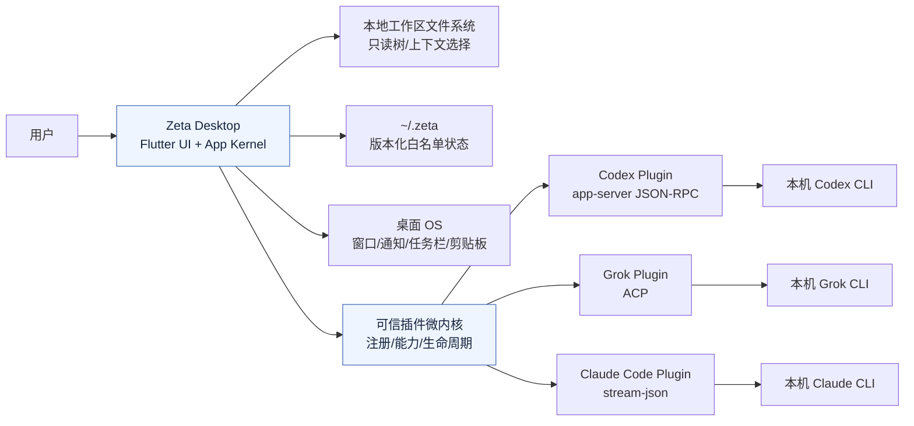
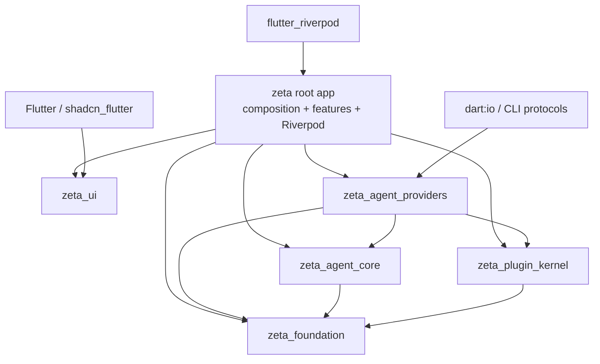
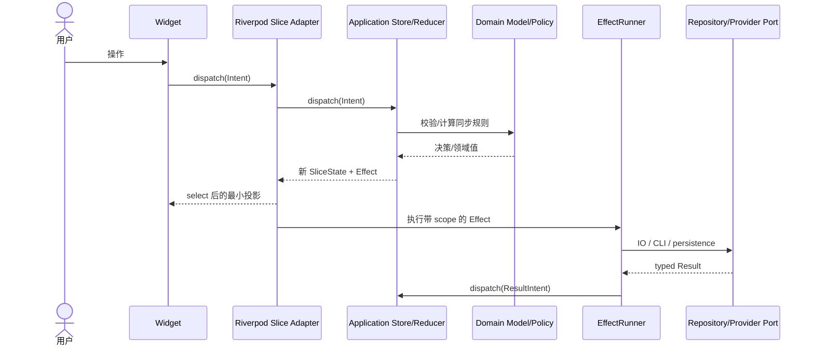

# Zeta 目标架构：Feature-First DDD、Riverpod、MVI、微内核与多 Package

最后更新：2026-08-21

状态：目标设计，待按 Phase 0–4 渐进实施

## 决策摘要

Zeta 采用一套组合架构，而不是并列维护四套框架：

- **Feature-First DDD** 定义业务边界、术语、数据所有权和端口。
- **MVI** 定义每个业务切片的输入、状态转移和副作用协议。
- **Riverpod** 负责应用装配、切片生命周期、依赖覆盖和细粒度 UI 订阅。
- **微内核** 负责可信、编译期插件的注册、能力、激活和隔离。
- **多 Package** 只强化稳定且高风险的边界，不按页面、团队或目录机械拆包。

核心取舍是：**逻辑上只有一棵应用状态树，物理上由各 bounded context 独立持有切片；Agent 原始流式事件不逐 token 写入全局 Riverpod 状态。** 现有 Provider-local adapter/reducer、`AgentEventPipeline`、背压、纯 reducer、`EffectRunner`、Binding 与 runtime generation 继续作为流式内核，Riverpod 只接收经过合并的轻量 UI 投影。

本设计是在 [AppFlowy 设计迁移决策矩阵](./appflowy_migration_decision_matrix.md) 的约束内，对用户明确选择的四个方向做**受控 Adapt**。它不采纳 AppFlowy 的 Rust/FFI、CRDT、全局 EventBus，也不复制其组织规模。

---

## 1. 架构目标和明确的非目标

### 1.1 目标

1. **单一事实来源**：同一业务事实只有一个 owner；UI、缓存和持久化都是明确投影，不互相回写。
2. **单向数据流**：`Intent → Store/Reducer → State + Effect → EffectRunner → Result Intent`，状态不能被 Widget、Repository 或插件旁路修改。
3. **流式可扩展且不卡 UI**：Provider 原始高频事件先在现有专用管线中解码、合并、限批和降频，再发布 Riverpod 切片。
4. **Provider 隔离**：新增 Provider 原则上只增加插件实现、app 组合和契约测试，不修改共享时间线、合并策略或其他 Provider。
5. **生命周期可证明**：plugin、global runtime、session runtime、Binding、feature store 和 UI Element 的所有者、scope、generation 与 dispose 顺序明确。
6. **边界可执行**：用 Package DAG、公开 API 和架构测试阻止 domain、Provider 协议、Flutter、Riverpod 与持久化细节越层。
7. **渐进迁移**：每个阶段可单独验收、回滚；迁移期间只有一个业务真源，不形成双写状态。
8. **适合当前规模**：只引入解决现有复杂度的抽象；每个新层必须能删除现有重复代码或建立可执行门禁。

### 1.2 非目标

1. 不建设第三方插件商店、动态下载、运行时代码加载或安全沙箱。
2. 不为不存在的多人协作引入 CRDT、OT、操作日志合并或协作服务器。
3. 不引入 Rust/FFI/Protobuf 跨语言核心；Zeta 仍直接适配本机 Agent CLI。
4. 不把所有状态塞进一个巨型 `AppState`/`AppNotifier`，也不让所有 Intent 经过一个全局 reducer。
5. 不用 Riverpod 接管 CLI 进程、Binding lease 或 runtime registry 的业务生命周期。
6. 不将每个 feature、页面或 Provider 立即拆成独立 Package。
7. 不在本轮改变 Provider wire 协议、`entryId` 语义、审批模型、时间线视觉或产品行为。
8. 不引入通用 Redux/MVI 框架、代码生成器或第二套依赖注入容器；先使用 Riverpod 与小型项目内契约。
9. 不实现云同步、账号同步、移动端状态同步或离线冲突解决。

---

## 2. 系统上下文图



上下文边界：

- Zeta 只拥有自身状态、运行时编排与 UI 投影，不拥有模型和 Provider 服务端状态。
- Agent CLI 是外部系统；其原始协议、配置和历史格式只能进入对应 Provider 插件的 data adapter。
- `~/.zeta` 只保存版本化白名单字段，不保存 prompt、回复、工具输出、patch、原始错误或凭证。
- 本设计中的“插件”是 Zeta 编译产物内的可信模块，不代表不受限的第三方代码。

---

## 3. 模块与依赖方向

### 3.1 目标 Package 图

目标只建立 5 个内部 Package；根 Flutter 应用继续保留，不立即迁到 `apps/`：

```text
zeta/                                  # 根 Flutter desktop app + app composition
  lib/src/app/
  lib/src/features/                    # 尚未稳定到需要物理拆包的业务 feature
  packages/
    zeta_foundation/                   # 纯 Dart 最小公共契约
    zeta_plugin_kernel/                # 纯 Dart 插件描述/生命周期/贡献注册
    zeta_agent_core/                   # 纯 Dart 中立 Agent domain + shared application engine
    zeta_agent_providers/              # CLI/协议/Provider-local adapter 与插件入口
    zeta_ui/                            # Flutter 设计 token、Workbench 与共享 UI 原语
```



禁止出现反向边：

- `zeta_foundation` 不依赖其他内部 Package、Flutter、Riverpod 或 `dart:io`。
- `zeta_plugin_kernel` 不 import 任何具体插件或 Provider。
- `zeta_agent_core` 不依赖 Flutter、Riverpod、具体 Provider 或 `zeta_agent_providers`。
- `zeta_agent_providers` 不依赖 root app、presentation 或 `zeta_ui`。
- `zeta_ui` 不依赖 Agent、Provider、Repository、Riverpod 或 root app。
- Package 间只能 import 对方公开库，禁止 `package:x/src/...`。

### 3.2 为什么不是更多 Package

Package 是编译期边界，不是目录美化工具。首个目标态不按 Provider 分成三个包，也不把 settings、workspace、usage 等全部拆出。只有满足以下任一条件，才提案继续拆包：

- 某模块需要独立版本、独立发布或被第二个应用复用；
- 现有架构测试无法有效阻止高风险越层依赖；
- 模块的测试和依赖闭包已经稳定，拆分可显著缩短反馈时间；
- 两个模块有不同平台约束，例如纯 Dart 与 Flutter/desktop IO；
- 单一 Package 的 owner、构建时间或变更冲突已经成为可测瓶颈。

### 3.3 Feature 内部依赖

```text
presentation/state (Riverpod adapter) ─┐
presentation/widgets ──────────────────┼──> application ──> domain
                                      │
app composition ──────────────────────┼──> data ─────────> domain
                                      └──> plugin/kernel public contracts
```

- `domain`：实体、值对象、领域状态、领域错误、Repository/Port 接口；纯 Dart。
- `application`：Intent、用例、纯 reducer、effect 描述、并发与事务协调；不依赖 Flutter、Riverpod、`dart:io`。
- `data`：Repository 实现、codec、mapper、协议、文件和 OS 适配；不依赖 presentation。
- `presentation/state`：Riverpod Provider/Notifier、selector、UI effect bridge；只把 application 暴露给 Widget。
- `presentation/widgets`：渲染状态、派发 Intent；不得调用 Repository 或协议客户端。
- `app`：唯一组合根，注册插件、覆盖依赖 Provider、创建长生命周期 runtime 和 store。

---

## 4. 每个模块的职责和数据所有权

### 4.1 Package 职责

| 模块 | 职责 | 拥有的数据 | 不拥有 |
| --- | --- | --- | --- |
| `zeta_foundation` | `Clock`、取消/operation identity、脱敏日志契约、通用 `Result/Failure` 基础类型 | 不拥有运行态数据 | 业务错误、Widget、文件路径、全局容器 |
| `zeta_plugin_kernel` | 插件 descriptor、API version、注册、激活状态、贡献目录、依赖拓扑和 shutdown 顺序 | plugin registry、activation generation、健康状态 | Provider 会话、Widget 树、CLI 原始状态 |
| `zeta_agent_core` | 中立 Agent 模型/端口、Binding/runtime 契约、事件管线、纯 reducer、TimelineStore、Effect 描述 | 每个 Binding 的中立会话状态、事件 identity、pipeline 队列与 reducer context | Provider raw payload、Flutter frame、持久化文件路径 |
| `zeta_agent_providers` | Codex/Grok/Claude data adapter、协议 transport、Provider-local reducer/tracker、plugin entrypoint | Provider raw connection、request registry、provider-local generation/decoder state | 跨 Provider 全局状态、UI 文案、其他 Provider 的兼容逻辑 |
| `zeta_ui` | Graphite token、`Ide*` 控件、Workbench scaffold、retained page、通用无业务 Widget | 仅 Widget 自身短期交互状态 | 业务切片、Repository、Provider 类型、持久化 |
| root app | 应用装配、Riverpod container、feature slices、跨 feature workflow、窗口/退出编排 | 应用状态树索引、feature store 生命周期、app session | Provider raw payload、第三方插件执行环境 |

### 4.2 Bounded context 与业务数据 owner

| Bounded context | 聚合/主键 | 唯一 owner | 允许的投影 |
| --- | --- | --- | --- |
| Agent Conversation | `BindingKey(providerId, draftEntryId/threadId)` | `AgentConversationStore` + 现有 Binding/pipeline | header、composer、pending interaction、timeline revision、thread snapshot |
| Provider Runtime | `AgentProviderRuntimeIdentity(providerId, scope, generation)` | `AgentProviderRuntimeRegistry` | health、capability、attached/cleared 状态；不暴露 raw client |
| Provider Catalog/Settings | `providerId` | Provider settings slice | enabled/configured/capability/model catalog 状态 |
| Project Threads | `(projectId, providerId, threadId)` | Project Threads slice | 分页列表、选择、操作状态 |
| Workspace | `projectId/path identity` | Workspace slice + file index controller | 惰性目录树、选择、索引 readiness |
| IDE Session | app session | IDE Session slice/coordinator | 当前页面、project/thread selection、Workbench layout intent |
| Settings | settings key/group | 对应 settings slice | appearance、language、general preferences |
| Usage Statistics | `(query, providerId, time window)` | Usage Statistics slice/repository | 聚合指标、分页明细、可重建索引 |
| Desktop Attention | normalized attention identity | Attention store | 未读计数、可见性、OS notification 投影 |

所有权规则：

1. Repository 读取或写入外部数据，但不拥有 UI/application state。
2. Riverpod Provider 暴露 owner，不复制 owner；派生 Provider 只能生成只读投影。
3. 跨 context 只传 ID、不可变 snapshot、typed domain event 或 port；禁止持有对方 controller 的可变引用。
4. 恢复数据只作为初始化 Intent 输入；恢复完成后，运行态 owner 是对应 feature store。
5. 任何“缓存”都必须声明 source of truth、scope、失效条件和重建方式。

---

## 5. 稳定接口与内部实现边界

### 5.1 稳定接口

稳定接口是跨 Package 或跨 bounded context 使用、需要兼容策略与契约测试的 API：

- `AgentProviderBundle` 及其 capability/optional ports；
- `AgentEvent`、`AgentTimelineMutation`、`AgentConversationEffect`；
- `AgentConversationBinding` 对外的 scope-safe 操作与 typed snapshot；
- `ZetaPluginDescriptor`、`ZetaPluginFactory`、`ZetaPluginContribution`；
- feature 的 `Intent`、只读 `SliceState`、Repository/Port；
- `Failure` 分类、`CancellationToken`/operation identity、脱敏 observability port；
- `zeta_ui` 的 `Ide*` 控件和 token。

稳定不代表永不变化。变更规则：

1. 新字段优先可选或提供明确默认语义；持久化 JSON 必须带 schema version。
2. capability 和 port 同步演进；port 为空时 capability 必须为 false。
3. 破坏性变更通过同一 PR 更新实现、契约测试、文档和迁移层。
4. 兼容层必须有 owner、删除 Phase 和使用计数，不能永久保留。

### 5.2 插件接口

微内核只接受编译期注册的可信插件：

```dart
abstract interface class ZetaPluginFactory {
  ZetaPluginDescriptor get descriptor;
  Future<ZetaPluginHandle> activate(ZetaPluginContext context);
}

abstract interface class ZetaPluginHandle {
  List<ZetaPluginContribution> get contributions;
  Future<void> close();
}
```

约束：

- `descriptor` 只含稳定 metadata、host API version、声明的 capability、启动策略和依赖 ID。
- `context` 是按 capability 构造的窄端口集合，不是 `BuildContext`、`ProviderContainer`、service locator 或任意文件系统入口。
- `contributions` 是 sealed typed union。首期仅支持 `AgentProviderPluginContribution`，它提供 `AgentProviderBundleFactory`/descriptor 等中立入口。
- Widget contribution 暂不进入纯 Dart kernel。需要 UI 扩展时，由 root app 将稳定 contribution ID 显式映射到 `zeta_ui` builder。
- 插件失败只令该插件进入 `failed`，不能阻断其他插件；核心必需插件缺失时应用进入明确的 degraded state，而不是伪造成功。

### 5.3 内部实现

以下是内部细节，不承诺跨模块稳定：

- Provider JSON key、RPC method、wire request/response、CLI 参数和 session 文件路径；
- timeline 内部集合、Markdown cache、coalescing buffer 数据结构；
- Riverpod Provider 的具体名称和拆分粒度；
- Widget 私有状态、布局算法和视觉组件内部结构；
- plugin kernel 的拓扑排序、registry 容器和启动调度器实现；
- Repository 的文件格式之外的实现类和 datasource。

公开 API 必须从 Package 顶层 barrel 导出；内部实现位于 `lib/src`，其他 Package 不得引用。

---

## 6. UI、应用层、领域层和基础设施层的交互规则

### 6.1 标准交互



### 6.2 分层规则

**UI**

- 只 `watch` 状态或 selector，事件处理器只 `read` notifier 并派发 Intent。
- 不调用 Repository、runtime client、codec、文件 API 或 Provider bundle port。
- 导航、Toast、对话框等一次性动作来自 typed `UiEffect`；不得用永久状态 boolean 重放副作用。
- `BuildContext`、generated l10n 与 Flutter Locale 不离开 presentation/app。

**Riverpod adapter**

- `Provider` 用于注入不可变服务或计算投影；复杂业务状态用 `NotifierProvider`/family。
- `StateProvider` 只允许简单、无业务校验的局部筛选值；禁止复杂对象和业务流程。
- 使用 `family` 按 `BindingKey`、project ID 或 query key 隔离实例。
- 使用 `select` 必须基于不可变值，并先用基线证明值得优化；不能用可变 List 绕过通知。
- `autoDispose` 只管理 UI/feature store；不得据此决定 CLI runtime、Binding 或 thread 生命周期。
- 测试通过 `ProviderContainer`/override 注入 fake；业务代码不直接读取全局 container。

**Application**

- Intent handler 协调 use case；reducer 同步、确定、无 Flutter scheduler/Timer/Future。
- IO 只描述为 typed Effect，由 scope-aware EffectRunner 执行。
- 跨 feature workflow 由 app/application coordinator 通过 ports 编排，不让两个 store 互相写状态。
- 迟到结果提交前必须校验 operation ID、Binding、runtime identity/generation 和 disposed 状态。

**Domain**

- 纯 Dart；只包含业务术语、值对象、状态机、策略和端口。
- 不 import Flutter、Riverpod、`dart:io`、JSON/RPC 类型或具体 Provider。
- 不产出 localized UI copy，不记录日志，不访问时钟；时钟和 ID 通过 port 输入。

**Data/Infrastructure**

- 将 raw payload 一次性转换为中立模型；脱敏在离开 data 层前完成。
- Repository 不持有 Widget/Notifier/Ref，不直接触发 Toast/导航。
- capability 不支持时抛 `UnsupportedError`；不能 no-op 或返回空数据伪造成功。
- Provider 特有 identity、去重、终态、文件证据和乱序修复留在本 Provider adapter/reducer。

### 6.3 Agent 流式响应专用路径

```mermaid
flowchart LR
  Wire["CLI raw frames"] --> Adapter["Provider-local codec/reducer"]
  Adapter --> Event["neutral AgentEvent"]
  Event --> Gate["listener generation gate"]
  Gate --> Coalesce["semantic coalescing buffer"]
  Coalesce --> Bounded["bounded dispatcher"]
  Bounded --> Reducer["pure conversation reducer"]
  Reducer --> Entities["normalized timeline entity store"]
  Reducer --> Effects["typed effects"]
  Entities --> Frame["frame/urgent UI scheduler"]
  Frame --> Slice["Riverpod ConversationSlice\nlightweight revisions + regions"]
  Slice --> Selectors["header/composer/pending/history/live selectors"]
  Selectors --> Widgets["AgentPane subtree"]
```



强制规则：

1. raw frame、token delta 和 tool delta **不得直接进入 Riverpod**。
2. Riverpod `ConversationSlice` 不复制完整消息正文；它持有 typed 小状态、实体 ID 和 revision。
3. Timeline entity store 仍只有 reducer 可以修改；Riverpod 只暴露只读 projection/query port。
4. 普通流最多按 Flutter frame 发布；审批、问题、终态等 urgent region 可立即发布。
5. 多 thread 使用 family key 严格隔离；打开两个 Pane 不共享 reducer、effect queue 或 current segment。
6. Riverpod adapter 的 dispose 只能释放 UI 订阅；Binding lease 由 workspace entry/Binding Manager 管理。

---

## 7. 状态、缓存、持久化和同步模型

### 7.1 单一逻辑状态树

“单一状态树”定义为一棵**可定位、可快照、所有权唯一**的逻辑树，不要求一个每次全量复制的 Dart 对象：

```text
ZetaStateTree
├── shell
│   ├── navigation
│   ├── activeProjectId
│   └── workbenchLayoutIntent
├── settings
│   ├── appearance
│   ├── general
│   └── providerSettingsById
├── pluginKernel
│   └── pluginStatusById
├── workspaceByProjectId
├── projectThreadsByProjectProvider
├── conversationsByBindingKey
│   ├── header
│   ├── composer
│   ├── pendingInteractions
│   ├── timelineEntityRevision
│   ├── liveTurnRevision
│   └── runtimeStatus
├── usageByQueryKey
└── attentionByIdentity
```

实现规则：

- 每个节点由一个 feature store 持有；root 提供只读 `ZetaStateSnapshot` 供调试、恢复测试和开发工具使用。
- 生产 UI 不 watch 根 snapshot，只 watch feature selector。
- 集合规范化为 `byId + orderedIds`，避免深层复制和重复对象。
- 状态必须不可变或具有不可变语义；所有更新由 reducer/notifier 接口完成。
- 大正文、diff、语法高亮结果和 Markdown tree 位于有上限的实体/渲染缓存，由 revision 进入逻辑树，不嵌入 root snapshot。

### 7.2 MVI 模型

每个 feature 最小定义：

- `FeatureIntent`：用户动作、系统输入、外部结果；命名为发生意图或事实。
- `FeatureState`：该 context 的完整可渲染状态。
- `FeatureReducer`：同步 `reduce(state, intent) -> Transition(state, effects)`。
- `FeatureEffect`：IO、持久化、CLI 或跨 context 请求的 typed 描述。
- `FeatureEffectRunner`：执行前校验 scope，完成后产生 result intent。
- `FeatureSelectors`：从 slice 派生不可变 UI 投影。

不建立一个通用 `BaseMviStore` 来吞掉所有差异。只共享最小 `Transition`、operation identity、effect envelope 和测试 helper；审批、问题、Plan、文件树和设置继续使用各自领域类型。

### 7.3 状态分层

| 类型 | 示例 | 生命周期 | 持久化 |
| --- | --- | --- | --- |
| Domain state | capability、thread status、permission selection | 业务 scope | 仅白名单、版本化 |
| Application state | loading、operation ID、分页 cursor、effect status | store scope | 通常不持久化 |
| Presentation state | hover、popover、输入法 composing、临时选择 | Widget/page scope | 不持久化 |
| Runtime state | CLI process、RPC pending、listener generation | runtime generation | 禁止持久化 |
| Derived cache | Markdown、highlight、diff projection、usage index | 有界/可重建 | 仅规范化派生索引可持久化 |

### 7.4 缓存

每个缓存必须声明四元组：`sourceOfTruth / key / invalidation / budget`。

- **Model catalog**：key 为 provider/runtime generation；成功全量目录替换，失败保留 last-known-good。
- **Timeline rendering**：key 为 entry/turn revision + theme/text style；LRU/lease 有上限，离屏释放。
- **Workspace index**：key 为 project root + index generation；目录惰性加载，不递归全扫、不跟符号链接。
- **Usage index**：Provider 分区、fingerprint 增量、可重建；只保存白名单统计字段。
- **Plugin descriptor catalog**：进程内只读；编译期注册变化才失效。

### 7.5 持久化

- Zeta 自有数据仍只进入 `~/.zeta/{config,state,logs,cache}`，文件实例由 app 注入。
- JSON 必须有 schema version、宽容 decoder、未知字段忽略、损坏回退和旧版本迁移测试。
- 写入采用原子替换；多个调用方通过单写者 store/coordinator 串行化。
- 禁止持久化 prompt、回复正文、工具输出、patch、原始错误、环境变量、凭证、raw payload 或 localized copy。
- store state 不直接序列化；必须通过显式 `PersistentSnapshotMapper` 生成白名单 DTO。

### 7.6 同步与一致性

当前没有 Zeta 云同步。同步模型只有三类：

1. **Provider 会话同步**：CLI/Provider 是外部事实源；Zeta 通过 subscribe/history/reconcile 转成中立事件，使用 thread/runtime generation 拒绝旧结果。
2. **本地持久化同步**：运行态 store 是前台真源，持久化是异步投影；失败显示可重试错误，不回滚已被 Provider 确认的运行态事实。
3. **多视图同步**：多个 Widget 订阅同一 feature slice；不得各自创建 Repository 或持有可变副本。

一致性等级：

- reducer 内状态转移：强一致、同步原子。
- Provider 命令与事件：最终一致，以 provider typed event/response 确认。
- UI projection：最多一帧延迟，urgent 状态除外。
- 持久化：最终一致、单写者、可重试。

---

## 8. 错误、重试、取消和事务模型

### 8.1 错误模型

错误分四层，不能跨层携带 raw exception 文本：

| 层 | 类型 | 处理 |
| --- | --- | --- |
| data | protocol/IO exception | 映射为脱敏 `Failure`，保留内存诊断分类 |
| domain | invariant/unsupported/conflict | typed failure；unsupported 必须显式失败 |
| application | stale/cancelled/timeout/retry exhausted | reducer 转成可渲染状态和可选 effect |
| presentation | localized message/interaction | 由错误分类映射文案、Toast 或状态卡 |

推荐分类：`UnsupportedFailure`、`ValidationFailure`、`ConflictFailure`、`TransientFailure`、`AuthenticationFailure`、`PermissionFailure`、`TimeoutFailure`、`CancelledFailure`、`StaleResultFailure`、`CorruptDataFailure`、`UnexpectedFailure`。

### 8.2 重试

- 默认只自动重试**幂等读取/探测**，采用指数退避 + jitter + 次数/时间预算。
- `turn/start`、审批回复、提问回复、删除、归档、配置写入等写操作不得盲目自动重试。
- 若 Provider 有 request id 和明确幂等保证，可由该 Provider 插件实现受控重试；共享层不能猜。
- `method-not-found`、malformed schema、capability false 属于当前 generation 的稳定失败，不做重试风暴。
- 用户触发的“重试持久化”只重试持久化，不重复调用已经成功的 Provider apply。
- retry state 包含 attempt、next delay、budget 和 operation ID，但不保存 raw request/payload。

### 8.3 取消

- 每个异步 operation 有稳定 `operationId` 和 cancellation token；scope 至少包含 feature instance、Binding key 与必要的 runtime generation。
- 新请求覆盖旧请求时先标记旧 operation cancelled；旧 Future 返回后 reducer 仍以 operation ID 拒绝。
- Agent turn 取消走当前 Binding 的已有 runtime port；runtime 已清除时 fail-closed，不为取消重启 CLI。
- store dispose 取消本 store 的 application effects，但不擅自关闭共享 global runtime。
- 取消是正常终态，不记作 unexpected error；超时与用户取消必须区分。

### 8.4 事务

- **内存事务**：一次 reducer transition 同步产生 next state 与 effect 列表，不允许先改半个状态再 await。
- **单文件事务**：写临时文件、flush、原子替换；decoder 宽容处理上次中断。
- **跨 feature 事务**：使用 app-level saga/coordinator，按步骤记录 typed progress，必要时执行补偿；不伪装成数据库 ACID。
- **Provider command**：先进入 pending state，只有明确 response/event 才 confirmed；失败回到 previous confirmed state 或显式 error state。
- **审批/提问/Plan**：request identity + runtime generation 保证 exactly-once decision；四种语义保持独立 registry 和回写端口。
- **Binding 晋升**：draft → real thread 继续使用现有原子 key 晋升和冲突 fail-closed。

---

## 9. 扩展点

### 9.1 首期支持

1. **Agent Provider Plugin**
   - descriptor：ID、显示 metadata、host API version、bootstrap policy。
   - contribution：`AgentProviderBundleFactory`、静态 capability seed、可选管理/用量 source factory。
   - 生命周期：registered → activating → active/failed → stopping → stopped。
2. **Repository override**
   - app composition/Riverpod override 注入 memory/file/fake 实现。
3. **Workbench slot**
   - 继续使用固定 Navigation/Canvas/Inspector 组合边界；不是任意插件插槽。
4. **Feature selector/effect handler**
   - 新 UI 通过 feature public state API 与 typed UiEffect 扩展。

### 9.2 延后支持

- 第三方插件 manifest、签名、下载、权限沙箱；
- 任意 Widget 动态贡献和路由注入；
- 插件间事件总线；
- 每个 Provider 独立 Package/发布周期；
- 云端插件目录、账号和多端插件配置同步。

### 9.3 新增 Provider 的理想改动面

```text
zeta_agent_providers/lib/src/<provider>/...   # raw protocol + adapter/reducer
zeta_agent_providers/lib/<provider>_plugin.dart
root app plugin registration                  # 一行显式装配
provider contract/fixture tests
assets/l10n（有真实 UI 文案时）
```

正常情况下不应修改 `zeta_agent_core` 的 TimelineStore、CoalescingPolicy、Pipeline 或现有 Provider 插件。

---

## 10. 测试金字塔与契约测试

### 10.1 金字塔

目标比例按测试数量而非运行时间估算：

| 层级 | 比例 | 重点 |
| --- | ---: | --- |
| 纯单元测试 | 60% | domain policy、MVI reducer、selector、codec、mapper、宽容 JSON、kernel DAG |
| 组件/契约测试 | 25% | Repository contract、Provider bundle、plugin lifecycle、package boundary、effect runner |
| Widget 测试 | 10% | selector 重建范围、交互、布局、UiEffect、retained page |
| 集成/真实 CLI 冒烟 | 5% | IdeHome 关键流、双 thread 隔离、Provider lifecycle、平台/真实 CLI |

### 10.2 必须建立的契约测试

**MVI 契约**

- 同一 state + intent 必须得到同一 transition；reducer 不触发 IO。
- cancelled/stale result 不改变 state。
- effect completion 只能通过 result intent 回写。
- 一次性 UiEffect 不 replay。

**Riverpod 契约**

- 每个测试创建独立 `ProviderContainer` 并 override ports。
- family key 隔离两个 project/thread/binding。
- selector 只在选中值变化时重建；选中值不可变。
- store dispose 不关闭不归它所有的 Agent runtime。
- 流式普通更新不超过既定 frame publish budget。

**Plugin kernel 契约**

- 重复 ID、缺依赖、依赖环、API version 不匹配 fail-closed。
- 激活顺序拓扑稳定，关闭顺序反向。
- 单插件激活失败不污染其他插件；核心插件失败产生明确 degraded state。
- capability 未声明时 context 不提供对应端口。

**Provider plugin 契约**

- bundle capability 与 optional port 一致。
- raw fixture 只在本 Provider 测试中出现。
- shared agent core fixture 保持 Provider 无关。
- live/history/replay reducer 独立且 canonical signature 一致。
- runtime generation、取消、迟到回写和 pending request cleanup 全覆盖。

**Package/架构契约**

- 禁止反向 import、跨 Package `/src` import、domain 引入 Flutter/Riverpod/IO。
- kernel 不包含具体 plugin/provider ID 分支。
- `zeta_agent_core` G1 文件不含 Provider import/identity 猜测。
- root app 是唯一 plugin registration 和 data implementation 组合点。

### 10.3 性能回归测试

- 记录 1、2、4 个活跃 conversation 的事件吞吐、队列水位、frame time 和 memory。
- 固定流式 fixture 验证 publish/rebuild 次数预算。
- Windows Profile 为 resize/timeline 热路径结论来源；Debug 数据不作为性能结论。
- package 拆分前后记录 `flutter analyze`、单测和全测时长，确认物理拆分有实际收益。

---

## 11. 可观测性要求

### 11.1 最小指标

| 区域 | 指标 |
| --- | --- |
| App 启动 | bootstrap 阶段耗时、首个可交互帧、degraded plugin 数 |
| Plugin | 注册/激活/失败/关闭次数和耗时、activation generation |
| MVI | intent 数、reducer 时延、effect 数/时延/结果、stale/cancelled 丢弃数 |
| Riverpod | provider add/update/dispose、按 provider 名聚合更新率、异常高频订阅 |
| Agent pipeline | 接收/拒绝/合并事件数、buffer/dispatcher 水位、每批大小、urgent publish |
| UI | conversation region publish 次数、selector rebuild 数、frame jank、cache hit/eviction |
| Runtime | global/session acquire、启动耗时、空闲回收、generation、孤儿进程检查 |
| Persistence | load/save/migrate 时延、corrupt fallback、retry、atomic write failure |

Riverpod 可通过 `ProviderObserver` 观测 Provider 生命周期，但观察器只能记录 provider 名、事件类型、耗时和脱敏分类；不得把完整 state 的 `toString()` 写入日志。

### 11.2 关联与隐私

- 每个用户操作生成进程内 correlation ID，贯穿 intent、effect 和 Provider request；默认不跨进程持久化。
- thread/path 等真实标识不进入结构化日志；需要聚合时使用会话内不可逆短 hash 或枚举分类。
- 日志不得包含 prompt、回复、命令、文件内容、完整路径、环境变量、凭证、raw payload、stderr 原文或原始错误文本。
- `Failure` 记录 category、operation、provider capability、generation 是否匹配和可重试性，不记录 payload。
- Profile/diagnostic 导出必须经过同一白名单 mapper。

### 11.3 告警阈值

Phase 0 先采基线，再固定阈值。至少要能检测：

- 普通流式更新超过一帧一次；
- dispatcher/cache 无界增长；
- 已 dispose provider 仍更新；
- runtime generation 失配结果被接受；
- plugin 关闭超时或残留子进程；
- 同一 Intent 导致重复 Provider 写操作；
- root snapshot 被生产 Widget 订阅。

---

## 12. 必须禁止的依赖或编码模式

1. 禁止 raw frame/token/tool delta 直接写 `Notifier`、`StateProvider` 或根状态树。
2. 禁止一个巨型 `AppNotifier` 持有所有 feature state，或每次 token 深拷贝整棵树。
3. 禁止 reducer 中使用 `Future`、`Timer`、Flutter scheduler、Repository 或回调副作用。
4. 禁止 Widget 调 Repository、data adapter、Provider client、bundle port 或文件系统。
5. 禁止 domain/application import Flutter、Riverpod、`dart:io`、generated l10n 或具体协议类型。
6. 禁止 data/Repository import Widget、`WidgetRef`、Notifier 或 presentation state。
7. 禁止把 `BuildContext`、`WidgetRef`、`Ref`、`ProviderContainer` 注入 domain、Repository 或插件 context。
8. 禁止 kernel import 具体插件；禁止按 plugin/provider 显示名 switch。
9. 禁止运行时扫描目录注册 Dart 插件、动态下载/执行插件代码。
10. 禁止全局 service locator、全局 EventBus、无 scope 广播 stream 或可变 singleton state。
11. 禁止用 `autoDispose` 决定 Agent CLI 进程、Binding lease 或 runtime registry 生命周期。
12. 禁止插件直接访问任意 `~/.zeta` 路径；必须使用 app 注入的 namespace/文件端口。
13. 禁止 capability 缺失时 no-op、空答案、空列表或默认成功。
14. 禁止跨 Package import `/src`，禁止 cyclic dependency 和“临时”反向依赖。
15. 禁止为了拆包复制 domain model、DTO、mapper 或 compatibility enum。
16. 禁止两个 store 双写同一业务事实，或在迁移期进行双向同步。
17. 禁止用永久状态字段触发 Toast/导航/对话框并在 rebuild 时重复消费。
18. 禁止把 mutable List/Map 作为 Riverpod `select` 结果后原地修改。
19. 禁止未经指标证明的大范围 `select`、provider scope 嵌套或 provider 数量微优化。
20. 禁止持久化或记录敏感正文、raw payload、原始错误和完整路径。

---

## 13. 与当前架构的差异

| 维度 | 当前 | 目标 | 保留不变 |
| --- | --- | --- | --- |
| 代码组织 | 单 Flutter Package，feature-first 分层 | 根 app + 5 个稳定内部 Package；feature 仍优先留根 app | feature/domain/application/data/presentation 术语 |
| Riverpod | 只有根 `ProviderScope`，无业务 Provider | feature family `NotifierProvider`、依赖 override、selector、Observer | 不升级依赖版本作为迁移前提 |
| 状态管理 | `ChangeNotifier`、`ValueNotifier`、controller、专用 store 混合 | MVI 切片 + 单一逻辑树 + Riverpod presentation adapter | 低层高频 TimelineStore/管线可继续专用实现 |
| 应用协调 | `IdeShellController` 组合并持有多个 feature controller | shell coordinator 只编排 workflow；feature store 独立 owner | `IdeHome` 仍是唯一 Workbench 组合边界 |
| 流式 Agent | 专用 event pipeline、pure reducer、effect runner、frame scheduler | 原样保留；上层增加轻量 ConversationSlice/revision adapter | G1/G2/G3、entryId、coalescing、Binding 语义 |
| Provider 装配 | `DefaultAgentProviderFactory` 在 data 组合点 switch | 编译期 plugin registration → typed contribution → runtime registry | Bundle/capability、global/session scope、fail-closed |
| 插件 | Provider bundle 具备部分插件特征，无通用 kernel | 最小可信微内核，只管理注册/能力/生命周期 | 不做第三方动态插件 |
| 生命周期 | app、registry、Binding、ViewModel 各自显式 dispose | kernel/store scope 进一步显式化；Riverpod 只管理其 owner | runtime registry 仍是 CLI 唯一 owner |
| 依赖门禁 | 文档 + 架构测试 + 单包目录规则 | 再加 Package DAG 和 public API 门禁 | 现有 G1–G8 全部继续有效 |
| 可观测性 | pipeline/UI 有部分诊断，日志分类已有 | Observer + intent/effect/plugin/cache/rebuild 统一白名单指标 | 不记录敏感内容 |
| 测试 | 大量 domain/application/widget/架构测试 | 增加 MVI、Riverpod、plugin 和跨 Package 契约 | 真实 CLI 冒烟仍不能由 fake 替代 |

这个目标不是推翻当前架构，而是把已有的正确机制重新归位：

- `AgentConversationReducer` 已经是 MVI reducer 的核心，不应重写成 Riverpod reducer。
- `AgentConversationUiStateStore` 已经按 region 发布，可成为 Riverpod adapter 的输入，而不是被逐字段重做。
- `AgentProviderBundle` 已经是 Provider plugin 的稳定贡献接口，微内核只补注册和生命周期目录。
- `IdeShellController` 当前承担过多组合职责，是后续按 feature slice 拆解的主要对象，但必须逐个 owner 迁移。

---

## 14. 渐进式迁移计划

### Phase 0：增加测试与可观测性

**状态：已落地（2026-08-21）。** 交付内容、基线数值、复测方式与尚未测量的项目见
[阶段 0：测试与可观测性基线](./phase0_observability_baseline.md)。

一处与本节原计划的偏差：`AgentEventPipeline` 属于 G1 共享层且内容基线被冻结（T18），
因此指标不是埋在管线内部，而是由 `AgentPipelineMetricsReporter` 在边界读取既有
`AgentEventPipelineDiagnostics` 并上报增量——共享层零改动，热路径也没有逐事件开销。

**改动范围**

- 为现有 controller/store 建立行为快照：启动恢复、项目/thread 选择、双会话隔离、发送/取消、审批和设置持久化。
- 在根 `ProviderScope` 增加脱敏 `ProviderObserver`，但尚不迁业务状态。
- 为 `AgentEventPipeline`、`AgentUiUpdateScheduler`、runtime registry 增加统一 metrics port。
- 固定流式 fixture 的 accepted/coalesced/dispatched/published/rebuilt 基线。
- 增加 import 架构守卫和 Package 候选依赖图测试，不移动文件。
- 记录 analyze/test 时长、启动耗时、1/2/4 会话内存与 frame 基线。

**前置条件**

- 现有测试全绿；测试 fixture 不含敏感内容。
- 明确 Observer/metrics 白名单，禁止输出完整 state。
- Profile 测试环境和可重复流式 fixture 可用。

**验收标准**

- 用户行为、持久化文件和 Provider wire 参数零变化。
- 能检测 provider update/dispose、stale result、队列高水位、每帧 publish 和 orphan runtime。
- 流式 fixture、双 thread 和关键恢复流具有稳定回归测试。
- 新探针在关闭时近似零开销，开启后不使既有性能基线退化超过 5%。

**回滚方式**

- Observer 和 metrics 通过 app 注入，可回退到 no-op port。
- 每个探针独立提交；删除探针不影响业务路径。
- 基线测试保留，即使撤回采集实现也不删除行为安全网。

**风险**

- 观察器误将 state 正文写入日志。
- Debug 指标被误当成 Profile 性能结论。
- instrumentation 本身改变流式调度时序。

**不应该同时进行的改动**

- Riverpod/Flutter/shadcn 版本升级。
- Provider 协议升级或新增 Provider。
- Timeline identity/coalescing 重构。
- UI 视觉重设计或大规模性能优化。

### Phase 1：建立边界但不改变行为

**状态：进行中（2026-08-22）。** 已拆出 `zeta_foundation`、`zeta_plugin_kernel`、
`zeta_ui` 与 `zeta_agent_core`，建立 pub workspace、编译期插件目录与依赖守卫；
`zeta_agent_providers` 按"一次一个叶子边界"留到后续增量。交付内容、燃尽清单、MVI 命名
规范与计划偏差（含 `zeta_agent_core` 暂留 `flutter/foundation` 的原因）见
[阶段 1：建立边界但不改变行为](./phase1_boundaries.md)。

**改动范围**

- 建立 Dart/Flutter workspace 和 5 个 Package 骨架，但一次只迁一个叶子边界。
- 首先迁 `zeta_foundation` 和 `zeta_ui`；随后迁 `zeta_plugin_kernel` 的纯契约；`zeta_agent_core/providers` 只在 import 图稳定后移动。
- 为每个 Package 建顶层公开 API、依赖守卫和独立测试入口。
- 在 root app 建 dependency providers/overrides；现有 controller 通过 Provider 暴露，仍是唯一业务 owner。
- 定义 Intent/State/Effect 命名规范和最小 `Transition`/operation identity，不建立通用基类框架。
- 引入 compile-time plugin catalog，先把现有 `DefaultAgentProviderFactory` 作为单一 compatibility contribution 接入，内部 switch 保持不变。

**前置条件**

- Phase 0 基线稳定。
- 每个候选 Package 的公开 API 清单和依赖闭包已经评审。
- CI、IDE、生成代码、assets/l10n 与三桌面平台支持 workspace。

**验收标准**

- 行为、状态 owner、Provider lifecycle 和持久化格式零变化。
- 根 app 仍是唯一装配点；kernel 不 import 具体 Provider。
- 所有 Package 禁止跨 `/src` import 和反向依赖。
- analyze/test/构建通过；与 Phase 0 相比启动、内存和流式 publish 基线无显著退化。
- compatibility layer 有使用点计数、owner 和 Phase 4 删除计划。

**回滚方式**

- 保留原路径兼容 barrel；调用方可逐提交切回原 import。
- 每次只移动一个叶子模块，回滚不需要恢复多个 Package。
- plugin catalog 可切回原 `DefaultAgentProviderFactory` 直连组合。

**风险**

- 机械搬文件造成大 diff、Git 历史丢失和循环依赖。
- 为追求“纯净”复制模型或增加无价值 facade。
- workspace 工具链、assets 或平台构建配置出现隐性差异。

**不应该同时进行的改动**

- 业务 controller → MVI 状态迁移。
- 修改 AgentEvent/entryId/审批语义。
- 新功能、UI 改版或持久化 schema 变化。
- 将三个 Provider 同时拆成独立 Package。

### Phase 2：迁移一个代表性业务纵切

代表性纵切选择：**单个 Agent Conversation 的 presentation/application 外壳**。它覆盖 family scope、流式投影、发送/取消 Intent、UiEffect、Binding lifecycle 和 Provider capability，但不重写底层 event pipeline。

**改动范围**

- 新建 `AgentConversationSliceState`：header、composer、pending interactions、history/live revisions、runtime/operation 状态。
- 新建 keyed `AgentConversationIntent` 和薄 `AgentConversationStore`/Riverpod family adapter。
- adapter 消费现有 `AgentConversationUiStateStore` 的 region 更新，把同一帧变化合并为一个轻量 slice transition。
- `AgentPane` 子树改用 selector；发送、取消、审批/提问仍调用现有 application ports，但统一通过 Intent/effect path。
- 只迁一个 conversation workspace entry；保留旧 ViewModel adapter 作为可切换回退路径。
- 增加两 thread、dispose、stale generation、普通/urgent stream、UiEffect exactly-once 契约测试。

**前置条件**

- Phase 1 Package/DI 边界稳定。
- 现有 conversation canonical signature 与性能基线固定。
- 明确 `AgentConversationUiStateStore` 和新 slice 的字段一一映射，不新增业务事实。

**验收标准**

- raw event/token 不进入 Riverpod；完整消息正文不复制进 slice。
- 普通流式 state publish 不超过一帧一次，urgent interaction 可及时显示。
- 两个 Binding 的 state/reducer/effect 完全隔离；dispose 一个不影响另一个。
- 发送、取消、审批、提问、Plan 四类语义和真实 wire 参数不变。
- canonical timeline signature、Widget 行为和 Phase 0 性能预算通过。
- 旧/新路径可由 app-level feature flag 二选一；生产运行时不存在双写 owner。

**回滚方式**

- feature flag 切回旧 `AgentConversationViewModel` 直连 UI。
- 新 adapter 是现有 store 的只读消费者，回滚不涉及数据迁移。
- 保留 fixture 和行为测试，用于定位新路径差异。

**风险**

- 形成 ViewModel 与 Notifier 双向同步或双写。
- Riverpod 更新频率高于现有 frame scheduler。
- `autoDispose` 错误释放 Binding/runtime。
- 一次性 effect 因 rebuild 重放。

**不应该同时进行的改动**

- 重写 `AgentEventPipeline`、TimelineStore、coalescing 或 reducer identity。
- Provider 协议/CLI 基线升级。
- Conversation UI 视觉与布局重构。
- 多 conversation、settings、workspace 同时迁移。

### Phase 3：扩大迁移范围

按风险从低到高分批，不做一次性“大爆炸”：

1. settings/appearance/general；
2. provider settings/management/model catalog；
3. project threads 与 usage statistics；
4. workspace 与 ide session；
5. desktop attention 与完整 conversation workspace；
6. 将 Codex/Grok/Claude 从 compatibility factory 转为三个显式 compile-time plugin contribution。

**改动范围**

- 每批建立 feature intent/state/effect/selectors，迁移唯一 owner 后删除该 feature 的旧写路径。
- 拆解 `IdeShellController`：保留跨 feature workflow coordinator，移出 feature state 和 Repository 构造。
- 将 `zeta_agent_core`、`zeta_agent_providers` 移入目标 Package，保持共享层与 Provider-local 边界。
- app 通过 plugin catalog 组装 Provider；runtime registry 继续是 factory 唯一调用者和 CLI 唯一 owner。
- 建立只读 root `ZetaStateSnapshot`，仅供诊断/恢复测试，不供生产 Widget watch。

**前置条件**

- Phase 2 至少稳定一个发布周期或达到等价的长时间真实使用证据。
- 代表性 slice 的性能、dispose、重试、取消和回滚机制验证完成。
- 每一批都有 owner 映射、依赖图和删除清单。

**验收标准**

- 每个业务事实只有一个 store owner；无 controller/notifier 双写。
- root snapshot 可重建全局逻辑状态关系，但生产 Widget 不订阅它。
- `IdeShellController` 不再持有 feature 内部可变状态，只协调跨 feature workflow。
- 新增 Provider 不修改 kernel/core shared pipeline；capability/port 契约全绿。
- 所有持久化仍走白名单 snapshot mapper，格式变化有版本和迁移测试。
- 每批完成即删除本批旧入口，不把清理全部拖到 Phase 4。

**回滚方式**

- 每批独立 feature flag/组合入口，不跨批双写。
- Repository 与持久化 schema 尽量不变；若必须变更，保留向后读、旧格式写的临时开关直到本批稳定。
- Provider plugin 可按 ID 单独回退到 compatibility contribution。

**风险**

- 跨 feature workflow 被错误拆进某个 slice，造成循环依赖。
- Package 移动与状态迁移叠加导致排障困难。
- selector 过细产生大量 provider，或过粗造成大面积 rebuild。
- compatibility layer 数量失控。

**不应该同时进行的改动**

- 一次迁移两个高风险 context（conversation、runtime、session restore）。
- 新路由框架、全局状态库或代码生成体系。
- 云同步、第三方插件 SDK、移动端支持。
- 大规模视觉 redesign 或 Provider 协议重构。

### Phase 4：删除旧路径与兼容层

**改动范围**

- 删除旧 ChangeNotifier/ViewModel bridge、已无调用者的 callback facade、compatibility plugin contribution 和过渡 barrel。
- 删除根 app 中直接构造 feature data/controller 的旧路径，保留明确 composition providers。
- 收紧 lint/架构守卫：禁止新 direct Repository call、跨 `/src` import、legacy state owner 和 root snapshot UI 订阅。
- 更新架构总览、工程规范、开发指南、术语表、贡献指南与 `AGENTS.md`，使目标态成为新权威源。
- 删除已完成的 feature flags、迁移计数和兼容测试，保留行为/契约/性能测试。

**前置条件**

- 所有生产路径已在 Phase 3 运行稳定；compatibility 使用计数为零。
- 旧格式数据迁移窗口结束，回退策略已有发布 tag/分支保障。
- 三桌面平台与真实 Provider 冒烟完成。

**验收标准**

- `rg`/架构测试证明旧 owner、旧 facade、跨层 import 和 compatibility API 为零。
- root app、kernel、agent core/providers、ui 的 Package DAG 与本文一致。
- 全量 analyze/test、性能基线、平台构建和真实 CLI 冒烟通过。
- 文档只描述一条当前路径，不再要求贡献者理解两套架构。

**回滚方式**

- Phase 4 按 compatibility 组件分小提交删除；问题只 revert 对应删除提交。
- 发布前保留可构建 tag，避免依赖已经删除的运行时 feature flag。
- 持久化继续向后读取至少一个稳定周期；不通过恢复旧双写路径回滚。

**风险**

- 删除仍被冷门入口、平台代码或外部嵌入测试使用的兼容 API。
- 文档/守卫未同步，后续重新引入旧模式。
- 试图在最后阶段顺便“整理”领域语义，扩大回归面。

**不应该同时进行的改动**

- 新功能、Provider 接入或协议升级。
- Riverpod/Flutter/shadcn 大版本升级。
- 持久化 schema 重设计。
- 重命名全部领域术语或大规模 UI 目录调整。

---

## 15. 迁移决策门禁

每个迁移 PR 必须回答：

1. 迁移后该业务事实的唯一 owner 是谁？
2. Intent、State、Effect、Result Intent 分别是什么？
3. 是否有 raw Provider/文件/Flutter/Riverpod 类型越过稳定边界？
4. store、Binding、runtime、plugin 各自由谁创建和 dispose？
5. 迟到结果用什么 operation/generation 判断？
6. 是否复制了大正文或提高了流式 publish/rebuild 频率？
7. 缓存的 source of truth、key、invalidation、budget 是什么？
8. 持久化白名单和 schema version 是否变化？
9. 旧路径如何回滚、何时删除，是否存在双写？
10. 哪些行为、契约、性能和架构测试证明迁移等价？

任一问题没有明确答案，先停在当前 Phase，不继续扩大迁移范围。

## 参考

- [Zeta 架构总览](./overview.md)
- [Zeta 工程规范](./engineering_standards.md)
- [AppFlowy 设计迁移决策矩阵](./appflowy_migration_decision_matrix.md)
- [Riverpod Providers](https://docs-v2.riverpod.dev/docs/concepts/providers)
- [Riverpod：使用 select 减少 rebuild](https://riverpod.dev/zh-Hans/docs/how_to/select)
- [Riverpod ProviderObserver](https://riverpod.dev/zh-Hans/docs/essentials/provider_observer)
- [Riverpod ProviderContainer/ProviderScope](https://riverpod.dev/de/docs/concepts2/containers)
