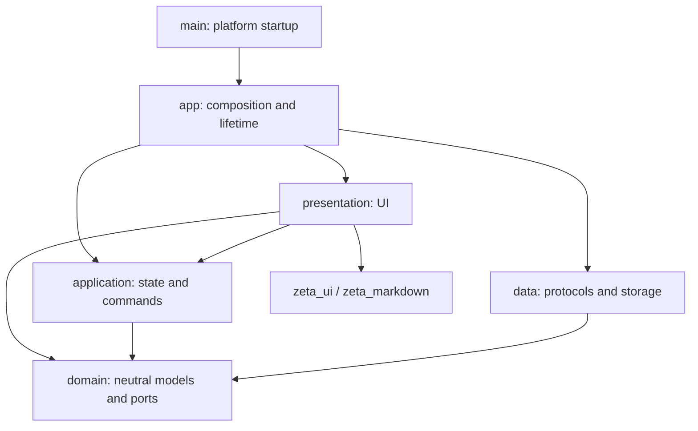
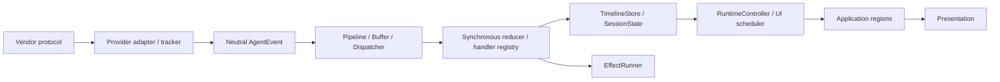

# Architecture Overview

English ｜ [中文](../../zh/architecture/overview.md)

This page describes responsibilities and data paths for contributors. Detailed rules are in the [engineering standards](../../zh/architecture/engineering_standards.md), implementation steps in the [developer guide](../../zh/development/developer_guide.md), and definitions in the [glossary](../development/glossary.md).

Zeta starts local agent CLIs, translates vendor protocols into neutral events, and displays conversations, tools and file-change evidence. Model inference, tool execution and vendor history formats remain with each CLI.

## Layers

Presentation subscribes to application state and command contracts. Application does not depend on presentation. Domain contains no Flutter, file I/O or vendor protocol fields. Feature code stays in its feature, shared infrastructure in core, and reusable UI in `zeta_ui`.

## Internal packages

| Package | Responsibility |
| --- | --- |
| `zeta_foundation` | Clock, logging, metrics and collection contracts; host helpers under `src/platform/` |
| `zeta_plugin_kernel` | Plugin activation, contributions and shutdown |
| `zeta_agent_core` | Domain, Binding/runtime, event pipeline, reducers and store |
| `zeta_agent_provider_api` | Neutral composition, management and usage contracts |
| `zeta_agent_provider_sdk` | Shared protocol mechanisms and separate testing entry points |
| `zeta_agent_provider_codex` / `grok` / `claude_code` | Vendor protocols, configuration, history, management and usage |
| `zeta_ui` | Graphite design system without business-model dependencies |
| `zeta_markdown` | Markdown rendering without internal-package dependencies |

`lib/src/app/plugins/agent_provider_manifest.dart` registers plugins. Composition validates contribution ownership, uniqueness and completeness. Vendor packages do not depend on one another. Plugin icons are static assets and can be read without activating plugins.

## Event pipeline

Providers determine identity, segments, deduplication, terminal state and file-change evidence before entering shared code. `sourceItemId` is protocol metadata, not a UI merge rule. The store merges by explicit IDs only.

The pipeline checks targets on admission and dispatch. High-frequency events use neutral coalescing rules. Reducers synchronously return state, mutations, snapshots and effects. Live, history and replay share registry definitions but keep separate reducers and scratch state.

EffectRunner checks generation, runtime/epoch and required thread/turn scope before execution. Raw protocol data remains immutable and opaque, for display in the context panel only.

## State and commands

| State | Owner | Write entry |
| --- | --- | --- |
| Current page, active project, selected thread, settings section | GoRouter (URL) | Navigation (`context.go` / `AppNavigationPort`) |
| Runtime facts and timeline | RuntimeController / core | Event processing |
| Conversation regions and command ledger | `AgentConversationSliceNotifier` | `AgentConversationActions` |
| Workspace entry resources | `AgentConversationWorkspaceNotifier` | App orchestration and route reconcile |
| Project thread list and reverse index | `ProjectThreadsSliceNotifier` | `ProjectThreadsOperations` |
| Management, detection and runtime summary | `AgentManagementSliceNotifier` | `AgentManagementOperations` and controlled ingress |
| Composer drafts and timeline scroll | Presentation `AgentPaneRetention` | Pane deactivate / entry close |
| Focus, popovers and IME state | Widget | Widget events |

Cross-widget business state has no parallel hand-written store or mirror Notifier. Location is not written through slice selection fields. Runners take frozen dependencies and an owner/result sink, not a Ref used to resolve the owner again.

Commands freeze payload, owner lifetime and scope before queueing and recheck on return. Old handles cannot find a new entry through BindingKey. Cancellation and approvals do not wait for preference saves. Settling a caller Future does not prove I/O has drained.

Settings and usage statistics share a root-navigator covering page and preserve the content page on return. Notification navigation waits for a committed route before resource readiness; asynchronous selection checks the navigation generation. The router coordinator handles draft promotion and entry closure against the content visit and owner lifetime, without replacing a covering page.

## Binding and lifetime

Each workspace entry owns separate conversation resources. `AgentConversationOwnerKey(entryId, lifetimeToken)` survives draft promotion; reopening after close uses a new token. BindingKey is an alias. Closing, closed and unknown targets expose no old body or writable entry.

The app constructs and starts the Shell before widgets mount. Opening history or a draft does not itself start a CLI; the Binding creates the session on execution. Page switches and subscriptions do not determine process, lease or file-handle lifetime.

Shutdown rejects new commands and settles waiters, drains management and project-thread execution, then closes consumers and fact sources, entries/controllers/leases, BindingManager, registry, plugins and the container. Repeated close calls share one Future. Failed releases remain failures. Conversation auto-disposal only reclaims an explicitly released empty projection.

Management summaries aggregate all foreground and background Bindings by exact provider configuration ID, not by the selected page or default assistant.

## Capabilities and approvals

Controls use capabilities and bundle ports. Execution checks again and throws `UnsupportedError` for missing support. Session configuration distinguishes failure and stale targets; displayed values change only through provider events.

Permissions, questions, provider plan approval and local execution handoff are separate. Handoff starts a new Default turn without using an approval port. Plan acceptance grants no advance authorization. Execution restores only valid user-selected permissions, otherwise using the provider's conservative default or requiring a choice.

## Workbench UI

`IdeHome` composes one Workbench; pages fill Navigation, Canvas and Inspector. The center column is the route's child; location is the URL. Composer drafts and scroll survive via presentation-layer retention. Do not use `IndexedStack` for long timelines.

Timeline construction is limited to visible blocks, with parsing and projection cached by content revision. Resize must not reparse unchanged bodies. Floating plans and pending interactions are positioned in one layout pass without post-layout measurement feedback.

UI uses Graphite tokens and Ide controls. Text comes from ARB or immutable catalogs; Flutter Locale and generated localization do not enter neutral layers. English or Simplified Chinese is fixed at startup, with restart required after changing the setting.

## Persistence

Startup resolves `.zeta` under the system application Documents directory and supplies stores through `ZetaStorageBindings`. Business layers receive storage interfaces, not host paths. Configuration, state, logs and caches are separated; JSON is versioned and decoded leniently.

Sensitive bodies and credentials do not enter Zeta's own records. Plugins may read their CLI's private data for defined functions. Writes require a separate product contract. Claude sign-in renewal updates the original CLI credential store without making a Zeta copy. See engineering standards §5 and the [Claude protocol](../../zh/protocols/claude_code_stream_json_protocol.md).
