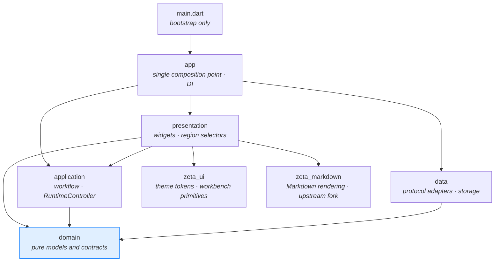
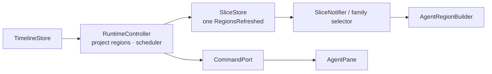
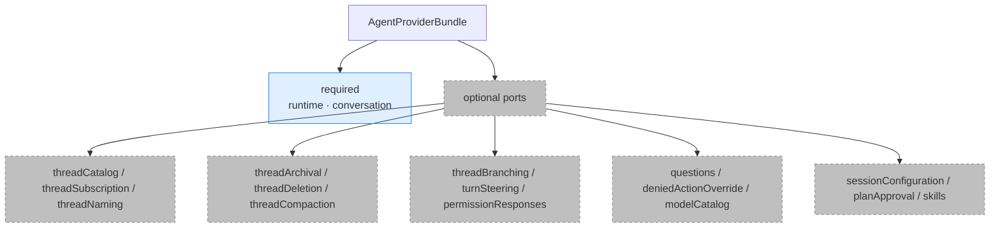
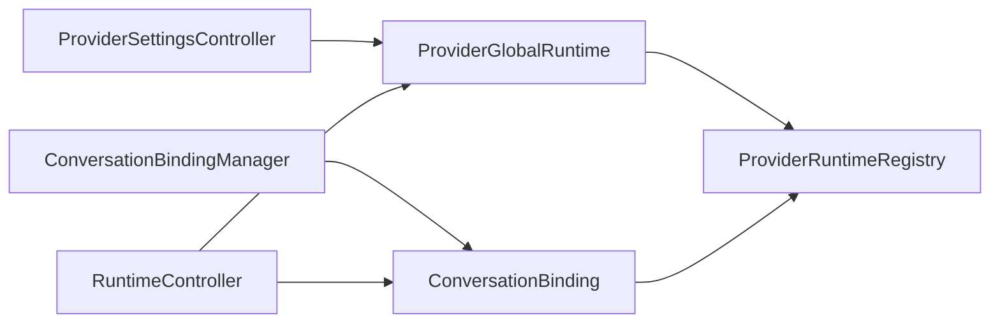
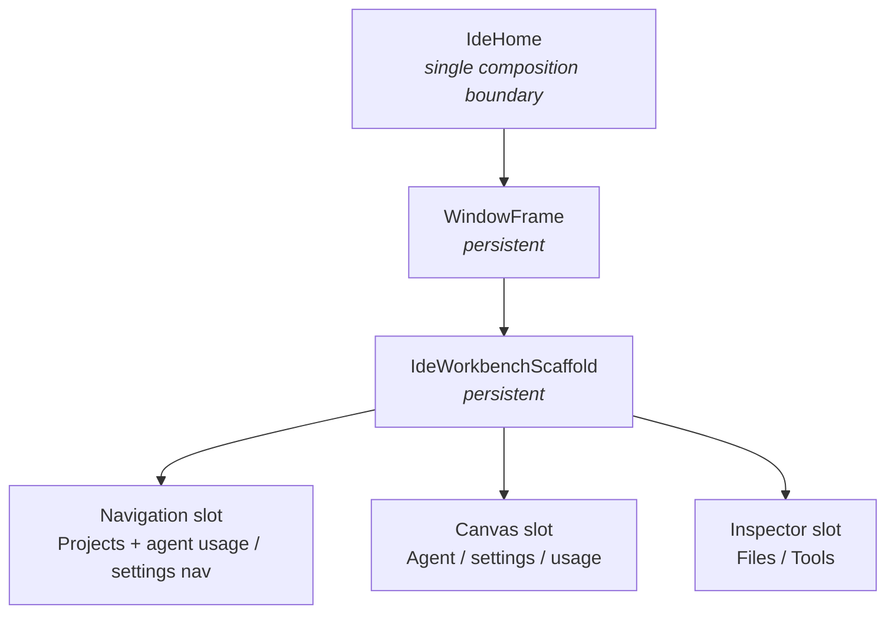

# Architecture overview

[中文](../../zh/architecture/overview.md) ｜ English

Written for someone opening this repository for the first time. The goal is to give you a working mental model in about fifteen minutes, so you know which layer to touch.

For definitions of specific terms, see the [glossary](../development/glossary.md). For the complete rules and invariants, see the [design document](../../zh/architecture/design_document.md) and [engineering standards](../../zh/architecture/engineering_standards.md) (both Chinese).

> Package update (2026-09-05): neutral contracts and shared mechanisms live in `zeta_agent_provider_api` and `zeta_agent_provider_sdk`. Codex, Grok and Claude Code have separate pure Dart plugin packages, registered in `agent_provider_manifest.dart`. Management and usage implementations now live in their owning plugins and are assembled through neutral, overridable contribution seams; manifest parity and isolation guards cover future plugins, and CI discovers packages for independent matrix jobs. See the [authoritative package boundaries](../../zh/architecture/engineering_standards.md#21-provider-插件包边界).

Provider plugins own their SVG assets and `AgentProviderDefinition.icon` metadata. Package-level `flutter.assets` declarations do not introduce a Flutter SDK dependency. The host entry point injects static lookup through `agentProviderIconsOverride` and owns theme, sizing, semantics and fallback rendering. Icon lookup must not activate plugins, infer brands from custom instance names, or persist asset metadata.

## In one sentence

Zeta is a **desktop shell**. It ships no model and implements no editor. It launches the agent CLIs already on your machine, translates their proprietary protocols into a set of neutral domain events, and renders those events as an auditable timeline.

The active providers are Codex app-server (default), Grok ACP, and Claude Code stream-json; Cursor is retired. See the [Claude Code protocol baseline](../../zh/protocols/claude_code_stream_json_protocol.md) for its current wire contract.

So the architecture revolves around exactly one question: **how do we keep provider-specific protocol differences from contaminating shared code?** Most constraints you'll read about are derived from that question.

## Layering



**Dependencies are one-way; you can't reverse an arrow.** The critical rule: `domain` is pure — no Flutter, no `dart:io`, no provider protocol fields. Any time you want to import a Codex type into domain, you're in the wrong layer.

Code is sliced by feature, and each feature is split into those same four layers:

```
lib/src/features/<feature>/
├── domain/         models, contracts, pure rules
├── application/    controllers, workflow orchestration
├── data/           protocol adapters, storage implementations
└── presentation/   widgets, region selectors
```

Existing features: `agent` (provider abstraction and conversation), `agent_management` (CLI detection and diagnostics), `desktop_notifications`, `ide_session` (restore), `project_threads`, `settings`, `usage_statistics`, `workspace` (file tree).

Project Threads commands enter `ProjectThreadsOperations`, implemented by the application Store. The Store owns synchronous rules, list state, and the thread-to-project index. The app Runner executes effects and keeps only I/O scheduling resources; it reads thread ownership through `StateOwner.threadFor` and sends typed results back. Pages preserve explicit mappings outside the visible window, and closed owners reject late updates and removal callbacks. The current Store listeners, presentation mirror, and Deferred runner remain until WP-3P.

**New code goes into the matching feature — not back into broad top-level directories.**

## The agent event pipeline

This is the one path worth understanding thoroughly. A raw notification from the CLI passes through all of this before it becomes a line on screen:

```mermaid
flowchart LR
    cli["Agent CLI<br/>stdio JSON-RPC"] --> dec["decoder<br/><i>shared · syntax only</i>"]
    dec --> ad["provider adapter<br/>+ reducer<br/><i>vendor-specific</i>"]
    ad --> ev(["AgentEvent<br/><i>neutral domain event</i>"])
    ev --> pipe["AgentEventPipeline<br/><i>gate → coalesce → bounded dispatch</i>"]
    pipe --> proc["EventProcessor<br/><i>pure sync reducer</i>"]
    proc --> store["TimelineStore<br/><i>dumb merge by entryId</i>"]
    proc --> eff["EffectRunner<br/><i>side-effect exit</i>"]
    store --> runtime["RuntimeController<br/>region projection + frame coalesce"]
    runtime --> slice["SliceStore<br/>one RegionsRefreshed"]
    slice --> ui["selector → AgentRegionBuilder"]

    classDef vendor fill:#F5A62333,stroke:#F5A623
    classDef neutral fill:#1B84FF22,stroke:#1B84FF
    class ad vendor
    class ev,pipe,proc,store,runtime,slice,ui neutral
```



Exactly one box is orange. **Everything after it must be provider-agnostic** — that's the entire point of the design.

Responsibilities break down like this:

| Stage | Owns | Explicitly doesn't own |
| --- | --- | --- |
| decoder | protocol syntax, transport lifecycle | any provider branching |
| **provider adapter / reducer** | vendor field compatibility, entryId assignment, segmentation, dedup, terminal states, complete file-change snapshots | punting unresolved semantics downstream |
| pipeline | subscription scope, coalescing, bounded dispatch | business semantics |
| processor / reducer | state transitions, timeline mutation descriptions; reduction dispatched via the handler registry; UI regions derived from dirty bits + SessionState diff | async work, Flutter scheduling, hard-coding which pane to refresh, branching on providerId |
| TimelineStore | update on same entryId, create on new entryId; raise dirty regions only when values change | inference, id rewriting, judging UI urgency |
| UI | rendering | parsing protocol |

The three rules most often violated:

1. **A provider's `sourceItemId` / `sourceMessageId` is metadata only.** entryId, message segmentation, reasoning phases, dedup, and terminal states are all decided by that provider's own adapter/reducer. TimelineStore merges blindly — it never guesses.
2. **Reducers must be purely synchronous.** No `Timer`, no `Future`, no Flutter scheduler, no external callbacks. Side effects go through the EffectRunner, which validates scope.
3. **Live / history / replay each get their own reducer instance.** Sharing one bleeds state across them.
4. **File changes render only typed evidence supplied by the provider.** Replacement snippets, written content, and unified patches retain their distinct meaning. A command-only path remains a command card; Zeta never parses the command or current workspace to invent a diff.

An `AgentFileChangeSnapshot` is a complete cumulative snapshot assembled by the provider before the shared
pipeline. The Store replaces it mechanically and the UI renders by evidence type. A Codex turn aggregate is
an explicit `liveOnly` fallback: it cannot masquerade as recoverable history or appear alongside later
tool-scoped evidence.

Before adding or changing an `AgentEvent`, work through all 16 items of the onboarding checklist in [developer guide §7](../../zh/development/developer_guide.md).

## Conversation UI publish

After TimelineStore there are only **two hops**. Do not reintroduce a ViewModel, `AgentConversationUiStateStore`, or `AgentConversationSliceComposition`:



- `AgentConversationRuntimeController` (application) owns the pipeline, region projection, `AgentUiUpdateScheduler`, CommandPort, and effects.
- `AgentConversationSliceStore.connected` dispatches once per `AgentUiUpdateRequest`, by region.
- Widgets read a region only through `AgentRegionBuilder`'s `ref.watch(selector(bindingKey))`. Send goes through `agentConversationCommandProvider`. High-frequency live-turn updates may use the presentation Flutter listenable adapter.
- A workspace entry composes thread, Binding, RuntimeController, and SliceStore once. Context-panel visibility is AgentPane widget state, not an application snapshot.
- The shell reads only `AgentConversationThreadSnapshot` (`selectedAgentController`).

## Provider capability negotiation

Zeta doesn't assume every agent can do the same things. Each provider exposes a set of ports through `AgentProviderBundle`, only two of which are required:



**UI renders by capability, never by provider name.** When a port is absent or `capability = false`, the corresponding entry point never appears in the menu, and an accidental call from the application layer throws `UnsupportedError` — **silent success is forbidden**, because it makes users believe something took effect when it didn't.

Session configuration is declared by the `sessionConfiguration` port. Commands return typed outcomes; the UI boundary translates missing-port errors to unsupported. Requests for the same option run in order and validate their thread/runtime target. Controls show pending and local failure feedback, while Provider events remain the source of displayed values.

The bundle is a strict boundary: the factory creates a native `AgentProviderBundle` directly, and the old `AgentProvider` facade is gone. The RuntimeController only retains neutral ports. Static capability defaults are injected by the data composition layer; Shared Domain does not switch on vendor names.

This is also what makes "adding a provider without touching shared code" realistic. The normal scope of a new provider is:

```
its own data files  +  neutral domain contracts  +  factory wiring  +  contract tests
```

If you find yourself needing to change a shared layer, stop and open an issue — that usually means the abstraction is wrong.

## Conversation bindings and provider lifecycle

Panes and RuntimeControllers never own provider processes directly:



- The registry is the sole owner of instances and child processes. There is one non-reaped global runtime per provider ID.
- A binding uniquely represents one logical conversation by draft/thread key and owns its session runtime, event generation, single-conversation permission snapshot, and active operations; permission state is not kept in a cross-conversation registry.
- The workspace composes a matching thread summary, binding, and RuntimeController once when creating an entry. A RuntimeController's thread identity is fixed; it may update only project/file context, while selecting another thread selects another entry.
- Creating a draft, opening a thread, or reading history/models/skills does not start a session runtime. Only the first submitted turn calls `beginTurn()`.
- A binding distinguishes dormant, starting, attached, and cleared explicitly. Starting is not a disconnect; only a cleared transition for the matching runtime identity may settle the current turn as interrupted.
- A binding already attached to a real thread is never rebound in place. The session returned by fork is registered like any newly created thread, then the shell reuses the standard selection flow to create its separate entry/binding; subsequent history, rename, and send operations target that new thread.
- Late cancel, steer, and interaction responses may only use `runCurrent()` and fail closed after runtime reclamation.
- The manager runs a single-flight sweep every minute. A session is reaped only after ten idle minutes with no active turn/RPC, using an exact runtime identity; a replacement waits for the old process to finish disposing.
- Runtime acquisition must explicitly choose a global or session scope. Shared model/usage features consume neutral ports, and the usage panel always uses the global runtime.

Claude Code models and the plan name come from a separate, no-prompt CLI initialize call and are
mapped to neutral models inside the Claude-local adapter. `supportedEffortLevels` are exposed as
neutral reasoning options and applied to the next turn through `--effort`. This is a snapshot of
options effective for the current CLI, not a guaranteed real-time exhaustive remote catalog. Quota
details use a separate, optional OAuth usage path and degrade to the plan name on REST failure.
The registry awaits optional `acquisitionPreparation` before returning a new or reused lease.
Claude calls the same `ensureFresh()` service here and before new requests, refreshing within five
minutes of expiry. Refresh failure blocks the operation; cancellation and approval responses remain
available. Credentials are written only to the selected existing CLI store, under a lock and with
readback verification. Zeta-owned storage and logs never contain credentials or raw payloads.
See the Claude protocol document, section 11, for scope and platform validation limits.

### Session scope of management status

Management runtime summaries cover only this Workbench's session bindings, grouped by exact configured `providerId` across foreground and background entries, including retained bindings without an entry. Default-provider choice and Canvas selection do not determine ownership. Global catalog warmup, connection tests, and external CLI processes are excluded. Ready means connected; a live turn or pending interaction means running. Historical active flags and short RPC counts cannot establish a live turn. Disabled policy preserves existing facts until actual clear/removal. Primary status follows running → error → starting → unavailable → idle → disabled → notRunning, while `hasErrors` remains independent.

## Three kinds of approval — don't conflate them

This is the most common newcomer trap. They all look like "show a card and wait for a click", but they are **three independent domain semantics** that do not share request/decision models:

| Type | Initiated by | Meaning |
| --- | --- | --- |
| **Permission approval** | provider | I want to run a command / write a file / reach the network — authorize me |
| **User question** | provider | I need an answer before I can continue |
| **Plan approval** | provider | please approve this plan |

There's a fourth thing, and it belongs to **none** of the above:

- **Plan execution handoff** — a local Zeta workflow. After a Plan turn succeeds, Zeta asks whether to execute. Choosing to run **starts an explicit new Default turn** and **pre-authorizes nothing** the plan mentioned. The card restores the still-valid permission selected before Plan; if its scope or option is stale, it falls back to the provider catalog's conservative default and allows a one-turn override.

That last one is frequently misimplemented as "steer the current turn" or "call the planApproval port". Both are wrong.

## Workbench UI



Page switching only swaps slot content; `WindowFrame` and `IdeWorkbenchScaffold` stay the same Element throughout. **Feature pages must not replace the top-level workbench.**

Workbench chrome padding lives on `IdeHome`: `space8` on the left, right, and bottom, and `space0` on top so the workbench sits flush with the title bar and there is no hairline between them. `IdeWorkbenchScaffold` is flush to that chrome; rails keep only the inner `space4` gap. Feature pages must not add another window-level inset.

The Agent home page mounts no Activity Rail. A leading title-bar action on `WindowFrame` is the sole visibility control for the merged sidebar; inside the Navigation slot, one `ProjectAgentSidebar` card contains Projects / Threads and the read-only agent-usage summary at the bottom. Usage keeps a collapsed summary in place and opens the full breakdown in a popover anchored above that summary. In Compact mode the entire sidebar reuses the Navigation Overlay, and dismissing it with the scrim or Escape restores focus to the title-bar action.

Sidebar visibility, sidebar width, and the selected usage provider are application-level Workbench preferences restored tolerantly from `ide_session.json`. The expanded usage popover is transient UI and is never persisted: it is inset by one `space4` step on each side of the sidebar width, scrolls inside itself when the content exceeds the space above the anchor, offers no height drag handle, and collapses on an outside click or the summary toggle. A terminal signal from either a foreground or background thread only makes usage follow that signal's provider and refresh silently; it never switches the conversation's active provider.

Cross-page retention uses `IdeRetainedPageView`, not `IndexedStack` (the latter keeps paying layout cost for long timelines). The timeline is virtualized with `SliverList.builder`, and streaming turns, syntax highlighting, and diff regions each get a `RepaintBoundary`.

Post-frame measurement, `GlobalKey` height probing, and post-layout `setState` feedback loops are forbidden — all of them produce visible jitter on long timelines.

On theming: import `shadcn_flutter` only `as sf`, and route all semantic colors through `IdeThemeScope` / `IdeColors.of(context)`. Business code must not contain bare `Color(0x...)`, hand-written `BoxShadow`, or ad-hoc `BorderRadius.circular(...)`.

## Interface language

The first ship supports English and Simplified Chinese only. The preference is `AppLanguage` in settings, stored in `config/general.json` (v3, codes `en` / `zh-Hans`). `MainApp` freezes the process Locale after general settings load, then mounts UI that has copy. Changing the setting shows “restart to apply”; the current process neither follows the OS locale nor remounts the workbench.

First launch, or an unavailable general-settings file, looks at the first preferred system locale only: Simplified Chinese (including bare `zh`) selects Chinese; Traditional Chinese and anything else fall back to English. A valid current settings file takes precedence. Widgets read `context.l10n`; application / data / reducer code only receives immutable text catalogs — Flutter Locale and generated l10n must not sink below the UI/app composition layer. Product terms `Agent` / `Provider` / `Thread` / `Token` stay English; date, number, and relative-time formats do not change with the UI language. Provider/user/raw strings are never translated.

`shadcn_flutter` ships English only; Zeta’s own adapter maps the public localization API onto the same ARB set. OS-owned surfaces such as the native file picker may keep the system language.

## Persistence

All Zeta-owned data lives under `~/.zeta/`:

```
config/   providers.json · appearance.json · general.json
state/    ide_session.json · usage_statistics_index.json
logs/     zeta-YYYY-MM-DD.log
cache/    agent_models_v1.json
```

Three hard requirements:

- **Versioned JSON with tolerant decoding.** Missing fields, corruption, and unsupported versions must never block startup; there is no historical-version migration path.
- **Read Provider-private data only inside that Provider's data adapter.** Protocol fields, raw content, and private paths stay out of upper layers; read access does not automatically authorize migration, rewriting, or deletion.
- **Derived indexes store allow-listed fields only.** Never persist prompts, response bodies, tool output, file-change evidence bodies, raw error text, environment variables, credentials, provider raw payloads, or localized UI copy.

Feature stores also must not assemble `File('~/.zeta/...')` themselves in presentation or application code — concrete files are injected from `lib/src/app`.

For the user-facing file listing and cleanup instructions, see the [data reference](../guide/data-and-privacy.md#what-zeta-writes-to-your-machine).

## Where to start for a given change

| What you want to do | Mainly touches |
| --- | --- |
| Restyle a timeline card | `features/agent/presentation` + `zeta_ui` tokens |
| Change Markdown rendering (syntax set / code palette / code toolbar / context menu / cursor) | injection points in `packages/zeta_markdown` plus the mapping in `agent_pane_styles.dart`; read `packages/zeta_markdown/UPSTREAM.md` first |
| Fix a streaming glitch in one provider | that provider's `data/` adapter / reducer |
| Add or fix provider file-change evidence | that provider's `data/` tracker + neutral domain/presentation; the shared Store only carries it mechanically |
| Surface a capability the provider already supports | domain port and capability → application → presentation |
| Onboard a brand-new agent CLI | new `data/` implementation + factory wiring + contract tests |
| Change file-tree ignore rules | `features/workspace/domain/workspace_directory_rules.dart` |
| Change a persisted field | that feature's `data/` + current-version decoding + tolerant fallback for corrupt/unsupported input |
| Add user-visible copy | ARB (`app_en.arb` / `app_zh.arb`) or the matching feature text catalog; run the literal scanner |

**Read before you start**: the [hard lines in CONTRIBUTING](../../../CONTRIBUTING.en.md#architectural-hard-lines) are the short version; [engineering standards](../../zh/architecture/engineering_standards.md) is the complete version with review gates.
