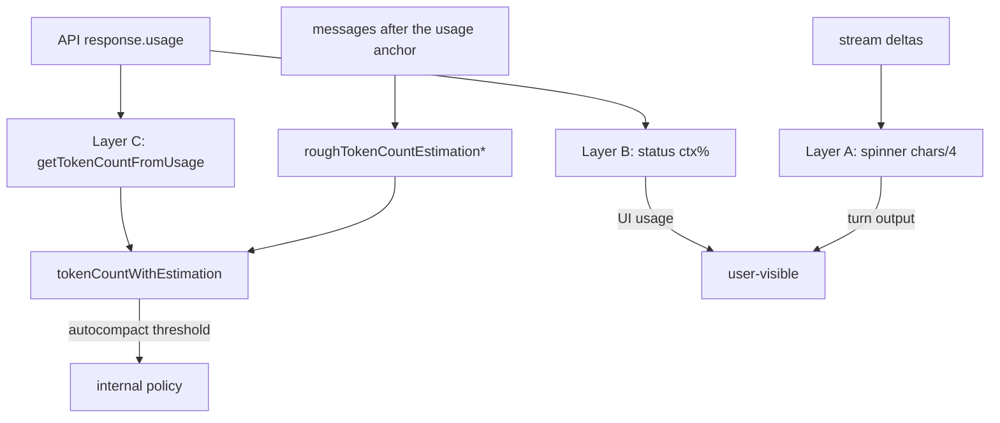

# Claude Code token metering and a Zeta reference guide

[中文](../../zh/protocols/claude_code_token_metering.md) ｜ English

> Based on the local source tree: `/Users/linpeilie/Development/Workspace/OpenSource/claude-code`  
> Anchored at commit: `2ccc2162` (HEAD at survey time)  
> Companion documents: [Claude Code provider adapter (historical proposal)](../../zh/history/claude_code_provider_adapter.md), [Claude Code stream-json protocol baseline](./claude_code_stream_json_protocol.md)  
> Constraint baseline: [migration topology §3](../architecture/migration_topology.md), [migration tasks §1](../architecture/migration_tasks.md)

> **Reading this during migration**: this document was written in the old repository, where G1–G8 were the
> architecture constraint numbers in the old `AGENTS.md`. The new repository's equivalents are below; read
> the in-text references against this table.
>
> | Old id | Meaning used here | New-repo equivalent |
> | --- | --- | --- |
> | G1 | the shared layer must not branch per provider | [topology §3.2](../architecture/migration_topology.md): no vendor branching in Repositories; gate §9.3, vendor clients do not depend on each other |
> | G2 | protocol identity is absorbed in the data layer | [topology §3.1](../architecture/migration_topology.md): Data returns typed models and never leaks raw JSON |
> | G4 | no entry point when a capability is missing | [migration tasks, step 33](../architecture/migration_tasks.md): each of the 19 optional ports has a "no entry point" test |
> | G6 | the domain stays neutral, with no vendor fields | ADR-001: `agent_provider_contracts` has zero vendor fields |
> | G7 | derived indexes store allowlisted fields only | [topology §11](../architecture/migration_topology.md): credentials and provider content never enter logs |

This document separates Claude Code's **live in-turn token display at the bottom of the screen** from its
**context usage / compaction threshold** metering, and gives actionable boundaries against Zeta's current
behaviour — **borrow the semantics and algorithms, not the UI or process model**.

---

## 1. Summary

Claude Code **does not run a full local tokenizer** on the main path. It splits "where the number comes
from" into three layers:

| Layer | Where the user sees it | Source of truth | Formula |
|---|---|---|---|
| **A. Spinner output bar** | `↓ N tokens` at the bottom during a turn | accumulated streaming delta characters | `round(chars / 4)` |
| **B. Status / ctx%** | "Context" in the status line | the most recent API `usage` | `(input + cache_write + cache_read) / window`, **excluding output** |
| **C. Threshold metering** | autocompact / session memory, etc. | the most recent `usage` in full + rough estimates of later messages | `getTokenCountFromUsage` + `roughTokenCountEstimation*` |

Zeta already has a neutral `AgentTokenUsage` plus a composer context ring, whose semantics are closest to
**B (most recent request usage)**, and it already explicitly avoids "treating session totals as window
usage". Claude Code's **A (streaming estimate)** and **C (per-message-type estimate)** are the increments
worth borrowing.

---

## 2. Source map (local paths)

| Responsibility | Path |
|---|---|
| usage extraction / canonical context count | `src/utils/tokens.ts` |
| local estimation (per message/block type) | `src/services/tokenEstimation.ts` |
| streaming delta → character length | `src/utils/messages.ts` → `handleMessageFromStream` |
| spinner showing `chars/4` | `src/components/Spinner.tsx`, `Spinner/SpinnerAnimationRow.tsx` |
| `responseLengthRef` ownership and reset | `src/screens/REPL.tsx` |
| ctx% / window size | `src/utils/context.ts`, `src/components/StatusLine.tsx` |
| the image constant 2000 | `src/services/compact/microCompact.ts` (`IMAGE_MAX_TOKEN_SIZE`) |

---

## 3. Layer A: live spinner output volume (local estimate)

### 3.1 Data flow

```
stream content_block_delta
  → handleMessageFromStream → onUpdateLength(deltaString)
  → REPL.responseLengthRef += delta.length
  → SpinnerAnimationRow: leaderTokens = round(displayedLength / 4)
  → UI: "↓ N tokens" (plus teammateTokens when a teammate is present)
```

The display has a **50 ms smoothing catch-up** (small steps closing the gap), not an instant jump to the
true value. By default the token number appears only after roughly **30 s** (or with verbose / a teammate).

### 3.2 What counts toward the streaming delta

From `handleMessageFromStream` (`messages.ts`) plus `getAssistantMessageContentLength` (`tokens.ts`, used to
backfill when a sub-agent has no streaming events).

| Event / content | Counted in `responseLength` | How |
|---|---|---|
| `text_delta` | yes | `delta.text.length` |
| `thinking_delta` | yes | `delta.thinking.length` |
| `input_json_delta` | yes | `delta.partial_json.length` |
| `signature_delta` | no | a cryptographic signature; not model output (prevents count inflation) |
| completed `text` block | yes (backfill path) | `text.length` |
| completed `thinking` | yes | `thinking.length` |
| completed `redacted_thinking` | yes | `data.length` |
| completed `tool_use` | yes | `JSON.stringify(input).length` |
| `tool_result` / user message | no | not part of this turn's output bar |
| `image` / `document` | no | the spinner path does not handle them |

**Semantics**: this approximates "the output volume being generated this turn". It is **not** context window
usage.

---

## 4. Layer B: status line context usage (API usage)

### 4.1 Taking the most recent real usage: `getCurrentUsage`

Scanning messages **backwards** for the most recent one that is:

- `type === 'assistant'`
- carries non-synthetic `usage`
- is not a synthetic model / synthetic copy

If `input+cache_create+cache_read == 0` and `output == 0`, it is treated as a third-party placeholder and
**skipped**, continuing backwards (to prevent `ctx:0%` flicker).

### 4.2 Usage and percentage

```ts
usedTokens =
  input_tokens +
  cache_creation_input_tokens +
  cache_read_input_tokens
// excludes output_tokens

used% = clamp(round(usedTokens / contextWindowSize * 100), 0, 100)
```

`contextWindowSize` comes from `getContextWindowForModel` (200k by default; `[1m]` / capability declarations
/ beta may make it 1M).

The built-in status line shows something like `Context 42% (50k/200k)`, where the denominator is the window
and the numerator is `usedTokens` above.

### 4.3 Difference from "full usage"

| Function | Formula | Use |
|---|---|---|
| Status `used` | input + cache_write + cache_read | the UI usage bar |
| `getTokenCountFromUsage` | the above **+ output** | thresholds / a complete window snapshot |
| `finalContextTokensFromLastResponse` | input + output (**no cache**); with `iterations`, the last round | task budget across compaction |

---

## 5. Layer C: thresholds use "usage + subsequent estimates"

### 5.1 The canonical entry point: `tokenCountWithEstimation`

```
context ≈ getTokenCountFromUsage(most recent usage)   // includes output
        + roughTokenCountEstimationForMessages(messages after the anchor)
```

**Never** sum tokens across the whole session (that double-counts as context grows). The source comments say
to prefer this function over `messageTokenCountFromLastAPIResponse` (output only) or bare
`tokenCountFromLastAPIResponse` (excludes later messages).

### 5.2 The parallel tool_use anchor

One API response may be split into several `assistant` records (sharing a `message.id`) with `tool_result`
interleaved:

```
[..., asst(id=A), user(result), asst(id=A), user(result), ...]
```

After finding the record with usage, **walk back to the first record with the same id**, then estimate over
the slice "after that", so tool_results heading into the next request are not missed.

### 5.3 Base estimation

```ts
roughTokenCountEstimation(content, bytesPerToken = 4)
  = round(content.length / bytesPerToken)
```

| File extension | bytesPerToken | Reason |
|---|---|---|
| `json` / `jsonl` / `jsonc` | **2** | symbol-dense; deliberately over-estimates to catch oversized tool results |
| everything else | **4** | default |

### 5.4 Message types

| `message.type` | Handling |
|---|---|
| `user` / `assistant` | with `message.content`, estimate over the content |
| `attachment` | expanded into a user message by `normalizeAttachmentForAPI`, then estimated |
| **anything else** | **0** |

### 5.5 Content block types (`roughTokenCountEstimationForBlock`)

| `block.type` | Estimate | Note |
|---|---|---|
| string / `text` | `len/4` | |
| `thinking` | `len(thinking)/4` | |
| `redacted_thinking` | `len(data)/4` | |
| `tool_use` | `len(name + JSON.stringify(input))/4` | aligned with the API serialized form |
| `tool_result` | **recursive** estimate of `content` | may nest text/image and others |
| `image` | **fixed 2000** | aligned with `IMAGE_MAX_TOKEN_SIZE`; not the base64 length |
| `document` (PDF, etc.) | **fixed 2000** | never stringify base64 (a 1 MB PDF would become hundreds of thousands of fake tokens) |
| others (`server_tool_use`, `web_search_tool_result`, `mcp_tool_use`, …) | `len(JSON.stringify(block))/4` | text-like fallback |

### 5.6 Whole-request estimation (Gemini / no countTokens)

`roughTokenCountEstimationForAPIRequest`: all message content plus `JSON.stringify(tools)/4`.

There are optional alternatives — `countTokensWithAPI` / Haiku fallback / Bedrock CountTokens — which are
**not** the spinner's main path and are out of scope here.

---

## 6. How the three layers relate



---

## 7. Zeta today, compared

### 7.1 What already exists

| Zeta component | Behaviour | Compared to Claude Code |
|---|---|---|
| `AgentTokenUsage` | totals / `last*` / `modelContextWindow`; Codex session-total diffing | fields are more neutral and multi-provider than CC's |
| Timeline `currentThreadLastTokenUsage` | prefers `last*`, **never** uses session totals as usage | matches the spirit of CC layer B ("most recent") |
| Composer progress ring | `totalTokens / modelContextWindow` (total already normalized to last usage) | close to layer B's UI; CC's numerator **excludes** output by default, while Zeta uses lastTotal (often including output, per provider) |
| Header / turn footer | shows session totals / per-turn deltas | billing-oriented, closer to CC's `/cost` than to the spinner |
| `AgentTokenUsageEvent` / `AgentContextWindowUsageEvent` | provider reports → reducer → timeline | correctly layered: metering in data/adapter, UI only renders |
| Grok `AgentContextWindowUsageEvent` | can derive usage directly | similar to CC's separation of "usage" from "billing" |
| Claude Code adapter doc §4.4 / §4.11 | stream-json `usage` → `AgentTokenUsageEvent`; plan via OAuth REST | layer B / billing already have a design slot; **layers A and C are not designed** |

### 7.2 Gaps relative to Claude Code

1. **No streaming output estimate**: the composer/status area shows no "generating ≈ N tokens" during a turn.
2. **No "usage + later messages" composite threshold function**: Zeta does no CC-style autocompact, but any
   future local warning would need layer C.
3. **The usage numerator is not unified to "input+cache only"**: CC's status line explicitly excludes output;
   Zeta depends on each provider's `lastTotalTokens` semantics, which must be spelled out in the mapper when
   integrating CC.
4. **Image/PDF constant caps** exist only in CC's estimation; Zeta's timeline does not locally estimate
   multimodal volume.

---

## 8. Recommendations for Zeta (by priority)

### 8.1 Strongly recommended (when integrating the Claude Code provider)

| # | Recommendation | Where | Gate |
|---|---|---|---|
| R1 | stream-json `result.usage` / assistant usage → `AgentTokenUsage`: `input`, `output`, `cache_creation` → mapped to `cachedInputTokens` or an extension field, `cache_read` | the mappers in `packages/claude_code_client/` | G2/G6: identity and fields are absorbed in the Data layer |
| R2 | The composer usage ring uses the **most recent window usage**; align the numerator with CC's status line: `input + cache_create + cache_read`, with `lastTotal` shown in a tooltip as "includes output" | the mapper writes `last*` plus an optional `AgentContextWindowUsageEvent` | never write session totals into usage |
| R3 | Five-hour/weekly plan limits keep using the REST path from [the adapter doc](../../zh/history/claude_code_provider_adapter.md) §4.11; **do not** derive them from the spinner or estimates | the `AgentUsageQuotaProvider` port | keep it semantically separate from token window usage |
| R4 | Do not put CC's `chars/4` into `agent_conversation_repository`'s pipeline or coalescing policy | if implementing a streaming estimate, put it in a presentation helper or a private `claude_code_client` helper | **G1** |

### 8.2 Worth borrowing (product experience, provider-agnostic)

| # | Recommendation | Note |
|---|---|---|
| R5 | Show an "output estimate" during a turn | accumulate characters of streaming text / reasoning / tool args and divide by 4; exclude signature-like fields. Can start live-turn only, not persisted |
| R6 | Do not flash "0%" when usage is zero or all-zero | match CC: skip placeholder usage and keep the last valid value or hide |
| R7 | Split the tooltip: usage (input+cache) / this turn's output / session totals | Zeta already has the beginnings of a breakdown; naming it after CC's three layers reduces confusion |

### 8.3 Borrow with care / do not port by default

| # | Item | Reason |
|---|---|---|
| R8 | autocompact / microCompact | Zeta does no in-session automatic summarization; threshold logic is the provider/CLI's job |
| R9 | Haiku `countTokens` / Bedrock CountTokens | extra model calls and credential paths; contrary to "the shell does not implement the model" |
| R10 | Status line shell hooks / CachePill TTL | CLI product shape; the composer/inspector suffices for Zeta |
| R11 | Introducing Anthropic `BetaUsage` field names into the domain | **G6**: protocol fields stay in the data mapper; the domain keeps the neutral `AgentTokenUsage` |
| R12 | Branching estimates by `providerId` in the shared layer | **G1** |

### 8.4 Minimal plan if implementing the streaming output estimate (draft)

Presentation-only or a single provider adapter helper; never in the shared store:

1. **Count**: `AgentMessageDeltaEvent` text, reasoning deltas, streaming tool-call argument fragments.
2. **Do not count**: permission/question cards, system prompts, signatures/metadata.
3. **Display**: `round(utf16OrUtf8Length / 4)` (matching CC's `.length` semantics is fine; exact
   cross-language parity is not the goal).
4. **Lifecycle**: reset at `turn/start`; hide the estimate at `turn/completed` or once a real
   `AgentTokenUsageEvent` arrives, switching to the API value.
5. **Tests**: count using provider-agnostic delta fixtures; never depend on Claude types in
   `agent_conversation_repository`'s coalescing tests.

### 8.5 If implementing a layer-C style usage warning (optional, later)

Only if the product needs a "near the window limit" warning and the provider does not report live context:

```
estimated = lastUsageWindowTokens  // from last* / ContextWindow events
           + roughEstimate(sinceLastUsageEntries)
```

The block-type table from §5.5 is portable; **image/document = 2000 must be kept**. Implement it as pure
functions with unit tests in `agent_conversation_repository`, taking neutral timeline entries as input rather
than Anthropic SDK types.

---

## 9. Quick semantic comparison (paste into the PR when implementing)

| Question | Claude Code | What Zeta should do |
|---|---|---|
| What is the jumping N tokens at the bottom? | this turn's output, chars/4 | if implemented: live estimate only, labelled "approx." |
| What is the composer ring? | status: input+cache / window | most recent usage / `modelContextWindow`; never session totals |
| What about the header's "xxx tokens"? | usually cumulative / cost-related | session totals via `currentThreadTokenUsage` |
| How does cache count toward the window? | status **includes** cache_read/create | the mapper must map cache into the usage numerator |
| Does output count in the ring? | status: **no** | recommended to exclude when integrating CC; other providers keep their existing lastTotal semantics with a tooltip note |
| Can each usage be summed? | **no** (double counting) | already handled with a cumulative flag + delta; keep it |

---

## 10. Handoff to the adapter documents

When landing the Claude Code provider:

- **Must do**: R1–R3 plus [the adapter doc](../../zh/history/claude_code_provider_adapter.md) §4.4
  `AgentTokenUsageEvent` and §4.11 plans.
- **Optional**: R5, the streaming estimate (experience only; does not block MVP).
- **May do**: reuse the `~/.claude` session JSONL from Claude Code's own data source for token aggregation;
  the raw structure and paths are not surfaced, and derived indexes store only G7-allowlisted fields.
- **Do not**: treat CC's source as a runtime dependency, or write prompts, responses, tool output,
  credentials, raw errors or session paths into the statistics index.

---

## 11. Revision history

| Date | Note |
|---|---|
| 2026-08-09 | first version: survey of local `claude-code@2ccc2162` compared against Zeta's composer/timeline |
| 2026-08-19 | migrated into the VGV repository; G1–G8 references mapped to the new architecture gates |
