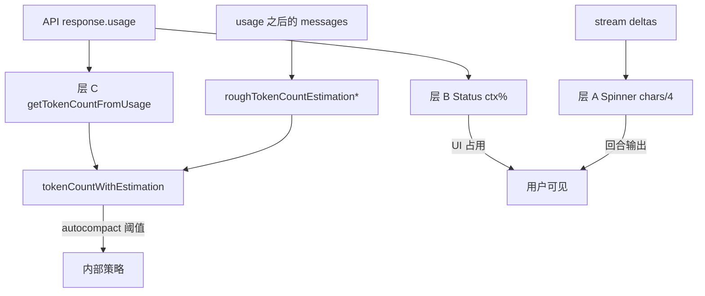

# Claude Code Token 计量机制与 Zeta 参考指南

> 基于本地源码树：`/Users/linpeilie/Development/Workspace/OpenSource/claude-code`  
> 锚定 commit：`2ccc2162`（测绘时 HEAD）  
> 配套文档：[Claude Code Provider 接入适配](./claude_code_provider_adapter.md)  
> 约束基线：`AGENTS.md`（G1–G9）、`docs/guides/developer_guide.md`

本文拆开 Claude Code **实时会话底部 token 显示** 与 **上下文占用/压缩阈值** 两套计量，并对照 Zeta 现状给出可落地的参考边界——**借鉴语义与算法，不复制其 UI/进程模型**。

---

## 1. 结论摘要

Claude Code **不在本地跑完整 tokenizer** 做主路径计量。它把「数字从哪来」分成三层：

| 层 | 用户可见位置 | 数据真源 | 公式要点 |
|---|---|---|---|
| **A. Spinner 输出条** | 回合进行中底部 `↓ N tokens` | 流式 delta 字符累计 | `round(chars / 4)` |
| **B. Status / ctx%** | StatusLine「Context」 | 最近一次 API `usage` | `(input + cache_write + cache_read) / window`，**不含 output** |
| **C. 阈值计量** | autocompact / session memory 等 | 最近 `usage` 全量 + 后续消息粗估 | `getTokenCountFromUsage` + `roughTokenCountEstimation*` |

Zeta 已有中立 `AgentTokenUsage` + Composer 上下文进度环，口径更接近 **B（最近一次请求占用）**，且已显式避免「会话累计当窗口占用」。Claude Code 的 **A（流式粗估）** 与 **C（按消息类型粗估）** 是最值得借鉴的增量。

---

## 2. 源码地图（本地路径）

| 职责 | 路径 |
|---|---|
| usage 抽取 / 规范上下文计数 | `src/utils/tokens.ts` |
| 本地粗估（消息/块类型） | `src/services/tokenEstimation.ts` |
| 流式 delta → 字符长度 | `src/utils/messages.ts` → `handleMessageFromStream` |
| Spinner 显示 `chars/4` | `src/components/Spinner.tsx`、`Spinner/SpinnerAnimationRow.tsx` |
| `responseLengthRef` 持有与重置 | `src/screens/REPL.tsx` |
| ctx% / 窗口大小 | `src/utils/context.ts`、`src/components/StatusLine.tsx` |
| 图片常数 2000 | `src/services/compact/microCompact.ts`（`IMAGE_MAX_TOKEN_SIZE`） |

---

## 3. 层 A：Spinner 实时输出量（本地粗估）

### 3.1 数据流

```
stream content_block_delta
  → handleMessageFromStream → onUpdateLength(deltaString)
  → REPL.responseLengthRef += delta.length
  → SpinnerAnimationRow: leaderTokens = round(displayedLength / 4)
  → UI: "↓ N tokens"（有 teammate 时加 teammateTokens）
```

显示有 **50ms 平滑追赶**（gap 小步增），不是瞬时跳到真实值。默认约 **30s** 后（或 verbose / 有 teammate）才露出 token 数字。

### 3.2 流式 delta 计入规则

出处：`handleMessageFromStream`（`messages.ts`）+ `getAssistantMessageContentLength`（`tokens.ts`，用于子 agent 无流式事件时回填）。

| 事件 / 内容 | 是否计入 `responseLength` | 计法 |
|---|---|---|
| `text_delta` | ✅ | `delta.text.length` |
| `thinking_delta` | ✅ | `delta.thinking.length` |
| `input_json_delta` | ✅ | `delta.partial_json.length` |
| `signature_delta` | ❌ | 密码学签名，不算模型输出（防 OTPS/计数膨胀） |
| 完成后的 `text` 块 | ✅（回填路径） | `text.length` |
| 完成后的 `thinking` | ✅ | `thinking.length` |
| 完成后的 `redacted_thinking` | ✅ | `data.length` |
| 完成后的 `tool_use` | ✅ | `JSON.stringify(input).length` |
| `tool_result` / 用户消息 | ❌ | 不属于本回合输出条 |
| `image` / `document` | ❌ | Spinner 路径不处理 |

**语义**：这是「本回合正在生成的输出量」近似，**不是**上下文窗口占用。

---

## 4. 层 B：StatusLine 上下文占用（API usage）

### 4.1 取最近真实 usage：`getCurrentUsage`

从 messages **从后往前**找最近一条：

- `type === 'assistant'`
- 带非合成 `usage`
- 非合成模型 / 非合成文案

若 `input+cache_create+cache_read == 0` 且 `output == 0`，视为第三方 placeholder，**跳过**继续往前找（防 `ctx:0%` 闪烁）。

### 4.2 占用与百分比

```ts
usedTokens =
  input_tokens +
  cache_creation_input_tokens +
  cache_read_input_tokens
// 不含 output_tokens

used% = clamp(round(usedTokens / contextWindowSize * 100), 0, 100)
```

`contextWindowSize`：`getContextWindowForModel`（默认 200k；`[1m]` / 能力声明 / beta 可为 1M）。

Builtin StatusLine 展示形如 `Context 42% (50k/200k)`，其中分母为窗口、分子为上述 `usedTokens`。

### 4.3 与「全量 usage」的区别

| 函数 | 公式 | 用途 |
|---|---|---|
| Status `used` | input + cache_write + cache_read | UI 占用条 |
| `getTokenCountFromUsage` | 上式 **+ output** | 阈值 / 完整窗口快照 |
| `finalContextTokensFromLastResponse` | input + output（**无 cache**）；有 `iterations` 时取最后一轮 | task budget 跨 compact |

---

## 5. 层 C：阈值用「usage + 后续粗估」

### 5.1 规范入口：`tokenCountWithEstimation`

```
上下文 ≈ getTokenCountFromUsage(最近 usage)   // 含 output
        + roughTokenCountEstimationForMessages(锚点之后的 messages)
```

**禁止**整会话累加 token（会随上下文增长双重计数）。源码注释写明应优先本函数，而不是 `messageTokenCountFromLastAPIResponse`（仅 output）或裸 `tokenCountFromLastAPIResponse`（不含后续消息）。

### 5.2 并行 tool_use 锚点

同一 API 响应可能拆成多条 `assistant`（共享 `message.id`），中间交错 `tool_result`：

```
[..., asst(id=A), user(result), asst(id=A), user(result), ...]
```

找到带 usage 的记录后，**回退到同 id 的第一条**，再对「其后」切片做粗估，避免漏掉将进入下一轮请求的 tool_result。

### 5.3 基础粗估

```ts
roughTokenCountEstimation(content, bytesPerToken = 4)
  = round(content.length / bytesPerToken)
```

| 文件扩展名 | bytesPerToken | 原因 |
|---|---|---|
| `json` / `jsonl` / `jsonc` | **2** | 符号密，故意偏高，防 oversized tool result 漏过 |
| 其它 | **4** | 默认 |

### 5.4 Message 类型

| `message.type` | 处理 |
|---|---|
| `user` / `assistant` | 有 `message.content` → 按 content 估 |
| `attachment` | `normalizeAttachmentForAPI` 展成 user 消息后再估 content |
| **其它** | **0** |

### 5.5 ContentBlock 类型（`roughTokenCountEstimationForBlock`）

| `block.type` | 估算 | 备注 |
|---|---|---|
| string / `text` | `len/4` | |
| `thinking` | `len(thinking)/4` | |
| `redacted_thinking` | `len(data)/4` | |
| `tool_use` | `len(name + JSON.stringify(input))/4` | 与 API 序列化形态对齐 |
| `tool_result` | **递归**估 `content` | 可嵌套 text/image 等 |
| `image` | **固定 2000** | 对齐 `IMAGE_MAX_TOKEN_SIZE`；不用 base64 长度 |
| `document`（PDF 等） | **固定 2000** | 禁止 stringify base64（否则 1MB PDF → 数十万假 token） |
| 其它（`server_tool_use`、`web_search_tool_result`、`mcp_tool_use`…） | `len(JSON.stringify(block))/4` | 文本类兜底 |

### 5.6 整请求粗估（Gemini / 无 countTokens）

`roughTokenCountEstimationForAPIRequest`：所有 message content + `JSON.stringify(tools)/4`。

另有可选路径：`countTokensWithAPI` / Haiku fallback / Bedrock CountTokens——**不是** Spinner 主路径，本文不展开。

---

## 6. 三层关系图



---

## 7. Zeta 现状对照

### 7.1 已有能力

| Zeta 组件 | 行为 | 与 CC 对照 |
|---|---|---|
| `AgentTokenUsage` | 累计 / `last*` / `modelContextWindow`；Codex 会话累计差分 | 字段比 CC 更中立、多 Provider |
| Timeline `currentThreadLastTokenUsage` | 优先 `last*`，**不用会话累计当占用** | 对齐 CC 层 B「最近一次」精神 |
| Composer 进度环 | `totalTokens / modelContextWindow`（此处 total 已归一化为 last 占用） | 接近层 B UI；CC 分子默认 **不含 output**，Zeta 用 lastTotal（常含 output，视 Provider） |
| Header / turn footer | 会话累计 / turn 增量展示 | 计费向，对应 CC `/cost` 一类，不是 Spinner |
| `AgentTokenUsageEvent` / `AgentContextWindowUsageEvent` | Provider 上报后进 reducer → timeline | 正确分层：计量在 data/adapter，UI 只渲染 |
| Grok `AgentContextWindowUsageEvent` | 可直接推占用 | 类似 CC 把「占用」与「计费」拆开 |
| Claude Code 接入文档 §4.4 / §4.11 | stream-json `usage` → `AgentTokenUsageEvent`；套餐走 OAuth REST | 层 B/计费已有设计位；**未设计层 A/C** |

### 7.2 缺口（相对 CC）

1. **无流式输出粗估**：回合进行中 Composer/状态区不显示「正在生成 ≈ N tokens」。  
2. **无「usage + 后续消息」合成阈值函数**：Zeta 不做 CC 式 autocompact，但若未来要做本地预警，缺层 C。  
3. **占用分子口径未统一到「仅 input+cache」**：CC Status 明确不含 output；Zeta 依赖 Provider 的 `lastTotalTokens` 语义，接入 CC 时必须在 mapper 里写清。  
4. **图片/PDF 常数封顶**仅存在于 CC 粗估；Zeta 时间线不本地估多模态体积。

---

## 8. 对 Zeta 的参考建议（按优先级）

### 8.1 强烈建议（接入 Claude Code Provider 时）

| # | 建议 | 落点 | 门禁 |
|---|---|---|---|
| R1 | stream-json `result.usage` / assistant usage → `AgentTokenUsage`：`input`、`output`、`cache_creation`→可映射 `cachedInputTokens` 或扩展字段、`cache_read` | `claude_code_*_mapper.dart`（待建） | G2/G6：身份与字段在 data 层消化 |
| R2 | Composer 占用环用 **最近一次窗口占用**，分子建议与 CC Status 对齐：`input + cache_create + cache_read`；`lastTotal` 另作 tooltip「含 output」 | mapper 写 `last*` + 可选 `AgentContextWindowUsageEvent` | 勿把会话累计写入占用 |
| R3 | 套餐五小时/周限额继续走文档 §4.11 REST，**不要**从 Spinner/粗估推 | `AgentUsageQuotaProvider` | 与 token 窗口占用语义隔离 |
| R4 | 不把 CC 的 `chars/4` 写进共享 TimelineStore / CoalescingPolicy | 若做流式估，放 presentation 或 adapter 私有 helper | **G1** |

### 8.2 值得借鉴（产品体验，Provider 无关）

| # | 建议 | 说明 |
|---|---|---|
| R5 | 回合进行中显示「输出粗估」 | 对 streaming text / reasoning / tool args 字符累加，`÷4`；签名类字段不计。可先只对当前 live turn，不入库 |
| R6 | 占用 0/全 0 usage 时不闪「0%」 | 对齐 CC：placeholder usage 跳过，UI 保持上一有效值或隐藏 |
| R7 | Tooltip 分栏：占用（input+cache）/ 本回合 output / 会话累计 | Zeta 已有分项展示雏形，可按 CC 三层语义命名，减少误解 |

### 8.3 谨慎参考 / 默认不搬

| # | 项 | 原因 |
|---|---|---|
| R8 | autocompact / microCompact | Zeta 不做会话内自动摘要压缩；阈值逻辑属 Provider/CLI 职责 |
| R9 | Haiku `countTokens` / Bedrock CountTokens | 额外模型调用与凭证路径；违反「壳层不实现模型」取向 |
| R10 | StatusLine shell 钩子 / CachePill TTL | CLI 产品形态；Zeta 用 Composer/Inspector 即可 |
| R11 | 在 domain 引入 Anthropic `BetaUsage` 字段名 | **G6**：协议字段留在 data mapper，domain 保持中立 `AgentTokenUsage` |
| R12 | 按 `providerId` 在共享层分支粗估 | **G1** |

### 8.4 若实现「流式输出粗估」的最小方案（草案）

仅 presentation / 单 Provider adapter 辅助，不进共享 Store：

1. **计入**：`AgentMessageDeltaEvent` 文本、reasoning delta、tool call arguments 流式片段。  
2. **不计**：权限/问答卡片、系统提示、签名/元数据。  
3. **显示**：`round(utf16OrUtf8Length / 4)`（与 CC 一致用字符串 `.length` 语义即可，不追求跨语言完全一致）。  
4. **生命周期**：`turn/start` 清零；`turn/completed` 或拿到真实 `AgentTokenUsageEvent` 后隐藏粗估、改显示 API 值。  
5. **测试**：用 Provider 无关的 delta fixture 测计数；禁止在 CoalescingPolicy 测试里依赖 CC 类型。

### 8.5 若实现「层 C 式占用预警」（可选，后期）

仅当产品需要「接近窗口上限」提示且 Provider 不报 live context 时：

```
estimated = lastUsageWindowTokens  // 来自 last* / ContextWindow 事件
           + roughEstimate(sinceLastUsageEntries)
```

块类型表可移植 §5.5；**image/document = 2000** 必须保留。实现放在 `features/agent/application` 的纯函数 + 单测，输入为中立 timeline entry，而不是 Anthropic SDK 类型。

---

## 9. 口径对照速查（实现时贴在 PR）

| 问题 | Claude Code | Zeta 应如何 |
|---|---|---|
| 底部跳动的 N tokens 是什么？ | 本回合输出 chars/4 | 若做：仅 live 粗估；标注「约」 |
| Composer 圆环是什么？ | Status：input+cache / window | 最近一次占用 / `modelContextWindow`；勿用会话累计 |
| Header「xxx tokens」？ | 常为累计/费用相关 | 会话累计 `currentThreadTokenUsage` |
| 缓存怎么算进窗口？ | Status **计入** cache_read/create | mapper 必须把 cache 映射进占用分子 |
| output 算进圆环吗？ | Status **不算** | 建议 CC 接入时不算；其它 Provider 保持现有 lastTotal 语义并在 tooltip 说明 |
| 能否累加每次 usage？ | **否**（双重计数） | 已用 cumulative flag + delta；保持 |

---

## 10. 与接入文档的衔接

落地 Claude Code Provider 时：

- **必须做**：本文 R1–R3 + [适配文档](./claude_code_provider_adapter.md) §4.4 `AgentTokenUsageEvent`、§4.11 套餐。  
- **可选做**：R5 流式粗估（体验），不阻塞 MVP。  
- **不做**：把 CC 源码当运行时依赖；不读 `~/.claude` 会话 JSONL 做 token 聚合（G7/G8；适配文档已排除）。

---

## 11. 修订记录

| 日期 | 说明 |
|---|---|
| 2026-08-09 | 初版：基于本地 `claude-code@2ccc2162` 测绘 + Zeta Composer/Timeline 对照 |
