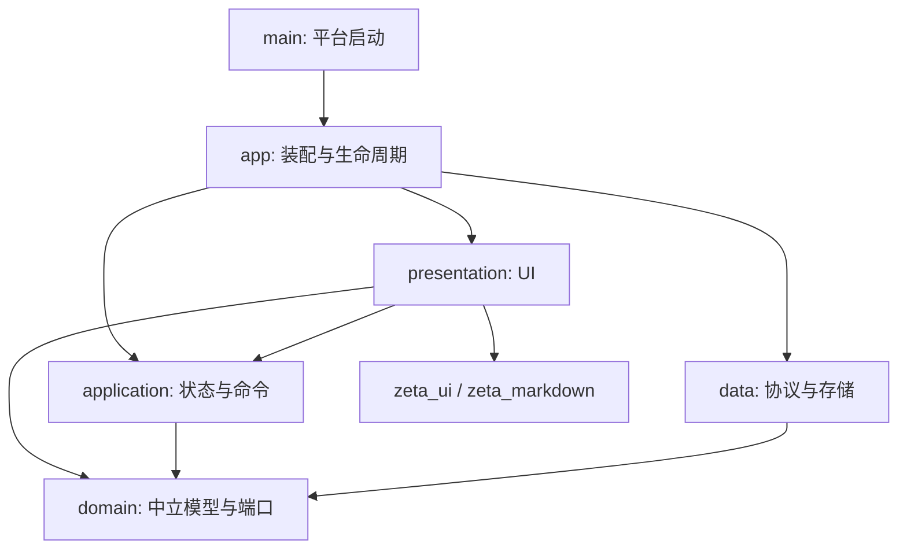
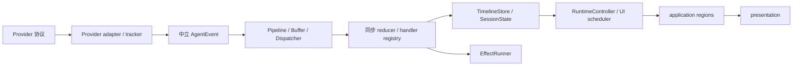

# 架构总览

中文 ｜ [English](../../en/architecture/overview.md)

本文面向贡献者，说明模块职责和数据路径。约束正文见[工程规范](engineering_standards.md)，接入步骤见[开发者指南](../development/developer_guide.md)，名词定义见[术语表](../development/glossary.md)。

Zeta 启动本机 Agent CLI，将各厂商协议转换为中立事件，再显示对话、工具记录和文件变更证据。模型推理、工具执行和厂商历史格式由各 CLI 负责。

## 分层

presentation 订阅 application 的状态和命令契约；application 不依赖 presentation。domain 不含 Flutter、文件 I/O 或厂商协议。新增代码放入对应 feature，跨 feature 基础设施在 core，共用 UI 在 `zeta_ui`。

## 内部包

| 包 | 职责 |
| --- | --- |
| `zeta_foundation` | 时钟、日志、指标、集合等基础契约；宿主工具集中在 `src/platform/` |
| `zeta_plugin_kernel` | 插件激活、贡献与关闭 |
| `zeta_agent_core` | 领域模型、Binding/runtime、事件管线、reducer 与 Store |
| `zeta_agent_provider_api` | 中立插件装配、管理和用量契约 |
| `zeta_agent_provider_sdk` | 共享协议机制和独立 testing 入口 |
| `zeta_agent_provider_codex` / `grok` / `claude_code` | 各厂商的协议、配置、历史、管理与用量实现 |
| `zeta_ui` | Graphite 设计系统，不依赖业务模型 |
| `zeta_markdown` | Markdown 渲染，不依赖其他内部包 |

插件由 `lib/src/app/plugins/agent_provider_manifest.dart` 集中登记。宿主通过经过归属、唯一性和完备性校验的贡献目录装配；具体插件互不依赖。图标是插件自有静态资源，读取图标不激活插件。

## Agent 事件管线

Provider 在进入共享层之前决定身份、分段、去重、终态和文件变更证据。`sourceItemId` 仅是协议 metadata，不能拿来推断 UI 合并边界。TimelineStore 只按显式 id 合并。

Pipeline 在入队和派发时复核目标；高频事件按中立合并策略缓冲。reducer 同步返回状态、mutation、snapshot 与 effect，不运行异步任务。live/history/replay 共享注册表定义，但分别持有 scratch 和 reducer 状态。

EffectRunner 在执行前复核 generation、runtime/epoch 及所需 thread/turn scope。原始协议作为不透明、不可变 payload 留给上下文面板，业务代码不读取其内容。

## 状态与命令

| 状态 | 所有者 | 写入口 |
| --- | --- | --- |
| 当前页、活动项目、选中会话、设置分区 | GoRouter（URL） | 导航（`context.go` / `AppNavigationPort`） |
| 会话运行事实与时间线 | RuntimeController / core | 事件处理链 |
| 会话 regions 与命令账本 | `AgentConversationSliceNotifier` | `AgentConversationActions` |
| Workspace entry 资源表 | `AgentConversationWorkspaceNotifier` | app 编排与路由 reconcile |
| 项目会话列表与反查索引 | `ProjectThreadsSliceNotifier` | `ProjectThreadsOperations` |
| 管理、检测与运行摘要 | `AgentManagementSliceNotifier` | `AgentManagementOperations` 与受控 ingress |
| 会话输入草稿与滚动 | presentation `AgentPaneRetention` | pane deactivate / entry 关闭 |
| 焦点、弹层、输入法状态 | Widget | Widget 事件 |

跨 Widget 业务状态不再通过手写 Store 和镜像 Notifier 重复发布。位置不写进 slice 选中字段。Runner 接受冻结依赖及 owner/result sink，不持 Ref 反向解析状态。

会话命令入队时冻结 payload、owner lifetime 与 scope，回写前再次校验。旧句柄不能通过 BindingKey 找到新 entry。取消与审批不等待偏好保存；调用方 Future 结算不等于底层 I/O 已排空。

## 会话 Binding 与 Provider 生命周期

每个 Workspace entry 拥有独立会话资源。`AgentConversationOwnerKey(entryId, lifetimeToken)` 在草稿晋升时保持稳定，关闭后重开使用新 token。BindingKey 是查询别名，Closing/Closed/Unknown 不返回旧正文或可写入口。

应用在 Widget 挂载前装配并启动 Shell。打开历史或草稿不等于启动 CLI，首次执行由 Binding 创建会话。切页和退订不决定进程、租约或文件句柄的寿命。

关闭时先拒绝新命令、结算等待者，再排空管理和项目会话操作；随后关闭消费者和事实源、entry/controller/lease、BindingManager、registry、插件与容器。重复关闭复用 Future，释放失败保留失败状态。Conversation 的自动回收只清理已经显式释放的空投影。

管理运行状态按精确 Provider 配置实例聚合全部前后台 Binding，不能由默认助手或当前页面推断。

## 能力与审批

功能入口以 capability 和 bundle 端口为依据。执行层再次校验，不支持时抛 `UnsupportedError`。Session config 结果明确区分失败和过期，显示值只由 Provider 事件更新。

四类交互分别处理：权限审批、用户提问、Provider Plan 审批、Zeta 本地执行交接。执行交接新建 Default 回合，不复用审批端口。接受计划不预授权其中的操作；恢复权限仅限仍有效的用户选择，否则采用 Provider 的保守默认或要求明确选择。

## 工作台 UI

`IdeHome` 组合唯一 Workbench 骨架，各页填充 Navigation、Canvas、Inspector。中栏内容由路由直接渲染；位置以 URL 为真源。跨会话的草稿与滚动由 presentation 层 retention 保留，不用 `IndexedStack` 同时布局长时间线。

时间线按可见块构建，解析和投影随内容版本缓存。resize 不应重复解析未变化正文；浮动计划与待确认区在单次布局内定位，不做布局后测高反馈。

主题使用 Graphite token 和 Ide 控件。应用文案从 ARB 或不可变文本目录注入，Flutter Locale 和 l10n 不进入中立层。英语与简体中文在启动时确定，切换后重启生效。

## 持久化

入口从系统应用文档目录解析 `.zeta`，通过 `ZetaStorageBindings` 装配各 store。业务层只接收存储接口，不拼路径。配置、状态、日志和缓存分别存放，JSON 版本化且宽容解码。

敏感正文和凭据不进入 Zeta 自有记录。各插件按功能读取相应 CLI 私有数据；写入须有独立产品契约。Claude 登录续期仅更新原 CLI 凭据存储，不在 Zeta 建副本。详见工程规范 §5 和[Claude 协议](../protocols/claude_code_stream_json_protocol.md)。
