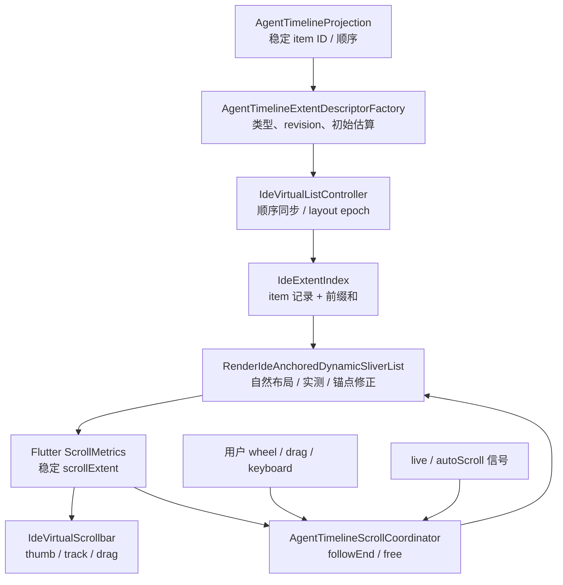
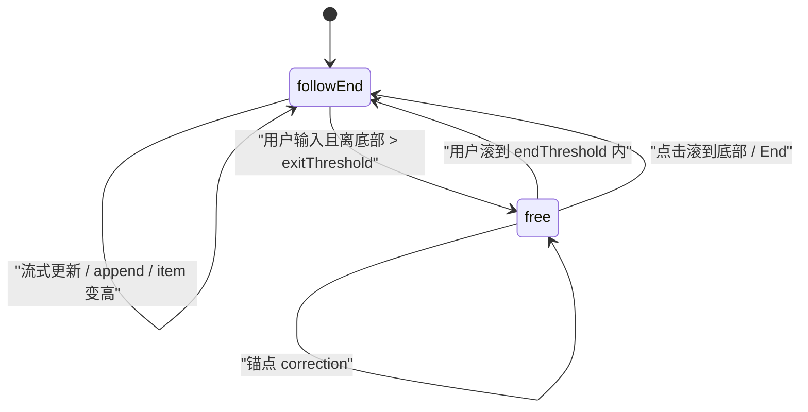

# Agent 时间线动态高度虚拟滚动与滚动条详细设计

| 项目 | 内容 |
| --- | --- |
| 文档状态 | 设计待实施 |
| 版本 | v1.0 |
| 日期 | 2026-07-27 |
| 适用范围 | Agent Conversation Timeline |
| 基线 | Flutter 3.44.4 / Dart 3.12.2 |
| 参考实现 | VS Code ListView / ChatListWidget |

## 1. 摘要

当前 Agent 时间线已经使用 `CustomScrollView + SliverList` 做了按 block 构建的虚拟化，但列表项高度由 Flutter 在布局过程中“边走边猜”。对于 Markdown、工具卡片、命令组、文件编辑组和流式输出这类高度差异大、且会持续变化的内容，`RenderSliverList` 会根据当前已布局子节点估算其余内容高度。估算样本发生变化时，`maxScrollExtent` 会重算，滚动条因此表现为：

- 用户滚动时列表内容在移动，但滚动条滑块几乎不动；
- 新测量到一个极高或极矮的节点后，滚动条突然跳一大段；
- 流式输出、展开/折叠或窗口宽度变化时，视口锚点发生漂移；
- “保持在底部”逻辑与用户主动离开底部的意图互相覆盖。

本设计参考 VS Code 的动态高度列表方案，但不照搬 DOM/TypeScript 实现。目标是在 Flutter 渲染层自建一套面向动态高度虚拟列表的基础设施：

1. 以稳定 item ID 保存每项的测量高度或估算高度；
2. 使用前缀和索引计算总高度、item offset 和 offset 对应 item；
3. 每次只修正发生变化的 item，不再用新平均值重估全部未显示项；
4. 高度变化发生在当前锚点之前时，通过 `scrollOffsetCorrection` 保持锚点不动；
5. 明确区分“跟随底部”和“自由浏览”两种滚动意图；
6. 滚动条直接消费稳定的 Flutter `ScrollMetrics`，而不是自行按 item 数量模拟滑块。

方案不引入第三方依赖，不修改 Provider 协议、domain timeline identity、持久化格式或 `~/.zeta` 数据。

## 2. 设计目标

### 2.1 必须达到

- 动态高度虚拟化：只构建视口和 cache extent 范围内的 timeline block。
- 稳定总高度：未显示项也拥有独立、稳定的高度记录。
- 增量校正：一次实测只改变一个 item 对总高度的贡献。
- 锚点稳定：锚点之前的内容新增、删除或变高/变矮时，用户正在看的内容不跳。
- 底部跟随：用户停留在底部时，流式输出持续保持最后一项可见。
- 尊重用户意图：用户主动上滚后，流式更新不得把视口拉回底部。
- 稳定滚动条：thumb 的位置和长度来自修正后的 `ScrollMetrics`。
- 保留现有稳定 key、timeline projection cache、流式更新节流和页面状态保留能力。
- 对展开/折叠、Markdown 继续生成、历史 prepend、删除/reorder、窗口缩放和文字缩放均有明确行为。

### 2.2 不在 v1 范围

- 不将所有应用列表一次性迁移到新基础设施。
- 不持久化 item 高度到磁盘。
- 不修改 timeline domain model 或 Provider adapter。
- 不支持二维虚拟化、横向列表、反向 growth direction 或嵌套滚动协调。
- 不追求未曾测量的内容高度百分之百准确；目标是让误差按单项收敛，不被“剩余项数量”放大。
- 不使用 item 数量直接计算滚动条滑块。
- 不以 `shrinkWrap`、一次性构建全部历史记录等方式规避虚拟化问题。

## 3. 当前实现与根因

### 3.1 当前链路

当前时间线的核心实现位于：

- `lib/src/features/agent/presentation/widgets/agent_pane_sections.dart`
  - `_AgentConversationTimeline`
  - `CustomScrollView`
  - `SliverList`
  - `SliverChildBuilderDelegate`
  - `findChildIndexCallback`
- `lib/src/features/agent/presentation/agent_timeline_projection.dart`
  - 将 turn/block 投影成稳定 ID 的 `AgentTimelineViewportItem`
- `lib/src/features/agent/presentation/agent_pane.dart`
  - `_scrollController`
  - `_stickToBottom`
  - `_shouldStickToBottom`
  - `_scrollToEnd`
- `lib/src/features/agent/application/agent_conversation_ui_signals.dart`
  - `live`
  - `autoScroll`
  - 16ms 级流式刷新合并

当前已经具备两项重要前提：

1. timeline item 有稳定 ID；
2. 虚拟化粒度已经是 render block，而不是整段 conversation。

因此无需推翻 projection 或 store，只需替换“动态高度虚拟滚动”基础能力。

### 3.2 Flutter 默认 `SliverList` 的行为

普通 `SliverList` 不知道未布局子节点的真实高度。它会基于已经布局的 child 区间调用 delegate 的估算逻辑，推导整个 sliver 的 `scrollExtent`。

假设列表有 2,000 项：

- 当前已测 20 项平均高度为 60；
- 推算总高度约为 `2,000 × 60 = 120,000`；
- 随后滚到一批 Markdown 大块，平均高度变成 180；
- 推算总高度可能变成 `2,000 × 180 = 360,000`。

单个新样本会通过“平均值 × 大量未显示项”放大，导致 `maxScrollExtent` 大幅改变。滚动条 thumb 的位置通常可抽象为：

```text
thumbTopRatio ≈ pixels / maxScrollExtent
thumbLengthRatio ≈ viewportExtent / (viewportExtent + maxScrollExtent)
```

因此内容虽然只滚动了一小段，thumb 可能因为分母持续增长而几乎不动；反过来，当估算突然收缩时，thumb 又会跳跃。

### 3.3 当前底部跟随的额外放大

`agent_pane.dart` 当前采用：

```text
maxScrollExtent - pixels <= 48
```

来判断是否保持底部，并在更新后 post-frame `jumpTo/animateTo(maxScrollExtent)`。

这里存在三个问题：

1. `maxScrollExtent` 本身正在变化，目标不是稳定值；
2. 普通 scroll listener 无法可靠区分用户滚动、布局修正和程序化滚动；
3. 流式输出每次继续变高时，新的动画可能覆盖上一轮动画或用户输入。

所以当前现象不是滚动条组件单独造成的，而是：

```text
未显示项高度缺少稳定模型
        +
全局平均估算反复变化
        +
底部跟随依赖不稳定的 maxScrollExtent
```

## 4. VS Code 方案拆解

### 4.1 动态高度缓存

VS Code 的 `CachedListVirtualDelegate` 为列表元素缓存已测量高度。未知项使用估算高度，测量完成后再写回缓存。

其核心思想不是“先知道所有真实高度”，而是：

- 每个元素始终有一个当前有效高度；
- 高度可以是 estimate，也可以是 measured；
- 新测量只替换该元素自己的记录。

### 4.2 区间高度索引

VS Code `ListView` 使用 range map 维护各项 size，并用它计算：

- 内容总高度；
- index 对应位置；
- scroll position 对应 index；
- 单项高度变化后的区间位置。

这样，一项从 100px 变成 140px，只会令总高度增加 40px，而不会重算全部未知项。

### 4.3 高度变化时保持锚点

VS Code 在动态元素高度更新时，如果该元素位于当前可见锚点之前，会把高度差同步补偿到 viewport scroll position。

例如：

```text
锚点 A 原位置 = 4,000
锚点前某项由 100 变为 180
高度差 = +80
新 scroll position = 4,080
```

内容坐标和滚动坐标一起增加 80，因此锚点 A 在屏幕上的视觉位置保持不变。

### 4.4 Chat 列表的稳定 identity 与底部锁定

VS Code Chat 列表还增加了：

- 以 item ID 作为 identity；
- 默认高度估算；
- ResizeObserver 回报真实高度；
- `supportDynamicHeights`；
- mutation 前记录“是否已经在底部”；
- 如果之前在底部，mutation 后继续 reveal 最后一项；
- 如果用户不在底部，保留其当前阅读位置；
- 展开/折叠动画期间持续修正锚点；
- wheel、pointer、keyboard 输入时取消自动锚定行为。

### 4.5 对 Zeta 的映射

| VS Code | Zeta 设计 |
| --- | --- |
| element identity | `AgentTimelineViewportItem.id` |
| cached dynamic height | `IdeExtentRecord.measuredExtent` |
| range map | `IdeExtentIndex` + Fenwick Tree |
| ResizeObserver | Flutter child natural layout measurement |
| updateElementHeight | render sliver 内的单点 extent update |
| viewport scroll compensation | `SliverGeometry.scrollOffsetCorrection` |
| supportDynamicHeights | `IdeAnchoredDynamicSliverList` |
| persisted auto scroll | `AgentTimelineScrollCoordinator` |
| reveal last element | 按最后 item ID 对齐到底部，而非依赖一次性的旧 max extent |

## 5. 总体架构



职责边界：

- projection 只负责“有哪些 item、顺序是什么、稳定 ID 是什么”；
- descriptor factory 负责 Agent 类型相关的估算；
- extent index 负责数学模型；
- render sliver 负责布局与视口锚点；
- coordinator 负责用户滚动意图与底部跟随；
- scrollbar 只负责呈现和交互，不持有第二套滚动真源。

## 6. 建议目录与文件

```text
lib/src/ui/core/virtualization/
├── ide_virtual_item.dart
├── ide_extent_index.dart
├── ide_dynamic_sliver_list.dart
├── ide_virtual_list_controller.dart
└── ide_virtual_scrollbar.dart

lib/src/features/agent/presentation/
├── agent_timeline_extent_descriptor.dart
├── agent_timeline_scroll_coordinator.dart
├── agent_pane.dart                         # 修改
└── widgets/
    └── agent_pane_sections.dart            # 修改

test/src/ui/core/virtualization/
├── ide_extent_index_test.dart
├── ide_dynamic_sliver_list_test.dart
└── ide_virtual_scrollbar_test.dart

test/src/features/agent/presentation/
├── agent_timeline_scroll_coordinator_test.dart
├── agent_timeline_virtualization_test.dart  # 扩充
└── agent_conversation_widget_test.dart      # 扩充
```

`ui/core/virtualization` 不依赖 Agent feature；Agent 相关类型判断保留在 feature presentation 内。

## 7. 核心数据模型

以下是建议签名，实施时可在不破坏职责边界的前提下微调。

### 7.1 Item descriptor

```dart
@immutable
final class IdeVirtualItemDescriptor {
  const IdeVirtualItemDescriptor({
    required this.id,
    required this.kind,
    required this.layoutRevision,
    required this.estimatedExtent,
  });

  /// 跨 snapshot/rebuild 保持稳定的业务 ID。
  final String id;

  /// 只用于同类项自适应估算，不参与业务逻辑。
  final String kind;

  /// 内容或展开状态发生布局级变化时递增/改变。
  final Object layoutRevision;

  /// 当前 layout epoch 下的新项初始估算高度。
  final double estimatedExtent;
}
```

约束：

- `id` 在当前序列内唯一；
- `estimatedExtent` 必须有限且不小于 0；
- `layoutRevision` 不要求全局单调，只需能判断本项布局输入是否改变；
- descriptor 不包含 Widget、BuildContext、Provider raw payload。

### 7.2 Extent record

```dart
final class IdeExtentRecord {
  IdeExtentRecord({
    required this.id,
    required this.kind,
    required this.layoutRevision,
    required this.effectiveExtent,
  });

  final String id;
  String kind;
  Object layoutRevision;

  double effectiveExtent;
  double? measuredExtent;
  IdeLayoutEpoch? measuredEpoch;
  bool isMeasurementFresh;
}
```

含义：

- `effectiveExtent` 是前缀和当前使用的唯一高度；
- 未测量项使用 estimate；
- 已测量项使用 measured；
- revision 或 layout epoch 变化后，旧 measured 不立刻清空，而是降级为 stale estimate；
- 可见项重新布局后再单点替换。

保留旧高度作为 stale estimate，可避免窗口宽度变化时瞬间把全部项重置为统一默认值。

### 7.3 Layout epoch

```dart
@immutable
final class IdeLayoutEpoch {
  const IdeLayoutEpoch({
    required this.crossAxisExtentInPhysicalPixels,
    required this.textScaleKey,
    required this.localeKey,
    required this.typographyEpoch,
  });

  final int crossAxisExtentInPhysicalPixels;
  final Object textScaleKey;
  final Object localeKey;
  final Object typographyEpoch;
}
```

宽度按 physical pixel 量化，避免浮点抖动反复令全部测量失效。

需要令 epoch 变化的输入：

- timeline 可用宽度；
- device pixel ratio；
- text scaler；
- locale；
- 字体/排版主题版本。

颜色变化不影响 epoch。仅 repaint 的主题变化不得触发重新估高。

## 8. `IdeExtentIndex` 设计

### 8.1 数据结构

```text
orderedRecords: List<IdeExtentRecord>
idToIndex:      Map<String, int>
extentTree:     Fenwick Tree<double>
cohortStats:    Map<String, IdeExtentCohortStats>
```

选择 Fenwick Tree 的原因：

- 单点高度更新：`O(log n)`；
- 前缀高度：`O(log n)`；
- 总高度：`O(1)` 或 `O(log n)`；
- 通过 prefix lower-bound 查 offset 所在 index：`O(log n)`；
- 实现规模和维护成本小于通用 interval tree；
- timeline 顺序整体同步频率远低于滚动和高度测量频率，序列变更时 `O(n)` 重建可接受。

### 8.2 必需 API

```dart
abstract interface class IdeExtentIndex {
  int get length;
  double get totalExtent;

  void synchronize(
    List<IdeVirtualItemDescriptor> descriptors, {
    required IdeLayoutEpoch epoch,
  });

  double extentAt(int index);
  double offsetOf(int index);
  int indexAtOffset(double scrollOffset);
  int? indexOfId(String id);

  IdeExtentDelta updateMeasuredExtent({
    required int index,
    required double measuredExtent,
    required IdeLayoutEpoch epoch,
  });
}
```

### 8.3 序列同步

`synchronize` 按稳定 ID 复用记录：

1. 建立旧 `id -> record`；
2. 按新 descriptor 顺序生成 records；
3. 相同 ID：
   - 复用 measured/stale extent；
   - 更新 kind 和 revision；
   - revision 改变时将 measurement 标记为 stale；
4. 新 ID：
   - 使用 descriptor estimate；
5. 已删除 ID：
   - 移出新序列；
6. 一次性重建 `idToIndex` 与 Fenwick Tree。

这样 projection snapshot 每次产生新 Dart 对象，也不会丢失高度缓存。此处有意不照搬 VS Code 的 `WeakMap<object, height>`，因为 Zeta 的 timeline projection 会频繁创建不可变快照，稳定 ID 更符合现有数据流。

### 8.4 Offset 查找

定义：

```text
offsetOf(i) = sum(extent[0 .. i-1])
endOf(i)    = offsetOf(i) + extent[i]
```

`indexAtOffset(x)` 返回首个满足：

```text
endOf(index) > x
```

的 index。

边界：

- `x <= 0` 返回首个可布局项；
- `x >= totalExtent` 返回最后一个 item；
- 允许 0 高度项；
- 连续 0 高度项必须跳过，不能进入无限循环；
- 空列表返回约定 sentinel，由调用方直接生成空 geometry。

### 8.5 单点更新

测量值更新时：

```text
delta = measuredExtent - oldEffectiveExtent
effectiveExtent = measuredExtent
Fenwick.add(index, delta)
totalExtent += delta
```

仅当：

```text
abs(delta) > 0.5 logical pixel
```

才更新索引，避免亚像素布局噪声触发修正循环。阈值最终按测试结果常量化。

测量输入必须：

- finite；
- `>= 0`；
- 对明显异常值记录 debug diagnostic；
- release 模式下安全 clamp，而不是令 geometry 产生 NaN。

## 9. 高度估算策略

### 9.1 估算优先级

每项按以下顺序选择 estimate：

1. 相同 `id`、相同 revision、相同 epoch 的 fresh measured；
2. 相同 `id` 的旧 measured，作为 stale estimate；
3. descriptor 的内容感知 estimate；
4. 相同 kind 的自适应 cohort estimate；
5. kind 默认值。

注意：fresh measured 会直接成为 effective extent；其余选项都是估算。

### 9.2 Agent item kind

建议 feature 层至少区分：

| kind | 初始估算思路 |
| --- | --- |
| `userMessage` | 文本长度、换行数、可用宽度 |
| `agentMarkdown` | 200 为基础，结合文本长度、代码块和换行 |
| `plan` | 步骤数、标题和摘要长度 |
| `toolCard` | header + 默认折叠摘要 |
| `commandGroup` | group header + 可见 command rows |
| `fileEditGroup` | group header + 默认可见文件 rows |
| `liveActivity` | 固定紧凑估算 |
| `turnFooter` | 固定紧凑估算 |
| `system/history` | 文本长度估算 |
| `hidden` | 0 |

初始常量不是精确 UI 规范，只是 cold start 基线。建议第一版以已有 Widget 的最小/常用高度校准，例如 Agent Markdown 采用与 VS Code Chat 接近的 200 logical px 起点。

### 9.3 内容感知估算

Markdown 可采用低成本公式：

```text
estimatedVisualLines =
    explicitLineCount
  + ceil(nonWhitespaceCharacterCount / charsPerVisualLine)
  + codeFencePenalty
  + imagePlaceholderPenalty

estimatedExtent =
  padding
  + estimatedVisualLines * bodyLineHeight
```

约束：

- 在 projection/descriptor 更新时计算，不能在每次 render layout 中扫描全文；
- 结果按合理区间 clamp；
- 只用于未知项，不能覆盖 fresh measured；
- 不解析完整 Markdown AST，避免重复 renderer 工作。

### 9.4 Cohort 自适应

同 kind 项测量后维护：

- 样本数；
- 指数移动平均；
- 可选的分桶中位数。

首版建议使用裁剪后的 EMA：

```text
sample = clamp(measured, lowerBound, upperBound)
estimate = estimate * 0.8 + sample * 0.2
```

关键限制：

- cohort 新估算只用于“尚未进入 extent index 的新项”；
- 不允许在用户滚动过程中用新的 cohort 均值批量改写所有未知记录；
- 否则会重新引入“平均值变化 × 大量项”的跳动。

## 10. 自定义动态高度 Sliver

### 10.1 类型

```dart
class IdeAnchoredDynamicSliverList extends SliverMultiBoxAdaptorWidget
```

对应：

```dart
class RenderIdeAnchoredDynamicSliverList
    extends RenderSliverMultiBoxAdaptor
```

v1 明确支持：

- 垂直；
- `AxisDirection.down`；
- `GrowthDirection.forward`；
- 非 reverse。

不满足条件时 debug assert，并在集成层保留切回普通 `SliverList` 的能力。

### 10.2 为什么不能直接用 `SliverVariedExtentList`

`SliverVariedExtentList` 适用于调用方能提前给出每项 extent 的场景。当前 timeline 的真实高度由 Markdown、wrap、主题字体、展开状态和异步内容共同决定。

如果把 estimate 当作强制 extent：

- 文本会被错误约束；
- 容易溢出或裁剪；
- 仍需额外做真实高度测量；
- 估算值与自然布局之间无法自动收敛。

所以目标组件需要：

- 用 estimate 定位和算总高；
- 但 child 仍按真实约束自然布局；
- 布局后将真实高度回写索引。

### 10.3 布局不变量

每次完成 layout 后应满足：

1. 每个存活 child 的 `layoutOffset == extentIndex.offsetOf(index)`；
2. `scrollExtent == extentIndex.totalExtent`；
3. 当前 paint/cache 区间被 child 覆盖，除非已经抵达列表边界；
4. 不在 cache 区间内的 child 被回收；
5. 每个实际布局 child 的 natural extent 已写回索引；
6. 锚点前的 delta 已通过 scroll correction 消化；
7. 一帧内不得产生无限 correction。

### 10.4 布局流程

```text
1. 应用待处理的 descriptors/epoch
2. 捕获当前锚点
3. 由 scrollOffset 通过 extent index 定位第一个候选 index
4. 创建/复用该 child
5. 向前和向后自然布局，覆盖 cache extent
6. 读取每个 child 的真实 mainAxis extent
7. 对变化项执行 point update
8. 计算锚点的新理论 offset
9. 若需要修正，返回 scrollOffsetCorrection 并结束本轮
10. correction 后下一轮 layout 重新定位
11. 写入每个 child 的 layoutOffset
12. collectGarbage
13. 生成 SliverGeometry
```

伪代码：

```dart
void performLayout() {
  applyPendingSequenceAndEpoch();

  if (extentIndex.isEmpty) {
    geometry = SliverGeometry.zero;
    return;
  }

  final anchor = captureAnchor(constraints.scrollOffset);
  final firstIndex = extentIndex.indexAtOffset(
    constraints.scrollOffset + constraints.cacheOrigin,
  );

  layoutChildrenFrom(firstIndex);
  final measurementDeltas = collectNaturalExtents();

  final correction = calculateAnchorCorrection(
    anchor: anchor,
    measurementDeltas: measurementDeltas,
  );

  if (correction.abs() > correctionEpsilon &&
      correctionCountThisFrame < maxCorrectionsPerFrame) {
    geometry = SliverGeometry(scrollOffsetCorrection: correction);
    return;
  }

  assignOffsetsFromExtentIndex();
  collectChildrenOutsideCache();
  geometry = buildGeometry(
    scrollExtent: extentIndex.totalExtent,
  );
}
```

### 10.5 Child 自然高度

child 接受与当前 timeline 一致的横向约束：

```text
minExtent = 0
maxExtent = infinity
crossAxisExtent = viewport crossAxis extent - sliver padding
```

render sliver 不把 estimate 作为 child 的固定高度。estimate 只参与：

- index/offset 映射；
- content extent；
- 未布局区间定位。

### 10.6 Padding 处理

保留现有 `SliverPadding`，extent index 只管理 item 本体高度。

好处：

- pagePadding 仍由标准 Flutter sliver 处理；
- item offset 的语义不混入外层 padding；
- scrollbar 的总 extent 会自然包含 padding；
- 窄屏/宽屏现有页面间距策略无需迁移。

## 11. 锚点模型

### 11.1 锚点定义

```dart
@immutable
final class IdeScrollAnchor {
  const IdeScrollAnchor({
    required this.itemId,
    required this.intraItemOffset,
    required this.viewportOffset,
  });

  final String itemId;
  final double intraItemOffset;
  final double viewportOffset;
}
```

解释：

- `itemId`：当前用作视觉基准的稳定 item；
- `intraItemOffset`：视口起点位于 item 内部的距离；
- `viewportOffset`：该基准希望保持在 viewport 中的位置，常规为 0。

锚点应选择：

1. viewport 起点处首个可见、非 0 高度 item；
2. 若首项只露出极少内容，仍保留其 intra offset；
3. 不用 child 对象身份，只用稳定业务 ID。

### 11.2 高度变化修正

旧锚点绝对内容坐标：

```text
oldAnchorContentOffset =
  oldOffsetOf(anchor.itemId) + anchor.intraItemOffset
```

测量或序列变化后的新坐标：

```text
newAnchorContentOffset =
  newOffsetOf(anchor.itemId) + anchor.intraItemOffset
```

修正量：

```text
correction =
  newAnchorContentOffset - oldAnchorContentOffset
```

通过：

```dart
SliverGeometry(scrollOffsetCorrection: correction)
```

让 Viewport/ScrollPosition 使用 Flutter 原生校正通道处理，而不是在 child layout 期间直接 `jumpTo`。

### 11.3 为什么使用 `scrollOffsetCorrection`

- 它是 Flutter sliver 协议为“布局发现 scroll offset 需要修正”提供的机制；
- correction 会触发正确的重新布局；
- 避免布局期间操作 `ScrollController`；
- 避免把程序修正误判成用户滚动；
- 与 viewport 的 overscroll、边界处理保持一致。

### 11.4 锚点被删除

序列同步前记录：

```text
anchorId
anchorOldIndex
intraItemOffset
```

若 `anchorId` 被删除：

1. 选择旧 anchor 后方第一个仍存活 item；
2. 没有后方项时选择前方最近存活 item；
3. 全部删除时回到 0；
4. 如果当前处于 `followEnd`，不走上述 fallback，直接继续锚定末尾。

### 11.5 Prepend、reorder、remove

- prepend 历史：锚点 ID 不变，新项高度累加为 correction；
- reorder：用新序列中锚点 ID 的 offset 计算 correction；
- remove before anchor：产生负 correction；
- append after anchor：自由浏览模式下 correction 为 0；
- mutate below anchor：自由浏览模式下 correction 为 0；
- mutate inside anchor：保持 item 起点和 intra offset；如内容内部语义位置变化，v1 不做文本级锚定。

## 12. 底部跟随状态机

### 12.1 状态

```dart
enum AgentTimelineScrollMode {
  followEnd,
  free,
}
```

内部还可有瞬时标记：

- `isApplyingAnchorCorrection`
- `isProgrammaticReveal`
- `pendingFollowEnd`
- `settledFrameCount`

它们不是第三种用户模式。

### 12.2 状态转换



建议使用迟滞阈值：

```text
exitFollowEndThreshold = 48 logical px
enterFollowEndThreshold = 8 logical px
```

只有“用户来源的滚动”且离底部超过 exit threshold，才退出 `followEnd`。布局 correction 或程序化 reveal 不得改变用户模式。

### 12.3 用户滚动来源

集成层监听：

- `UserScrollNotification`
- pointer signal / wheel
- scrollbar thumb drag
- touch drag
- keyboard PageUp/PageDown/Home/End

程序操作由 suppression token 标记：

```text
beginProgrammaticScroll()
  jump/reveal/correction
endProgrammaticScroll()
```

实际 `scrollOffsetCorrection` 不直接通过 `ScrollController` 发起，但 coordinator 仍需避免将该次 metrics 变化识别为用户意图。

### 12.4 流式更新

当前 `autoScrollTickListenable` 保留为“内容发生了可能影响底部的变化”信号，但不再无条件调用一次 `animateTo(maxScrollExtent)`。

行为：

- `followEnd`：
  1. 标记 `pendingFollowEnd`；
  2. 本帧 layout 完成后 reveal 最后一个稳定 ID；
  3. 如果最后一项继续变高，下一帧继续对齐；
  4. 连续两帧 end distance 小于 1px 后 settled。
- `free`：
  1. 不调用 scroll-to-end；
  2. 由 render sliver 保持当前锚点；
  3. append/streaming 位于锚点后方时视口不动。

### 12.5 为什么不对每个 token `animateTo`

- 流式信号最高可按约 16ms 合并触发；
- 180ms 动画会持续排队或互相覆盖；
- 动画中的 `pixels` 与仍在变化的 `maxScrollExtent` 不同步；
- 用户滚动容易被残余动画抢回。

规则：

- 流式 follow end 使用无动画的 frame-coalesced reveal/jump；
- 用户主动点击“滚到底部”可使用一次短动画；
- 动画结束后切换到持续 follow end；
- 用户 wheel/pointer/key 输入立即取消显式动画。

## 13. 滚动条设计

### 13.1 组件职责

`IdeVirtualScrollbar` 是 Flutter `RawScrollbar/Scrollbar` 的项目级包装，负责：

- 与 timeline `ScrollController` 绑定；
- 桌面端 hover、track、thumb drag；
- 主题令牌映射；
- notification 过滤；
- 语义标签；
- 防止自动 Scrollbar 重复插入。

它不负责：

- 保存 item 高度；
- 计算虚拟列表总高度；
- 按 item count 映射 thumb；
- 直接纠正 anchor。

### 13.2 结构

```dart
IdeVirtualScrollbar(
  controller: scrollController,
  semanticLabel: 'Agent 对话滚动条',
  child: ScrollConfiguration(
    behavior: inheritedBehavior.copyWith(scrollbars: false),
    child: CustomScrollView(
      controller: scrollController,
      slivers: [
        SliverPadding(
          padding: pagePadding,
          sliver: IdeAnchoredDynamicSliverList(...),
        ),
      ],
    ),
  ),
)
```

### 13.3 ScrollMetrics 真源

```text
extentIndex.totalExtent
  -> RenderSliver geometry.scrollExtent
  -> Viewport maxScrollExtent
  -> ScrollMetrics
  -> RawScrollbar thumb
```

全链路只有一个内容高度真源。禁止另建：

```text
itemCount × averageHeight
```

的视觉滚动条模型，否则 thumb 与真实拖动位置会分叉。

### 13.4 视觉规范

实施时从 `IdeThemeScope` / Graphite tokens 获取：

- thumb idle/hover/drag 颜色；
- track hover 颜色；
- 圆角；
- thickness；
- hover/drag 动效。

不得在 feature 中写裸 `Color(0x...)`、临时 `BorderRadius.circular(...)` 或手写 shadow。

建议：

- 默认窄 thumb；
- hover/drag 时增宽；
- desktop 开启 interactive；
- 仅 timeline 自己响应 notification；
- thumb 不遮挡正文或右侧 inspector；
- 窄视口维持可拖动的最小命中宽度；
- 增加 `Semantics(label: 'Agent 对话滚动条')`。

### 13.5 “滚到底部”按钮

参考 VS Code Chat，在 `free` 且离底部超过阈值时显示独立浮动按钮：

- 点击：进入 `followEnd` 并 reveal 最后一项；
- 按钮不是滚动条的一部分；
- 可显示在 timeline 右下安全区域；
- 使用 `ui/core` 既有交互表面和主题令牌；
- 提供语义标签；
- streaming 期间可以附带“有新内容”状态，但 v1 不要求未读计数。

## 14. Agent Timeline 集成

### 14.1 State 所有权

`_AgentPaneState` 持有：

```text
ScrollController
IdeVirtualListController
AgentTimelineScrollCoordinator
```

生命周期：

- `initState` 创建；
- 同一 view model 的页面切换/面板隐藏不清空；
- 窗口宽度变化只更新 layout epoch；
- timeline snapshot 更新只 synchronize；
- view model 实例真正替换时清空 extent index 和 coordinator；
- `dispose` 统一释放。

### 14.2 Projection 到 descriptor

新增 `AgentTimelineExtentDescriptorFactory`：

```dart
IdeVirtualItemDescriptor describe(
  AgentTimelineViewportItem item,
  AgentTimelineLayoutContext context,
)
```

`layoutRevision` 至少覆盖：

- block render revision；
- live Markdown 内容 revision；
- command/file group 展开状态；
- plan 状态与步骤；
- tool activity 展示状态；
- footer/action 可见性；
- 影响布局的 feature flag。

不要把全局 live tick 直接作为所有 item 的 revision，否则会令全部记录 stale。只更新实际变化的 item。

### 14.3 现有 stable key

继续使用：

```dart
agentTimelineViewportItemKey(item)
```

以及现有 `findChildIndexCallback`。

新 sliver 的 child manager 必须保留 keyed child 在 prepend/reorder 后的 State，包括：

- Markdown 渲染状态；
- 命令组展开；
- 文件编辑组展开；
- 其他本地 StatefulWidget 状态。

extent index identity 与 Widget key 使用同一个业务 ID 语义，但二者仍是不同职责：

- key 保持 element/state；
- extent ID 保持高度/offset。

### 14.4 现有 projection cache

`AgentTimelineProjectionCache` 继续按 turn ID/render revision 工作。

当 projection cache 执行 `retainOnly` 后，新的 descriptor 序列直接交给 `IdeVirtualListController.synchronize`。extent index 不自行读取 store，也不重复生成 timeline projection。

### 14.5 UI signals

保留分段信号：

- `history`
- `live`
- `expansion`
- `autoScroll`

映射：

| 信号 | 新行为 |
| --- | --- |
| history | 重建 projection，synchronize descriptors |
| live | 仅变化 block revision 失效；可见 child 自然重测 |
| expansion | 目标 item revision 失效；动画每帧自然重测 |
| autoScroll | 通知 coordinator 评估 follow end，不直接 animate |

不允许因滚动基础设施引入全页 `setState` 或让每个 token 重建 workbench。

## 15. 关键场景行为

### 15.1 首次打开大量历史

1. descriptors 一次同步；
2. 所有 item 获得独立 estimate；
3. extent tree 立即得到稳定初始总高；
4. 首帧只构建 viewport/cache 内 child；
5. 可见项测量后逐项更新；
6. 总高每次只变化对应 item delta。

### 15.2 向下滚入高度差异大的内容

新项测量可能仍令 thumb 发生小幅变化，但变化量只等于：

```text
该项真实高度 - 该项原估算高度
```

不会变成：

```text
新平均高度差 × 全部剩余项
```

这是本方案消除“大段跳动”的核心。

### 15.3 流式 Markdown

- 可见 live block 每帧自然布局；
- extent 单点递增；
- `followEnd` 时持续对齐末尾；
- `free` 时如果 live block 在 anchor 后方，视口不动；
- 如果用户正查看该 live block 内部，保持 item 级 anchor，不保证 Markdown 字符级 anchor。

### 15.4 展开/折叠

展开动画的每一帧都可能产生新高度：

- child layout 将 delta 写入 extent index；
- item 位于 anchor 前方时逐帧 correction；
- item 位于 anchor 后方时不移动视口；
- 用户在动画中发起 wheel/pointer/key 输入，用户输入优先；
- 如果原本处于 follow end，且展开项就是末尾区域，保持末尾对齐。

### 15.5 Prepend 历史

- 新历史项插入序列头部；
- 旧首屏 anchor ID 仍可定位；
- 新项 estimate 总和成为正 correction；
- 当前内容视觉位置保持；
- 新项实际测量后，再按单项 delta 继续修正。

### 15.6 窗口宽度变化

1. 产生新 layout epoch；
2. 旧 measured 降级为 stale estimate，但数值保留；
3. 当前可见项按新宽度自然重测；
4. 单项回写与锚点修正；
5. cohort 可更新未来新项估算；
6. 禁止宽度刚变化就把所有项重置为统一默认高度。

### 15.7 文字缩放、locale、字体变化

与宽度变化一致，产生新 epoch。

如果系统文字缩放变化幅度较大，可优先扩大 cache extent，使更多邻近项尽快完成新测量，但不得同步构建全部历史。

### 15.8 页面切换与面板显隐

现有要求是主页面切换时保留 Agent Canvas、草稿、滚动位置和面板状态。

因此：

- timeline widget 的稳定 key 保持；
- controller 归 `_AgentPaneState`，不下沉到短生命周期 child；
- 页面暂时不可见时不清空 extent index；
- 恢复时先比较 epoch，再决定是否把 measurement 标记 stale。

## 16. 正确性约束与防抖

### 16.1 Correction 循环保护

可能发生：

```text
layout -> measure -> correction -> relayout -> measure
```

需要：

- correction epsilon；
- 单 frame 最大 correction 次数，建议 2；
- 超限后使用当前索引完成 geometry，并在下一 frame 继续；
- debug 模式记录 item ID、old/new extent 和 correction；
- 不允许同步递归调用 layout。

### 16.2 Layout 期间通知

render sliver 在布局中可以更新内部 extent index，但不能同步触发上层 `ChangeNotifier` 导致 rebuild。

诊断快照或 scrollbar 辅助状态如需通知：

- 聚合到 post-frame；
- 每帧最多一次；
- 不影响 geometry 真源。

### 16.3 浮点误差

- 所有 extent 均为 logical pixel；
- epoch 的 cross-axis 用 physical pixel 整数比较；
- correction/measurement 使用 epsilon；
- prefix sum tree 定期全量重建，避免长期累积误差；
- debug 测试覆盖大量随机 point update 后的 prefix 精度。

### 16.4 极端高度

对单项超大 Markdown：

- 允许自然高度；
- 不人为拆分业务 block 作为本设计前置条件；
- total extent 使用 double；
- estimate clamp 只限制初始估算，不裁剪真实 measured；
- 如未来发现单个 RenderBox 高度达到平台精度风险，再单独设计 block 内分片。

## 17. 降级与回滚

### 17.1 Fail-safe

遇到以下数据异常：

- duplicate item ID；
- NaN/Infinity extent；
- child index 与 descriptor 不一致；
- 无法解析 child key；

debug 模式直接 assert 并输出上下文；release 模式：

- extent 安全 clamp；
- 重建 index；
- 必要时当前 frame 回退到从最近存活 child 线性布局；
- 不崩溃、不进入无限 correction。

duplicate ID 属于 projection 契约错误，不能静默把两个 item 合并。

### 17.2 Feature flag

建议在实现和灰度阶段保留应用内私有开关：

```text
useAnchoredDynamicTimelineSliver
```

仅用于开发/回滚，不作为长期用户配置。

关闭时恢复：

```text
SliverList + 现有 scrollbar
```

projection、Widget key 和业务状态不变，便于 A/B 对照。

## 18. 性能预算与可观测性

### 18.1 复杂度

| 操作 | 目标复杂度 |
| --- | --- |
| 单项高度更新 | `O(log n)` |
| prefix offset | `O(log n)` |
| offset 查 index | `O(log n)` |
| total extent | `O(1)` 或 `O(log n)` |
| projection 序列同步 | `O(n)` |
| 每帧 child layout | `O(visible + cache)` |
| prepend/reorder index rebuild | `O(n)` |

### 18.2 构建预算

沿用现有虚拟化测试约束，并扩大到动态高度：

- 2,000 项首帧不得构建全部 item；
- 常规桌面 viewport 下首帧构建数保持在合理 cache 上限；
- 流式更新只重建/布局受影响的 live block 和邻近 sliver；
- 不因 scrollbar repaint 重建 timeline children；
- 高频区域继续使用 `RepaintBoundary`。

具体 child 上限不要绑定单一像素高度，测试应结合 viewport/cache extent 断言“远小于总项数”。

### 18.3 Debug metrics

建议 debug-only 暴露：

```text
itemCount
measuredCount
staleMeasurementCount
totalExtent
measurementUpdateCount
anchorCorrectionCount
anchorCorrectionAbsoluteSum
maxSingleCorrection
followEndMode
endDistance
laidOutChildCount
```

日志使用 `dart:developer`，禁止 `print`。

可在 DevTools profile 场景中记录：

- initial layout；
- 2,000 项连续滚动；
- live Markdown 30 秒；
- 展开/折叠大 command group；
- 宽度从 1,400 缩到 700 再恢复。

## 19. 测试详设

### 19.1 `IdeExtentIndex` 单元测试

必须覆盖：

1. 初始 estimates 的 total/prefix；
2. point update 只改变该项及之后的 prefix；
3. `indexAtOffset` 边界；
4. 连续 0 高度项；
5. stable ID synchronize 复用测量；
6. prepend；
7. remove；
8. reorder；
9. anchor ID 删除 fallback；
10. revision 变化将 measured 降级为 stale；
11. epoch 变化保留旧值但标 stale；
12. duplicate ID；
13. NaN/Infinity；
14. 10,000 次随机 update 后与朴素数组前缀和一致。

### 19.2 Render sliver Widget 测试

构造交替高度：

```text
24, 80, 2,000, 32, 600, 48, ...
```

验证：

- 首帧只构建 viewport/cache item；
- max extent 等于 records 总和；
- 滚入新项后，总 extent 只变化该项误差；
- anchor 前 item 高度增加后，anchor 屏幕坐标变化不超过 1 logical px；
- anchor 后 item 高度增加后，scroll pixels 不变；
- prepend 后原首屏 item 屏幕坐标不变；
- remove/reorder 后 anchor 按规则保持；
- 0 高度项不会卡死；
- correction 不产生无限 pump。

### 19.3 Scrollbar 测试

验证：

- scrollbar 和 timeline 使用同一 controller；
- 自动 scrollbar 被禁用，不出现双 thumb；
- thumb drag 可到列表头尾；
- thumb 使用真实 `ScrollMetrics`；
- 单项测量误差不会被放大成“误差 × 剩余项数”；
- hover/drag 状态使用主题令牌；
- semantics label 存在；
- 窄 viewport 可操作。

对于 thumb 像素位置，测试应断言趋势和容差，不依赖 Flutter 私有 paint 常量。

### 19.4 Coordinator 单元测试

使用 fake metrics/scroll driver 覆盖：

- 初始 `followEnd`；
- 用户上滚超过 48px 进入 `free`；
- 8px 内重新进入 `followEnd`；
- correction 不改变模式；
- programmatic reveal 不改变模式；
- free 模式收到 100 次 autoScroll tick 不滚到底；
- follow 模式 coalesce 同帧多次 tick；
- 显式按钮进入 follow 并 reveal last ID；
- 用户输入取消按钮触发的动画；
- last item 在 mutation 中替换时按新 last ID reveal。

### 19.5 Agent Widget 回归测试

扩充现有测试：

- `agent_timeline_virtualization_test.dart`
  - 固定高度；
  - 大幅动态高度；
  - prepend/state retention；
  - stable keys；
  - scroll metrics 稳定。
- `agent_conversation_widget_test.dart`
  - command group 展开/折叠保持锚点；
  - file edit group 展开/折叠保持锚点；
  - 用户停在顶部时 streaming 不移动；
  - 用户在底部时 streaming 持续跟随；
  - streaming 期间用户上滚后立即停止 follow；
  - 页面切换后恢复滚动位置；
  - 窗口宽度变化后保持可见 item。

### 19.6 性能回归场景

profile 模式建立可复现 fixture：

- 2,000 个 timeline blocks；
- 60% 短文本；
- 20% Markdown；
- 10% command/file groups；
- 10% 大块，最高约 2,000 logical px；
- 末尾 live Markdown 持续 30 秒；
- 期间执行 resize 与 expand/collapse。

记录：

- frame build/layout time；
- dropped frames；
- 最大存活 child 数；
- correction 次数/最大值；
- maxScrollExtent 变化来源；
- 内存中 extent record 数。

## 20. 验收标准

### 20.1 功能验收

- timeline 保持按需构建；
- scrollbar 可见、可拖动、可 hover，且无重复滚动条；
- stable key 对应的本地 Widget state 在 prepend/reorder 后保留；
- 用户上滚后 streaming 不抢回底部；
- 用户保持底部时 streaming 持续显示最新内容；
- 展开/折叠不会令当前阅读 item 跳出原视觉位置；
- 页面切换、面板显隐和窗口 resize 后行为符合现有保留要求。

### 20.2 数学验收

- `geometry.scrollExtent == extentIndex.totalExtent`，允许浮点容差；
- 单项从 estimate `e` 测得 `m` 后，总高度变化为 `m - e`；
- 不存在“新平均值覆盖全部未知项”的路径；
- anchor correction 等于 anchor 新旧内容坐标差；
- stable ID 序列同步后复用对应 extent。

### 20.3 视觉验收

- 在 2,000 项、混合高度 fixture 中连续滚动，不再出现由全局平均重估造成的 thumb 大段跃迁；
- 允许首次测得一个极端大项时 thumb 按该项真实 delta 小幅修正；
- anchor 前发生高度变化后，同一 anchor 的 viewport 坐标偏差不超过 1 logical px；
- free 模式 streaming 期间 `pixels` 偏差不超过 1 logical px；
- follow end settled 后 end distance 不超过 1 logical px；
- correction 不产生可见来回抖动。

### 20.4 性能验收

- 2,000 项首帧不全量 build/layout；
- point measurement update 为 `O(log n)`；
- 常规流式输出不触发全序列 height rebuild；
- scrollbar repaint 不触发 timeline child rebuild；
- `flutter analyze` 无新增问题；
- 全量 `flutter test` 通过。

## 21. 实施阶段

### 阶段 0：基线与诊断

- 固化当前混合高度/streaming/expand/resize fixture；
- 记录现有 maxScrollExtent、pixels、首帧 child 数；
- 增加仅测试可见的 metrics 抽象；
- 不改变生产滚动行为。

完成条件：现有问题可由自动化测试或稳定 profile 场景复现。

### 阶段 1：Extent Index

- 实现 descriptor、record、layout epoch；
- 实现 Fenwick Tree；
- 实现 stable ID synchronize；
- 完成纯 Dart 单元测试；
- 不接入 Agent UI。

完成条件：随机属性测试与所有边界测试通过。

### 阶段 2：自定义 RenderSliver

- 实现自然布局与虚拟化；
- 接入 extent index；
- 实现 item measurement；
- 实现 anchor correction；
- 完成通用 Widget 测试；
- feature flag 下与普通 `SliverList` 并存。

完成条件：混合高度、prepend、reorder、resize 测试通过，无全量 child。

### 阶段 3：Coordinator 与 Scrollbar

- 实现 follow/free 状态机；
- 区分用户输入和程序化动作；
- 实现 frame-coalesced reveal end；
- 包装项目级 scrollbar；
- 增加滚到底部按钮；
- 完成可访问性与主题适配。

完成条件：streaming 与手动浏览互不抢占。

### 阶段 4：Agent 集成

- 新增 descriptor factory；
- 替换 `_AgentConversationTimeline` 的 `SliverList`；
- 替换 `_stickToBottom/_scrollToEnd`；
- 保留 projection cache、stable key 和 signals；
- 扩充 Agent widget 回归测试。

完成条件：现有 Agent 测试和新增场景全部通过。

### 阶段 5：性能验证与清理

- 运行 `dart format .`；
- 运行 `flutter analyze`；
- 运行 `flutter test`；
- profile 混合高度 fixture；
- 清理旧滚动逻辑；
- feature flag 保留一个发布周期后再决定移除。

## 22. 预计改动点

| 文件 | 改动 |
| --- | --- |
| `agent_pane_sections.dart` | 用 `IdeAnchoredDynamicSliverList` 替换时间线 `SliverList`；包裹 `IdeVirtualScrollbar` |
| `agent_pane.dart` | 持有 virtual list controller/coordinator；移除旧 `_stickToBottom` 和逐 tick `animateTo` |
| `agent_timeline_projection.dart` | 原则上不改；如需，仅补不破坏现有 ID 的布局 revision 暴露 |
| `agent_timeline_extent_descriptor.dart` | 新增 Agent item 类型与估算适配 |
| `agent_timeline_scroll_coordinator.dart` | 新增底部跟随状态机 |
| `ui/core/virtualization/*` | 新增通用动态高度虚拟列表基础设施 |
| 相关测试 | 新增 extent、render、scrollbar、streaming 和 resize 覆盖 |

禁止改动：

- Provider 协议 adapter；
- `AgentConversationTimelineStore` 的 identity 规则；
- app-server event decoder；
- `~/.zeta` 持久化；
- `AgentTimelineProjectionCache` 的数据边界。

## 23. 方案权衡

### 23.1 相比继续使用普通 `SliverList`

优点：

- 根治全局平均估算放大；
- 可控锚点；
- 总高度模型可测试；
- 能精确表达 bottom lock。

代价：

- 需要维护自定义 RenderSliver；
- Flutter 升级时需要跑完整 render 回归；
- correction、garbage collection 和 child manager 的测试门槛较高。

结论：当前内容动态性和 IDE 桌面滚动体验要求已超过普通 `SliverList` 的合适范围，值得承担该成本。

### 23.2 相比固定高度或强制 varied extent

优点：

- 不牺牲 Markdown/工具卡片自然布局；
- 无需截断正文；
- 展开/折叠可继续工作。

代价：

- 首次遇到未知项仍需 estimate -> measured 收敛；
- 无法保证 cold start 的 thumb 绝对不动。

结论：动态内容不适合固定 extent；应控制误差的传播范围，而不是假装不存在误差。

### 23.3 相比一次性构建全部 item 后测量

优点：

- 保持真正虚拟化；
- 大历史不会带来首帧和内存灾难；
- 流式更新成本与可见范围相关。

代价：

- offscreen 项使用估算；
- 设计复杂度更高。

结论：桌面 Agent 历史可能长期增长，全量测量不可接受。

### 23.4 相比第三方列表包

优点：

- 与现有 stable key、projection、theme 和 bottom lock 精确适配；
- 无新增运行时依赖；
- 可直接使用 Flutter sliver correction 协议；
- 避免包行为与版本升级不可控。

代价：

- 基础设施由项目自己维护；
- 需要更完整的 render tests。

结论：按用户要求自建，且当前项目已有足够清晰的边界支撑自建。

## 24. 风险与缓解

| 风险 | 影响 | 缓解 |
| --- | --- | --- |
| RenderSliver 实现错误 | 空白、重复 child、越界 | 分阶段接入；通用 fixture；feature flag |
| correction 循环 | 卡顿或 pump 不结束 | epsilon、每帧次数上限、诊断 |
| ID 不稳定或重复 | 高度错配、State 错配 | 复用现有稳定 ID；debug assert |
| resize 令大量高度失效 | thumb 渐进变化 | 旧值作为 stale estimate；可见项优先重测 |
| streaming 与用户滚动竞争 | 视口被抢回 | 明确 user-origin 状态机；取消动画 |
| 极端大 item | 单次真实 delta 较大 | 内容感知 estimate；只传播单项误差 |
| Flutter 升级改变 sliver 行为 | 回归 | 锁定 render tests；升级时专项验证 |
| 自适应估算反向引入全局跳动 | 重现根因 | cohort 只用于新 record，禁止批量 rebase |

## 25. 决策记录

### D1：滚动条不维护第二套高度

状态：接受。

理由：滚动条与列表必须共享 Flutter `ScrollMetrics`。单独模拟 thumb 会让拖动、键盘滚动、语义和 overscroll 分叉。

### D2：使用稳定 ID，而不是对象引用缓存高度

状态：接受。

理由：Zeta 使用不可变 projection snapshot；Dart 对象会替换，业务 ID 才是跨 rebuild 真正稳定的 identity。

### D3：使用 Fenwick Tree

状态：接受。

理由：满足单点更新、prefix 和 lower-bound 的复杂度需求，实现和测试成本可控。

### D4：用 `scrollOffsetCorrection` 保持锚点

状态：接受。

理由：这是 Flutter sliver 协议内的布局修正通道，比 post-frame `jumpTo` 更一致。

### D5：流式底部跟随不使用逐 tick 动画

状态：接受。

理由：高频动态目标不适合持续动画；frame-coalesced end reveal 更稳定，也更尊重用户输入。

### D6：窗口 resize 后保留旧高度作为 stale estimate

状态：接受。

理由：立即清空会令全部 item 回到统一默认值并造成新的 thumb 跳变；旧值通常比全局默认更接近新高度。

### D7：v1 只支持当前纵向、forward timeline

状态：接受。

理由：控制自定义 RenderSliver 的首版风险；当前需求不需要反向或横向。

## 26. 参考资料

### VS Code 源码

- [VS Code `CachedListVirtualDelegate`](https://github.com/microsoft/vscode/blob/main/src/vs/base/browser/ui/list/list.ts)
- [VS Code `ListView` 动态高度、range map 与 anchor correction](https://github.com/microsoft/vscode/blob/main/src/vs/base/browser/ui/list/listView.ts)
- [VS Code `ChatListWidget` identity、scroll lock 与 scroll-to-end](https://github.com/microsoft/vscode/blob/main/src/vs/workbench/contrib/chat/browser/widget/chatListWidget.ts)
- [VS Code `ChatListDelegate` 与动态高度测量](https://github.com/microsoft/vscode/blob/main/src/vs/workbench/contrib/chat/browser/widget/chatListRenderer.ts)

### Flutter 官方资料

- [SliverChildDelegate.estimateMaxScrollOffset](https://api.flutter.dev/flutter/widgets/SliverChildDelegate/estimateMaxScrollOffset.html)
- [SliverChildDelegate](https://api.flutter.dev/flutter/widgets/SliverChildDelegate-class.html)
- [SliverVariedExtentList](https://api.flutter.dev/flutter/widgets/SliverVariedExtentList-class.html)
- [Flutter issue #129768：动态列表 maxScrollExtent](https://github.com/flutter/flutter/issues/129768)
- [Flutter issue #120338：高度估算变化与滚动行为](https://github.com/flutter/flutter/issues/120338)

## 27. 最终结论

本方案的核心不是重新画一根 scrollbar，而是建立一个稳定的动态高度坐标系：

```text
稳定 ID
  -> 独立 estimate/measured extent
  -> 前缀和索引
  -> 单项增量修正
  -> 锚点补偿
  -> 稳定 ScrollMetrics
  -> 可靠滚动条与底部跟随
```

这与 VS Code 的解决方向一致，同时按 Flutter 的 sliver/layout 协议实现。完成后，即使真实高度仍需在滚入视口时逐步获知，误差也只属于具体 item，不再通过全局平均值乘以剩余项数放大，从根因上解决“滚动条不动或突然跳一大段”的问题。
