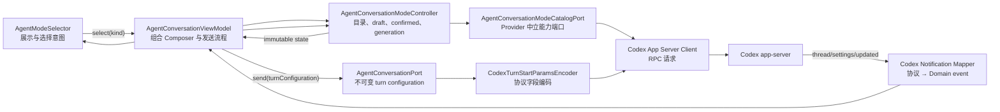
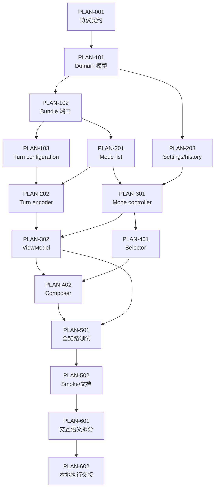

# Zeta Plan 模式适配详细设计与开发任务

- 最后更新：2026-07-23
- 文档状态：Ready for Development
- 适用范围：`lib/src/features/agent/`、Agent Composer 与 Codex app-server 适配层
- 协议基线：仓库 pinned Codex `0.144.5` stable Schema + 本机 Codex `0.144.1`
  experimental Schema 交叉核验

---

## 0. 文档定位

本文档把 Zeta 适配 Codex Plan 模式的方案拆成可直接领取、开发、测试和验收的任务。
目标不是重做现有计划卡片，而是补齐下面这条控制链：

```text
模式发现
  → 用户选择 Default / Plan
  → 冻结下一回合配置
  → turn/start.collaborationMode 编码
  → thread/settings/updated 权威回写
  → 历史恢复与线程切换隔离
```

本设计遵循以下边界：

- Domain 只表达 Provider 中立的会话模式，不出现 Codex JSON 字段。
- Application 负责模式目录加载、选择、线程恢复和异步竞态控制。
- Data 负责 `collaborationMode/list`、`turn/start` 编码与通知映射。
- Presentation 只渲染可用选项并发出选择意图。
- `app` 继续只负责依赖装配，不保存线程级模式状态。
- 不把模式状态放进 Provider 全局可变配置，避免多个 thread 互相污染。

## 1. 结论摘要

### 1.1 当前项目已经具备的能力

当前实现已经能消费 Plan 模式产生的主要结果：

| 能力 | 当前状态 | 主要落点 |
| --- | --- | --- |
| Plan 文本增量 | 已支持 | `codex_notification_mapper.dart` 的 `item/plan/delta` |
| Plan 最终文本 | 已支持 | `item/completed` 中的 `plan` item 映射 |
| 结构化步骤计划 | 已支持 | `turn/plan/updated` → `AgentPlanUpdatedEvent` |
| Plan 消息卡片 | 已支持 | `agent_pane_messages.dart` |
| 活动计划面板 | 已支持 | `agent_pane_plan_panel.dart` |
| 历史 Plan item | 已支持 | `codex_thread_history_reader.dart` |
| 结构化用户提问 | 已支持 | `item/tool/requestUserInput` 与 answers 回写 |
| 独立计划审批模型 | 已存在 | `agent_plan_approval_models.dart` |

因此，本次开发不应复制 Plan timeline、Plan panel 或审批卡片。

### 1.2 当前缺失的能力

| 缺口 | 影响 |
| --- | --- |
| 未调用 `collaborationMode/list` | UI 不知道运行时是否支持 Default / Plan |
| `supportsModeSelection` 未由 Codex 运行时启用 | 能力描述与真实协议不一致 |
| Composer 没有模式选择器 | 用户无法显式进入或退出 Plan 模式 |
| `turn/start` 不发送 `collaborationMode` | 即使 UI 增加选项也不会生效 |
| `thread/settings/updated` 忽略 collaboration mode | 无法确认服务端实际生效模式 |
| 历史中的 `collaborationMode` 仍是弱类型字符串 | 恢复、未知值和 UI 映射容易分叉 |
| ViewModel 没有模式控制器 | Provider/Thread 快速切换时容易串状态 |
| 模式可能被误放进 Provider 全局 selection | 多线程并发时存在模式泄漏风险 |

### 1.3 本次确定的设计决策

1. Plan 是 `AgentConversationMode`，不是 `AgentPlanEntry`、Plan 消息或权限审批。
2. 模式是“线程粘性、逐回合提交”的状态，不是全局 Provider 配置。
3. UI 的选择表示“下一次新 turn 使用的模式”；活动 turn 的 `turn/steer` 不修改模式。
4. 退出 Plan 时必须在下一次 `turn/start` 显式发送 Default，不能只省略字段。
5. 内置模式的 `developer_instructions` 固定发送 `null`，由 Codex 使用内置指令；
   Zeta 不复制、不持久化 Plan prompt。
6. Plan 预设的 medium effort 是逐回合覆盖，不修改用户保存的模型 reasoning 偏好。
7. `thread/settings/updated` 是服务端有效设置的权威来源；请求成功只做本地确认兜底。
8. Provider 是否支持模式选择必须通过运行时探测，不只依赖版本号。
9. 新能力通过可选端口进入 `AgentProviderBundle`，不继续扩大所有 Provider 的必选接口。
10. 本次不引入第三方状态管理或新运行时依赖。

## 2. 范围与非目标

### 2.1 纳入范围

- Codex collaboration mode 目录发现。
- Default / Plan 两种内置模式的 Provider 中立领域模型。
- 模式运行时能力探测与 `AgentProviderBundle` 可选端口。
- `turn/start.collaborationMode` 的精确编码。
- `thread/settings/updated` 的模式回写。
- 在线历史与本地历史中的模式恢复。
- 独立 application controller。
- Agent Composer 模式选择器。
- Provider、Thread、活动 turn 切换时的状态隔离。
- 协议、Domain、Application、ViewModel 和 Widget 测试。
- 协议文档、架构文档和开发指南同步。

### 2.2 非目标

- 不重写 Plan 消息卡、活动计划面板或 timeline reducer。
- 不让 `turn/steer` 动态切换当前活动 turn 的模式。
- 不允许用户编辑 Codex 内置 Plan developer instructions。
- 不把模式偏好写入全局 Provider 配置或 `~/.zeta/config`。
- 不把 mode selection 合并进 permission selection。
- 不把 `item/tool/requestUserInput` 重构作为 Plan MVP 阻塞项。
- 不为 Grok/Cursor 伪造 Prompt 形式的 Plan 模式。
- 不新增 `riverpod`、`bloc` 等状态管理依赖。
- 不在 Widget 中按 `AgentProviderKind.codex` 写协议分支。

## 3. 术语与语义隔离

代码评审时必须区分以下四类“计划”概念：

| 概念 | 含义 | 生命周期 | 推荐类型/现有类型 |
| --- | --- | --- | --- |
| Conversation Mode | Default / Plan 运行模式 | thread 粘性、每个新 turn 可覆盖 | 新增 `AgentConversationMode*` |
| Plan Message | 模型输出的计划 Markdown | turn item | `AgentMessageKind.plan` |
| Structured Plan | 步骤及 pending/inProgress/completed | turn 投影 | `AgentPlanUpdatedEvent`、`AgentPlanEntry` |
| Plan Approval | Provider 请求用户接受/拒绝计划 | server request | `AgentPlanApprovalRequest` |

禁止出现以下耦合：

- 用是否收到 Plan 消息反推当前 Conversation Mode。
- 用 permission approval 表示 Plan mode。
- 用 `AgentPlanEntry` 保存 Default / Plan 选择。
- 在 `TimelineStore` 中增加 Codex collaboration mode 分支。
- 在 Widget 中直接读写 `collaborationMode` JSON。

## 4. 协议基线

### 4.1 版本与稳定性

仓库当前 pinned stable Schema 为 Codex `0.144.5`，但 collaboration mode 属于
experimental API。本文同时使用本机 `0.144.1` experimental Schema 和当前官方
App Server 文档核验字段。

开发时采用以下证据优先级：

1. 目标 Codex 版本生成的 experimental JSON Schema。
2. 同版本 stable Schema，用于确认非实验字段没有回归。
3. 官方 App Server 文档。
4. 真实 app-server 非破坏性 smoke。
5. 现有实现和历史行为。

不得因为本机 CLI 版本低于仓库 pin，就把 `0.144.1` 的完整 Schema 覆盖到
`third_party/codex_app_server_schema/`。

### 4.2 协议矩阵

| 方向 | 方法/通知 | 稳定性 | 关键结构 | Zeta 处理 |
| --- | --- | --- | --- | --- |
| client → server | `collaborationMode/list` | experimental | 空 params，返回 `data[]`，无分页 | 映射为模式目录 |
| client → server | `turn/start` | stable 方法、experimental 字段 | 可带 `collaborationMode` | 由专用 encoder 生成 |
| server → client | `thread/settings/updated` | experimental | 完整 `threadSettings` | 更新已确认模式 |
| server → client | `item/plan/delta` | experimental | Plan Markdown delta | 沿用现有实现 |
| server → client | `turn/plan/updated` | 已有通知 | 结构化步骤快照 | 沿用现有实现 |
| server → client request | `item/tool/requestUserInput` | experimental | 问题列表与 answers | 沿用现有实现 |

### 4.3 CollaborationMode 结构

目标 Schema 的有效结构为：

```json
{
  "mode": "plan",
  "settings": {
    "model": "<effective-model-id>",
    "reasoning_effort": "medium",
    "developer_instructions": null
  }
}
```

约束：

- `mode` 目前只能是 `plan` 或 `default`。
- `settings` 必填。
- `settings.model` 必填且必须是非空字符串。
- `settings.reasoning_effort` 可空。
- `settings.developer_instructions: null` 表示使用选中模式的 Codex 内置指令。
- `turn/start.collaborationMode` 优先于顶层 model、effort 和 developer instructions。

### 4.4 CollaborationModeMask 结构

`collaborationMode/list` 返回的每个 preset mask 包含：

```json
{
  "name": "Plan",
  "mode": "plan",
  "model": null,
  "reasoning_effort": "medium"
}
```

字段规则：

- `name` 必填，用作 Provider 提供的展示名。
- `mode`、`model`、`reasoning_effort` 可空。
- 内置 preset 不选择模型。
- Plan preset 建议 medium reasoning effort。
- Zeta 必须用当前有效模型补齐 `settings.model`。

### 4.5 turn/start 编码规则

| 场景 | `collaborationMode` | 顶层 `model` | 顶层 `effort` |
| --- | --- | --- | --- |
| Provider 不支持模式 | 不发送 | 沿用当前逻辑 | 沿用当前逻辑 |
| 选择 Default | 显式发送 `mode: default` | 不发送 | 不发送 |
| 选择 Plan | 显式发送 `mode: plan` | 不发送 | 不发送 |
| 活动 turn 追加输入 | `turn/steer` 不发送 | 不适用 | 不适用 |
| 模式有效模型无法解析 | 不发请求，返回可诊断错误 | 不发送非法 payload | 不发送非法 payload |

当 collaboration mode 存在时，以下字段仍保持顶层编码：

- `threadId`
- `input`
- `cwd`
- `serviceTier`
- `approvalPolicy`
- `permissions` 或 `sandboxPolicy`
- `clientUserMessageId`

### 4.6 Default 也必须显式提交

Codex 的 collaboration mode 属于线程的 next-turn settings。用户从 Plan 切换到 Default
时，如果 Zeta 只省略 `collaborationMode`，服务端可能继续使用线程已有 Plan 设置。

因此：

```text
用户显式选择 Default
  ≠ collaborationMode: null
  ≠ 省略 collaborationMode
  = collaborationMode.mode: "default"
```

## 5. 目标架构

### 5.1 分层数据流



### 5.2 组件职责

| 组件 | 高内聚职责 | 明确不负责 |
| --- | --- | --- |
| Mode domain models | 表达模式、preset、selection、catalog | JSON 解析、Widget 文案 |
| Mode catalog port | 暴露 Provider 可提供的模式目录 | 保存 UI 选择 |
| Turn configuration | 冻结一次 `turn/start` 的模式快照 | 全局持久化 |
| Codex mode mapper | 宽容解析 mask 和未知值 | UI 排序与交互 |
| Turn params encoder | 生成协议合法且无冲突的 params | 读取 Widget 状态 |
| Mode controller | 目录加载、选择、恢复、竞态守卫 | JSON-RPC、timeline 合并 |
| ViewModel | 编排 controller、session 与发送 | 协议字段拼装 |
| Mode selector | 展示、键盘/鼠标交互 | Provider 判断、RPC |

### 5.3 依赖方向

```text
presentation
    ↓
application
    ↓
domain
    ↑
data implements domain ports

app → 只组合具体实现
```

禁止反向依赖：

- Domain 不导入 Flutter Widget 或 app-server datasource。
- Application 不导入 Codex mapper/client。
- Data 不导入 presentation。
- Widget 不导入 Codex provider。

## 6. Domain 设计

### 6.1 新增文件

```text
lib/src/features/agent/domain/
  agent_conversation_mode_models.dart
```

### 6.2 推荐模型

以下为接口级伪代码，开发时按项目现有不可变模型风格实现：

```dart
enum AgentConversationModeKind {
  defaultMode,
  plan,
  unknown,
}

final class AgentConversationModeId {
  const AgentConversationModeId({
    required this.rawValue,
    required this.kind,
  });

  final String rawValue;
  final AgentConversationModeKind kind;
}

final class AgentConversationModePreset {
  const AgentConversationModePreset({
    required this.id,
    required this.displayName,
    this.suggestedModelId,
    this.suggestedReasoningEffort,
    this.isSelectable = true,
  });

  final AgentConversationModeId id;
  final String displayName;
  final String? suggestedModelId;
  final String? suggestedReasoningEffort;
  final bool isSelectable;
}

final class AgentConversationModeCatalog {
  const AgentConversationModeCatalog({
    required this.presets,
  });

  final List<AgentConversationModePreset> presets;
}

final class AgentConversationModeSelection {
  const AgentConversationModeSelection({
    required this.modeId,
    required this.effectiveModelId,
    this.effectiveReasoningEffort,
  });

  final AgentConversationModeId modeId;
  final String effectiveModelId;
  final String? effectiveReasoningEffort;
}

final class AgentTurnConfiguration {
  const AgentTurnConfiguration({
    this.conversationMode,
  });

  final AgentConversationModeSelection? conversationMode;
}
```

### 6.3 不变量

- `rawValue` 统一 trim + lowercase。
- `"default"` 映射为 `defaultMode`，`"plan"` 映射为 `plan`。
- 未知字符串保留 raw value，但 `kind = unknown`。
- 暴露给外部的 preset 集合必须是不可修改快照。
- 可提交的 selection 必须具有非空 `effectiveModelId`。
- 未知模式可以展示为只读当前状态，但不能由 UI 主动选中。
- `AgentTurnConfiguration` 创建后不可被后续 UI 选择修改。

### 6.4 为什么保留 unknown

实验协议可能新增模式。直接使用只有两个值的 enum 会迫使 mapper：

- 抛异常并中断历史加载；或
- 把未知模式错误映射成 Default。

保留 `unknown + rawValue` 可以做到：

- 历史和通知宽容读取。
- UI 显示“未知模式”而不是错误状态。
- 下一次用户选择 Default/Plan 时回到 Zeta 已支持的集合。
- 不让 Provider 原始 payload 泄漏到 presentation。

## 7. Provider Bundle 与端口设计

### 7.1 新增可选端口

在 `agent_provider_bundle.dart` 增加：

```dart
abstract interface class AgentConversationModeCatalogPort {
  Future<AgentConversationModeCatalog> listConversationModes();
}
```

`AgentProviderBundle` 增加可空字段：

```dart
final AgentConversationModeCatalogPort? conversationModes;
```

迁移期在 `agent_provider.dart` 增加可选 legacy interface：

```dart
abstract interface class AgentConversationModeCatalogProvider {
  Future<AgentConversationModeCatalog> listConversationModes();
}
```

`AgentProviderBundle.adapt` 通过接口匹配生成 adapter，不按 Provider kind 判断。

### 7.2 Conversation 端口调整

`AgentConversationPort.sendMessage` 增加：

```dart
AgentTurnConfiguration configuration = const AgentTurnConfiguration(),
```

对应更新旧 `AgentProvider.sendMessage` 与 legacy adapter。非 Codex Provider 可忽略
`configuration.conversationMode == null`；如果收到非空且自身不支持，应抛出明确
`UnsupportedError`，不得静默当成 Default。

### 7.3 能力不变量

端口与 capability 分别表达：

- `conversationModes != null`：适配器具备探测和调用能力。
- `supportsModeSelection == true`：当前运行时已经成功发现可用 Default/Plan preset。

运行时探测成功前 capability 可以为 false。探测失败不得影响普通对话能力。

为保证能安全退出 Plan，UI 可用条件为：

```text
port 存在
AND runtime probe 成功
AND catalog 同时包含 selectable default 与 plan
AND 当前有效模型可解析
```

## 8. Codex Data 适配详设

### 8.1 推荐文件布局

```text
lib/src/features/agent/data/
  datasources/app_server/
    codex_app_server_agent_provider.dart
    codex_app_server_client.dart
  mappers/
    codex_collaboration_mode_mapper.dart
    codex_turn_start_params_encoder.dart
    codex_notification_mapper.dart
  datasources/local_history/
    codex_thread_history_reader.dart
```

两个新 mapper 继续通过 `part` 接入现有 app-server library，保持协议细节封闭在 data。

### 8.2 collaborationMode/list client

在 `_CodexAppServerClient` 增加：

```dart
Future<AgentConversationModeCatalog> fetchCollaborationModeCatalog()
```

请求：

```json
{
  "method": "collaborationMode/list",
  "params": {}
}
```

处理规则：

- 不实现 cursor 分页，因为目标协议明确无分页。
- `data` 缺失或非数组时返回受控格式错误。
- 单个损坏 entry 跳过并记录不含原始 payload 的诊断。
- 目录去重键使用规范化 mode raw value。
- 同 mode 重复时保留第一个合法条目并计数。
- 返回目录必须是不可修改集合。

### 8.3 Codex collaboration mode mapper

`_CodexCollaborationModeMapper` 负责：

- `name` → `displayName`
- `mode` → `AgentConversationModeId`
- `model` → `suggestedModelId`
- `reasoning_effort` → `suggestedReasoningEffort`
- 已知/未知 mode 分类
- 空白、字段类型错误和重复值宽容处理

mapper 不负责：

- 选择当前模型。
- 生成 `turn/start` payload。
- 判断 UI 是否处于 active turn。
- 修改 Provider 的模型 selection。

### 8.4 有效模型与 effort 解析

构建 selection 时按以下优先级解析模型：

1. preset 的非空 `suggestedModelId`。
2. 当前 thread settings 的 model。
3. Composer 当前选中 model。
4. Provider config 的 default model。
5. 模型目录的 default model。

全部为空时，不得发送缺少 `settings.model` 的请求。

reasoning effort 解析：

1. preset 的 `suggestedReasoningEffort`。
2. Composer 当前模型的用户选择。
3. `null`。

因此，Plan 内置 preset 的 medium 只覆盖本次 mode selection，不回写用户模型偏好。

### 8.5 turn/start params encoder

把 `_CodexAppServerClient.sendMessage` 当前内联 map 提取为
`_CodexTurnStartParamsEncoder`。

建议输入：

```dart
Map<String, Object?> encode({
  required AgentSession session,
  required List<AgentUserInput> inputs,
  required AgentContext context,
  required AgentModelSelection modelSelection,
  required AgentPermissionSelection permissionSelection,
  required AgentTurnConfiguration turnConfiguration,
  String? clientUserMessageId,
})
```

核心编码伪代码：

```dart
final mode = turnConfiguration.conversationMode;

return <String, Object?>{
  'threadId': session.id,
  'input': encodeInputs(inputs),
  if (context.projectPath != null) 'cwd': context.projectPath,
  if (mode == null) 'model': resolvedLegacyModel,
  if (mode == null) 'effort': modelSelection.reasoningEffort,
  if (mode != null)
    'collaborationMode': <String, Object?>{
      'mode': codexModeValue(mode.modeId),
      'settings': <String, Object?>{
        'model': mode.effectiveModelId,
        'reasoning_effort': mode.effectiveReasoningEffort,
        'developer_instructions': null,
      },
    },
  'serviceTier': modelSelection.serviceTierId,
  // permission fields 保持现有逻辑
};
```

编码器必须验证：

- unknown mode 不可发送。
- model 不可空白。
- 有 collaboration mode 时不得同时发送顶层 `model`、`effort`。
- `permissions` 与 `sandboxPolicy` 仍保持互斥。
- 不改变现有 `approvalPolicy` 归一化。
- 不改变 `clientUserMessageId` 和富输入编码。

### 8.6 请求示例

Plan：

```json
{
  "threadId": "<thread-id>",
  "input": [
    {
      "type": "text",
      "text": "分析当前模块并给出实施计划"
    }
  ],
  "cwd": "<project-path>",
  "collaborationMode": {
    "mode": "plan",
    "settings": {
      "model": "<effective-model-id>",
      "reasoning_effort": "medium",
      "developer_instructions": null
    }
  },
  "approvalPolicy": "on-request"
}
```

从 Plan 退出到 Default：

```json
{
  "threadId": "<thread-id>",
  "input": [
    {
      "type": "text",
      "text": "开始实施"
    }
  ],
  "collaborationMode": {
    "mode": "default",
    "settings": {
      "model": "<effective-model-id>",
      "reasoning_effort": "<user-selected-effort>",
      "developer_instructions": null
    }
  }
}
```

### 8.7 Provider 运行时探测

`CodexAppServerAgentProvider` 实现 optional catalog provider：

```text
initialize 完成
  → 允许 controller 调用 listConversationModes
  → client 请求 collaborationMode/list
  → mapper 归一化
  → 缓存当前 connection epoch 的目录
  → 更新 effective capability
```

缓存边界：

- 只在一个 provider runtime/connection epoch 内缓存。
- Provider dispose 或重建后清空。
- 不写入磁盘。
- 不与 model catalog TTL 混用。
- 失败不缓存为空目录覆盖上一次同 epoch 的成功结果。

错误分类：

| 错误 | 处理 |
| --- | --- |
| method not found / experimental disabled | 标记 unsupported，不自动重复请求 |
| malformed response | 标记 protocol error，允许用户重试 |
| process/transport error | 保持普通对话可用，模式入口暂时禁用 |
| 缺少 Default 或 Plan | 标记 incomplete catalog，不开放选择 |
| 临时超时 | 展示可重试状态，不修改 confirmed mode |

### 8.8 thread/settings/updated 映射

扩展 `AgentThreadSettingsUpdatedEvent`：

```dart
final AgentConversationModeSelection? collaborationMode;
final String? reasoningEffort;
final String? serviceTierId;
```

最低必须新增 `collaborationMode`。如果同步补齐 effort/service tier，应保持一次性小改动，
不要把完整 Provider raw settings 放进 domain。

mapper 读取：

```text
params.threadId
params.threadSettings.collaborationMode.mode
params.threadSettings.collaborationMode.settings.model
params.threadSettings.collaborationMode.settings.reasoning_effort
```

服务端通知中的 mode 是有效值，优先级高于：

- 本地 draft。
- turn/start 成功后的乐观确认。
- 历史 turn 的 collaboration mode。

### 8.9 历史恢复

`AgentHistoryTurn.collaborationMode` 从弱类型字符串迁移为
`AgentConversationModeId?`，或在不破坏现有模型的前提下增加 typed getter。

在线 `thread/read` 和本地 JSONL reader 必须共用同一规范化函数：

- 支持字符串 `"plan"` / `"default"`。
- 支持对象中的 `mode`。
- 大小写和首尾空白归一化。
- 未知值保留为 `unknown`。
- 缺失值返回 null，不推断为 Plan。

恢复优先级：

1. 当前连接收到的 `thread/settings/updated`。
2. `thread/read` 返回的最新有效设置/turn mode。
3. 本地 JSONL 最新有效 turn mode。
4. 新 thread 默认 Default。

## 9. Application Controller 详设

### 9.1 新增文件

```text
lib/src/features/agent/application/
  agent_conversation_mode_controller.dart
```

### 9.2 状态模型

```dart
enum AgentConversationModeLoadStatus {
  unavailable,
  loading,
  ready,
  error,
}

final class AgentConversationModeState {
  const AgentConversationModeState({
    required this.status,
    required this.presets,
    this.confirmedMode,
    this.draftMode,
    this.pendingTurnMode,
    this.errorMessage,
    this.appliesToNextTurn = false,
  });

  final AgentConversationModeLoadStatus status;
  final List<AgentConversationModePreset> presets;
  final AgentConversationModeId? confirmedMode;
  final AgentConversationModeId? draftMode;
  final AgentConversationModeSelection? pendingTurnMode;
  final String? errorMessage;
  final bool appliesToNextTurn;
}
```

语义：

- `confirmedMode`：服务端或已成功请求确认的 thread 模式。
- `draftMode`：用户希望下一次新 turn 使用的模式。
- `pendingTurnMode`：已经冻结并进入发送流程、尚未确认的 selection。
- `appliesToNextTurn`：当前有 active turn，选择不会影响当前 steer。

### 9.3 Controller API

```dart
final class AgentConversationModeController extends ChangeNotifier {
  AgentConversationModeState get state;

  Future<void> loadCatalog({
    required String providerId,
    required AgentConversationModeCatalogPort? port,
  });

  void selectMode(AgentConversationModeId modeId);

  void bindThread({
    required String? threadId,
    AgentConversationModeId? historyMode,
  });

  void applyThreadSettings(AgentThreadSettingsUpdatedEvent event);

  AgentTurnConfiguration snapshotForNewTurn({
    required String effectiveModelId,
    String? selectedReasoningEffort,
  });

  void markTurnAccepted({
    required String threadId,
    required AgentConversationModeSelection? selection,
  });

  void markTurnFailed();

  void setTurnRunning(bool running);

  void dispose();
}
```

### 9.4 状态转换

| 事件 | confirmed | draft | pending | UI |
| --- | --- | --- | --- | --- |
| 新 Provider | 清空 | 清空 | 清空 | loading/unavailable |
| catalog 成功 | 保留 | 无值则 Default | 不变 | ready |
| 新 thread | Default | Default | null | 可选择 |
| 恢复已有 thread | history mode | 同 confirmed | null | 展示恢复值 |
| 用户选择 Plan | 不变 | Plan | null | 立即显示 Plan |
| 新 turn 发送前 | 不变 | 不变 | selection 快照 | sending |
| turn/start 成功 | selection | selection | null | confirmed |
| turn/start 失败 | 不变 | 保留用户 draft | null | 可重试 |
| settings updated | server mode | server mode* | 清除匹配 pending | 权威同步 |
| active turn 中切换 | 不变 | 新选择 | null | 标“下一回合” |
| thread 切换 | 按新 thread 恢复 | 按新 thread 恢复 | null | 旧状态不可回写 |

`*` 如果用户在通知到达后已经作出新的 draft 选择，通知只更新 confirmed，不覆盖更新的
draft。实现可用 selection revision 判断。

### 9.5 并发与代次守卫

Controller 至少维护：

```text
providerGeneration
threadGeneration
selectionRevision
disposed
```

异步 catalog 加载完成前必须检查：

- provider generation 未变化。
- controller 未 disposed。
- 返回结果仍属于当前 provider。

turn 发送回调前必须检查：

- thread generation 未变化。
- threadId 与请求时一致。
- pending selection revision 未被新选择覆盖。

禁止：

- Provider A 的 catalog 回写到 Provider B。
- Thread A 的 settings event 改变 Thread B 的 Composer。
- 失败的旧 turn 清除新 turn 的 pending mode。
- dispose 后 notifyListeners。

### 9.6 持久化策略

不新增 Zeta 本地持久化：

- thread 的有效模式由 Codex thread settings/history 恢复。
- 新 thread 默认 Default。
- draft 只在当前 UI 生命周期内存在。
- Provider 配置不保存 `selectedCollaborationMode`。
- 不修改 `~/.codex`、`~/.zeta/config` 或模型目录缓存格式。

## 10. ViewModel 集成

### 10.1 集成位置

修改：

```text
lib/src/features/agent/presentation/agent_conversation_view_model.dart
```

ViewModel 持有一个 `AgentConversationModeController`，并把 controller 的变化投影为
Composer 所需的只读字段。

### 10.2 暴露给 Presentation 的最小接口

```dart
bool get canSelectConversationMode;
List<AgentConversationModePreset> get conversationModeOptions;
AgentConversationModeId? get selectedConversationMode;
String? get conversationModeStatusMessage;
bool get conversationModeAppliesToNextTurn;
void selectConversationMode(AgentConversationModeId modeId);
```

Widget 不直接获取 controller 或 provider。

### 10.3 Provider 与 thread 生命周期

| ViewModel 行为 | Mode controller 行为 |
| --- | --- |
| `_ensureProvider` 完成 | 加载当前 bundle 的 mode catalog |
| provider 切换 | 增加 provider generation，清旧目录 |
| `_ensureSession` 创建新 thread | bind 默认模式 |
| resume/select thread | 从 history 绑定模式 |
| 收到 settings event | 只在 thread 匹配时 apply |
| turn running 状态变化 | 更新 appliesToNextTurn |
| dispose | 移除监听并 dispose controller |

### 10.4 sendMessage 调整

现有发送流程在 `_ensureSession` 后、调用 conversation port 前增加：

```text
1. 读取当前有效模型。
2. 调 controller.snapshotForNewTurn。
3. 把 snapshot 放进 AgentTurnConfiguration。
4. 调 conversation.sendMessage(configuration: snapshot)。
5. 成功后 markTurnAccepted。
6. 失败后 markTurnFailed，保留 draft。
```

必须在“发送瞬间”冻结 selection，和现有 turn model footer 的冻结语义一致。

活动 turn 分支继续调用 `turnSteering.steerTurn`：

- 不创建 mode pending。
- 不发送 collaboration mode。
- 用户在 UI 的新选择保留给下一次新 turn。

### 10.5 事件处理

`_handleEvent` 的 `AgentThreadSettingsUpdatedEvent` 分支：

1. 继续应用 model/permission 更新。
2. 校验 event threadId 与当前 selected thread。
3. 把 collaboration mode 交给 mode controller。
4. 只触发 Composer/header 所需更新。
5. 不触发 timeline 重建。

Plan message 与 structured plan 的现有 event 分支保持不变。

## 11. Presentation 详设

### 11.1 新增 Widget

```text
lib/src/features/agent/presentation/widgets/
  agent_mode_selector.dart
```

该文件遵循现有 `AgentPane` 的 library/part 组织方式，使用
`part of '../agent_pane.dart';`，并在 `agent_pane.dart` 中增加对应 `part` 声明。

推荐组件：

```text
AgentModeSelector
  ├─ trigger：图标 + Default/Plan + 状态后缀
  └─ popover/menu
      ├─ Default
      └─ Plan · Medium
```

### 11.2 Composer 落点

修改 `agent_pane_composer.dart`，选择器顺序：

```text
[Mode] [Session Config] [Model] [Permission]
```

模式选择器放在模型选择器前，强调它是一次对话行为模式，而不是模型属性。

不得复用 `AgentSessionConfigOption`：

- session config 依赖已存在 session。
- mode 在新 thread 首个 turn 前就必须可选择。
- mode 有 next-turn、confirmed 和 experimental 能力语义。

### 11.3 显示规则

| 状态 | Trigger 文案 | 行为 |
| --- | --- | --- |
| 不支持 | 不显示 | 普通对话不受影响 |
| 加载中 | `Mode…` | 禁用，tooltip 说明 |
| Ready + Default | `Default` | 可打开 |
| Ready + Plan | `Plan · Medium` | 可打开 |
| active turn 后选择 Plan | `Plan · Medium · 下一回合` | 当前 steer 不受影响 |
| catalog 错误 | `Mode unavailable` | 禁用，可由外层提供重试 |
| 有 unknown confirmed mode | `Custom mode` | 只读提示，可选 Default/Plan 覆盖 |
| 模型尚不可解析 | 当前模式 + warning | 禁用选择或发送受控错误 |

### 11.4 视觉与令牌

- 使用 `IdeColors.of(context)`、`IdeTextStyles.of(context)`。
- 使用 `IdeSpacing`、`IdeRadius` 和现有 `IdeChip`/popover 原语。
- `shadcn_flutter` 只能使用 `sf` 别名。
- 不写裸 `Color(0x...)`、临时 `BorderRadius.circular` 或手写阴影。
- 文案必须有界并使用 ellipsis。
- 非文本模式图标必须有 semantics label。
- 窄窗口继续使用 Composer 现有横向滚动 toolbar，不允许 overflow。
- 增大系统字体时菜单项仍可读。

### 11.5 交互规则

- 选择立即更新 draft，不立即发 RPC。
- 打开 selector 不要求 session 已创建。
- active turn 中允许选择，但明确“下一回合生效”。
- 键盘支持 Tab 聚焦、Enter/Space 打开、方向键移动、Enter 选择、Esc 关闭。
- 选择当前项不重复 notify。
- Provider/Thread 切换时菜单应关闭，避免在旧上下文操作。

## 12. requestUserInput 与 Plan 的关系

当前项目已能处理 Plan 模式常用的 `item/tool/requestUserInput`：

- 映射问题列表。
- 展示结构化表单。
- 回传 `{ answers: ... }`。
- 消费 `serverRequest/resolved`。

当前语义仍通过 `AgentPermissionKind.userInput` 和 `respondToPermission` 复用权限通道。
这不是 Plan MVP 阻塞项，但后续应拆成：

```text
AgentApprovalRequest
AgentUserQuestionRequest
AgentPlanApprovalRequest
```

本次任务只增加回归测试，确保模式适配没有破坏现有用户提问流程，不在同一 PR 重构交互域。

## 13. 详细开发任务

下列任务按依赖顺序排列。每项都可以直接作为 issue、子任务或 PR checklist。

### Phase 0：协议契约与基线

#### PLAN-001：固定 collaboration mode 实验协议契约

- 状态：`[ ]`
- 优先级：P0
- 预计工作量：0.5 人日
- 依赖：无

目标：

- 确认目标 Codex `0.144.5` experimental Schema 中的精确字段。
- 防止直接按最新文档开发而与 pinned runtime 漂移。

改动：

1. 使用目标版本 CLI 在临时目录生成 experimental Schema。
2. 核对：
   - `collaborationMode/list`
   - `CollaborationModeMask`
   - `TurnStartParams.collaborationMode`
   - `ThreadSettings.collaborationMode`
3. 在协议契约测试中加入最小 fixture，不覆盖当前 stable pinned 快照。
4. 在 `docs/codex_app_server_protocol.md` 标记本能力为 experimental。

主要文件：

```text
docs/codex_app_server_protocol.md
test/src/features/agent/data/datasources/app_server/codex_app_server_provider_test.dart
third_party/codex_app_server_schema/  # 只做 diff 核验，不用低版本覆盖
```

测试：

- fixture 能表达 Default、Plan、unknown、字段缺失。
- 测试明确区分 omitted 与 null。

验收：

- [ ] 目标版本字段已核验。
- [ ] 没有把本机 `0.144.1` 快照覆盖到 pinned `0.144.5`。
- [ ] stable/experimental 边界在文档中明确。

### Phase 1：Domain 与能力端口

#### PLAN-101：新增 Provider 中立模式领域模型

- 状态：`[x]`（2026-07-23 已完成）
- 优先级：P0
- 预计工作量：0.5–1 人日
- 依赖：PLAN-001

目标：

- 建立 Conversation Mode 独立领域语义。

改动：

1. 新增 `agent_conversation_mode_models.dart`。
2. 实现 kind、id、preset、catalog、selection、turn configuration。
3. 集合使用不可修改快照。
4. 增加 normalize/fromRaw 辅助方法。
5. 为公共 API 补充中文 `///` 注释。

主要文件：

```text
lib/src/features/agent/domain/agent_conversation_mode_models.dart
lib/src/features/agent/domain/agent_models.dart
test/src/features/agent/domain/agent_conversation_mode_models_test.dart
```

测试：

- `default`、`plan`、大小写、空白、unknown。
- selection 拒绝空 model。
- catalog 集合不可修改。
- unknown 保留 raw value。

验收：

- [x] Domain 不导入 data/presentation。
- [x] 类型名与现有 Plan item/approval 无歧义。
- [x] 未知协议值不会让历史加载失败。

实施记录：

- 新增 `agent_conversation_mode_models.dart`，实现 kind、规范化 id、preset、
  防御性 catalog、selection 和不可变 turn configuration。
- `agent_models.dart` 已导出新领域模型。
- 新增 10 个领域单元测试，目标测试、`flutter analyze` 与全量 `flutter test`
  均通过。

#### PLAN-102：扩展 Provider Bundle 可选模式端口

- 状态：`[x]`（2026-07-23 已完成）
- 优先级：P0
- 预计工作量：0.5 人日
- 依赖：PLAN-101

目标：

- 让 application 依赖可选能力端口，不依赖 Codex 类型。

改动：

1. 新增 `AgentConversationModeCatalogPort`。
2. `AgentProviderBundle` 增加 `conversationModes`。
3. 增加 legacy optional provider interface 和 adapter。
4. 为 Codex/Grok/Cursor 更新 bundle 契约测试。

主要文件：

```text
lib/src/features/agent/domain/agent_provider.dart
lib/src/features/agent/domain/agent_provider_bundle.dart
test/src/features/agent/domain/agent_provider_bundle_test.dart
```

测试：

- Codex 实现端口时 bundle 暴露。
- Grok/Cursor 不实现时为 null。
- capability 与 runtime probe 语义不混淆。

验收：

- [x] UI/application 不按 Provider kind 判断。
- [x] 不支持 Provider 不需要 no-op 实现。
- [x] 原有 bundle 端口不受影响。

实施记录：

- 新增 `AgentConversationModeCatalogProvider` optional interface 和
  `AgentConversationModeCatalogPort`。
- `AgentProviderBundle` 通过接口匹配暴露 `conversationModes`，legacy adapter
  只负责调用转发，不依赖 Provider kind 或 capability。
- 契约测试覆盖 Codex 配置的实现型 fake、Codex/Grok/Cursor 未实现接口时的 null
  行为，以及端口存在但 runtime capability 尚未确认的状态。
- 目标测试、`flutter analyze` 与全量 `flutter test` 均通过；Codex 真实目录发现仍留在
  PLAN-201。

#### PLAN-103：为 sendMessage 增加不可变 turn configuration

- 状态：`[x]`（2026-07-23 已完成）
- 优先级：P0
- 预计工作量：0.5–1 人日
- 依赖：PLAN-101、PLAN-102

目标：

- 把模式作为一次新 turn 的参数，避免 Provider 全局可变 selection。

改动：

1. 扩展 `AgentConversationPort.sendMessage`。
2. 扩展 legacy `AgentProvider.sendMessage`。
3. 更新 Codex、Grok、Cursor 实现签名。
4. 非支持 Provider 对 null configuration 保持原行为。
5. 更新 fake/stub provider。

主要文件：

```text
lib/src/features/agent/domain/agent_provider.dart
lib/src/features/agent/domain/agent_provider_bundle.dart
lib/src/features/agent/data/datasources/app_server/codex_app_server_agent_provider.dart
lib/src/features/agent/data/datasources/acp/grok_acp_agent_provider.dart
test/src/testing/ide_test_harness.dart
```

测试：

- 默认空 configuration 不改变现有请求。
- selection 在调用后不可被外部修改。
- 不支持 Provider 收到非空 mode 时明确失败。

验收：

- [x] 没有新增 Provider 级 `updateModeSelection`。
- [x] 多 thread 并发请求各自携带独立 snapshot。
- [x] 现有 send/steer 行为无回归。

实施记录：

- `AgentConversationPort.sendMessage`、legacy `AgentProvider.sendMessage` 与适配器统一增加
  默认空的 `AgentTurnConfiguration` 参数，配置只随单次调用透传。
- Codex 与 Grok 对空配置保持原发送流程；在 PLAN-202 接入协议编码前，收到非空 mode
  会在初始化或发送 RPC 前明确抛出 `UnsupportedError`。Cursor 已退役且无活动实现。
- 所有 fake/stub provider 已同步签名；契约测试覆盖配置对象原样透传、双 thread
  并发快照隔离，以及不支持 Provider 的显式失败。
- `dart format .`、目标测试、`flutter analyze` 与全量 `flutter test`（715 项）均通过。

### Phase 2：Codex 协议适配

#### PLAN-201：实现 collaborationMode/list 与目录 mapper

- 状态：`[x]`（2026-07-23 已完成）
- 优先级：P0
- 预计工作量：0.5–1 人日
- 依赖：PLAN-102

目标：

- 从当前 app-server 发现真实可用模式。

改动：

1. 新增 `_CodexCollaborationModeMapper`。
2. client 新增 `fetchCollaborationModeCatalog`。
3. Provider 实现 optional catalog provider。
4. 加入 epoch 内缓存和失败分类。
5. 成功后更新 `supportsModeSelection` 有效能力。

主要文件：

```text
lib/src/features/agent/data/mappers/codex_collaboration_mode_mapper.dart
lib/src/features/agent/data/datasources/app_server/codex_app_server_client.dart
lib/src/features/agent/data/datasources/app_server/codex_app_server_agent_provider.dart
lib/src/features/agent/data/datasources/app_server/codex_collaboration_mode_catalog_failure.dart
lib/src/features/agent/domain/agent_provider_capabilities.dart
test/src/features/agent/data/datasources/app_server/codex_app_server_provider_test.dart
test/src/features/agent/domain/agent_provider_capabilities_test.dart
```

测试：

- 请求 method 和空 params 精确匹配。
- Plan mask 解析 medium。
- 内置 model 为 null 时合法。
- 重复、unknown、损坏 entry 宽容处理。
- method not found 不影响普通 sendMessage。
- dispose/reinitialize 后不复用旧 epoch catalog。

验收：

- [x] 不通过版本号单独启用入口。
- [x] 目录同时具备 Default/Plan 才可选择。
- [x] 失败不会用空目录覆盖同 epoch 成功缓存。

实施记录：

- 新增 `_CodexCollaborationModeMapper`，按规范化 mode id 去重并宽容跳过损坏条目，
  保留 unknown mode；顶层 `data` 结构错误使用受控 `FormatException`。
- `_CodexAppServerClient` 以空 params 调用无分页的 `collaborationMode/list`，只记录损坏
  与重复条目计数，不记录原始 payload。
- `CodexAppServerAgentProvider` 实现可选目录接口，按 `AgentRuntimeScope` 提供
  single-flight 与 epoch 内存缓存；method-not-found/experimental-disabled 在当前
  epoch 标记 unsupported，格式、超时和 transport 错误保持可重试。
- 只有目录同时包含 Default 与 Plan 时才动态启用 `supportsModeSelection`；dispose
  会清空目录状态，旧 epoch 的迟到结果不会回写。
- 协议实现以仓库 pin 的 Codex `0.144.5` experimental Schema 为准；未按版本号直接
  开启能力，也未改写 pinned schema。目标测试、`flutter analyze` 与全量
  `flutter test`（723 项）均通过。

#### PLAN-202：提取并实现 turn/start params encoder

- 状态：`[x]`（2026-07-23 已完成）
- 优先级：P0
- 预计工作量：1 人日
- 依赖：PLAN-103、PLAN-201

目标：

- 保证 collaboration mode 请求合法、无冲突、可独立测试。

改动：

1. 新增 `_CodexTurnStartParamsEncoder`。
2. 从 client `sendMessage` 移除内联 params map。
3. 编码 Default/Plan nested settings。
4. mode 存在时省略顶层 model/effort。
5. 保持 permission、service tier、inputs、client id 行为。
6. 增加受控编码异常。

主要文件：

```text
lib/src/features/agent/data/mappers/codex_turn_start_params_encoder.dart
lib/src/features/agent/data/datasources/app_server/codex_app_server_client.dart
lib/src/features/agent/data/datasources/app_server/codex_app_server_agent_provider.dart
test/src/features/agent/data/datasources/app_server/codex_app_server_provider_test.dart
```

测试：

- legacy 无 mode 请求与当前快照一致。
- Plan 请求包含 model/medium/null instructions。
- Default 显式提交。
- mode 与顶层 model/effort 不共存。
- 空 model、unknown mode 失败且不发 RPC。
- permissions/sandbox 互斥保持。
- 富输入、cwd、client id 不丢失。

验收：

- [x] client 不再手写 turn/start map。
- [x] Default 能可靠退出 sticky Plan。
- [x] 不发送重复或互相矛盾的配置。

实施记录：

- 新增纯映射 `_CodexTurnStartParamsEncoder`，统一编码 legacy、Plan、Default、
  permission profile、sandbox、service tier、富输入和 client message id；
  `turn/start` client 只负责发送编码结果。
- 显式模式仅生成 `collaborationMode.settings`，并固定发送
  `developer_instructions: null`；顶层 `model`/`effort` 不再与模式配置共存。
  显式 Default 会覆盖上一回合的 sticky Plan。
- unknown mode 通过 `CodexTurnStartEncodingException` 在 initialize 前受控失败；
  空白模型继续由不可变 Domain 配置在构造阶段拒绝，二者都不会产生 RPC。
- permission profile 与 legacy `sandboxPolicy` 继续互斥；Plan 快照测试同时覆盖
  text element、local image、mention、cwd、service tier 与 client message id。
- 协议编码以仓库 pin 的 Codex `0.144.5` experimental `TurnStartParams` 契约为准，
  并与当前本地官方协议缓存交叉核对；未升级 CLI，也未修改 pinned schema。
  目标测试（85 项）、`flutter analyze` 与全量 `flutter test`（727 项）均通过。

#### PLAN-203：映射 thread settings 与历史模式

- 状态：`[x]`（2026-07-23 已完成）
- 优先级：P0
- 预计工作量：0.5–1 人日
- 依赖：PLAN-101

目标：

- 建立有效模式的服务端回写和历史恢复链路。

改动：

1. 扩展 `AgentThreadSettingsUpdatedEvent`。
2. notification mapper 读取 collaboration mode。
3. history model 使用 typed mode 或 typed getter。
4. 在线 history 与 JSONL 共用 normalize。
5. 未知值保留，不推断。

主要文件：

```text
lib/src/features/agent/domain/agent_event_models.dart
lib/src/features/agent/domain/agent_turn_history_models.dart
lib/src/features/agent/data/mappers/codex_notification_mapper.dart
lib/src/features/agent/data/datasources/local_history/codex_thread_history_reader.dart
lib/src/features/agent/data/datasources/local_history/codex_jsonl_history_parser.dart
test/src/features/agent/data/datasources/app_server/codex_app_server_provider_test.dart
test/src/features/agent/domain/agent_turn_history_models_test.dart
```

测试：

- settings updated 的 Plan/Default/unknown。
- threadId 作用域正确。
- history 字符串/对象/缺失/损坏。
- 最新有效 mode 恢复。
- Plan item 现有 history 测试保持通过。

验收：

- [x] Provider raw settings 不进入 presentation。
- [x] settings event 可作为权威回写。
- [x] 历史读取失败不阻塞 thread 打开。

实施记录：

- 新增无状态 `_CodexConversationModeCodec`，由通知 mapper、在线 `thread/read`
  和本地 JSONL parser 共用；统一支持字符串与 `{mode: ...}` 对象，负责大小写/
  空白归一化，缺失或损坏值返回 null，未知非空值保留为 typed unknown。
- `AgentThreadSettingsUpdatedEvent` 新增 typed `collaborationMode`、`reasoningEffort`
  和 `serviceTierId`；通知中的完整 `threadSettings` 不再通过 raw payload 暴露到
  presentation，`threadId` 继续作为权威作用域。
- `AgentHistoryTurn.collaborationMode` 已迁移为 `AgentConversationModeId?`；
  `AgentThreadHistorySnapshot.latestCollaborationMode` 从最新 turn 反向查找有效值，
  后续缺失或损坏记录不会误清空已知/未知模式。
- 协议实现以仓库 pin 的 Codex `0.144.5` experimental
  `ThreadSettingsUpdatedNotification` 契约为准，并与本机 `0.144.1` 官方实验 schema
  交叉核对；未升级 CLI，也未修改 pinned schema。目标测试（99 项）、
  `flutter analyze` 与全量 `flutter test`（731 项）均通过。

### Phase 3：Application 与 ViewModel

#### PLAN-301：实现 AgentConversationModeController

- 状态：`[x]`（2026-07-23 已完成）
- 优先级：P0
- 预计工作量：1–1.5 人日
- 依赖：PLAN-201、PLAN-203

目标：

- 集中管理模式目录、draft、confirmed、pending 和竞态。

改动：

1. 新增 immutable state 和 controller。
2. 实现 catalog 加载及重试。
3. 实现 provider/thread/selection generation。
4. 实现 history/settings 回写优先级。
5. 实现 snapshot、accepted、failed。
6. disposed 前后做通知守卫。

主要文件：

```text
lib/src/features/agent/application/agent_conversation_mode_controller.dart
test/src/features/agent/application/agent_conversation_mode_controller_test.dart
```

测试：

- 默认、新 thread、恢复已有 thread。
- 选择 Plan 后 snapshot 为 medium。
- 模型切换后只影响后续 snapshot。
- active turn 显示 next-turn 语义。
- 失败保留 draft、不误改 confirmed。
- settings event 权威覆盖。
- 用户新 draft 不被迟到 event 覆盖。
- Provider/Thread 快速切换丢弃旧 async 结果。
- dispose 后不通知。

验收：

- [x] Controller 不导入 Codex data 类。
- [x] ViewModel 不自行复制状态机。
- [x] 每次通知都能对应实际 UI 状态变化。

实施记录：

- 新增不可变 `AgentConversationModeState` 与
  `AgentConversationModeController`，集中管理 unavailable/loading/ready/error、
  presets、confirmed、draft、pending 和 active-turn next-turn 语义；Controller
  只依赖 Provider 中立的 domain 模型、端口与事件。
- catalog 加载支持无能力端口、不完整目录和 unsupported runtime 的安全降级，
  暂时性失败进入可重试状态；provider generation 与 disposed 守卫会丢弃旧
  Provider 或销毁后的异步结果。
- thread generation、selection revision 和 pending selection identity 共同隔离
  Thread 快切、相同值旧发送回调与迟到 settings；服务端设置权威更新 confirmed，
  但不会覆盖用户在请求后作出的新 draft。
- 新 turn snapshot 冻结当次有效模型和 preset reasoning effort；Plan 的 medium
  只进入 `AgentTurnConfiguration`，后续模型/模式修改不会改变既有快照。accepted
  与 failed 只清理各自 pending，失败保留 draft 且不改 confirmed。
- 新增 17 项 Controller 单元测试；`flutter analyze` 与全量 `flutter test`
  （748 项）均通过。

#### PLAN-302：接入 AgentConversationViewModel 发送与事件链

- 状态：`[x]`（2026-07-23 已完成）
- 优先级：P0
- 预计工作量：1 人日
- 依赖：PLAN-202、PLAN-301

目标：

- 把模式 snapshot 送入新 turn，并同步服务端有效状态。

改动：

1. ViewModel 持有/监听 mode controller。
2. Provider ensure 后加载目录。
3. thread select/resume 后绑定 history。
4. `sendMessage` 新 turn 分支冻结 configuration。
5. 成功/失败调用 controller。
6. `turn/steer` 保持无 mode。
7. settings event 转交 controller。
8. dispose 清理监听。

主要文件：

```text
lib/src/features/agent/presentation/agent_conversation_view_model.dart
test/src/features/agent/presentation/agent_conversation_view_model_test.dart
```

测试：

- 首次 turn 可选择 Plan。
- Default/Plan snapshot 传入 conversation port。
- running turn 输入走 steer，不传 mode。
- running 中改 mode 只影响下一新 turn。
- send 失败保留选择。
- thread/provider 切换不串状态。
- settings event 只更新匹配 thread。
- 现有 Plan timeline/plan panel 行为无回归。

验收：

- [x] ViewModel 不拼 Codex JSON。
- [x] Provider 全局 model selection 不被 Plan medium 改写。
- [x] 失败和切换路径均清理 pending。

实现记录（2026-07-23）：

- `AgentConversationViewModel` 通过构造注入持有并监听
  `AgentConversationModeController`，向 presentation 暴露 Provider 中立的目录状态、
  当前选择、提示文案和重试/选择操作；自建 controller 会在 ViewModel 销毁时释放。
- Provider ensure 后按 provider/runtime scope 加载 mode catalog，并用 generation 丢弃
  迟到结果；不支持 mode 端口的 Provider 保持 unavailable，不引入类型分支。
- 新建、恢复和切换 Thread 时绑定 history mode；Provider/Thread 切换会先失效旧目录与
  pending，请求完成、settings 事件和 session-start 事件均受当前 Thread 边界约束。
- 新 turn 在 session 就绪后冻结 `AgentTurnConfiguration`，Default/Plan 都显式传入；
  Plan preset 的 medium 仅属于当次 turn，不改写 Provider 全局模型选择。running turn
  继续走 steer，保持空 configuration。
- 发送成功/失败分别确认或回滚对应 pending snapshot；失败保留 draft，运行中改 mode
  只影响下一次新 turn，迟到的旧 Thread 回调不会污染当前 Thread。
- 新增 6 项 ViewModel 单元测试，覆盖 Plan/Default snapshot、steer、失败恢复、
  settings scope 和 Thread 切换竞态；`flutter analyze`、模式链路 91 项测试及全量
  `flutter test`（754 项）均通过。

### Phase 4：Presentation

#### PLAN-401：实现 AgentModeSelector

- 状态：`[x]`（2026-07-23 已完成）
- 优先级：P1
- 预计工作量：0.5–1 人日
- 依赖：PLAN-301

目标：

- 提供紧凑、可访问、Provider 中立的模式选择控件。

改动：

1. 新增独立 selector Widget。
2. 复用 `ui/core` 视觉原语和 Graphite tokens。
3. 实现 loading/ready/error/next-turn/unknown。
4. 实现键盘与 semantics。
5. 增加稳定 key。

主要文件：

```text
lib/src/features/agent/presentation/widgets/agent_mode_selector.dart
test/src/features/agent/presentation/agent_conversation_widget_test.dart
```

测试：

- Default、Plan、Plan · Medium 文案。
- 不支持时不渲染。
- loading/error 禁用。
- active turn 显示下一回合。
- 键盘选择和语义标签。
- 大字体与窄宽度无 overflow。

验收：

- [x] Widget 不导入 provider/data。
- [x] 不出现裸颜色、半径、阴影。
- [x] 模式文案有界。

实现记录（2026-07-23）：

- 新增独立 `AgentModeSelector` 与 presentation 状态枚举，只接收领域层 preset、
  selected mode 和选择意图；不感知 Provider/data，也不持有 Thread 状态。
- 实现 unsupported 隐藏、loading/error 禁用、Default/Plan、`Plan · Medium`、
  unknown 只读提示和 active turn“下一回合”文案。
- 弹层复用 Composer 选择器表面、`PaneInteractiveSurface`、`IdeColors`、
  `IdeTextStyles`、`IdeSpacing`、`IdeRadius` 与 `IdeMotion`，没有新增裸颜色、
  临时圆角或手写阴影。
- 触发器和选项提供稳定 key、tooltip 与语义标签；支持 Tab、Enter/Space、
  上下方向键、Home/End、Enter 选择和 Esc 关闭，相同选项不会重复回调。
- `contextId` 或目录/选择状态变化时关闭旧弹层；触发器文案单行省略，菜单可滚动，
  窄视口和 2 倍文字缩放下保持无 overflow。
- 新增 7 项独立 Widget 测试；Agent presentation 联合回归 72 项、
  `flutter analyze` 与全量 `flutter test`（761 项）均通过。

#### PLAN-402：接入 `_AgentComposer`

- 状态：`[x]`
- 优先级：P1
- 预计工作量：0.5 人日
- 依赖：PLAN-302、PLAN-401

目标：

- 把 selector 放入现有 Composer 配置工具栏。

改动：

1. 扩展 `agent_pane_composer.dart` 中 `_AgentComposer` 的构造参数。
2. 在 session/model/permission 前插入 mode selector。
3. 通过 `agent_pane_sections.dart` 从 `AgentPane`/ViewModel 传入只读状态与 callback。
4. 保持窄视口横向滚动和稳定 key。
5. 页面切换时保留 Agent Canvas 和 draft。

主要文件：

```text
lib/src/features/agent/presentation/widgets/agent_pane_composer.dart
lib/src/features/agent/presentation/widgets/agent_pane_sections.dart
lib/src/features/agent/presentation/agent_pane.dart
test/src/features/agent/presentation/agent_conversation_widget_test.dart
test/src/features/agent/presentation/agent_pane_pr3_test.dart
```

测试：

- 控件顺序正确。
- 点击选择回调只触发一次。
- 不支持 Provider 的 Composer 与当前视觉一致。
- 页面切换保留 selected mode、输入草稿、滚动与面板状态。
- 窄窗口无 overflow。

验收：

- [x] `IdeHome`/workbench 组合边界未改变。
- [x] 没有把 feature 路由放进共享 scaffold。
- [x] Grok/Cursor UI 无多余占位。

实现记录（2026-07-23）：

- ViewModel 新增模式目录加载状态与 Provider/thread 上下文只读快照，
  `_AgentComposerSection` 只负责把 application 状态映射为 presentation 状态并传入
  Composer，没有让 Widget 直接访问 Provider/data。
- `_AgentComposer` 将 `AgentModeSelector` 放在 session/model/permission 之前；
  unavailable 状态不加入选择器列表，因此不产生空 Widget 或额外间距。
- 复用现有紧凑工具栏与 `agent-composer-selector-scroll` 横向滚动；模式触发器继续使用
  PLAN-401 的稳定 key，窄窗口下无 overflow。
- Provider/thread 上下文变化会关闭旧模式弹层；点击 Plan 只触发一次 ViewModel
  选择意图，Grok/Cursor 等不支持 Provider 保持原 Composer 布局。
- 扩展真实 `IdeHome` 页面切换回归，验证 selected mode、输入草稿、时间线滚动、
  左右面板宽度和面板可见性一起保留，未改动 workbench 组合边界或共享路由。
- 新增 3 项 Composer 集成 Widget 测试并扩展 2 项页面切换测试；目标回归 55 项、
  `flutter analyze` 与全量 `flutter test`（764 项）均通过。

### Phase 5：回归、文档与发布

#### PLAN-501：补齐 Plan 模式全链路测试

- 状态：`[x]`
- 优先级：P0
- 预计工作量：1 人日
- 依赖：PLAN-302、PLAN-402

目标：

- 用分层测试保护协议、竞态、UI 和现有 Plan 输出。

改动：

1. 增加协议精确请求断言。
2. 增加 controller 交错测试。
3. 增加 ViewModel 线程切换测试。
4. 增加 Widget 响应式测试。
5. 增加 requestUserInput 回归。
6. 增加现有 Plan delta/structured plan 回归。

主要文件：

```text
test/src/features/agent/domain/agent_conversation_mode_models_test.dart
test/src/features/agent/domain/agent_provider_bundle_test.dart
test/src/features/agent/application/agent_conversation_mode_controller_test.dart
test/src/features/agent/data/datasources/app_server/codex_app_server_provider_test.dart
test/src/features/agent/presentation/agent_conversation_view_model_test.dart
test/src/features/agent/presentation/agent_conversation_widget_test.dart
```

验收：

- [x] 所有关键竞态至少有一个旧实现会失败的测试。
- [x] Plan 输出、计划面板和用户提问无回归。
- [x] Grok/Cursor 普通发送无回归。

实现结果：

- 复用并收口前序任务已随实现落地的 Domain、Bundle 与 Codex fake peer
  精确协议断言，持续校验 `collaborationMode/list` 空参数、Plan/Default
  `turn/start` 嵌套配置、历史恢复、Plan delta、structured plan 与
  `requestUserInput` 答案写回。
- 为 `AgentConversationModeController` 增加“旧 Provider 的重试结果晚于
  Provider 切换返回”交错测试，验证 generation 守卫不会让旧目录覆盖当前目录。
- 为 `AgentConversationViewModel` 增加“旧 thread 历史晚于快速线程切换返回”
  交错测试，验证旧历史中的 Plan 模式与时间线内容均不会污染当前 thread。
- 为 MainApp 组合链增加窄视口与放大字体回归：从模式选择器发送 Plan，
  断言 medium 推理深度快照，连续合并 Plan delta，展示 structured plan，
  使用稳定选项 id 回答多选问题，并以 completed Plan 替换流式内容。
- 扩展共享 Widget fake，仅记录 `AgentTurnConfiguration` 与
  `AgentPermissionDecision`，不引入生产依赖或修改运行时代码。
- 已执行 `dart format .`、`flutter analyze` 与全量 `flutter test`；
  静态分析无问题，767 项测试全部通过。

#### PLAN-502：真实 App Server smoke 与文档收口

- 状态：`[x]`
- 优先级：P0
- 预计工作量：0.5 人日
- 依赖：PLAN-501

目标：

- 验证 fake peer 之外的实验协议行为，并完成文档闭环。

Smoke 场景：

1. initialize 开启 experimental API。
2. 调用 `collaborationMode/list`。
3. 新 thread 以 Plan 发起 turn。
4. 观察 `thread/settings/updated` 为 Plan。
5. 接收 Plan delta 和 structured plan。
6. 回答一次 `item/tool/requestUserInput`。
7. 下一 turn 显式切回 Default。
8. 观察 settings updated 为 Default。
9. 重启 Zeta 并恢复 thread，确认模式正确。
10. 在 active turn 中切换模式，确认只影响下一 turn。

文档：

```text
docs/codex_app_server_protocol.md
docs/engineering_standards.md
docs/developer_guide.md
docs/design_document.md
plan/codex_app_server_adaptation_plan.md
```

验收：

- [x] 记录 OS、CLI 版本、Schema 模式和结果。
- [x] 不记录 Prompt、回复、文件内容或凭证。
- [x] 架构边界文档与实现一致。
- [x] experimental 能力有清晰降级路径。

实现结果：

- 新增 `tool/smoke_codex_plan_mode.py`，以真实 stdio App Server 验证 experimental
  initialize、模式目录、Plan/Default settings、Plan delta、用户提问应答、下一 turn
  mode 语义、进程重启、thread resume、本地 mode 快照恢复与 settings 收敛；异常路径
  best-effort 归档测试 thread。
- 收紧公共 smoke harness：可选精确版本门禁、实际版本归一化、`requestUserInput`
  结构化应答，以及 stderr / payload 内容抑制。
- 2026-07-23 在 Windows AMD64、Codex CLI `0.144.1`、experimental Schema 下执行：
  18/19 通过；唯一差异是未收到 `turn/plan/updated`，严格 smoke 返回失败。该运行低于
  仓库 stable pin `0.144.5`，只作为实验兼容性证据，不替代目标版本发布门禁。
- 文档已同步稳定/实验双基线、mode 的 application/data 所有权、thread snapshot
  恢复边界和 experimental 降级路径。真实记录不含 Prompt、回复、文件内容、凭证、
  原始 JSONL、thread/turn id 或 stderr 原文。

### Phase 6：可选语义清理，不阻塞 Plan MVP

#### PLAN-601：拆分用户提问与权限审批

- 状态：`[x]`
- 优先级：P2
- 预计工作量：1–2 人日
- 依赖：PLAN-502

目标：

- 消除 `requestUserInput` 对 permission 语义的借用。

建议单独立项，不与 Plan mode PR 混合。完成后：

- `AgentInteractionPort` 按审批/提问拆分方法。
- Timeline 使用独立 question request 类型。
- `respondToPermission` 不再处理 answers。
- Plan approval 继续保持独立。

实现结果：

- 新增独立的 `AgentQuestionRequest` / `AgentQuestionResponse` 与 requested/resolved
  事件；`AgentPermissionRequest`、`AgentPermissionDecision` 删除 questions/answers，
  权限域只保留 approve/deny/cancel 语义。
- `AgentInteractionPort` 分别暴露 `respondToPermission` 与 `respondToQuestion`；
  提问回写由可选 `AgentQuestionResponseProvider` 承载，Codex 实现该能力，未支持用户
  提问的 Provider 不增加伪实现。
- 新增 `_CodexQuestionMapper` 和独立 pending question registry；
  `item/tool/requestUserInput` 严格回写 `{answers: ...}`，空 map 表示协议级 Skip，
  `serverRequest/resolved` 和连接关闭分别清理 question 与 permission 状态。
- Timeline、ViewModel、Pending Interaction Dock 与 Context 面板使用独立 question
  条目和表单；提问卡只提供 Submit/Skip，不再显示 Approve/Deny/Cancel turn。
- 独立计划审批的模型、端口和卡片未改动；三类交互只共享 Dock 布局，不共享领域语义。
- 新增 Domain、Bundle、Codex fake peer、Timeline、ViewModel 与 Widget 回归测试；
  `flutter analyze`、263 项聚焦测试和 772 项全量测试通过。

### Phase 7：Plan 完成后的本地执行交接

#### PLAN-602：补充“生成计划 → 用户确认 → Default 执行”工作流

- 状态：`[x]`
- 优先级：P1
- 预计工作量：1 人日
- 依赖：PLAN-302、PLAN-402、PLAN-601

目标：

- Plan 回合成功生成非空计划后，在 Composer 上方明确询问用户是否执行。
- 保持本地产品工作流与 Provider 计划审批、权限审批、用户提问完全解耦。

状态与职责：

```text
AgentTurnCompletedEvent(completed)
  -> ViewModel 在 live turn 归档前提取 plan message / structured plan
  -> AgentPlanExecutionHandoffController 校验 Plan 模式与非空内容
  -> AgentPlanExecutionRequest（本地、单实例、非持久化）
  -> Pending Interaction Dock
       Run plan      -> select Default -> 新 turn/start
       Keep planning -> select Plan -> Composer focus
       Dismiss       -> 仅清理本地请求
```

实现约束：

- `completeLiveTurnGroup` 会清空 live structured plan，交接快照必须在其之前生成。
- 只接受 `completed + Plan + 非空计划`；failed/interrupted、Default、空内容、只读状态不展示。
- thread、workspace、provider 切换，thread 关闭或 Provider 变为只读时清除请求。
- Run plan 创建新的 Default 回合，不使用 steer，不调用 `AgentPlanApprovalPort`，不预授权工具。
- Provider 独立计划审批仍使用 `AgentPlanApprovalRequest/Decision`；两者只共享 Dock 布局。

开发文件：

```text
lib/src/features/agent/domain/agent_plan_execution_models.dart
lib/src/features/agent/application/agent_plan_execution_handoff_controller.dart
lib/src/features/agent/presentation/agent_conversation_view_model.dart
lib/src/features/agent/presentation/widgets/agent_pane_sections.dart
lib/src/features/agent/presentation/widgets/agent_pane_cards.dart
```

验收：

- [x] 成功 Plan 回合显示 Plan ready 卡片及 Run plan / Keep planning / Dismiss。
- [x] Run plan 的下一回合携带显式 Default mode snapshot。
- [x] Keep planning 清卡并让 Composer 保持 Plan。
- [x] Dismiss 不产生 Provider 请求或权限决策。
- [x] failed/interrupted/空计划不创建交接。
- [x] Controller、ViewModel 与 Widget 测试覆盖主要路径和陈旧请求保护。

## 14. 任务依赖与并行关系



可并行：

- PLAN-201 与 PLAN-203 在 Domain 模型完成后可并行。
- PLAN-401 可在 controller public state 稳定后与 ViewModel 接入并行。
- 协议测试、controller 测试应随实现同步，不等到 PLAN-501 才开始。

不可并行或不应提前：

- encoder 不应在 turn configuration 定型前实现。
- Composer 不应直接绕过 controller 临时接 client。
- smoke 不应在协议契约测试未通过时开始。

## 15. 建议 PR 拆分

| PR | 任务 | 目的 | 建议提交信息 |
| --- | --- | --- | --- |
| PR 1 | PLAN-001、101、102、103 | 协议与领域边界 | `feat(agent): define conversation mode contracts` |
| PR 2 | PLAN-201、202、203 | Codex data adapter | `feat(codex): adapt collaboration mode protocol` |
| PR 3 | PLAN-301、302 | Application 与发送链 | `feat(agent): manage next-turn conversation mode` |
| PR 4 | PLAN-401、402 | Composer UI | `feat(agent): add Plan mode selector` |
| PR 5 | PLAN-501、502 | 回归、smoke、文档 | `test(agent): cover Plan mode adaptation` |
| PR 6 | PLAN-601 | 用户提问与权限审批解耦 | `refactor(agent): split questions from permissions` |
| PR 7 | PLAN-602 | Plan 完成后的本地执行交接 | `feat(agent): add Plan execution handoff` |

每个 PR 应满足：

- 可单独编译。
- 不依赖未合并 UI 假实现。
- 带最窄范围测试。
- 不混入 requestUserInput 语义重构。

## 16. 测试矩阵

### 16.1 Domain

| 用例 | 预期 |
| --- | --- |
| normalize default/plan | 正确 kind |
| normalize unknown | 保留 raw，kind unknown |
| 空 model selection | 构建失败 |
| catalog 外部修改 | 抛 UnsupportedError |
| Default 与 Plan 相等性 | 基于规范化 id |

### 16.2 Data / RPC

| 用例 | 预期 |
| --- | --- |
| list modes | method 和 params 精确 |
| Plan mask | effort medium、model null |
| malformed entry | 跳过且不泄漏 raw |
| incomplete catalog | capability 不启用 |
| Plan turn/start | nested mode 正确 |
| Default turn/start | 显式 default |
| legacy turn/start | 与当前请求一致 |
| mode + top-level model | 不允许出现 |
| missing effective model | 请求未发送 |
| settings updated | typed domain event |
| history unknown mode | 宽容恢复 |

### 16.3 Application

| 交错 | 预期 |
| --- | --- |
| Provider A load → 切 B → A 返回 | 丢弃 A |
| Thread A send → 切 B → A settings event | B 不变 |
| 选择 Plan → send 失败 | draft 仍是 Plan |
| 选择 Plan → send → 选择 Default → 旧通知到达 | draft 保持 Default |
| active turn 选择 Plan → steer | 当前 turn 不变 |
| active turn 完成 → 新 send | 使用 Plan |
| Plan completed + 非空计划 | 创建本地执行交接 |
| Plan failed/interrupted/空计划 | 不创建执行交接 |
| Run plan | 新回合显式使用 Default |
| 旧交接回调晚于新请求 | 不清除新请求 |
| dispose → catalog 返回 | 不 notify |

### 16.4 Widget

| 用例 | 预期 |
| --- | --- |
| 不支持 Provider | selector 不出现 |
| Ready | Default/Plan 可选 |
| Plan preset | 显示 medium |
| Active turn | 显示“下一回合” |
| 键盘操作 | 完整可选 |
| textScale 放大 | 无裁切/overflow |
| 窄视口 | toolbar 可滚动 |
| 页面切换 | draft 和 Canvas 状态保留 |
| Plan 完成 | Pending Dock 显示三个本地交接动作 |
| Keep planning | 卡片关闭且 Composer 获得焦点 |
| Run plan | 卡片关闭并启动 Default 回合 |

### 16.5 现有能力回归

- `item/plan/delta` 合并顺序。
- completed Plan item 覆盖增量快照。
- `turn/plan/updated` 的 pending/inProgress/completed。
- Plan panel 展开、滚动和 RepaintBoundary。
- `item/tool/requestUserInput` answers 回写。
- Default 模式普通 agent message。
- Grok/Cursor 普通发送、历史和 steer。

## 17. 建议验证命令

开发过程中按修改范围执行：

```sh
dart format .

flutter test test/src/features/agent/domain/agent_conversation_mode_models_test.dart
flutter test test/src/features/agent/domain/agent_provider_bundle_test.dart
flutter test test/src/features/agent/application/agent_conversation_mode_controller_test.dart
flutter test test/src/features/agent/data/datasources/app_server/codex_app_server_provider_test.dart
flutter test test/src/features/agent/presentation/agent_conversation_view_model_test.dart
flutter test test/src/features/agent/presentation/agent_conversation_widget_test.dart

flutter analyze
flutter test
```

协议 diff：

```powershell
./tool/gen_codex_schema.ps1 -Diff -Experimental -CodexBin "<0.144.5-codex-path>"
```

注意：当前本机 Codex 为 `0.144.1` 时，不使用 `-Force` 覆盖仓库 `0.144.5` pin。

## 18. 手工验收清单

### 18.1 基本流程

- [ ] Codex Composer 出现 Default/Plan selector。
- [ ] Grok/Cursor 不出现空 selector。
- [ ] 新 thread 默认显示 Default。
- [ ] 首条消息前可以选择 Plan。
- [ ] Plan 回合出现现有 Plan Markdown 卡片。
- [ ] structured plan 面板正常更新。
- [ ] 用户问题表单可回答。
- [ ] 下一回合选择 Default 后实际退出 Plan。
- [ ] Plan 成功结束后出现 Plan ready 执行交接卡。
- [ ] Run plan 启动新 Default 回合，Keep planning 返回输入框，Dismiss 只关卡。
- [ ] 执行交接不替代后续命令、文件或网络权限审批。

### 18.2 Thread 与 Provider

- [ ] Thread A Plan、Thread B Default，来回切换不串状态。
- [ ] Provider 切换时旧 catalog 不闪回。
- [ ] 恢复历史 thread 后模式与服务端一致。
- [ ] Provider 重启后重新探测目录。
- [ ] experimental API 不可用时普通对话仍可发送。

### 18.3 活动 turn

- [ ] Plan turn 运行中选择 Default，当前 turn 不变。
- [ ] 此时 steer 仍进入当前 Plan turn。
- [ ] turn 完成后新消息使用 Default。
- [ ] send 失败后选择仍保留，用户可重试。

### 18.4 UI 与可访问性

- [ ] 1024px 及更窄窗口无 overflow。
- [ ] 系统字体放大后可读。
- [ ] 键盘可完成全部选择。
- [ ] screen reader 能读出当前模式和“下一回合”。
- [ ] 长 Provider/模型信息不撑开 Composer。

## 19. 可观测性与隐私

### 19.1 建议诊断字段

允许记录：

```text
providerId
runtimeId / connectionEpoch
threadId 的脱敏或内部 id
catalogLoadStatus
catalogPresetCount
selectedModeKind
confirmedModeKind
modeProbeFailureCategory
```

禁止记录：

- 用户 Prompt。
- Plan Markdown 正文。
- 用户提问 answers。
- developer instructions。
- Provider raw payload。
- 环境变量值、token 或认证信息。
- 完整 HOME 路径。

### 19.2 建议计数器

- collaboration mode catalog success/failure。
- incomplete catalog。
- unknown mode。
- stale provider/thread result dropped。
- invalid mode configuration prevented。
- settings event corrected local optimistic state。

计数器不是本次 MVP 的强制 UI 功能，可先使用现有 logger 的 fine/warning 级别。

## 20. 风险与缓解

| 风险 | 影响 | 缓解 |
| --- | --- | --- |
| Experimental 协议漂移 | 请求失效 | 目标版本 Schema + fake contract + smoke |
| Default 省略导致 Plan 粘住 | 用户误以为已退出 | 显式发送 default |
| Plan medium 覆盖保存偏好 | 模型配置被污染 | effort 只存在 turn snapshot |
| Provider 全局 mode 状态 | 多 thread 串模式 | configuration 随请求传递 |
| settings event 迟到 | 覆盖用户新选择 | selection revision |
| catalog 旧请求返回 | Provider 闪回 | provider generation |
| thread event 串线 | 错误模式显示 | threadId + generation |
| 缺少有效模型 | 非法 schema | 发送前验证并受控失败 |
| 未知新模式 | 历史打不开 | unknown + raw value |
| 重构 requestUserInput 扩大范围 | PR 风险上升 | 推迟到 PLAN-601 |

## 21. 回滚策略

### 21.1 代码回滚单元

- UI selector 可单独回滚，Domain/Data 保留不影响普通对话。
- Controller/ViewModel 可回滚到空 configuration，Data encoder 保留 legacy 路径。
- Codex catalog probe 可禁用，普通 `turn/start` 继续走旧编码。
- 不需要迁移或回滚本地持久化，因为本次不写 mode 配置。

### 21.2 运行时降级

满足任一条件时隐藏/禁用 selector，并走 legacy send：

- catalog port 不存在。
- experimental API 未启用。
- list 方法不存在。
- catalog 缺少 Default 或 Plan。
- 当前 runtime 被兼容策略收窄。

如果 thread 已确认处于 Plan，但运行时升级后无法构建合法 Default payload：

- 不伪造退出成功。
- 显示明确错误。
- 允许用户升级/恢复兼容 CLI 后重试。
- 普通历史仍可读取。

## 22. 文件变更清单

### 22.1 新增

```text
lib/src/features/agent/domain/agent_conversation_mode_models.dart
lib/src/features/agent/application/agent_conversation_mode_controller.dart
lib/src/features/agent/data/mappers/codex_collaboration_mode_mapper.dart
lib/src/features/agent/data/mappers/codex_turn_start_params_encoder.dart
lib/src/features/agent/presentation/widgets/agent_mode_selector.dart

test/src/features/agent/domain/agent_conversation_mode_models_test.dart
test/src/features/agent/application/agent_conversation_mode_controller_test.dart
```

### 22.2 修改

```text
lib/src/features/agent/domain/agent_models.dart
lib/src/features/agent/domain/agent_provider.dart
lib/src/features/agent/domain/agent_provider_bundle.dart
lib/src/features/agent/domain/agent_provider_capabilities.dart
lib/src/features/agent/domain/agent_event_models.dart
lib/src/features/agent/domain/agent_turn_history_models.dart

lib/src/features/agent/data/datasources/app_server/codex_app_server_agent_provider.dart
lib/src/features/agent/data/datasources/app_server/codex_app_server_client.dart
lib/src/features/agent/data/mappers/codex_notification_mapper.dart
lib/src/features/agent/data/datasources/local_history/codex_thread_history_reader.dart
lib/src/features/agent/data/datasources/local_history/codex_jsonl_history_parser.dart

lib/src/features/agent/presentation/agent_conversation_view_model.dart
lib/src/features/agent/presentation/agent_pane.dart
lib/src/features/agent/presentation/widgets/agent_pane_composer.dart
lib/src/features/agent/presentation/widgets/agent_pane_sections.dart

test/src/features/agent/domain/agent_provider_bundle_test.dart
test/src/features/agent/domain/agent_provider_capabilities_test.dart
test/src/features/agent/data/datasources/app_server/codex_app_server_provider_test.dart
test/src/features/agent/presentation/agent_conversation_view_model_test.dart
test/src/features/agent/presentation/agent_conversation_widget_test.dart
test/src/testing/ide_test_harness.dart

docs/codex_app_server_protocol.md
docs/engineering_standards.md
docs/developer_guide.md
docs/design_document.md
plan/codex_app_server_adaptation_plan.md
```

实际实现时以最小改动为准。若某个历史 parser 已经通过共享 reader 覆盖，不为形式重复改文件。

## 23. Definition of Ready

开始编码前：

- [ ] 目标 Codex `0.144.5` experimental Schema 已核验。
- [ ] Default/Plan 两个 preset 在真实 list 响应中确认。
- [ ] `developer_instructions: null` 语义确认。
- [ ] 现有 Plan delta、structured plan、requestUserInput 测试基线通过。
- [ ] 新 domain 命名与 Plan item/approval 无冲突。
- [ ] PR 拆分和负责人已确定。

## 24. Definition of Done

全部满足才视为适配完成：

1. Composer 可在首条消息前选择 Default/Plan。
2. 模式能力来自可选端口和运行时目录，不按 Provider kind 硬编码。
3. `turn/start` 对 Default/Plan 发送合法 collaboration mode。
4. mode 存在时不发送冲突的顶层 model/effort。
5. Default 可可靠退出 sticky Plan。
6. Plan medium 不修改用户保存的 reasoning 选择。
7. `thread/settings/updated` 能回写实际模式。
8. history 能恢复已知和未知 mode。
9. Provider/Thread 快速切换无状态串线。
10. active turn 中的模式修改只影响下一 turn。
11. send 失败保留 draft 且不误报 confirmed。
12. Plan delta、structured plan、requestUserInput 无回归。
13. Grok/Cursor 普通对话无回归。
14. `dart format .`、`flutter analyze`、相关测试和全量测试通过。
15. 真实目标版本 App Server smoke 通过。
16. 协议、工程规范、开发指南和设计文档同步。
17. Plan 成功终态具有本地执行交接，且与 Provider 计划审批、权限、提问语义隔离。

## 25. 开发领取表

| 任务 | 负责人 | 状态 | 目标 PR | 备注 |
| --- | --- | --- | --- | --- |
| PLAN-001 |  | Todo | PR 1 | 协议契约 |
| PLAN-101 |  | Done | PR 1 | Domain |
| PLAN-102 |  | Done | PR 1 | Bundle |
| PLAN-103 |  | Done | PR 1 | Turn config |
| PLAN-201 |  | Done | PR 2 | Mode list |
| PLAN-202 |  | Done | PR 2 | Encoder |
| PLAN-203 |  | Done | PR 2 | Settings/history |
| PLAN-301 |  | Done | PR 3 | Controller |
| PLAN-302 |  | Done | PR 3 | ViewModel |
| PLAN-401 |  | Done | PR 4 | Selector |
| PLAN-402 |  | Done | PR 4 | Composer |
| PLAN-501 |  | Done | PR 5 | Regression |
| PLAN-502 |  | Done | PR 5 | Smoke/docs；0.144.5 目标版本门禁待具备对应 CLI 后执行 |
| PLAN-601 |  | Done | PR 6 | 独立交互语义 |

## 26. 参考

- `docs/codex_app_server_protocol.md`
- `plan/codex_app_server_adaptation_plan.md`
- `plan/多_Agent_Provider_协议演进技术详设书.md`
- `third_party/codex_app_server_schema/PINNED_VERSION`
- Codex App Server 官方文档：<https://developers.openai.com/codex/app-server>
