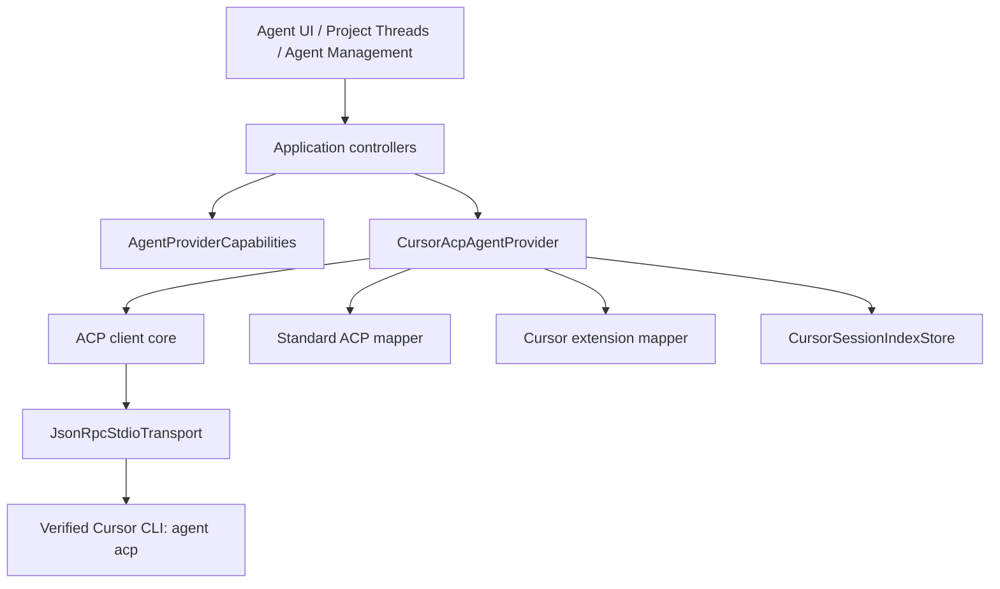

# Zeta 接入 Cursor Agent 的分析与分步落地方案

> 状态：Phase 1–5 已完成；Phase 6 工程门禁已落地，macOS/Linux/WSL 真实证据待补
>
> 编制日期：2026-07-13
>
> 目标平台：macOS、Linux、Windows
>
> 推荐协议：Cursor CLI 官方 ACP（`agent acp`）
>
> 推荐发布方式：默认关闭、用户显式启用的 Beta Provider

## 1. 结论摘要

Zeta 应通过 Cursor 官方 `agent acp` 接入 Cursor Agent，并继续使用现有的
stdio + JSON-RPC 传输层。Cursor ACP 与现有 Grok ACP 在协议主干上相同，能复用
`JsonRpcStdioTransport`、部分 `session/update` 映射和审批 UI；但不能直接把 Cursor
配置交给 `GrokAcpAgentProvider`，因为当前 Grok 实现混合了 xAI 扩展、Grok 本地历史、
Grok 模型命令和标题轮询。

推荐采用“共享 ACP 内核 + Cursor/Grok 薄适配层”的结构，并在接入 Cursor 前补齐
Provider capability 模型。Cursor 官方只保证 `initialize`、认证、`session/new` /
`session/load`、`session/prompt`、`session/update`、权限请求和取消等核心流程；thread
列表、删除、用量、模型/模式配置等必须以实际握手结果和 session payload 为准。Zeta
当前把重命名、归档、分叉、回滚、压缩等 Codex 能力做成了无条件接口，若不先能力化，
Cursor 接入后会出现无效按钮或静默 no-op。

主方案不选用 `agent -p --output-format stream-json`。该模式适合一次性脚本，但无法像
ACP 一样稳定表达双向权限请求、阻塞式提问/计划审批、长生命周期 session 和客户端能力
协商，只适合作为故障诊断或极简降级路径。

## 2. 本次范围

### 2.1 纳入范围

- Cursor CLI 安装定位、身份校验、版本和登录状态检测。
- Cursor ACP stdio 生命周期、认证、session 创建/恢复、流式消息、工具、审批和取消。
- Cursor session 在 Zeta 内的列表、恢复和历史回放。
- 模型、模式和其他 session config options 的动态展示与切换。
- Cursor 官方扩展请求：提问、计划审批、todo、子 Agent 状态和图片生成状态。
- Provider capability 驱动的 UI 降级。
- Agent 管理页接入、配置脱敏和实时 stderr 诊断。
- macOS、Linux、Windows 的定位、启动和回归测试。

### 2.2 暂不纳入首版

- Cursor Cloud Agent、Automations、私有 Worker 或远程任务接管。
- 解析 Cursor 未公开的本地数据库、会话文件或日志目录。
- 把 Cursor 用量并入当前 Codex 专用使用统计；没有官方稳定用量事件时不估算。
- 自动安装或自动更新 Cursor CLI。
- 把 Cursor API Key 明文保存到 `shared_preferences`、日志或命令行参数。
- 为 Cursor 伪造不受协议支持的归档、回滚、分叉、压缩或 steer 语义。

## 3. 当前项目分析

### 3.1 已有架构优势

当前 Agent 链路已经具备第三个 Provider 所需的大部分骨架：

```text
UI / ViewModel
  -> AgentProvider（中立领域接口）
    -> CodexAppServerAgentProvider
    -> GrokAcpAgentProvider
      -> JsonRpcStdioTransport
        -> CLI 子进程
```

- `lib/src/features/agent/domain/agent_provider.dart` 隔离了 UI 与具体协议。
- `JsonRpcStdioTransport` 已支持 JSONL 分帧、请求 id 关联、服务端请求、通知、stderr、
  超时和关闭清理，可直接作为 Cursor ACP 的传输层。
- `GrokAcpNotificationMapper` 已覆盖 ACP 的消息、思考、工具、计划和部分用量事件。
- `ActiveAgentProviderController` 已支持全局配置、启停、切换、共享实例和临时实例。
- `ProjectThreadsController` 已能跨已启用 Provider 聚合 thread。
- Agent 管理模块已按 repository 抽象出检测、连接测试、配置、日志等职责。
- 会话快照保存稳定 `providerId`，适合增加 `cursor` 而不污染项目会话结构。

### 3.2 当前阻碍 Cursor 接入的结构性问题

1. `AgentProviderKind.acp` 实际被工厂硬编码成 `GrokAcpAgentProvider`，协议类型与厂商实现
   混在一起，Cursor 配置不能直接复用该 kind。
2. `AgentProvider` 把大量 Codex 专属操作定义成必选方法，缺少 capability 描述；Grok
   已出现静默 no-op，继续扩展会放大误导性 UI。
3. `switchThread` 先 `readThreadHistory`、发送时再 `resumeSession`。Cursor 的官方历史
   来源是 `session/load` 回放，因此必须保证一次 load 同时完成历史捕获和 session 绑定，
   避免重复回放或把历史插入正在乐观发送的新消息之间。
4. 当前 Grok ACP mapper 既有标准 ACP 映射，也有 `_x.ai/*` 和 Grok 用量语义，不能直接
   改名后共享。
5. Agent 管理 controller 的配置清洗、来源标签和默认回退仍包含 Codex/Grok 二分支。
6. `ProjectThreadsController` 会向所有已启用 Provider 调用 `listThreads`。Cursor 官方页
   没有承诺 `session/list`，因此需 capability gate 和 Zeta 本地 session 索引兜底。
7. `AgentUserInputQaPair.options` 只保存展示文案，UI 目前按单选处理；Cursor
   `cursor/ask_question` 需要保留 option id，并支持 `allowMultiple`。
8. Provider 在应用启动时可能因模型预加载提前启动，而 Cursor 项目 MCP 要求在项目目录
   启动 Agent；Cursor 进程生命周期必须与 workspace 绑定或延迟到获得 workspace 后。
9. 当前使用统计仓库和页面仍是 Codex 专用实现，Cursor 不应只因成为 Provider 就被错误
   纳入统计口径。

### 3.3 当前开发环境暴露出的命令冲突

Cursor 当前官方入口名为通用的 `agent`。本机 `~/.local/bin/agent` 已指向 Grok CLI，
因此“basename 是 agent”或“PATH 中能找到 agent”都不足以证明它是 Cursor。新 locator
必须执行身份探测，例如组合检查：

- `--version` / `about --format json` 的产品标识；
- `help acp` 是否存在；
- ACP `initialize` 返回的 `agentInfo` 或认证方法是否符合 Cursor；
- 失败时继续尝试其他候选，不把第一个 `agent` 当成最终结果。

这是接入前置条件，不是后续优化项。

## 4. 官方能力基线与边界

截至 2026-07-13，Cursor 官方文档给出的 ACP 主流程为：

1. 启动 `agent acp`；
2. 通过 stdio 交换 newline-delimited JSON-RPC 2.0；
3. `initialize`，协议版本为 ACP v1；
4. 使用 `cursor_login` 执行 `authenticate`；
5. `session/new` 或 `session/load`；
6. `session/prompt`，消费 `session/update`；
7. 响应 `session/request_permission`；
8. 必要时发送 `session/cancel`。

Cursor 还定义了以下扩展：

- 阻塞请求：`cursor/ask_question`、`cursor/create_plan`；
- 通知：`cursor/update_todos`、`cursor/task`、`cursor/generate_image`。

阻塞请求若不响应，会让 turn 一直等待，因此 MVP 必须至少提供“正常响应、跳过/拒绝、
取消”三条路径。未知服务端请求必须返回明确 JSON-RPC method-not-supported 错误，不能
静默吞掉。

### 4.1 能力对照表

| 能力 | Cursor 官方基线 | Zeta 落地策略 |
| --- | --- | --- |
| stdio / JSON-RPC / JSONL | 明确支持 | 复用 `JsonRpcStdioTransport` |
| initialize / authenticate | 明确支持 | 协议 v1 + `cursor_login`，校验响应身份 |
| 新建 session | 明确支持 | `session/new`，`cwd` 为项目根目录 |
| 恢复与历史 | 明确支持 `session/load` | 捕获 replay，生成领域 history snapshot，并复用已 load session |
| prompt / streaming | 明确支持 | 标准 ACP mapper 转 `AgentEvent` |
| 权限审批 | 明确支持 | 映射 allow-once / allow-always / reject-once |
| 取消 | 明确支持 | `session/cancel` |
| session 列表 | ACP v1 可选能力；Cursor 页未承诺 | 握手支持则 `session/list`，否则读 Zeta 本地索引 |
| session 删除 | ACP v1 capability-gated | 仅能力存在时展示；本地索引可单独移除 |
| 重命名/归档/取消归档 | 无 Cursor 官方保证 | 默认隐藏，不做 no-op |
| 分叉/回滚/压缩/steer | 无 Cursor 官方保证 | 默认隐藏；只有未来明确能力或扩展时再实现 |
| 模型/模式 | session config options / modes | session 创建后动态读取并 `session/set_config_option` |
| 用量/上下文 | ACP `usage_update` 为可选 | 收到才展示，不估算、不虚构 |
| 图片输入 | 取决于 prompt capabilities | 握手允许才启用附件入口 |
| MCP | 用户/项目 `.cursor/mcp.json` | 首版尊重已有配置，不由 Zeta 重写；进程按 workspace 启动 |
| Cursor 扩展 | 官方明确列出 | 分阶段映射为中立提问、计划、todo、子任务和图片事件 |

### 4.2 参考资料

- [Cursor ACP 官方文档](https://cursor.com/docs/cli/acp)
- [Cursor CLI 参数](https://cursor.com/docs/cli/reference/parameters)
- [Cursor CLI 安装与更新](https://cursor.com/docs/cli/installation)
- [Cursor CLI 认证](https://cursor.com/docs/cli/reference/authentication)
- [Cursor CLI 权限配置](https://cursor.com/docs/cli/reference/permissions)
- [ACP v1 Session Setup](https://agentclientprotocol.com/protocol/v1/session-setup)
- [ACP v1 Prompt Turn](https://agentclientprotocol.com/protocol/v1/prompt-turn)
- [ACP v1 Session Config Options](https://agentclientprotocol.com/protocol/v1/session-config-options)
- [ACP v1 Session List](https://agentclientprotocol.com/protocol/v1/session-list)
- [ACP 官方 schema 仓库](https://github.com/agentclientprotocol/agent-client-protocol)

## 5. 方案选择

| 方案 | 优点 | 主要缺点 | 结论 |
| --- | --- | --- | --- |
| Cursor 官方 ACP | 双向请求、session、权限、流式工具、能力协商完整 | 需要处理可选能力和 Cursor 扩展 | **推荐** |
| Headless stream-json | 接入快、事件为 NDJSON | 一次性进程语义，双向审批/提问弱，历史与能力协商不足 | 仅诊断/降级 |
| 嵌入交互式 TUI | 与终端体验接近 | 需要 PTY、难结构化映射、跨平台和可访问性差 | 不采用 |
| 解析 Cursor 私有本地数据 | 可能看到全部历史 | 未公开、易随版本变化、存在隐私与兼容风险 | 不采用 |

## 6. 目标架构



目标依赖边界：

- presentation 只消费中立 capabilities、事件、session 配置和历史模型；
- application 负责编排 workspace、session、取消、恢复和 UI 降级；
- `features/agent/data/datasources/acp` 保存标准 ACP wire details；
- Cursor method、认证、进程参数、身份探测和扩展 payload 留在 Cursor data adapter；
- Cursor 原始 payload 不进入 UI；`raw` 仅用于诊断与兼容，不作为渲染必需输入。

## 7. 关键设计决策

### 7.1 Provider 标识与配置兼容

- 新增稳定 id：`cursor`。
- 新增 `AgentProviderKind.cursorAcp`。
- 保留既有 `AgentProviderKind.acp` 对 Grok 的含义，避免破坏 v1 持久化配置。
- 不通过 `providerId` 在工厂中偷换同一个 `acp` kind 的实现。
- 新增 `AgentProviderConfig.defaultCursor`：`command: agent`、`arguments: [acp]`、默认
  `enabled: false`。
- 继续使用 provider 配置 version 1；`_ensureBuiltinProviders` 宽容补入 Cursor，不修改
  已有 active provider。只有后续拆分 `protocolKind` / `adapterKind` 时才升级为 version 2。

### 7.2 Capability 取代静默 no-op

新增不可变 `AgentProviderCapabilities`，至少覆盖：

- session：create、load/resume、list、delete；
- history：replay/read；
- turn：prompt、cancel、steer；
- thread 操作：rename、archive、unarchive、fork、rollback、compact；
- input：text、local image、resource/mention；
- interaction：permission、user question、plan approval；
- config：models、modes、reasoning/config options；
- telemetry：usage/context；
- bootstrap：是否必须有 workspace、是否允许 eager model preload。

Capabilities 分成两层：

1. Provider 静态能力：初始化前即可判断，例如 Cursor 需要 workspace、无 Codex
   permission profile；
2. 握手后协商能力：从 `initialize.agentCapabilities`、prompt capabilities 和 session
   payload 更新。

应用层所有操作先检查 capability。未支持能力不展示；运行中能力变化时撤销入口并保留
明确的只读提示。现有 Grok no-op 应在本次基础重构中逐步改成 capability=false +
`UnsupportedError`，避免新逻辑继续依赖“调用成功但没有效果”。

### 7.3 Cursor CLI 定位与身份校验

新增 `CursorCliLocator`，候选顺序为：

1. 用户保存的绝对路径；
2. `cursor-agent` 兼容别名（若存在）；
3. PATH 中的 `agent`；
4. 官方常见安装位置，如 macOS/Linux 的 `~/.local/bin/agent`；
5. Windows 原生/WSL 的候选路径与脚本包装器。

每个候选都执行身份探测，不能只按 basename 接受。建议先检查无副作用命令，再做 ACP
握手：

```text
--version
about --format json
help acp
initialize -> agentInfo/authMethods
```

只有产品身份、ACP 能力和可执行路径都通过才持久化 `cliPath`。账号密钥只从 Cursor 已有
登录态、`CURSOR_API_KEY` / `CURSOR_AUTH_TOKEN` 等环境变量读取；Zeta 不新增密钥输入框。

### 7.4 Workspace 绑定的进程生命周期

Cursor Provider 不参与无 workspace 的 eager initialize。第一次 `startSession` /
`resumeSession` 时：

1. 取得规范化项目路径；
2. 以该路径作为子进程 working directory；
3. 启动 `agent acp` 并完成 initialize/authenticate；
4. 再发送 `session/new` 或 `session/load`。

切换到不同项目时关闭旧 Cursor peer，并为新 workspace 创建 peer。这样才能可靠加载项目级
`.cursor/mcp.json`、`.cursor/rules` 和 `AGENTS.md`，也避免一个共享进程跨项目泄漏状态。
Codex/Grok 的现有共享策略不在本次被强制改变。

### 7.5 标准 ACP 与厂商扩展拆分

从 `GrokAcpNotificationMapper` 提取：

- `AcpSessionUpdateMapper`：标准消息、思考、工具、计划、usage、session info、config option；
- `AcpPermissionMapper`：标准 permission options 与响应；
- `AcpContentCodec`：text/image/resource/mention 内容块；
- `AcpSessionReplayCollector`：把 `session/load` replay 组装为 history snapshot。

继续保留：

- `GrokAcpAgentProvider` 中的 `_x.ai/*`、本地 history、generated title、Grok model CLI；
- `CursorAcpAgentProvider` 中的 `cursor/*`、`cursor_login`、Cursor config options 和 CLI
  身份策略。

### 7.6 Session 列表与历史

Cursor session 使用双层来源：

1. 若握手包含 `sessionCapabilities.list`，调用官方 `session/list`；
2. 否则读取 `CursorSessionIndexStore`，仅展示由 Zeta 创建或成功恢复过的 session。

本地索引只保存：session id、provider id、cwd、title、createdAt、updatedAt、最后状态和
可选协议 metadata；不保存 prompt、回复正文、token、API key 或完整原始 payload。

打开历史 thread 时采用单次 load：

1. 设置 replay capture 状态；
2. 调用 `session/load`；
3. 在响应返回前收集 replay 的 `session/update`；
4. 生成 `AgentThreadHistorySnapshot`；
5. 标记该 session 已在当前 peer 中加载；
6. 后续 `resumeSession` 复用该状态，不再次发送 `session/load`。

若从 IDE 恢复后用户直接发送消息，也必须先完成 load；replay 在 capture 通道中构建历史，
不可直接混入已乐观插入的新用户消息。建议把现有“read + resume”最终收敛为应用层的
`openThread` 用例，但第一阶段可以通过 load cache 保持接口兼容。

### 7.7 模型、模式与 config options

- `listModels()` 初始化前允许返回空列表，不通过解析不稳定的 CLI 人类可读输出硬凑模型。
- 从 `session/new` / `session/load` 的 `configOptions` 读取 category=`model`、`mode`、
  `thought_level`、`model_config`，映射为中立 session 配置。
- 用户切换后调用 `session/set_config_option`；旧版仅有 modes 时回退
  `session/set_mode`。
- 收到 `config_option_update` / `current_mode_update` 时回写 UI。
- 只有 Cursor 实际返回的 reasoning/model 选项才展示；不沿用 Codex 的固定 effort 或
  service tier 假设。
- 持久化“上次选择”时以 provider + configId + value 为键；新 session 中不存在该选项时
  忽略并显示默认值。

### 7.8 权限与 Cursor 扩展

- `session/request_permission`：保存 option id、kind、name；“本次允许 / 始终允许 / 本次
  拒绝”映射到服务端提供的实际 option，而不是硬编码猜测。
- `cursor/ask_question`：扩展问答模型，使选项同时保留 `id` 和 `label`，并支持多选；UI
  返回 option id。
- `cursor/create_plan`：使用独立的计划审批领域事件/卡片，不伪装成命令审批；接受、拒绝、
  取消都必须回 JSON-RPC response。
- `cursor/update_todos`：映射为现有 `AgentPlanUpdatedEvent` 或新增 todo state，遵循 merge
  语义。
- `cursor/task`：映射为中立子任务工具事件，不启动 Zeta 自己的子进程。
- `cursor/generate_image`：首版只展示状态与已生成本地路径；Zeta 不代替 Cursor 调用图像
  服务，若请求形态需要客户端产图则明确拒绝并不中断主进程。
- 任何待响应请求在 turn 取消、进程退出或 provider dispose 时都要收到 cancelled/error，
  并清理 pending map。

### 7.9 Agent 管理页

新增 `CursorAgentManagementRepository`：

- 安装：locator + identity probe；
- 版本：`--version` / `about --format json`；
- 账号：`status --format json` 或 `whoami`；
- 连接测试：initialize + authenticate，不发送 prompt；
- 模型：握手没有模型时允许为空，不创建无意义 session 污染历史；
- 配置：全局 `~/.cursor/cli-config.json`，按 JSON 校验、备份、冲突检测、原子替换和脱敏；
- 项目配置：只展示当前项目 `.cursor/cli.json` / `.cursor/mcp.json` 的存在状态，首版不在
  全局管理页混合编辑；
- 日志：官方未保证稳定磁盘路径时，不扫描私有目录；展示当前 Zeta 捕获的脱敏 stderr
  ring buffer；
- 更新：只提示 `agent update`，不得在检测阶段自动执行。

## 8. 预计文件变更

| 模块 | 主要文件 | 变更 |
| --- | --- | --- |
| Domain | `agent_provider.dart` | 暴露 capabilities / bootstrap policy，能力不支持时明确失败 |
| Domain | `agent_provider_models.dart` | `cursor` id、`cursorAcp` kind、默认禁用配置、宽容补齐 |
| Domain | 新增 `agent_provider_capabilities.dart` | 静态与协商后能力快照 |
| Domain | 新增 `agent_session_config_models.dart` | config option、option id/label、mode/model 分类 |
| ACP core | 新增 `datasources/acp/acp_session_client.dart` | 标准 initialize/session/prompt/cancel/config 请求 |
| ACP core | 新增 `mappers/acp_session_update_mapper.dart` | 标准 ACP update 映射 |
| ACP core | 新增 `mappers/acp_permission_mapper.dart` | 标准审批请求/响应 |
| ACP core | 新增 `datasources/acp/acp_session_replay_collector.dart` | load replay 到 history snapshot |
| Cursor | 新增 `datasources/acp/cursor_acp_agent_provider.dart` | Cursor 生命周期、扩展、workspace peer |
| Cursor | 新增 `datasources/acp/cursor_process_starter.dart` | 身份验证后的跨平台进程启动 |
| Cursor | 新增 `mappers/cursor_acp_extension_mapper.dart` | `cursor/*` 请求与通知 |
| Cursor | 新增 `cursor_cli_locator.dart` | PATH/常见路径/身份探测 |
| Cursor | 新增 `local_history/cursor_session_index_store.dart` | 无 `session/list` 时的最小本地索引 |
| Factory | `default_agent_provider_factory.dart` | `cursorAcp` 路由 |
| Application | `agent_conversation_view_model.dart` | capability UI、workspace bootstrap、config options、load capture |
| Threads | `project_threads_controller.dart` | capability-gated list/delete/actions、本地 Cursor 列表兜底 |
| Management | `agent_management_models.dart` | Cursor definition |
| Management | 新增 `cursor_agent_management_repository.dart` | 检测、账号、握手、JSON 配置、stderr |
| Composition | `ide_home.dart` | 注册 Cursor management repository |
| Presentation | Agent header/composer/thread menus/cards | 隐藏不支持操作；Cursor 模式、提问、计划审批 |
| Tests | `test/src/features/agent/...` | locator、ACP core、Cursor provider、replay、extensions |
| Tests | `test/src/features/agent_management/...` | Cursor 检测/配置/脱敏 |
| Tests | `test/src/features/project_threads/...` | capability 与本地索引聚合 |
| Docs | `docs/design_document.md` 等 | Provider、ACP、管理、测试与限制同步 |

## 9. 分步实施计划

### Phase 0：协议基线与真实 CLI 探针

目标：在改业务代码前确认目标 Cursor CLI 的实际 wire shape。

步骤：

1. 从 ACP 官方仓库 pin 协议 v1 schema/tag，记录来源、artifact 版本、hash 和许可证。
2. 根据 Cursor 官方 ACP 文档建立 Cursor 扩展 fixtures；扩展没有标准 schema 时以最小
   宽容 codec 处理未知字段。
3. 新增只读 smoke 工具：定位 Cursor、打印身份摘要、initialize/authenticate、记录
   capabilities，然后关闭；默认不创建 session、不发送 prompt。
4. 在已登录的 macOS、Linux、Windows 环境采集脱敏握手 fixture。
5. 验证 `session/new`、`session/load`、`session/list`、config options、prompt
   capabilities 在目标 CLI 版本中的实际支持情况。
6. 建立 capability matrix，所有未观测到的能力默认 false。

退出标准：

- 能稳定区分 Cursor `agent` 与其他同名 CLI；
- 三个平台至少各有一次身份/握手结果，或明确记录未覆盖平台；
- 核心方法与 Cursor 扩展 fixture 可被测试读取；
- 没有执行计费 prompt。

### Phase 1：Provider 能力化与 ACP 公共层提取（已完成，2026-07-13）

目标：先消除接入第三个 Provider 时的错误语义。

步骤：

1. 增加 `AgentProviderCapabilities` 和 bootstrap policy。
2. Codex 返回与当前实现一致的能力；Grok 按现状返回真实能力，不再把无支持操作当成功。
3. Project thread 菜单、header 操作、composer 附件和选择器改为 capability 驱动。
4. 提取标准 `AcpSessionUpdateMapper`、permission mapper、content codec。
5. Grok 保持 xAI 扩展和本地历史策略不变，只改为调用共享 mapper。
6. 为 config option 和带 id 的问答选项建立中立领域模型。

实际落地：

- 已增加 `AgentProviderCapabilities`、`AgentProviderBootstrapPolicy`，并为 Codex/Grok
  返回当前真实能力。
- Grok 的重命名、归档、取消归档、删除、分叉、回滚、压缩和 steer 不再静默
  no-op/错误降级，误调用统一抛出 `UnsupportedError`。
- Project thread 菜单、Agent header、composer 附件及模型/策略选择器已改为
  capability 驱动。
- 已提取 `AcpSessionUpdateMapper`、`AcpPermissionMapper`、`AcpContentCodec`；Grok
  mapper 只保留 xAI 扩展入口和本地历史策略。
- 已增加中立 `AgentSessionConfigOption`、带稳定 id 的 `AgentUserInputOption` 与
  `allowMultiple`，旧标签选项和 v1 provider 配置继续兼容。
- 已补充领域、共享 ACP fixture、Grok 明确失败、多选问答和 capability UI 回归测试。
- 已修正运行中 turn 的 Widget 测试等待方式，完整 `flutter test` 共 350 项通过。

退出标准：

- Codex/Grok 现有测试通过；
- Grok 不支持的 thread 操作不会显示；
- 标准 ACP fixture 在共享 mapper 中通过；
- 工厂和 v1 配置仍能读取旧数据。

### Phase 2：Cursor CLI 管理与核心对话 MVP（已完成，2026-07-14）

目标：用户可显式启用 Cursor，并完成单个项目内的安全对话。

步骤：

1. 增加 `cursor` provider config、`cursorAcp` kind 和 factory 分支，默认禁用。
2. 实现 `CursorCliLocator`、identity probe 和跨平台 process starter。
3. 实现 workspace-scoped `CursorAcpAgentProvider`。
4. 完成 initialize、authenticate、session/new、prompt、streaming、permission、cancel、
   dispose。
5. 处理未知通知、未知 content block、错误 response、stderr、进程早退和超时。
6. 实现 Agent 管理页的安装、版本、账号和无计费连接测试；连接成功后允许启用。
7. 支持 text；图片/mention 只有 prompt capability 明确允许时才启用。

实际落地：

- 已增加稳定 `cursor` id、`cursorAcp` kind 与默认关闭的 Cursor 配置；旧 v1 配置会宽容
  补入 Cursor，且不改变 active provider。
- 已实现 `CursorCliLocator` 与 process starter：逐候选执行产品/版本/ACP 身份探测，跳过
  Grok 等同名 `agent`，保存路径和每次启动前都会重新验证。
- 已实现 workspace-scoped `CursorAcpAgentProvider`：项目切换会取消挂起审批、关闭旧 peer
  并重新 initialize/authenticate；无 workspace 不允许 eager initialize。
- 已支持 session/new、文本 prompt、标准消息/思考/工具/计划流、服务端权限请求、拒绝、
  取消、未知 request 错误响应、协议警告、stderr 脱敏处理、进程早退和超时收尾。
- 图片与 resource/mention capability 默认关闭，只有 initialize 明确声明后才开放；图片按
  ACP MIME/base64 block 发送。
- Agent 管理页已注册 Cursor，提供安装身份、版本、账号和无 session/无 prompt 连接测试；
  只有连接测试成功后才允许启用。
- 已增加配置兼容、locator 冲突、process 参数、provider 生命周期/流式/权限/取消、管理
  检测和敏感信息遮挡回归测试。

退出标准：

- 可在项目中选择 Cursor 创建新 thread；
- 文本流、工具卡、计划、审批、取消和错误状态正确；
- 拒绝权限不会卡死 turn；
- workspace 切换会重建 Cursor peer；
- Cursor 未安装、未登录、命令冲突都有可读错误；
- Codex/Grok 无行为回归。

### Phase 3：Session 列表、历史与恢复（已完成，2026-07-14）

目标：Cursor thread 可进入 Zeta 的项目列表和 IDE 恢复链路。

步骤：

1. 实现 `CursorSessionIndexStore` 版本化、宽容读取和原子更新。
2. session/new 成功后写入最小索引；title/session_info_update 后更新 metadata。
3. 支持 capability-gated `session/list`，并与本地索引去重合并；服务端数据优先。
4. 实现 load replay collector 与 history snapshot mapper。
5. 处理 `switchThread -> read history -> resume` 的单次 load cache。
6. 应用恢复后直接发送前先完成 load，不允许 fallback 新建 session 覆盖旧 thread。
7. `session/delete` 仅在 capability 存在时调用；否则只允许“从 Zeta 列表移除”，并明确
   不代表删除 Cursor 端历史。
8. 搜索、分页、路径规范化、标题更新与 provider 归属加入测试。

实际落地：

- 已实现版本化 `CursorSessionIndexStore`：使用 shared preferences 保存最小索引，
  宽容读取损坏/旧版/重复条目，并通过进程内串行 read-modify-write 避免并发丢更新；
  metadata 只保留短标量并过滤 prompt、token、auth 等敏感字段。
- Cursor 静态声明本地索引列表能力；握手后仅在
  `sessionCapabilities.list/delete` 明确存在时调用远端方法。`session/list` 与本地索引
  按 session id 去重、服务端 metadata 优先，并支持项目路径过滤、搜索和客户端分页。
- 已新增标准 ACP `AcpSessionReplayCollector`，在 `session/load` 响应返回前隔离收集
  user/agent message、thought、tool、plan、usage 和 turn 终态，生成有序 history snapshot，
  replay 不进入 live timeline。
- `readThreadHistory -> resumeSession` 共享 workspace-scoped loaded-session cache，同一 peer
  内只执行一次 `session/load`；旧 IDE 快照即使缺少 session locator，也可用 thread 的
  project path 恢复。直接发送前的 resume 同样先 load，失败时明确终止且不创建新 session。
- `session_info_update` 会同步标题、更新时间、安全 metadata 和列表事件；prompt 生命周期
  会更新索引的最后状态与活跃时间。
- 未协商 `session/delete` 时只允许“仅从 Zeta 列表移除”，UI 明确区分本地移除和远端
  删除；协商成功后才发送标准 `session/delete`。
- 已补充索引兼容/并发、路径规范化、搜索分页、远端合并、回放顺序、单次 load cache、
  fail-closed 恢复和删除分流测试；`flutter analyze` 无问题，完整 `flutter test` 共 384 项通过。

退出标准：

- Zeta 创建的 Cursor session 重启后可见、可打开、可继续；
- history 不重复、不乱序、不混入新消息；
- `session/list` 缺失时不影响 Codex/Grok 聚合列表；
- session/load 失败时 fail-closed，不偷偷创建新 session。

### Phase 4：模型、模式与 Cursor 阻塞扩展（已完成，2026-07-14）

目标：补齐 Cursor 与原生 CLI 的关键交互体验。

步骤：

1. 解析 session config options 并展示模型、agent/plan/ask、thought level 等动态选项。
2. 实现 `session/set_config_option` 与旧 mode fallback。
3. 支持 option update/current mode update 的双向同步。
4. 完成 `cursor/ask_question` 多题、多选、跳过与取消。
5. 完成 `cursor/create_plan` 的 markdown 计划、todo、阶段和接受/拒绝。
6. 将 `cursor/update_todos` 映射为 plan/todo 状态。
7. 将 `cursor/task`、`cursor/generate_image` 映射为中立时间线事件。
8. 对阻塞请求增加超时、turn cancel、provider dispose 的收尾测试。

实际落地：

- 新增标准 `AcpSessionConfigMapper` 与中立 session config 领域模型；优先读取
  `configOptions`，仅在服务端未提供新协议时回退 legacy modes。
- `CursorAcpAgentProvider` 已支持 `session/set_config_option`、`session/set_mode` 回退、
  `config_option_update` 与 `current_mode_update`；配置 UI 只展示服务端声明的 select / boolean
  选项，并在服务端成功回执后更新状态。
- 新增 `CursorAcpExtensionMapper`，隔离 `cursor/*` wire payload；提问保留稳定 question / option
  id 和多选语义，计划审批使用独立领域事件与时间线卡片，不与普通权限审批混用。
- `cursor/update_todos` 已按 session 执行 merge，`cursor/task` 与
  `cursor/generate_image` 已映射为中立工具时间线事件；客户端产图请求会明确返回
  method-not-supported。
- 所有待响应的 permission、question 与 plan request 均配置超时，并在 turn cancel、workspace
  切换、进程退出和 provider dispose 时回包、清理 timer 与 UI pending state。
- 已补充 config mapper、Cursor 扩展 mapper、provider 生命周期、timeline store 与 widget
  测试；`flutter analyze` 无问题，完整 `flutter test` 共 402 项通过。

退出标准：

- 所有 Cursor 阻塞请求都有响应路径；
- plan/ask/agent 切换以服务端回执为准；
- 模型/模式缺失或变化不会导致 UI 崩溃；
- 未知 Cursor 扩展记录一次诊断后安全忽略或明确拒绝。

### Phase 5：配置、安全与可观测性（已完成，2026-07-14）

目标：使 Cursor Provider 可长期维护，而不是仅能跑通 demo。

步骤：

1. 增加 Cursor JSON 配置读取、校验、脱敏、冲突检测、备份和原子保存。
2. 明确全局 CLI 配置与项目 `.cursor` 配置边界。
3. 增加脱敏 stderr ring buffer，限制行数、单行长度和敏感字段。
4. 记录 CLI 版本、ACP protocolVersion、agentInfo、协商 capabilities 和退出原因；不记录
   prompt 正文或密钥。
5. 对 Cursor 自动更新导致的 capability 变化给出“重新检测”提示，不自动执行更新。
6. 增加 feature flag/Beta 标记和一次性兼容告警。

实际落地：

- Cursor 全局 `cli-config.json` 已支持 JSON object 校验、递归敏感字段脱敏、外部修改签名
  冲突检测、保存前备份、临时文件写入与原子替换；符号链接配置仍拒绝写入，保存失败不会
  用半成品覆盖原文件。
- Agent 配置页已明确只编辑全局 `~/.cursor/cli-config.json`；项目内
  `.cursor/cli.json`、`.cursor/mcp.json`、规则和 `AGENTS.md` 只随 workspace 加载，不在
  全局管理页读取、合并或改写。
- 新增进程内 `CursorDiagnosticsStore` ring buffer，默认最多 200 行、单行最多 1000 字符；
  stderr、协议告警和错误在入库前统一折叠换行、遮挡凭证与用户目录，不扫描 Cursor 私有
  日志目录，也不记录 prompt 正文或完整 wire payload。
- initialize 成功后只记录 CLI 版本、ACP protocolVersion、agentInfo 白名单字段、协商
  capability 名称与安全 fingerprint；同时记录定位/启动、认证、session、turn、映射告警、
  workspace 切换和意外退出阶段，管理页可搜索、筛选和复制这些内存诊断。
- 检测结果会持久化 capability fingerprint；Cursor CLI 版本或协商能力变化时给出重新检测
  与复核提示，Zeta 不执行自动更新。
- Cursor 继续默认关闭，并在 Agent 列表和详情显示 Beta；首次启用前展示一次性兼容告警，
  用户确认只持久化非敏感 acknowledgement 标志，后续不重复弹出。
- 已补充诊断脱敏/容量、握手摘要、stderr/退出、嵌套 JSON 脱敏、配置冲突与备份、版本变化、
  Beta 提示及配置边界的单元和 Widget 回归测试；`flutter analyze` 无问题，完整
  `flutter test` 共 413 项通过。

退出标准：

- 敏感配置、API key、auth token 不进入持久化摘要和日志；
- 配置外部修改可检测，保存失败不损坏原文件；
- 诊断信息足以区分定位、认证、握手、session、turn 和协议映射失败。

### Phase 6：跨平台验收、文档与发布

目标：完成可发布质量门禁。

步骤：

1. macOS arm64/x64、Linux、Windows 原生与 WSL 按支持范围执行真实 CLI smoke。
2. 覆盖路径含空格、中文、符号链接、无 HOME、受限 PATH 和脚本包装器。
3. 运行格式化、静态分析、全量测试和真实 Cursor smoke。
4. 更新设计文档、开发者指南、工程规范、产品需求和项目记忆。
5. 编写用户安装、登录、启用、权限、MCP、排错和卸载说明。
6. Beta 发布后观察协议未知事件计数、初始化失败率和 session/load 失败率，再决定默认展示
   层级；保持默认禁用，直到至少两个 Cursor CLI 版本通过回归。

实际落地（2026-07-14）：

- 新增 `tool/smoke_cursor_acp.py`：多信号定位 Cursor、默认使用中文/空格临时 Git workspace，
  验证 initialize/authenticate、session/new、只读 prompt 流、进程重启后的 session/load replay、
  cancel 与协商后的 list/delete；全部工具权限默认拒绝，输出只保留脱敏摘要。
- smoke 首次运行发现 Windows 官方 `.cmd/.ps1` 包装器可能在单杀父进程后遗留 Node 子进程；
  `cursorProcessStarter` 已为 Windows wrapper 增加 `taskkill /T` 进程树收尾，通用 JSON-RPC
  transport 关闭时等待进程退出，并补充回归测试。
- Cursor locator 新增无 HOME、受限 PATH、中文空格路径与损坏候选回归；既有同名 Grok
  `agent` 冲突和 Windows wrapper 参数测试继续通过。
- 新增用户安装/登录/启用/权限/MCP/排错/卸载指南与独立发布验收矩阵；工程规范、开发者
  指南、设计文档、产品需求和项目记忆已同步当前 Cursor Beta 边界。
- Windows x64 原生真实 smoke 已通过：2026-07-14，Cursor CLI
  `2026.07.09-a3815c0`，`.cmd` 包装器，完整 10/10；覆盖中文/空格路径、15 条 prompt update、
  3 条 replay update、cancel 与 session/list。该版本未声明 session/delete，按能力安全跳过。
- `dart format .` 无额外改动，`flutter analyze` 无问题，全量 `flutter test` 416 项通过。
- 当前机器未安装 WSL 发行版，也没有 macOS/Linux runner；这些平台及第二个 Cursor CLI
  版本保持“待执行”，因此 Cursor 继续默认关闭的有限 Beta，不提升默认展示层级。

当前判定：工程实现和本机 Windows 验收完成；完整跨平台退出标准尚未满足。发布记录不得把
自动化覆盖替代为 macOS/Linux/WSL 的真实通过证据。

退出标准：

- `flutter analyze` 无新增问题；
- `flutter test` 全量通过；
- 真实 CLI 核心 smoke 在声明支持的平台通过；
- 文档明确支持/不支持能力与数据边界；
- 可通过关闭 Cursor Provider 完整回滚，不影响 Codex/Grok。

## 10. 测试矩阵

### 10.1 单元测试

- Cursor locator 跳过 Grok `agent`、损坏软链接、错误脚本和伪造版本输出。
- Windows `.exe/.cmd/.bat/.ps1` 启动参数与 `acp` 位置正确。
- provider config 旧 v1 数据补入 disabled Cursor，active provider 不变。
- initialize/auth capability 解析、未知字段和未来 capability 宽容处理。
- 标准 ACP message/thought/tool/plan/usage/config/session info 映射。
- permission option id/kind 映射和所有响应结果。
- ask question 多选 id 映射、plan approval、todo merge。
- session load replay 的分组、消息 id、工具更新、turn 终态与空历史。
- 本地 session index 的旧版本、损坏、重复、路径归一化和并发写。
- 进程退出、请求超时、取消、dispose 和 pending server request 清理。

### 10.2 Widget / application 测试

- Agent 管理列表展示 Cursor，默认禁用，检测成功后可启用。
- 未登录、未安装、命令冲突和 handshake 失败的状态与建议文案。
- Cursor 不支持的 thread 菜单项不显示。
- session/list 不支持时仍显示 Zeta 本地 Cursor threads。
- 切换 Codex/Grok/Cursor 时 provider、模型、模式和时间线不串线。
- Cursor 权限、提问和计划卡在窄/宽布局及大字体下可用。
- 恢复 thread 后发送不会新建 session。
- provider 被禁用时既有 thread 只读行为一致。

### 10.3 真实 CLI smoke

最小 smoke 不写业务文件，使用临时 Git 项目：

1. 定位与身份确认；
2. initialize/authenticate；
3. session/new；
4. 发送只读 prompt；
5. 验证 agent_message_chunk、tool_call、stopReason；
6. session/load 并核对 replay；
7. 触发需要权限的命令并分别 allow/reject；
8. cancel 长回合；
9. 若 capability 存在，测试 session/list/delete/config option；
10. 关闭 stdin、杀死进程、重启并恢复。

真实测试日志必须脱敏；CI 无 Cursor 凭据时自动 skip，不把缺少外部 CLI 当单元测试失败。

## 11. 验收标准

### P0 必须满足

- Cursor CLI 身份不会与 Grok 或其他 `agent` 命令混淆。
- 新建、流式消息、工具、权限、取消、错误和关闭流程可靠。
- Cursor Provider 默认禁用，不改变现有用户 active provider。
- UI 不展示协议不支持的操作。
- 无密钥明文持久化和日志泄漏。

### P1 必须满足

- Zeta 创建的 Cursor session 可列出、重启恢复、加载历史和继续对话。
- `session/list` 不可用时有明确且有限的本地索引 fallback。
- 模型、模式和 config option 使用服务端动态数据。
- Cursor 阻塞扩展不会导致 turn 永久挂起。

### P2 增强项

- usage/context 仅在事件存在时展示。
- MCP 状态与项目配置提示更完整。
- Cursor 子任务、todo 和图片生成获得更丰富的时间线样式。

## 12. 风险与缓解

| 风险 | 影响 | 缓解 |
| --- | --- | --- |
| `agent` 命令名冲突 | 启动错误 CLI | 多信号身份探测 + 绝对路径持久化 + 握手二次校验 |
| Cursor CLI 自动更新 | wire shape 或行为变化 | pin ACP schema、能力协商、未知字段宽容、两个版本回归 |
| Cursor 未实现可选 session/list | 项目列表缺历史 | 本地最小索引；UI 标注“Zeta 会话”范围 |
| session/load replay 与现有 read/resume 分裂 | 历史重复/乱序 | 单次 load collector + loaded-session cache，后续收敛 openThread 用例 |
| 阻塞扩展未响应 | turn 永久等待 | request 路由表、默认拒绝、取消/dispose 收尾、超时测试 |
| workspace 进程复用 | 读取错误项目规则/MCP | Cursor peer 按 workspace 创建，切项目即重建 |
| API key 泄漏 | 安全事故 | 只读环境/官方登录态，不进参数、prefs、日志 |
| 可选用量缺失 | 错误统计 | 不估算、不并入 Codex 统计，收到官方事件才展示 |
| 能力按钮仍按 provider kind 判断 | 错误 UX | Phase 1 先完成 capability 驱动，再启用 Cursor |
| Windows 包装器/编码差异 | 无法启动或 JSON 损坏 | 复用 launcher 策略、malformed UTF-8 容忍、平台 fixture/smoke |

## 13. 推荐提交切片

1. `refactor(agent): 引入 provider capabilities`
2. `refactor(acp): 提取标准 ACP 映射与客户端`
3. `feat(cursor): 添加 CLI 定位与管理检测`
4. `feat(cursor): 接入 ACP 核心对话流程`
5. `feat(cursor): 支持会话历史与恢复`
6. `feat(cursor): 支持模型模式与交互扩展`
7. `docs(cursor): 补充接入与排错文档`

每个切片都应独立通过相关测试；不要在单个提交中同时重写 Grok 历史、Cursor Provider 和
Agent 管理 UI。

## 14. 最终 Definition of Done

- Cursor 通过官方 ACP 接入，未依赖私有文件格式。
- Provider capability 成为 UI 操作的唯一事实来源。
- Cursor/Grok 共享标准 ACP 核心，厂商扩展彼此隔离。
- session 创建、恢复、历史、权限、取消和阻塞请求全部有自动化测试。
- CLI 身份冲突、无登录、升级后能力变化和进程退出均可诊断。
- Cursor 默认禁用且可独立回滚，Codex/Grok 全量回归通过。
- `docs/engineering_standards.md`、`docs/developer_guide.md`、
  `docs/design_document.md` 与最终实现保持一致。
