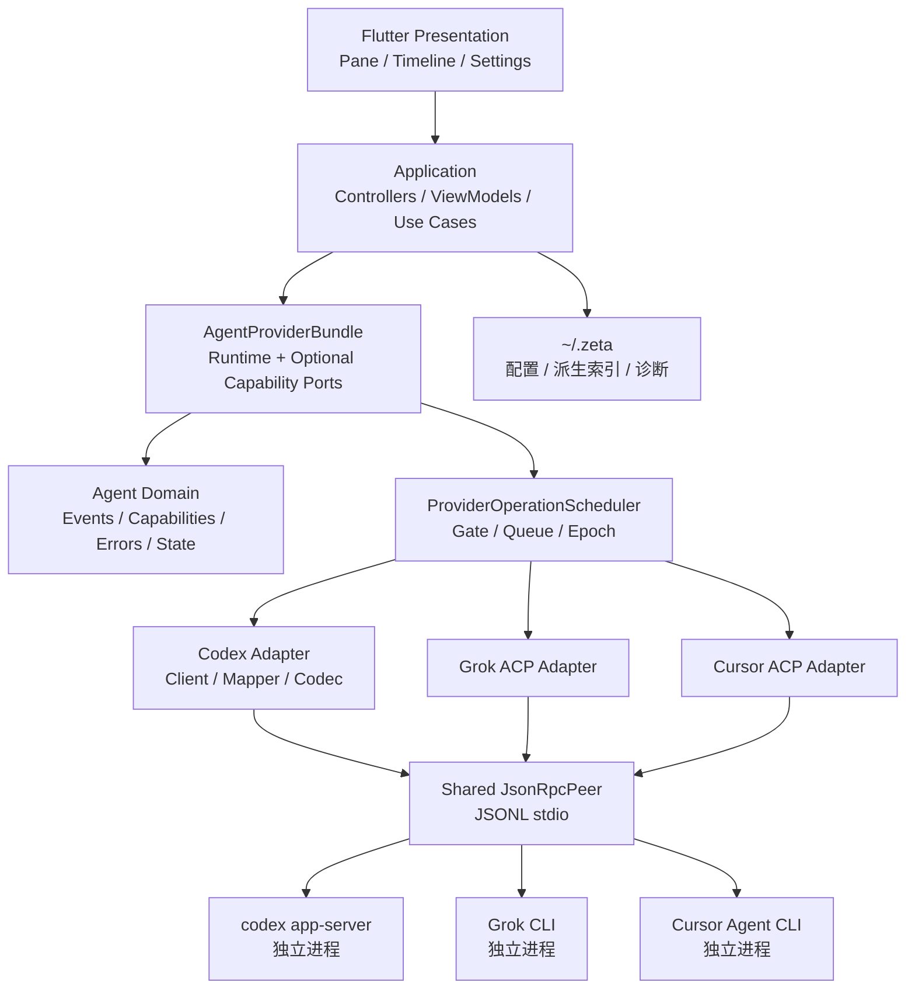
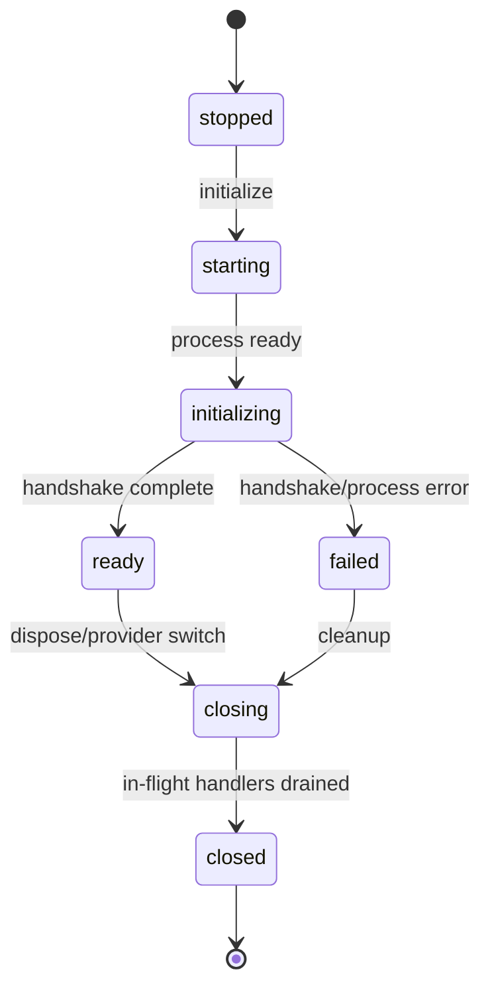

# Zeta 多 Agent Provider 协议演进技术详设书

> 文档状态：可实施评审稿  
> 最后更新：2026-07-16  
> 适用项目：Zeta（Flutter Desktop Agent IDE shell）  
> 适用范围：Codex app-server、Grok ACP、Cursor ACP 及后续协议型 Agent Provider

## 0. 文档定位

本文定义 Zeta Agent 运行时下一阶段的详细设计，目标是直接指导分阶段开发、测试、验收和 Code Review。

本文不是 Codex 功能清单，也不要求把 Codex 的全部能力复制到 Zeta。核心路线是：

1. 先修复已经确认的协议语义漂移和错误产品承诺。
2. 保持 `codex app-server` 为独立进程和协议边界。
3. 不把 Codex Core、工具执行、沙箱或会话存储移植进 Zeta。
4. 把可复用的生命周期、能力协商、并发控制和数据边界设计抽象为多 Provider 能力。
5. 在稳定边界建立后，再接入账户、配置、Review、MCP、Skills 等增量能力。

本文与现有文档的关系：

- `plan/codex_app_server_adaptation_plan.md` 继续作为历史适配清单和已完成功能记录。
- 本文作为后续架构演进、协议兼容和产品语义的实施基线。
- 若两者在 `turn/steer`、`thread/rollback`、Permission Profile 或协议版本上冲突，以本文和目标版本 Schema 为准。
- 架构边界仍须遵守 `docs/design_document.md`、`docs/engineering_standards.md` 和 `AGENTS.md`。

## 1. 结论摘要

### 1.1 总体结论

Zeta 当前采用“Flutter UI/Application → 中立 Agent Domain → Provider Data Adapter → 外部 CLI 进程”的方向正确，不需要推倒重建。

本轮演进重点不是内嵌 Codex，而是补齐以下系统能力：

- 精确的协议版本和运行时身份识别。
- 能力可用性、稳定性、弃用状态和不可用原因的统一表达。
- 按 Provider、Project、Thread 等资源范围串行化操作。
- 连接关闭门控、监听 generation、请求关联和反向请求生命周期。
- Provider API 优先、Provider 本地历史只读回退的历史策略。
- 以可选能力端口替代不断膨胀的单一 `AgentProvider` 必选接口。

### 1.2 首要问题

以下事项必须先于新功能处理：

| 问题 | 当前风险 | 目标处理 |
| --- | --- | --- |
| `turn/steer` 未发送必需的 `expectedTurnId`，并发送无效 `cwd` | 运行中追加指令可能直接失败 | 修正请求模型和并发前置条件，增加协议契约测试 |
| `thread/rollback` 已弃用 | “编辑并重试”建立在即将移除的能力上 | 移除产品承诺，迁移为基于 `thread/fork.lastTurnId` 的分支工作流 |
| Permission Profile 仅展示但声明为可应用 | UI 选择与实际运行权限不一致 | 拆分“发现/展示”和“选择/应用”两个能力 |
| 能力为静态布尔值 | 无法表达版本不支持、实验性或弃用 | 引入有效能力描述符和运行时协商结果 |
| 在线历史优先解析内部 JSONL | 依赖 Provider 内部存储格式 | 在线优先公开协议，JSONL 仅用于离线/旧版本只读回退 |
| Codex `initialize` 响应未进入运行时状态 | 无法诊断实际 CLI、平台和兼容性 | 保存中立 `AgentRuntimeInfo` 并驱动能力策略 |

### 1.3 明确不做

- 不在 Dart/Flutter 中重写 Codex Core。
- 不由 Zeta 接管 Codex 的工具执行、审批裁决、沙箱实现或命令执行器。
- 不复制、迁移或重写 `~/.codex`、`~/.grok`、`~/.cursor` 中的 Provider 会话正文。
- 不为统一 UI 伪造 Provider 不具备的能力。
- 不通过普通 Prompt 模拟“稳定协议能力”后仍把它声明为原生能力。
- 当前不把 WebSocket、远程 App Server、Realtime/Voice 作为默认运行形态。
- 当前不默认开启 Codex experimental API。

## 2. 协议与版本基线

### 2.1 本次设计采用的证据层级

按以下优先级判断协议事实：

1. 实际启动的目标 CLI 生成的 stable Schema。
2. 对应 release 的 `app-server-protocol` 源码和测试。
3. 对应 release 的 App Server README/官方文档。
4. Zeta 运行日志和脱敏抓包，仅作为具体实例证据。

不得以最新版文档推断旧版 CLI 的精确字段，也不得用 Zeta 当前实现反推协议事实。

### 2.2 当前版本状态

| 项目 | 版本 | 用途 |
| --- | --- | --- |
| Zeta 当前 pinned Schema | `0.142.5` | 当前可复现兼容基线 |
| 本机 Codex CLI/技能缓存 Schema | `0.144.1` | 本机运行核对，不作为 `0.144.5` 字段事实 |
| 本次源码分析目标 | `0.144.5` | 目标设计基线 |
| 2026-07-16 官方 latest release | `0.144.5` | 最新正式 release |

从 `0.142.5` 到 `0.144.5` 的四类方法联合类型数量没有变化，但存在较多字段级和语义级变化。因此升级工作应被定义为“受控协议迁移”，不能只替换版本号。

### 2.3 稳定性边界

默认产品能力只依赖 stable API。典型边界如下：

| 能力 | 0.144.5 状态 | Zeta 策略 |
| --- | --- | --- |
| `initialize` / `initialized` | 稳定 | 默认使用 |
| `thread/start` / `resume` / `read` / `list` | 稳定 | 默认使用 |
| `turn/start` / `steer` / `interrupt` | 稳定 | 修正后默认使用 |
| `thread/fork.lastTurnId` | 0.144.5 稳定字段 | 用于分支到已结束 turn；旧版不承诺 |
| `thread/rollback` | 已弃用、即将移除 | 停止新增依赖并移除产品入口 |
| Permission Profile 列表/展示 | 可发现 | 与实际应用能力分开表达 |
| thread/turn 的 `permissions` 选择 | 实验性 | 默认关闭，必须独立功能开关 |
| 分页历史、`thread/turns/list`、`thread/items/list` | 实验性 | 当前不进入稳定领域契约 |
| Dynamic Tools、多 Agent 关系过滤、Realtime | 实验性或高风险 | 按真实需求单独立项 |
| `review/start` | 稳定 | Phase 3 可选能力 |
| `account/*`、`config/*`、`skills/list`、MCP 状态/OAuth | 稳定主路径 | Phase 3 分端口接入 |

### 2.4 运行时兼容策略

新增 `AgentRuntimeCompatibility`：

```dart
enum AgentRuntimeCompatibilityStatus {
  supported,
  supportedWithLimitedCapabilities,
  newerUntested,
  olderUnsupported,
  protocolMismatch,
}
```

规则：

- Zeta 必须记录实际 CLI 版本、协议身份、初始化返回的服务端信息和当前 Schema 目标版本。
- 实际版本低于某能力最小版本时，只关闭该能力，不应让整个 Provider 无条件失效。
- 关键核心协议不兼容时，Provider 进入 `protocolMismatch`，阻止创建新回合，但仍可尝试本地只读历史。
- 实际版本高于已测试版本时显示“版本未验证”，保守关闭依赖新增字段的能力；不得假定向前兼容。
- `forkAtTurn` 仅在确认支持 `lastTurnId` 时可用。旧版本只能提供“复制当前完整线程”的普通 fork，不能冒充“从此处重试”。

## 3. 现状架构评估

### 3.1 已有优势

当前实现中应保留和强化的部分：

- `JsonRpcPeer` 已支持请求/响应 ID 关联、客户端通知、服务端通知、服务端反向请求和响应。
- JSONL stdio 分帧、stderr、协议错误和进程退出已经集中在 transport。
- Codex 请求编码、通知映射、审批映射和历史解析均位于 data 层。
- UI 主要消费 `AgentEvent`、`AgentThreadSummary`、`AgentPermissionRequest` 等中立模型。
- Cursor 已经根据 initialize 响应动态收窄部分能力，证明运行时能力协商在现有架构中可行。
- Provider 切换和复杂异步加载已有 token/version guard。
- 未知通知有计数，未知服务端请求返回明确 JSON-RPC error，不再伪造成功。

### 3.2 当前结构性问题

`AgentProvider` 当前包含 23 个必选方法，混合了：

- 运行时生命周期。
- Thread 查询和变更。
- Turn 执行和 steering。
- Permission、Guardian、模型、配置。
- Provider 特有的历史和订阅语义。

直接后果是 Grok/Cursor 必须用空列表、no-op 或 `UnsupportedError` 实现大量不具备的能力，同时 `AgentProviderCapabilities` 又必须手工与这些实现保持一致。

另一个问题是能力只有布尔值，无法表达：

- 服务端协议声明支持，但客户端尚未实现。
- 客户端实现存在，但运行版本过旧。
- 能力可用，但属于 experimental。
- 能力仍可调用，但已经 deprecated。
- 能力暂时不可用，原因是未登录、工作区缺失或连接未就绪。

## 4. 架构决策

### ADR-01：外部进程是 Provider 执行边界

Codex、Grok、Cursor CLI 均作为独立进程运行。Zeta 负责：

- 进程定位、启动、关闭和状态诊断。
- 协议握手、消息编解码和请求关联。
- 将 Provider 语义映射为中立领域模型。
- 呈现审批、提问、进度、历史和错误。

Provider 负责：

- 模型调用和上下文管理。
- 工具选择与执行编排。
- 沙箱、命令执行和文件修改。
- Provider 原生会话历史和配置。

### ADR-02：协议细节只存在于 data adapter

以下内容不得进入 application/presentation：

- `threadId` 以外的 Codex 原始 payload。
- ACP `_meta`、厂商扩展 method 和 JSON key。
- Provider 专属错误对象、审批响应结构和配置层形状。

Data mapper 必须将其转换为中立模型；诊断确需保留原始信息时，只保存经过脱敏、限长的摘要。

### ADR-03：正确性优先于抽象

Phase 0 先在现有结构内修正 `turn/steer`、历史请求、权限承诺和 rollback 产品语义。不得以“等待新架构”为理由继续保留已确认的错误协议调用。

### ADR-04：能力端口采用渐进迁移

不一次性删除现有 `AgentProvider`。迁移期间：

- `AgentProvider` 继续作为兼容门面。
- 新能力优先定义可选端口。
- Application 通过 `AgentProviderBundle` 获得可选端口。
- 每迁移一个功能域，就从旧必选接口中移除相应方法；删除动作单独 PR 完成。

### ADR-05：有效能力由交集计算

有效能力计算公式：

```text
有效能力 = 客户端已实现端口
         ∩ Provider/握手声明
         ∩ 运行版本兼容策略
         ∩ 稳定性策略
         ∩ 产品功能开关
         ∩ 当前运行条件
```

任何一项不成立，UI 不得展示为可执行能力。

### ADR-06：Provider API 是在线事实来源

- 在线且协议可用时，Thread/Turn/Item 以 Provider 公开 API 和实时事件为准。
- Provider 本地 JSONL 仅作为离线、Provider 禁用、CLI 无法启动或兼容回退的只读来源。
- Zeta 只保存派生索引和 UI 状态，不复制 Provider 正文。

### ADR-07：终态事件权威，增量事件是投影

- 文本 delta、工具 progress、token update 和 diff update 用于实时投影。
- `item/completed` 覆盖同 item 的增量聚合结果。
- `turn/completed` 决定 turn 的最终状态。
- `turn/interrupt` 成功响应只代表取消请求已接受，不代表 turn 已结束。
- 事件重复、响应与通知乱序时，按 `(runtimeId, connectionEpoch, threadId, turnId, itemId)` 幂等归并。

## 5. 目标总体架构



依赖方向保持：

```text
presentation → application → domain contracts
data → domain contracts
app composition → application + concrete data implementations
```

Domain 不依赖 data，UI 不识别 Codex/Grok/Cursor method 名称。

## 6. 领域模型与能力端口

### 6.1 Provider Bundle

当前 Phase 2 已落地的 bundle 形状如下（位于
`lib/src/features/agent/domain/agent_provider_bundle.dart`）：

```dart
final class AgentProviderBundle {
  const AgentProviderBundle({
    required this.runtime,
    required this.conversation,
    this.threadCatalog,
    this.threadMutations,
    this.threadBranching,
    this.turnSteering,
    this.interactions,
    this.modelCatalog,
    this.localThreadList,
    this.sessionConfiguration,
    this.planApproval,
  });

  factory AgentProviderBundle.adapt(AgentProvider provider);

  final AgentRuntimePort runtime;
  final AgentConversationPort conversation;
  final AgentThreadCatalogPort? threadCatalog;
  final AgentThreadMutationsPort? threadMutations;
  final AgentThreadBranchingPort? threadBranching;
  final AgentTurnSteeringPort? turnSteering;
  final AgentInteractionPort? interactions;
  final AgentModelCatalogPort? modelCatalog;
  final AgentLocalThreadListPort? localThreadList;
  final AgentSessionConfigurationPort? sessionConfiguration;
  final AgentPlanApprovalPort? planApproval;
}
```

当前 `AgentProviderFactory` 仍返回 `AgentProvider`；Application 通过 `provider.bundle`
扩展获取 bundle。这样可以在不重写现有 factory、依赖注入和 provider 生命周期装配的前提下，
渐进迁移 Application / Presentation 到端口化边界。

Phase 3 预留的 `usage`、`review`、`integrationDiscovery`、`providerConfiguration`
等端口尚未落地，不应写入当前实现清单。

### 6.2 核心端口职责

| 端口 | 必选性 | 职责 |
| --- | --- | --- |
| `AgentRuntimePort` | 必选 | 配置、capabilities、事件流、运行时信息、生命周期与初始化/关闭 |
| `AgentConversationPort` | 必选 | start/resume、send、cancel |
| `AgentThreadCatalogPort` | 可选 | list/read history、订阅管理 |
| `AgentThreadMutationsPort` | 可选 | rename/archive/unarchive/delete/compact |
| `AgentThreadBranchingPort` | 可选 | 普通 fork、按稳定 turn 边界 fork |
| `AgentTurnSteeringPort` | 可选 | 向当前活动 turn 追加输入，并显式校验 `expectedTurnId` |
| `AgentInteractionPort` | 可选 | 权限响应与 Guardian 放行 |
| `AgentModelCatalogPort` | 可选 | 模型和模型级能力发现 |
| `AgentLocalThreadListPort` | 可选 | 只移除 Zeta 本地 thread 列表记录 |
| `AgentSessionConfigurationPort` | 可选 | Provider 原生 session 动态配置 |
| `AgentPlanApprovalPort` | 可选 | 独立计划审批响应 |

当前 `AgentInteractionPort` 与 `AgentPlanApprovalPort` 保持分离，避免把 Cursor 的独立计划审批路径
重新折叠回通用权限/提问响应。

### 6.3 Steering 请求模型

`steerTurn` 必须显式携带预期活动回合。当前实现尚未单独抽出 `AgentSteerRequest`
值对象，而是在 `AgentTurnSteeringPort.steerTurn(...)` 的参数上直接承载这些字段：

```dart
final class AgentSteerRequest {
  const AgentSteerRequest({
    required this.threadId,
    required this.expectedTurnId,
    required this.inputs,
    this.clientUserMessageId,
  });

  final String threadId;
  final String expectedTurnId;
  final List<AgentUserInput> inputs;
  final String? clientUserMessageId;
}
```

不包含 `cwd`、model、permission 或 sandbox 覆盖，因为 steering 不是新 turn，也不是 thread 配置变更。

若 Provider 没有原生、可验证的活动 turn 身份，则不得实现 `AgentTurnSteeringPort`。

### 6.4 Thread 分支模型

```dart
sealed class AgentForkBoundary {
  const AgentForkBoundary();
}

final class AgentForkCurrentHead extends AgentForkBoundary {
  const AgentForkCurrentHead();
}

final class AgentForkThroughTurn extends AgentForkBoundary {
  const AgentForkThroughTurn(this.turnId);
  final String turnId;
}
```

规则：

- `AgentForkThroughTurn` 仅接受已进入终态且属于源 Thread 的 turn。
- 不将 turn index 作为协议边界；必须使用 Provider 稳定 turn ID。
- Provider 只支持完整 fork 时，只实现 `forkCurrentHead`，`forkAtTurn` 能力为不可用。
- 分支只复制对话历史，不恢复工作区文件。UI 必须明确提示当前工作区仍保持现状。

### 6.5 运行时信息

```dart
class AgentRuntimeInfo {
  const AgentRuntimeInfo({
    required this.runtimeId,
    required this.connectionEpoch,
    required this.protocolName,
    required this.protocolVersion,
    required this.compatibilityStatus,
    this.cliVersion,
    this.serverUserAgent,
    this.platform,
    this.homePath,
    this.experimentalApiEnabled = false,
  });
}
```

用途：

- 驱动有效能力计算。
- 在 Agent 管理诊断页显示实际运行版本。
- 为日志、pending request 和事件建立 connection epoch。
- 避免 CLI 重启后旧 request ID 与新连接冲突。

当前 `providerKind` 仍由 `AgentProviderConfig.kind` 提供，不在 `AgentRuntimeInfo`
里重复保存。

### 6.6 中立错误模型

新增或完善 `AgentFailureCode`：

```text
providerUnavailable
protocolMismatch
invalidProviderResponse
unsupportedCapability
staleActiveTurn
authenticationRequired
permissionDenied
rateLimited
usageLimitExceeded
sessionBudgetExceeded
contextWindowExceeded
requestTimedOut
connectionClosed
sandboxFailure
unknown
```

错误对象至少包含：

- `code`
- 用户可见 `message`
- 可选、脱敏、限长 `diagnosticDetails`
- `retryability`
- `threadId` / `turnId`
- `runtimeId` / `connectionEpoch`

UI 不解析 Provider 原始错误枚举。

## 7. 能力模型设计

### 7.1 从布尔值升级为描述符

```dart
enum AgentCapabilityAvailability { available, unavailable }

enum AgentCapabilityStability { stable, experimental, deprecated }

enum AgentCapabilityOrigin {
  adapter,
  handshake,
  versionPolicy,
  runtimeCondition,
}

final class AgentCapabilityDescriptor {
  const AgentCapabilityDescriptor({
    required this.id,
    required this.availability,
    required this.stability,
    required this.origin,
    this.reason,
    this.minimumProviderVersion,
  });
}
```

迁移期间可继续提供 `canSteerTurn` 等便捷 getter，但 getter 必须由描述符计算，不能再单独维护静态真值。

### 7.2 能力 ID 必须拆分语义

禁止继续使用范围过大的能力名称。至少拆分：

```text
thread.list
thread.readHistory
thread.rename
thread.archive
thread.delete
thread.forkCurrentHead
thread.forkAtTurn
thread.compact
turn.start
turn.cancel
turn.steer
permission.respond
permission.policySelection
permission.profileDiscovery
permission.profileSelection
model.catalog
model.reasoningSelection
model.serviceTierSelection
account.read
account.login
usage.read
review.start
integration.skills
integration.mcpStatus
configuration.read
configuration.write
```

这样可以精确表达“能列出 Permission Profile，但不能将其应用到 turn”。

### 7.3 能力一致性不变量

每个 Provider 必须满足：

1. 对应端口为空时，相关能力一定不可用。
2. experimental API 未开启时，experimental 能力一定不可执行。
3. deprecated 能力不得用于新增产品入口。
4. 运行时协商收窄能力后，UI 和 application 立即使用新快照。
5. capability=false 的操作在 application 层拒绝，data 层再次防御。
6. 不允许通过静默 no-op 表示不支持。

增加通用契约测试，遍历 Provider Bundle 验证“能力声明 ↔ 端口实现”一致性。

## 8. Codex App Server 适配详设

### 8.1 初始化

顺序保持：

```text
启动进程
→ 建立 stdout/stdin/stderr 监听
→ initialize(clientInfo, capabilities)
→ 校验并保存 initialize result
→ initialized notification
→ Provider ready
→ 拉取稳定的发现类数据
```

要求：

- `experimentalApi` 默认 `false`。
- 保存 `codexHome`、platform、`userAgent` 等 initialize 结果，但只通过中立 `AgentRuntimeInfo` 暴露。
- 初始化响应无法识别时进入 `protocolMismatch`，不得继续发送 turn。
- initialize 中已经 opt-out 的通知必须与实际消费清单同步维护。
- 不记录 initialize 中潜在敏感配置原文。

### 8.2 `turn/start`

- Request 成功响应和 `turn/started` 通知均可能提供 turn 身份，客户端按 ID 幂等 upsert。
- `turn/started`、item 事件和响应到达顺序不得作为正确性前提。
- `clientUserMessageId` 保持由 Zeta 生成，用于 UI 输入幂等关联。
- model、effort、service tier、approval 和 sandbox 值必须经过 Provider codec 编码。
- `on-failure` 在发送前归一化为 `on-request`，并记录一次不含用户内容的迁移诊断。

### 8.3 `turn/steer`

Codex 请求必须是：

```json
{
  "threadId": "...",
  "expectedTurnId": "...",
  "input": [],
  "clientUserMessageId": "..."
}
```

约束：

- 不发送 `cwd`。
- 不发送 thread/turn setting override。
- 不创建新的本地 turn，不等待新的 `turn/started`。
- 响应返回的活动 turn ID 必须等于 `expectedTurnId`，否则记为协议异常。
- 活动 turn 在请求期间完成导致 precondition 失败时，映射为 `staleActiveTurn`。
- 不自动把失败的 steer 重发为新 turn，因为这会改变用户语义；UI 提供“作为下一回合发送”。

### 8.4 `turn/interrupt`

- 请求使用 `(threadId, turnId)`。
- 空响应仅代表取消已接受。
- 本地保持 cancelling 状态，直到 `turn/completed.status == interrupted|failed|completed`。
- 超时不能直接伪造 interrupted；应显示“取消状态未知”，等待终态或连接关闭。

### 8.5 `thread/read` 与历史

稳定模式只发送协议定义字段，例如：

```json
{
  "threadId": "...",
  "includeTurns": true
}
```

不得向 `thread/read` 发送不属于该请求的 `itemsView`。

历史来源选择：

1. Provider 已 ready：优先 `thread/read`。
2. Provider 被禁用、CLI 不可用或打开离线历史：只读本地 JSONL。
3. API 返回明确不支持或兼容错误：记录诊断后回退 JSONL。
4. 两个来源不得无规则拼接；`AgentThreadHistorySnapshot` 标记 `source` 和 `completeness`。

分页历史仍为 experimental 时，不进入稳定接口。未来接入时新增独立分页端口，不改变现有完整快照的语义。

### 8.6 Fork 与 Rollback

- 停止使用 `thread/rollback` 支撑产品功能。
- `canRollbackThread` 迁移为 deprecated/unavailable，UI 移除“回滚”措辞。
- Codex `forkAtTurn` 编码为 `thread/fork.lastTurnId`。
- `lastTurnId` 必须属于源 Thread 且已终态。
- 对不支持 `lastTurnId` 的旧 CLI，关闭 `thread.forkAtTurn`，不做索引换算或多次 rollback 模拟。
- 不使用 experimental `beforeTurnId` 作为稳定实现。

### 8.7 Permission 与 Profile

将能力拆分为：

- `permission.policySelection`：可发送稳定 approval/sandbox policy。
- `permission.profileDiscovery`：可列出和展示 Profile。
- `permission.profileSelection`：可把 Profile 真正应用到 thread/turn。

默认 `experimentalApi=false` 时：

- 允许 discovery。
- selection 为 unavailable，原因注明“需要 experimental permissions API”。
- UI 不得把选中的 profile ID 持久化为已生效运行策略。
- 如果保留 Profile 展示入口，应明确标记“仅查看”。

### 8.8 服务端请求

所有带 ID 的 Server Request 必须进入独立生命周期：

```text
received → pending → responding → resolved
                  ↘ expired/cancelled
```

要求：

- pending key 使用 `(runtimeId, connectionEpoch, requestId)`。
- 每个已支持 method 都有精确响应 codec。
- 未知 method 返回 `-32601`，不返回 `{}` 或 `null` 伪造成功。
- `serverRequest/resolved` 到达后撤销本地 pending，不再次回包。
- dispose、连接关闭和 Provider 切换必须取消 timer 并清理 pending UI。
- 审批、用户提问、计划审批、MCP elicitation 保持不同领域类型，不合并为一个模糊“批准/拒绝”。

### 8.9 通知和未知类型

- 解码器容忍未知字段。
- 未知通知按 method 去重记录计数。
- 未知 item 类型映射为安全的 `AgentUnknownTimelineEntry` 或诊断事件，不得导致整个历史失败。
- 终态通知不得被 opt-out。
- 新增通知适配时同步更新 opt-out 清单、mapper 测试和完整历史 mapper。

## 9. Grok 与 Cursor 的复用方式

### 9.1 中立语义映射

| 中立概念 | Codex | Grok/Cursor ACP |
| --- | --- | --- |
| Thread | `thread` | `session` |
| Turn | Provider 原生 turn ID | 使用协议 ID；无原生 ID 时只能生成本地展示 ID |
| Prompt | `turn/start` | `session/prompt` 或对应 ACP 方法 |
| Cancel | `turn/interrupt` | ACP cancel；未声明则不可用 |
| Steering | `turn/steer` + expected ID | 仅在协议/厂商扩展明确支持时实现 |
| Fork at turn | `thread/fork.lastTurnId` | 仅在有稳定历史边界能力时实现 |
| Permission | Server Request | ACP permission request/options |
| Session config | thread/turn settings | ACP `configOptions` |
| History | thread API/只读 JSONL | ACP load/replay 或最小本地索引 |

### 9.2 禁止的统一方式

- 不把 ACP session index 当成 Codex thread ID 语义。
- 不为没有 turn ID 的 Provider 伪造可用于 steering/fork 的稳定 turn ID。
- 不把普通 Prompt review 冒充 Provider 原生 `review/start`。
- 不把 Cursor/Grok 的权限 option ID 映射成 Codex approval policy 字符串。
- 不在 Widget 中按 `providerKind` 分支解析协议字段。

### 9.3 允许的产品级降级

产品可以提供独立的通用动作，例如“发送代码审查提示”，但必须与原生 `AgentReviewProvider` 分开命名和埋点。语义不等价的降级不能复用同一个 capability ID。

## 10. 并发、生命周期与背压

### 10.1 Provider 生命周期状态机



规则：

- `closing` 后禁止新 RPC 进入。
- 已获得执行令牌的 handler 可完成或按操作类型取消。
- `dispose` 必须幂等。
- `closed` 后所有 pending request 以 `connectionClosed` 完成。
- Provider 重启生成新的 `runtimeId` 或至少递增 `connectionEpoch`。

### 10.2 按资源串行化

建议新增 `ProviderOperationScheduler`：

```dart
sealed class ProviderOperationKey {
  const ProviderOperationKey();
}

final class RuntimeOperationKey extends ProviderOperationKey { /* provider */ }
final class ProjectOperationKey extends ProviderOperationKey { /* provider + path */ }
final class ThreadOperationKey extends ProviderOperationKey { /* provider + thread */ }
final class ProcessOperationKey extends ProviderOperationKey { /* runtime + process */ }

enum ProviderOperationAccess { sharedRead, exclusive }
```

调度规则：

- 同一 key FIFO。
- 同一 key 上连续的 `sharedRead` 可并发。
- `exclusive` 等待之前操作结束，并阻塞后续同 key 操作。
- 不同 key 可并发。
- Provider initialize/dispose 使用 Runtime key exclusive。
- list/read 使用 Project/Thread key sharedRead。
- resume/fork/archive/delete/compact 使用 Thread key exclusive。
- 禁止持有一个 key 的任务同步等待同 key 的新任务，避免重入死锁。

### 10.3 Listener Generation

每次 resume/subscribe 为 Thread 生成递增 generation：

```text
(runtimeId, connectionEpoch, threadId, listenerGeneration)
```

旧 listener 退出时，仅当 generation 仍匹配才可清理当前监听状态。这样可防止：

- 快速切换 Thread 后旧订阅覆盖新订阅。
- Provider 重启后旧流事件进入新会话。
- dispose 与 resume 交叉执行导致新监听被误关。

### 10.4 UI 事件背压

Transport 层不得丢弃协议消息。Application 投影层可合并高频事件：

- 同一 item 的连续文本 delta。
- 同一 turn 的 token usage 快照。
- 同一 turn 的 diff snapshot。
- 同一工具调用的 progress 文本。

约束：

- 只合并相同 `(threadId, turnId, itemId, eventKind)` 的可替代事件。
- 收到 `item/completed` 前必须先 flush 对应 delta。
- `turn/completed`、审批、提问、错误、连接状态不得丢弃或覆盖。
- UI publish 以一帧一次为目标；积压时优先立即 flush 并记录无内容的性能诊断。

## 11. 历史、持久化与配置边界

### 11.1 Provider 历史

`AgentThreadHistorySnapshot` 建议补充：

```dart
enum AgentHistorySource { providerApi, providerLocalReadOnly, derivedCache }
enum AgentHistoryCompleteness { complete, partial, metadataOnly }
```

Zeta 不保存消息正文副本作为权威来源。需要性能缓存时，只能放入 `~/.zeta/cache`，必须：

- 可删除、可重建。
- 带 Provider、版本和 thread identity。
- 不覆盖 Provider 原始历史。
- 明确数据保留和隐私策略。

### 11.2 Zeta 自有存储

继续使用：

```text
~/.zeta/config      Zeta Provider 与 UI 配置
~/.zeta/state       会话索引、迁移 marker、派生统计
~/.zeta/logs        脱敏诊断
~/.zeta/cache       可重建缓存
```

不得写入 Provider 自有目录。

### 11.3 旧 approval policy 迁移

对持久化的 `on-failure`：

1. Codec 读取时归一化为 `on-request`。
2. 请求编码器再次防御，绝不把旧值发给新 App Server。
3. 记录一次不含用户路径和内容的迁移诊断。
4. 下次正常保存 Provider 配置时写回标准值。
5. 单元测试覆盖旧配置、损坏配置和重复加载，保证幂等。

### 11.4 Provider 配置

Zeta 只管理可执行文件路径、启用状态、展示名和 Zeta 自己的选择偏好。

Codex 原生配置通过 App Server `config/read`、`configRequirements/read`、`config/value/write`、`config/batchWrite` 访问：

- 展示有效值和来源。
- 展示组织/MDM 限制。
- 写入携带预期版本或等价冲突保护。
- 冲突时刷新，不覆盖外部修改。
- 不直接编辑 `~/.codex/config.toml`。

其他 Provider 若有原生配置 API，通过同一 `AgentProviderConfiguration` 端口实现；没有则不展示。

## 12. 产品与 UI 语义

### 12.1 能力呈现

- 稳定且可用：正常显示。
- 暂时不可用：禁用并展示原因，例如“需要先登录”。
- 版本不支持：隐藏或禁用，并展示最低版本。
- experimental：默认隐藏；启用实验功能后带实验标记。
- deprecated：不用于新入口；仅保留迁移期诊断。

### 12.2 编辑并重试

现有“编辑上一条消息并重试”调整为：

```text
从此处创建分支并重试
```

交互要求：

- 显示将作为边界的 turn。
- 创建新 Thread 后再发送修改后的消息。
- 原 Thread 保持不变。
- 明确提示“只分支对话历史，不回退当前工作区文件”。
- CLI 版本不支持 `forkAtTurn` 时隐藏该入口，不使用完整 fork 冒充。

### 12.3 Permission Profile

- 只有 discovery：显示只读详情，不允许选中为运行策略。
- selection 可用且用户显式开启 experimental：显示实验标记和当前实际生效 Profile。
- approval/sandbox preset 继续作为稳定策略入口。
- `thread/settings/updated` 或 Provider 对应事件是实际生效状态的权威回写。

### 12.4 兼容性提示

Agent 管理页增加运行时诊断：

- 实际 CLI 版本。
- 已测试版本区间。
- 协议兼容状态。
- 被收窄能力数量及原因。
- experimental API 是否启用。

不得显示原始认证信息、完整 HOME 路径或未经脱敏的 stderr。

## 13. 稳定能力接入顺序

在 Phase 0～2 完成后，按独立端口逐项接入：

### 13.1 账户与登录

能力：

- `account/read`
- login start/cancel/completed
- logout/account updated
- rate limits/usage

设计：

- 独立 `AgentAccountProvider` 或并入账户/用量组合端口。
- 登录状态不从终端字符串猜测。
- 登录流程与模型回合完全分开，不通过发送 Prompt 探测。

### 13.2 配置管理

使用第 11.4 节的配置端口。首期只读，验证来源和约束模型后再开放写入。

### 13.3 Review

使用 `AgentReviewProvider` 映射 `review/start`：

- 独立 review request/result 模型。
- 复用普通 turn/item 投影，但保留 review 生命周期标记。
- Grok/Cursor 未声明原生 review 时 capability=false。

### 13.4 Model Provider 能力

接入 `modelProvider/capabilities/read`，用于补充模型目录，而不是在 Widget 中硬编码模型能力。

### 13.5 Skills 与 MCP

首期仅做发现和状态：

- `skills/list` 与 `skills/changed` invalidation。
- MCP startup status。
- OAuth login 和重新授权提示。
- 配置 reload。

动态工具调用、MCP 表单 elicitation 和 Apps 交互需单独安全评审后再开放。

## 14. 分阶段实施计划

### Phase 0：协议正确性与产品承诺修正

目标：在不大改架构的前提下消除已确认错误。

建议拆分为 4 个 PR。

#### PR 0.1：协议契约测试先行

内容：

- 为 `turn/steer` 增加请求快照测试，断言 `expectedTurnId` 必填且无 `cwd`。
- 为 `thread/read` 断言只发送合法字段。
- 增加 `on-failure` 归一化测试。
- 增加 `sessionBudgetExceeded` 错误映射测试。
- 增加 capability 与实际接口一致性测试的最小框架。

完成标准：新增测试在旧实现上准确失败，失败原因与目标问题一致。

#### PR 0.2：Steer、Read、Error 修复

内容：

- 领域 steering 请求加入 `expectedTurnId`。
- Provider 从活动 turn map 读取并校验 turn ID。
- Client 请求移除 `cwd`。
- 移除 `thread/read.itemsView`。
- approval policy 编码归一化。
- 错误 mapper 支持新增稳定错误码。

完成标准：fake peer 契约测试、Provider 单测和真实 0.144.5 非破坏性 smoke 通过。

#### PR 0.3：Rollback 退出与 Fork-at-turn

内容：

- UI 移除 rollback 产品入口和文案。
- 引入 `AgentForkBoundary`。
- Codex 0.144.5 使用 `lastTurnId`。
- 旧版本关闭 `forkAtTurn`。
- “编辑并重试”迁移为分支工作流。
- 增加工作区不会被回退的明确提示。

完成标准：原线程历史不变，新线程边界正确，活动 turn 不能作为 `lastTurnId`。

#### PR 0.4：运行时信息与真实能力

内容：

- 消费 Codex initialize result。
- 增加 `AgentRuntimeInfo` 和兼容状态。
- Permission Profile 拆分 discovery/selection。
- Codex 静态能力改为运行时有效能力。
- Agent 管理页展示精简兼容诊断。

完成标准：未开启 experimental 时 Profile selection 不可执行；版本过旧时 `forkAtTurn` 不出现。

Phase 0 总体验收：

- 不再发送已知无效字段。
- 不再依赖 `thread/rollback`。
- UI 不再声称实际未应用的 Profile 已生效。
- 0.144.5 stable Schema 契约测试通过。
- pinned Schema 更新流程完成，并保留升级 diff 记录。

### Phase 1：运行时可靠性

建议拆分为 3 个 PR。

#### PR 1.1：连接 Gate 与 Epoch（已完成）

- [x] Provider 生命周期状态机。
- [x] closing 后禁止新请求。
- [x] pending request 使用 runtime/epoch 作用域。
- [x] dispose 等待或取消 in-flight handler。

实现落点：`ProviderRuntimeJsonRpcPeer` 包装 Codex/Grok/Cursor 的现有
`JsonRpcPeer`，统一生成 `AgentRuntimeScope(runtimeId, connectionEpoch)`、门控 client
RPC、给反向请求注入连接作用域，并追踪 start / client RPC / server-request handler。
Provider dispose 先进入 `closing`，处理 pending 交互并关闭 transport，再等待已入场操作
排空后进入 `closed`；Cursor 工作区切换会创建新的 runtime scope。协议 transport 仍负责
JSONL 分帧和请求 ID 关联，没有新建平行传输层。

#### PR 1.2：资源键调度器（已完成）

- [x] 实现 sharedRead/exclusive 队列。
- [x] 先接入 thread resume/fork/archive/delete/compact。
- [x] 再接入 list/read sharedRead。
- [x] 增加顺序、并发、异常释放和 dispose 测试。

实现落点：`ProviderOperationScheduler` 按 Runtime、Project、Thread、Process 资源键维护
独立队列；同键连续 `sharedRead` 并发执行，`exclusive` 形成 FIFO 屏障，不同键互不
阻塞。同键重入直接返回 `ProviderOperationReentrancyException`，避免调用链同步等待自身
形成死锁；关闭时拒绝新任务、取消未入场任务并等待已入场任务排空。Codex 的 resume、
fork、rename、archive/unarchive、delete、compact，Grok 的 resume，以及 Cursor 的
resume、delete/本地索引移除已接入 Thread exclusive；三类 Provider 的 list/read 已接入
Project/Thread sharedRead。Provider initialize/dispose 继续由 PR 1.1 的生命周期 Gate
负责，dispose 会先关闭调度器入口，再关闭 peer，最后等待调度任务收尾。

#### PR 1.3：Listener Generation 与流式合并（已完成）

- [x] Thread listener generation。
- [x] 旧连接事件隔离。
- [x] delta/progress/snapshot 合并。
- [x] terminal/approval 事件不可丢测试。

实现落点：`AgentProviderEventListenerGate` 为对话详情和 Project Threads 消费者维护
`(runtimeId, connectionEpoch, providerId, threadId, listenerGeneration)`；新监听先入场，
旧监听后取消，旧 generation 的退出回调只能释放自身，快速切换 Thread、Provider 重启和
dispose 交叉时都不能清理或污染新监听。Codex/Grok/Cursor 通过可选
`AgentRuntimeScopeProvider` 暴露当前连接作用域，未启动的监听在首个 runtime 事件到达时
完成绑定，之后拒绝不同 epoch 的事件。

`AgentEventStreamBuffer` 只位于 Application → UI 投影边界，Transport/Provider mapper
仍逐条消费全部协议消息。缓冲器按同一 thread/turn/item/event kind 合并文本和 reasoning
delta、token/diff 最新快照及工具 progress；item 完整快照、工具终态、turn 终态、审批、
错误和连接状态会先 flush 既有增量再立即发布。键数量达到上限时立即 flush，并只记录无正文
的计数诊断。单元测试覆盖合并/顺序/背压/旧代次丢弃，ViewModel 回归测试覆盖切换 Thread
前已排队的旧流事件隔离。

Phase 1 验收：

- 快速切换 Provider/Thread 不串流。
- dispose 期间不会发起新 RPC。
- 同一 Thread 的变更顺序确定，不同 Thread 仍可并发。
- 高频流式输出下 UI 不出现明显消息积压。

### Phase 2：多 Provider 能力端口迁移

当前状态（截至 2026-07-16）：

1. 已完成：新增 `AgentProviderBundle`，由旧 Provider 适配生成，并通过 `provider.bundle`
   暴露给应用层。
2. 已完成：迁移既有可选能力 `SessionConfiguration`、`PlanApproval`、`LocalThreadList`。
3. 已完成：迁移 `ThreadCatalog` / `ThreadMutations` / `ThreadBranching`。
4. 已完成：迁移 `TurnSteering` / `Interactions`。
5. 已完成：迁移 `ModelCatalog`。
6. 未完成：删除旧 `AgentProvider` 中已迁移的方法和静态布尔字段；这是后续收口 PR，
   不属于本轮 Phase 2 交付。

每个功能域单独 PR，禁止同时迁移所有 Provider。

Phase 2 验收：

- 已满足：`AgentConversationViewModel`、`ProjectThreadsController` 和 Agent 管理模型探测
  不再按 Provider kind 决定已迁移功能入口。
- 已满足：应用层对不支持功能改为依赖端口缺失与 capability gate，而不是要求每个
  provider 提供等价 no-op 行为。
- 已满足：新增 `test/src/features/agent/domain/agent_provider_bundle_test.dart`，
  覆盖 Codex / Grok / Cursor 的能力域到端口映射一致性。
- 已满足：`AgentConversationViewModel` 与 `ProjectThreadsController` 迁移路径已有回归测试，
  原有核心对话、历史、权限和项目切换行为无回归。
- 待后续收口：删除旧 `AgentProvider` 的已迁移方法和静态布尔字段。

### Phase 3：稳定增量能力

每项独立立项和 PR：

1. 账户/登录/用量。
2. 配置只读与约束展示。
3. 配置乐观写入。
4. 原生 Review。
5. Model Provider capabilities。
6. Skills 发现和失效刷新。
7. MCP 状态与 OAuth。

接入原则：先 domain port 和 mapper 测试，再 application controller，最后 UI。

### Phase 4：实验能力评估

进入条件：

- 有明确产品场景。
- 有独立 feature flag。
- stable 与 experimental Schema 分开生成和测试。
- UI 有实验标记和关闭路径。
- 升级/移除实验字段不会破坏稳定领域模型。

候选：分页历史、Permission Profile selection、Dynamic Tools、多 Agent 关系、Realtime、远程 App Server。

## 15. 文件落点建议

### 15.1 现有文件的主要影响面

```text
lib/src/features/agent/domain/agent_provider.dart
lib/src/features/agent/domain/agent_provider_capabilities.dart
lib/src/features/agent/domain/agent_event_models.dart
lib/src/features/agent/domain/agent_turn_history_models.dart
lib/src/features/agent/data/datasources/transport/json_rpc_stdio_transport.dart
lib/src/features/agent/data/datasources/app_server/codex_app_server_agent_provider.dart
lib/src/features/agent/data/datasources/app_server/codex_app_server_client.dart
lib/src/features/agent/data/datasources/app_server/codex_notification_mapper.dart
lib/src/features/agent/data/datasources/app_server/codex_approval_mapper.dart
lib/src/features/agent/data/datasources/local_history/codex_thread_history_reader.dart
lib/src/features/agent/application/agent_conversation_permission_selection_controller.dart
lib/src/features/agent/presentation/agent_conversation_view_model.dart
lib/src/features/project_threads/application/project_threads_controller.dart
lib/src/ui/features/ide/view_models/active_agent_provider_controller.dart
```

### 15.2 当前已落地结构

```text
lib/src/features/agent/domain/
  agent_provider_bundle.dart        // bundle、端口声明与 legacy adapter
  agent_runtime_models.dart         // runtime info / scope / lifecycle
  agent_thread_models.dart          // fork boundary 等 thread 领域模型

test/src/features/agent/domain/
  agent_provider_bundle_test.dart   // bundle 端口一致性与 provider 映射契约
```

当前没有为了形式把端口拆到 `domain/ports/` 子目录。若 Phase 3/4 继续扩张端口数量，
再评估是否拆分文件层级。

## 16. 测试设计

### 16.1 协议契约测试

使用 fake `JsonRpcPeer` 捕获精确请求：

- method 名称。
- 必填字段。
- 禁止字段。
- nullable/omitted 区别。
- 响应与事件关联。
- 错误响应。

至少覆盖：

- initialize/initialized 顺序。
- start/resume/fork/steer/interrupt。
- `expectedTurnId` 匹配与过期。
- Server Request 成功、拒绝、外部 resolved、超时、dispose。
- unknown notification/item/request。

Phase 2 当前已新增 `test/src/features/agent/domain/agent_provider_bundle_test.dart`，
验证 bundle 端口与 `AgentProviderCapabilities` 的一致性，以及 Codex / Grok / Cursor
能力域映射。更底层的 JSON-RPC 请求字段约束继续由 adapter / datasource 契约测试承担。

### 16.2 Domain 与 Application 单测

- 有效能力交集计算。
- experimental/deprecated/version 限制。
- Provider Bundle 与能力一致性。
- `AgentConversationViewModel` 通过 bundle 的模型、权限、计划审批、历史、分叉和 steer 路由。
- `ProjectThreadsController` 通过 bundle 的 list/rename/archive/delete/fork 路由。
- Operation Scheduler FIFO、shared read、跨 key 并发、异常释放。
- Listener Generation 旧事件丢弃。
- 历史来源选择和不合并规则。
- `on-failure` 幂等迁移。
- 分支边界合法性。

### 16.3 Widget 测试

- 不支持和实验能力入口状态。
- “从此处创建分支并重试”流程。
- 工作区不回退提示。
- Profile 仅查看与实际 selection 的差异。
- 版本未验证/协议不兼容提示。
- pending 审批被其他客户端解决后撤销。

### 16.4 真实 CLI Smoke

自动化 fake 不能替代真实 smoke。每次 pinned 版本升级至少验证：

```text
initialize
thread/start
turn/start（非破坏性 prompt）
turn/steer
turn/interrupt
thread/read
thread/fork.lastTurnId
未知通知容忍
正常 dispose
```

记录 OS、架构、CLI 版本和结果；使用临时 workspace、最小权限，不记录 Prompt 或凭证。

## 17. Code Review 检查清单

### 17.1 协议

- [ ] method、方向、参数和响应来自目标版本 stable Schema。
- [ ] 必填、可空和省略语义正确。
- [ ] 没有向请求发送其他方法的字段。
- [ ] stable/experimental/deprecated 状态已标注。
- [ ] 响应与通知乱序不会破坏状态。
- [ ] 未知字段、通知和 item 可安全处理。

### 17.2 架构

- [ ] Provider 原始 payload 没有进入 application/presentation。
- [ ] 新功能使用可选端口，没有继续扩大所有 Provider 的必选面。
- [ ] UI 没有按 Provider kind 硬编码协议行为。
- [ ] capability 与端口实现一致。
- [ ] 没有复制或修改 Provider 自有历史。

### 17.3 并发与生命周期

- [ ] dispose 幂等并清理 timer、subscription、pending request。
- [ ] closing 后不会启动新操作。
- [ ] 旧 connection/listener 事件不会污染当前状态。
- [ ] 同资源写操作顺序确定。
- [ ] terminal/approval/error 事件不会被流式合并丢失。

### 17.4 产品语义

- [ ] 不可用功能没有显示成可执行。
- [ ] experimental 功能有明确开关和标记。
- [ ] deprecated 能力没有成为新入口依赖。
- [ ] 分支历史与工作区文件状态的差异已向用户说明。
- [ ] 语义不等价的 Prompt fallback 使用不同产品名称和 capability。

### 17.5 安全与隐私

- [ ] 日志不包含 Prompt、回复正文、文件内容、token、认证参数。
- [ ] 未知 Server Request 返回明确错误，不自动批准。
- [ ] 默认 approval/sandbox 策略保持保守。
- [ ] 配置写入有冲突检测和原子性。
- [ ] 真实 smoke 使用临时 workspace 和最小权限。

### 17.6 质量门禁

- [ ] `dart format .`
- [ ] `flutter analyze`
- [ ] 相关单元测试和 Widget 测试通过。
- [ ] 行为变更附最窄风险点测试。
- [ ] pinned Schema、协议文档和适配计划同步更新。

## 18. 风险与缓解

| 风险 | 缓解措施 |
| --- | --- |
| CLI 版本快速演进 | 固定 Schema、运行时版本诊断、能力按版本收窄 |
| 一次性拆分 Provider 导致大面积回归 | Bundle + 旧 Facade 渐进迁移，每个功能域独立 PR |
| Fork 被误解为文件回滚 | UI 强提示，领域模型不使用 rollback 命名 |
| 流式合并破坏事件顺序 | 仅同 key 同类型合并，terminal 前强制 flush |
| 调度器产生死锁 | 禁止同 key 重入；增加 timeout、异常释放和随机序列测试 |
| 本地 JSONL 漂移 | 降级为只读 fallback，在线使用公开 API |
| 实验能力污染稳定领域 | 独立端口、feature flag、experimental Schema 测试 |
| 能力描述与实现再次漂移 | 通用契约测试和有效能力交集计算 |

## 19. 完成定义

本详设的架构目标在以下条件全部满足后视为完成：

1. Zeta 不再发送已确认错误的 Codex 请求字段。
2. `turn/steer` 使用活动 turn precondition，并正确处理竞态失败。
3. 新产品流程不依赖 `thread/rollback`。
4. Permission Profile discovery 和 selection 不再混为同一能力。
5. Codex/Grok/Cursor 的 UI 入口完全由中立有效能力驱动。
6. Provider 生命周期具备 gate、epoch 和 listener generation。
7. 同一 Thread 的变更操作可证明有序，不同 Thread 可并发。
8. 在线历史以 Provider API 为主，本地历史是明确标记的只读回退。
9. 账户、配置、Review、Skills/MCP 等新能力通过可选端口接入。
10. 协议升级具有 Schema diff、契约测试、真实 smoke 和文档更新闭环。

## 20. 参考资料

- [Codex App Server 官方文档](https://developers.openai.com/codex/app-server)
- [OpenAI Codex App Server README](https://github.com/openai/codex/blob/main/codex-rs/app-server/README.md)
- [OpenAI Codex App Server Protocol](https://github.com/openai/codex/tree/main/codex-rs/app-server-protocol)
- `third_party/codex_app_server_schema/`：Zeta 当前 pinned Schema
- `docs/codex_app_server_protocol.md`：Zeta 协议固定与升级流程
- `plan/codex_app_server_adaptation_plan.md`：已有适配清单与历史记录
- 本次目标源码：`D:\Development\Workspace\OpenSource\codex-rust-v0.144.5`
